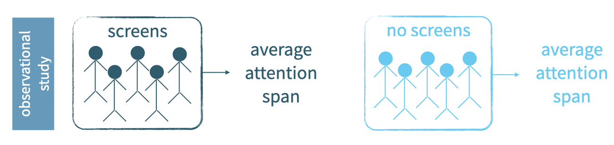
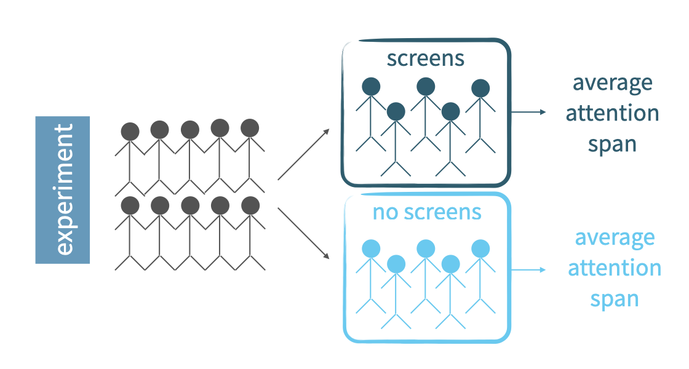

## Observational studies and experiments

In this lesson, we discuss two types of studies commonly used in scientific research: observational studies and experiments. In particular, we will outline how to identify them and what the type of study says about the scope of the inference we can make based on that study's results.

In an *observational study*, researchers collect data in a way that does not directly interfere with how the data arise, in other words, they merely "observe". And based on an observational study we can only establish an association between the *explanatory* and *response* variables.

In an *experiment*, on the other hand, researchers randomly assign subjects to various treatments and can therefore establish causal connections between the *explanatory* and *response* variables.

Suppose we want to evaluate the relationship between using screens at bedtime such as a computer, tablet, or phone and attention span during the day. We can design this study as an observational study or as an experiment.

In an observational study, we sample two types of people from the population: those who choose to use screens at bedtime and those who don't.

Then, we find the average attention span for the two groups of people and compare.



On the other hand, in an experiment, we sample a group of people from the population and then we randomly assign these people into two groups: those who are asked to use screens at bedtime and those who asked not to use them. The difference is that the decision of whether to use screens or not is not left up to the subjects, as it was in the observational study, but is instead imposed by the researcher.

At the end, we compare the attention spans of the two groups.



Based on the observational study, even if we find a difference between the average attention span of these two groups of people, we can't attribute this difference solely to using screens because there may be other variables that we didn't control for in this study that contribute to the observed difference. For example, people who use screens at night might also be using screens for longer time periods during the day and their attention span might be affected by the daytime usage as well.

However, in the experiment, such variables that might also contribute to the outcome, called confounding variables, are most likely represented equally in the two groups due to random assignment. Therefore, if we find a difference between the two averages, we can indeed make a causal statement attributing this difference to bedtime screen usage.

Let's put these ideas into practice.

### Identify type of study: Reading speed and font

A study is designed to evaluate whether people read text faster in Arial or Helvetica font. A group of volunteers who agreed to be a part of the study are randomly assigned to two groups: one where they read some text in Arial, and another where they read the same text in Helvetica. At the end, average reading speeds from the two groups are compared. 

*What type of study is this? An observational study, an experiment, or neither? Why did you answer that way?*

Next, let's take a look at data from a different study on country characteristics. First, load the data and view it, then identify the type of study. Remember, an experiment requires random assignment.

### Recap: Types of studies

Let's load and take a look at data from a different study on country characteristics. The data can be found in the **gapminder** dataset. 

```
* Initialize things if you have not done this already during this SAS session;
%include "~/my_shared_file_links/hammi002/sasprog/run_first.sas";

* Makes a working copy of GAPMINDER data and glimpse;
%use_data(gapminder);
%glimpse(gapminder);
```

*What type of study do you think these data came from? An observational study, an experiment, or neither? Why did you answer that way?*

## Random sampling assignment

In this section, we'll clarify the difference between *random sampling* and *random assignment*, and more importantly, why we care about this difference.

**Random sampling** occurs when _subjects are being selected for a study_. If subjects are selected randomly from the population of interest, then the resulting sample is likely representative of that population and therefore the study's results can be generalizable to that population.

**Random assignment** occurs only _in experimental settings where subjects are being assigned to various treatments_. Random assignment _allows for causal conclusions_ about the relationship between the treatment and the response. 

Here is a quick summary of how random sampling and random assignment affect the scope of inference of a study's results.

#### Scope of inference


A study that employs random sampling and random assignment can be used to make causal conclusions and these conclusions can be generalized to the whole population. This would be an ideal experiment, but such studies are usually difficult to carry out, especially if the experimental units are humans, since it may be difficult to randomly sample people from the population and then impose treatments on them. This is why most experiments recruit volunteer subjects. You may have seen ads for these on a university campus or in a newspaper.

Such human experiments that rely on volunteers employ random assignment, but not random sampling. These studies can be used to make causal conclusions, but the conclusions only apply to the sample and the results cannot be generalized to the population.

A study that uses no random assignment, but does use random sampling is your typical observational study. Results can only be used to make association statements, but they can be generalized to the whole population.

A final type of study, one that doesn't use random assignment or random sampling, can only be used to make non causal association statements. This is an unideal observational study.

You'll get some more practice with these concepts now.

### Random sampling and random assignment?

One of the early studies linking smoking and lung cancer compared patients who are already hospitalized with lung cancer to similar patients without lung cancer (hospitalized for other reasons), and recorded whether each patient smoked. Then, proportions of smokers for patients with and without lung cancer were compared.

*Did this study employ random sampling and/or random assignment?*

No. Neither.  Random assignment is not employed because the conditions are not imposed on the patients by the people conducting the study; random sampling is not employed because the study records the patients who are already hospitalized, so it wouldn't be appropriate to apply the findings back to the population as a whole.

### Identify the scope of inference of study

Volunteers were recruited to participate in a study where they were asked to type 40 bits of trivia—for example, "an ostrich’s eye is bigger than its brain"—into a computer. A randomly selected half of these subjects were told the information would be saved in the computer; the other half were told the items they typed would be erased.

Then, the subjects were asked to remember these bits of trivia, and the number of bits of trivia each subject could correctly recall were recorded. It was found that the subjects were significantly more likely to remember information if they thought they would not be able to find it later.

*Can the results of this study be generalized to all people?*

No. There is no random sampling since the subjects of the study were volunteers, so the results cannot be generalized to all people.

*Do the results of this study infer a causal link between believing information is stored and memory?*

Yes, due to random assignment, we are able to infer a causal link between the belief information is stored and the ability to recall that same information.


You have successfully completed Tutorial 2 in Section 1: Getting Started with Data.

What's next?

- [Back to the main page](https://bghammill.github.io/)
- [Back to Section 1: Getting Started with Data](https://bghammill.github.io/ims-01-data/)
- [Introduction to Modern Statistics textbook link](http://openintro-ims.netlify.app/)


<!-- MathJax -->

<script src="https://cdn.mathjax.org/mathjax/latest/MathJax.js?config=TeX-AMS-MML_HTMLorMML" type="text/javascript"></script>

