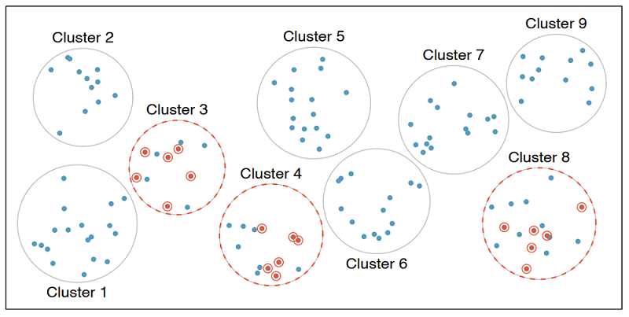

## Sampling strategies

In this section, we discuss why and how to sample data.

In the previous lesson, when we defined observational studies and experiments, we mentioned working with samples from the population. But why do we sample in the first place? Why not try to collect data from the entire population of interest? Well, you could try, that is, try to take a census, but it isn't easy.

### Why not take a census?

First, taking a census requires a lot more resources than collecting data from a sample of the population.

Second, certain individuals in your population might be hard to locate or collect data from. If these individuals that are missed in the census are different from those in the rest of the population, the census data will be biased. For example, in the US census, undocumented immigrants are often not recorded properly since they tend to be reluctant to fill out census forms with the concern that this information could be shared with immigration. However, these individuals might have characteristics different than the rest of the population and hence, not getting information from them might result in unreliable data from geographical regions with high concentrations of undocumented immigrants.

Lastly, populations are constantly changing. Even if you do have the required resources and manage to collect data from everyone in the population, tomorrow your population will be different and so the hard work required to collect such data may not pay off.

If you think about it, sampling is actually quite natural.

### Sampling is natural

Think about cooking, you might taste the dish to see if it's properly seasons. In other words, you examine a small part of what we're cooking in order to get an idea about the dish as a whole. After all, we would never eat a whole pot of soup just to check its taste.

When you taste a spoonful of soup and decide the spoonful you tasted isn't salty enough, what you're doing is, essentially, exploratory analysis on a sample. If you then generalize and conclude that your entire soup needs salt, that's making an inference.

For any inference to be valid, the sample that is analyzed (the spoonful you tasted) needs to be representative of the entire population (the whole pot of soup). If your spoonful comes only from the surface and the salt is collected at the bottom of the pot, what you tasted is probably not going to be representative of the whole pot. On the other hand, if you first stir the soup thoroughly before you taste, your spoonful will more likely be representative of the whole pot.

Sampling data is a bit different than sampling soup, though. So next, we'll introduce a few commonly used sampling methods: simple random sampling, stratified sampling, cluster sampling, and multistage sampling.

### Simple random sample

In simple random sampling, we randomly select cases from the population, such that each case is equally likely to be selected. This is similar to randomly drawing names from a hat.


### Stratified sample

In stratified sampling, we first divide the population into homogeneous groups, called strata, and then we randomly sample from within each stratum. For example, if we wanted to make sure that people from low, medium, and high socioeconomic status are equally represented in a study, we would first divide our population into three groups as such and then sample from within each group.


### Cluster sample

In cluster sampling, we divide the population into clusters, randomly sample a few clusters, and then sample all observations within these clusters. The clusters, unlike strata in stratified sampling, are heterogeneous within themselves and each cluster is similar to the others, such that we can get away with sampling from just a few of the clusters.


### Multistage sample

Multistage sampling adds another step to cluster sampling. Just like in cluster sampling, we divide the population into clusters, randomly sample a few clusters, and then we randomly sample observations from within those clusters.



Cluster and multistage sampling are often used for economical reasons. For example, one might divide a city into geographic regions that are on average similar to each other and then sample randomly from a few randomly picked regions in order to avoid traveling to all regions.

Time to put these concepts into practice!

***Sampling strategies, determine which***

A consulting company is planning a pilot study on marketing in Boston. They identify all the zip codes that make up the greater Boston area, then sample 50 randomly selected addresses from each zip code and mail a coupon to these addresses. They then track whether the coupon was used in the following month.

*What sampling strategy has this company used?* 

***Sampling strategies, choose worst***

A school district has requested a survey be conducted on the socioeconomic status of their students. Their budget does not allow for a census, so they need to sample students within the school district. 

Students living in this district generally attend a school in their neighborhood. The district is broken into many distinct and unique neighborhoods, some including large single-family homes and others with only low-income housing. 

*Which sample strategy would likely be the most effective for selecting the students to sample? If a cluster-based or stratified strategy is best, what is the cluster/strata they should use?*

## Sampling in SAS

In this section, we'll practice sampling in SAS.

Suppose we want to collect data from counties in the United States, but we do not have the resources to obtain these data from all counties. Conveniently, however, we do have a list of all counties. This is publicly available information and is contained in the `county` dataset. 

***Setup***

Let's start by initializing the SAS environment and loading/checking  the `county` dataset. 

```
* Initialize things if you have not done this already during this SAS session;
%include "~/my_shared_file_links/hammi002/sasprog/run_first.sas";

* Makes and checks a working copy of COUNTY data;
%use_data(county);
%glimpse(county);
```

This dataset contains data from counties in all 50 states plus the District of Columbia (DC). Since DC is not a state by definition, we'll first remove it from the dataset. We can do this by useing a `where` statement to the input dataset while creating a new dataset.

But first, did you notice in the `PROC CONTENTS` output that the `state` variable is formatted? That means we need to know the code that is associated with DC in the data. The best way to do that is to do a `PROC FREQ` on the `state` variable, as:

```
* Check distribution of STATE in these data;
proc freq data=county;
	tables state / missing;
run;
```

What code is associated with DC? Now let's use that code when creating a new dataset, `county_nodc`. We'll also check the new dataset to ensure this worked.

```
* Create new datset without DC;
data county_nodc;
	set county;
	where state ne 9;
run;

* Check new dataset and confirm DC was dropped;
%glimpse(county_nodc);

proc freq data=county_nodc;
	tables state / missing;
run;
```

### Simple random sample

Suppose our limited resources require that we collect data from only _150_ of the over _3000_ counties in the United States. One option is to take a simple random sample. We will use  `PROC SURVEYSELECT` to do this.

We start with the `county_nodc` dataset, use simple random sampling (`method=srs`), take one sample (`reps=1`) with 150 counties (`sampsize=150`), and save it in the new `county_srs`  dataset. 

```
* Get simple random sample of 150 counties and check output;
proc surveyselect data=county_nodc method=srs reps=1 sampsize=150 out=county_srs;
	id _all_;
run;

%glimpse(county_srs)
```

We can see that there are indeed 150 observations in this data frame. Note that your sample will look different than someone else's sample, even though you're running the exact same code. We are taking a random sample here, so your sample will be different than others, just by random chance. However, the sample size should be the same, since that is something we specified.

### SRS state distribution

If our goal was to take a sample of any 150 counties, we have accomplished this goal. However, if we wanted to obtain equal numbers of counties from each state (that is, three counties per state) a simple random sample won't ensure that.

We can confirm this by checking how many records from each state appear in the `county_srs` dataset: 

```
* Check distribution of STATE in these data;
proc freq data=county_srs;
	tables state / missing;
run;
```

The resulting output shows that this sampling approach yields a variable number of counties in each state, and even that some states were not sampled at all. If we instead want to sample three counties per state to make up our sample of 150 counties, we should use stratified sampling.

### Stratified sample

The code looks very similar to how we selected the simple random sample, except we have indicated a strata within which to sample, and changed requested *within-strata* sample size to 3 (`n=3`). With 50 states, this should give us 150 total sampled counties. 

Let's run this sampling and check the state distribution:

```
*  Get stratified random sample of 150 counties and check output;
proc surveyselect data=county_nodc method=srs reps=1 n=3 out=county_strat;
	strata state;
	id _all_;
run;

%glimpse(county_strat);

* Check distribution of STATE in these data;
proc freq data=county_strat;
	tables state / missing;
run;
```

The resulting output shows that this sampling approach yields 150 counties, with 3 counties coming from each state.

### Cluster sample

Just to give you a sense about what cluster sampling looks like, let's change the scenario by requesting a sample of all counties within 5 random states. This code, again, looks similar to above, except instead of a `strata state` statement, we have used a `cluster state` statement. This minor change requests SAS to sample states, not counties. It will, in fact, select all counties within `n=5` states. 

Let's run this sampling and check the state distribution:

```
* Get cluster sample of 5 states and check output;
proc surveyselect data=county_nodc method=srs reps=1 n=5 out=county_clus;
	cluster state;
	id _all_;
run;

%glimpse(county_clus);

* Check distribution of STATE in these data;
proc freq data=county_clus;
	tables state / missing;
run;
```

For me, the resulting output shows that this sampling approach yielded 277 counties from 5 states. The number of counties in your sample will differ because the 5 selected states will differ. What we can be pretty sure of, however, is that we will most likely not end up with 150 counties. To do this would require multistage sampling, the code for which is beyond the scope of this tutorial.

## Principles of experimental design

In this section, we discuss principles of experimental design: _control, randomize, replicate, and block_.

To **control** means to compare the treatment of interest to a control group.

To **randomize** means to randomly assign subjects to treatments.

To **replicate** means to collect a sufficiently large sample within a study or to replicate the entire study.

To **block** means to to account for the potential effect of known or suspected confounding variables by first grouping subjects into blocks based on these variables, then randomizing subjects within each block to treatment groups.

Let's discuss blocking a bit more.

### Design a study, with blocking


We would like to design an experiment to investigate whether students learn the SAS language better in a traditional lecture based course or using an interactive online learning platform. Two courses that teach the exact same material are designed and the only difference between these courses is the method of delivery: traditional lecture or interactive online.

We sample a group of students for our study that we will randomly assign to these two courses.

But before we do so, we need to consider any potential confounding variables. It is suspected that previous programming experience might have an effect on how students learn in these two settings and we know that some of the students in our study have previous programming experience and some don't. Therefore we decide to block for having previous programming experience.

To do so, we divide our sample into two, those with programming experience and those without.

Then, we randomly assign individuals from each block into the two courses, ensuring that those with and without programming experience are equally represented in the two treatment groups.


In this experiment the _explanatory_ variable is the _course type_ lecture versus interactive online and the variable that we're _blocking_ for is _previous programming experience_.

This way, if we find a difference in mastery of the R language between students in the two courses, we will be able to attribute it to the course type and can be assured that the difference isn't due to previous programming experience since both those with and without such experience were equally represented in the two treatment groups.

Now it's time to practice these experimental design concepts.

***Identifying components of a study***

A researcher designs a study to test the effect of light and noise levels on exam performance of students. The researcher also believes that light and noise levels might have different effects on males and females, so she wants to make sure both sexes are represented equally under different conditions.

*Which of the statements below is correct?*

* There are 3 explanatory variables (light, noise, sex) and 1 response variable (exam performance).
* There is 1 explanatory variable (sex) and 3 response variables (light, noise, exam performance).
* There are 2 blocking variables (light and noise), 1 explanatory variable (sex), and 1 response variable (exam performance).
* There are 2 explanatory variables (light and noise), 1 blocking variable (sex), and 1 response variable (exam performance).

***Experimental design terminology***

As a check of understanding...

*What type of variables represent conditions you can impose on the experimental unites? Explanatory variables, response variables, or blocking variables.*

*What type of variables represent characteristics of experimental units that you would like to control for? Explanatory variables, response variables, or blocking variables.*

And to connect the concepts of stratification and blocking...

*Which strategy do we use to control for a variable in random sampling? Stratification or blocking?*

*Which strategy do we use to control for a variable in random assignment? Stratification or blocking?*


You have successfully completed this tutorial.

What's next?

- [Back to the main page](https://bghammill.github.io/)
- [Back to Section 1: Getting Started with Data](https://bghammill.github.io/ims-01-data/)
- [Introduction to Modern Statistics textbook link](http://openintro-ims.netlify.app/)


<!-- MathJax -->

<script src="https://cdn.mathjax.org/mathjax/latest/MathJax.js?config=TeX-AMS-MML_HTMLorMML" type="text/javascript"></script>

