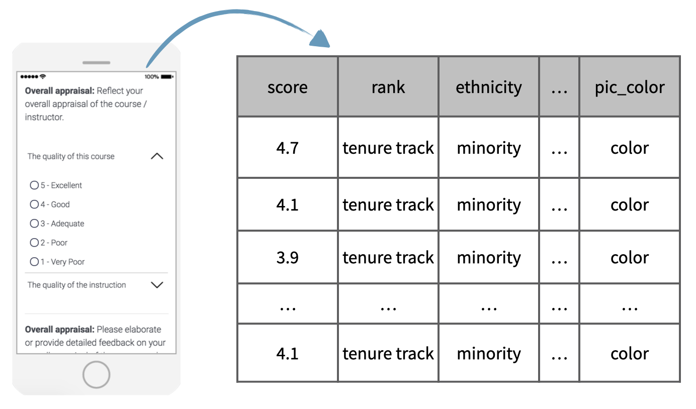

## Case study

In this last lesson of the tutorial, we will work on a case study, based on data from a study titled "Beauty in the Classroom".

As you might know, many college courses conclude by giving students the opportunity to anonymously evaluate both the course and the instructor. However, the use of these student evaluations as an indicator of course quality and teaching effectiveness is often criticized because the measures may reflect the influence of non teaching related characteristics, such as the physical appearance of the instructor.



The data that we will be working with, which includes information on course evaluations as well as students' scoring of professors' physical attractiveness, was collected as part of a study conducted at University of Texas, Austin.

In the following exercises, you will be asked to analyze these data with the eventual goal of investigating whether instructors who are viewed to be better looking receive higher instructional ratings. These exercises are designed to help you review the concepts and SAS syntax that you've learned in previous lessons of this tutorial.

## Exercise: Beauty in the classroom

### Inspect the data

The purpose of this lesson is to give you an opportunity to apply and practice what you've learned on a real world dataset. For this reason, we'll provide a little less guidance than usual.

Make a working copy of the `evals` dataset and take a look at the data, using techniques you learned in previous lessons. Use an approach that shows you how many observations and variables are included in the dataset.  

For this analysis, we have added an additional variable to the dataset, `cls_size`. This variable classifies classes as small, midsize, or large, depending on the number of students in the class (`cls_students`). Just for your information, this was done using the following code:

```
* Create class size based on number of students;	
select;
	when (cls_students <= 18) cls_size = 1;
	when (cls_students <= 59) cls_size = 2;
	otherwise cls_size = 3;
end;
```

Note that many variables in this dataset, including `cls_size`, are formatted.

### Identify type of study

*Based on the description of this dataset above, what type of study would you say generated these data? An observational study or an experimental study? Why?*

## Variables in the data

Let's take a closer look at each of the variables in the course evaluations dataset.

Remember that  the `%glimpse()` macro will output dataset contents, which includes a list of the variables, and will print out the first few observations of the dataset.

The main response variable is the average evaluation score (`score`) of the professor for a given course. Scores range between 1 and 5 with 1 being a poor evaluation and 5 being an excellent evaluation.

We are also given the following additional information:

* Whether the professor is a teaching faculty, tenure track faculty, or tenured faculty (`rank`)
* Whether they are from a minority group or not (`ethnicity`)
* Whether they are male or female (`gender`)
* Whether the language of instruction at the university where they received their education was English or not (`language`)
* The age of the professor (`age`)

Additionally, we also have a series of variables on the attributes of the class the evaluations came from, such as, percent of students who completed the evaluations (`cls_perc_eval`), number of students who completed the evaluations (`cls_did_eval`), and the total number of students in the class (`cls_students`), as well as the level of the course (`cls_level`), whether a single professor or multiple professors taught it (`cls_profs`), and whether the course was a single credit or multi-credit course  (`cls_credits`).

The attractiveness score (`bty_<various>`) of the professors in the sample were determined by six students who were provided photos of the professors to rate. These students were comprised of 1 female student who is lower level, that is first year or sophomore, indicated with f1lower, two female students who are upper level, that is junior or senior, 1 male student who is lower level, and two male students who are upper level. In their scoring 1 indicates a low attractiveness score and 10 a high attractiveness score.

The average of these scores (`bty_avg`) for each professor is also given.

These last two variables in the dataset are about the professors' photos: whether the professor was wearing a formal outfit (`pic_outfit`) and whether the picture was black and white or in color (`pic_color`).

Now that you are more familiar with the variables in the dataset, you will be asked to determine their types.

### Identify variable types

It's always useful to start your exploration of a dataset by identifying variable types. The results from this exercise will help you design appropriate visualizations and calculate useful summary statistics later in your analysis.

- Explore the `evals` data once again with the following goals in mind: (1) Identify each variable as numerical or categorical. (2) If numerical, determine if it is discrete or continuous. (3) If categorical, determine if it is ordinal or not.

### Create a scatterplot

The `bty_avg` variable shows the average beauty rating of the professor by the six students who were asked to rate the attractiveness of these faculty. The `score` variable shows the average professor evaluation score, with 1 being *very unsatisfactory* and 5 being *excellent*.

Use `PROC SGPLOT` to create a scatterplot displaying the relationship between these two variables. 

- *How would you describe the relationship apparent in this visualization?*

### Create a scatterplot, with an added layer

Suppose you are interested in evaluating how the relationship between a professor's attractiveness and their evaluation score varies across different class types (small, midsize, and large).

Recreate your visualization from the previous exercise, but this time color the points by class type.

- *How would you describe the relationship apparent in this visualization?*

## 

You have successfully completed this tutorial.


# [< Back to Section 1](https://bghammill.github.io/ims-01-data/)


<!-- MathJax -->

<script src="https://cdn.mathjax.org/mathjax/latest/MathJax.js?config=TeX-AMS-MML_HTMLorMML" type="text/javascript"></script>

