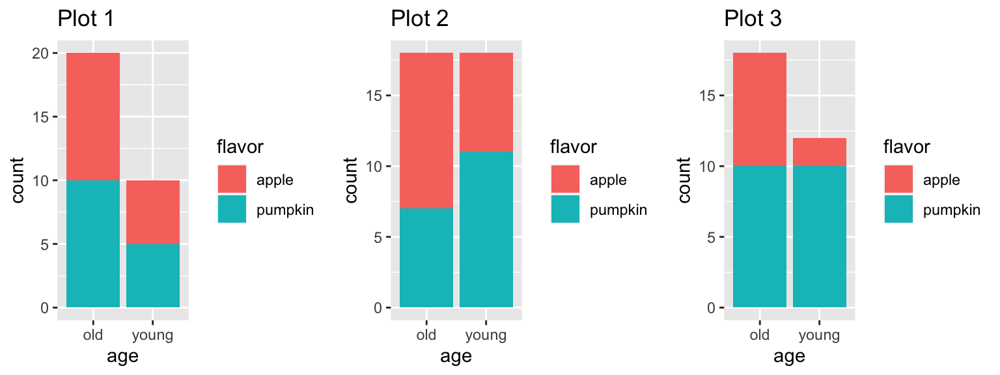
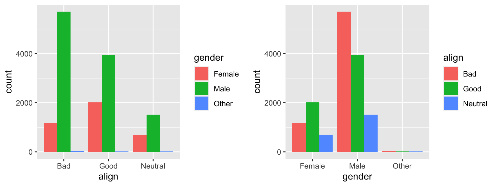
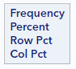
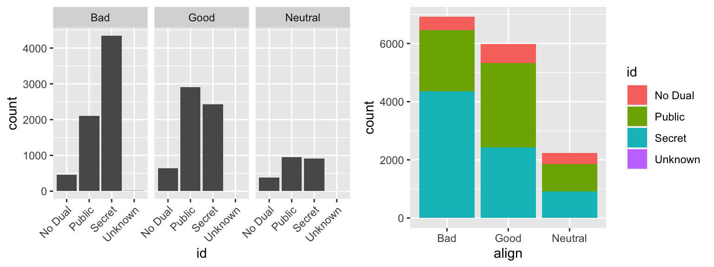
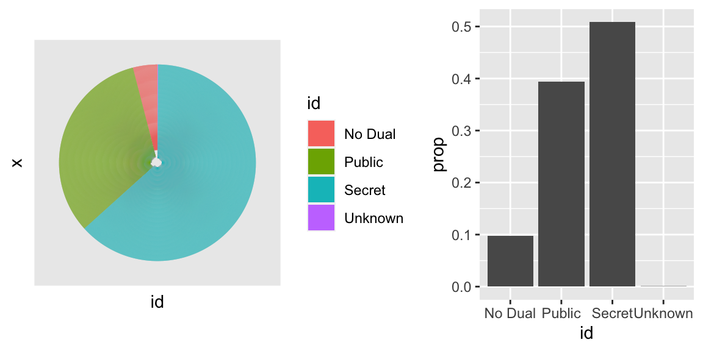

## Exploring categorical data

In this tutorial we'll learn about summarizing and visualizing data.  Sometimes, we refer to the techniques covered in this tutorial as **exploratory data analysis** or EDA.

EDA is all about learning the structure of a dataset through a series of numerical and graphical techniques. When you do EDA, you'll look for both general trends and interesting outliers in your data. You'll also generate questions that will help inform subsequent analysis.

The emphasis of the first two lessons is on visualization: how to create and interpret graphical displays of your data. The third lesson focuses on numerical summaries of distributions. We end with a case study that will allow you to synthesize these concepts and apply them to a more complex dataset that contains information on the characteristics of email that are associated with it being spam.

Before beginning the tutorial, we recommend you have some exposure to the SAS language and that you've taken the Getting Started with Data tutorial in this series.

Let's get started.

### Introduction 

In this tutorial, you'll be exploring data from a wide range of contexts. The first dataset comes from comic books. Two publishers, Marvel and DC, have created a host of superheroes that have made their way into popular culture. You're probably familiar with Batman and Spiderman, but what about Mor the Mighty?

The comics dataset has information on all comic characters that have been introduced by DC and Marvel. Let's make a working copy of that dataset and check it out:

```
* Initialize things if you have not done this already during this SAS session;
%include "~/my_shared_file_links/hammi002/sasprog/run_first.sas";

* Makes and checks a working copy of COMICS data;
%use_data(comics);
%glimpse(comics);
```

We see that each row, or observation, is a different character and each column, or variable, is a different piece of information about that character. The top the output tells us the dimensions of this dataset: over 23,000 observations and 11 variables. In the variable list, we see that many are character types, which may indicate that they are categorical variables.

The first row in the dataset is Peter Parker, alias: Spiderman, where his alias and character name are included in the first variable `name`. The second column, `id`, shows that Peter Parker's personal identity is kept secret, and the third column tell us that his `align`ment is good; that he's a superhero, not a super villain. If you scroll the table to the right side, you will see several additional variables, including eye color and hair color.

We can learn the different values of a particular character variable by using `PROC FREQ` to generate tables for each variable. It's clear that the alignment variable can be "good" or "neutral", but what other values are possible?  

```
* Check distribution of ALIGN variable;
proc freq data=comics;
	tables align / missing;
run;
```

Inspecting the resulting table, we learn that there are in fact four possible alignments, "Good", "Bad", "Neutral", and "Reformed criminals". Good thing we checked that! .

If we do the same for identity, we learn that there are four possible identities.

```
* Check distribution of ID variable;
proc freq data=comics;
	tables id / missing;
run;
```

Also note, based on the output so far, that this is the first dataset we've worked with that has some missing data. For this tutorial, we will generally ignore missing data and just report percentages and generate figures for non-missing data. In practice, you'll want to consult a statistician about how best to handle missing data in analyses

A common way to represent the number of cases that fall into each combination of levels of two categorical variables, such as these, is with what's called a "contingency table." Creating a contingency table is a simple extension of the `PROC FREQ` code above: 

```
* Check counts of ALIGN by ID variables;
proc freq data=comics;
	tables align * id / norow nopct nocol;
run;
```

Some things to notice about this code:

* We list `align` first because we want that variable to be our row variable
* We list `id` second, because we want that variable to be our column variable
* We added the `norow`, `nopct`, and `nocol` options here since we only wanted to look at counts for now (no percentages) 
* We have removed the `missing` option, so we get the counts only for characters where information on both variables is known. In this case, SAS does tell us how many observations were excluded due to missing data, at the bottom of the table, but does not included those records in the cell counts above.

The output tells us that the most common category, at a count of 4492, was characters with "Bad" alignment with "Secret" identities.

While tables of counts can be useful, you can get the bigger picture by translating these counts into a graphic. The graphics that you'll be making in this tutorial utilize `PROC SGPLOT`, which you saw in the previous tutorial. 

Here, we're interested in the relationship between two categorical variables, which is represented well by a stacked bar chart. In a bar chart, we plot the counts or frequencies of different levels of a categorical variable, by specifying the categorical variable we want to be on the x-axis: 

```
* Simple bar chart of ID;
proc sgplot data=comics;
	vbar id;
run;
```

A stacked bar chart adds another layer to the plot, by dividing each bar into different levels of another variable. This coloring of the bars comes from adding a group variable to the `vbar` statement above: 

```
* Stacked bar chart of ID, with categories of alignment;
proc sgplot data=comics;
	vbar id / group=align;
run;
```

Let's look carefully at how this is constructed: each colored bar segment actually corresponds to a count in our table, with the x-axis and the fill color indicating the category being plotted. Several things pop out, like the fact that there are very few characters whose identities are unknown (since it's nearly flat). The single largest bar segment corresponds to the most common category: characters with secret identities that are also bad. We can look across the identity types and realize that bad is not always the largest category. This indicates that there is indeed an association between alignment and identity.

That should be enough to get started. Now it's your turn to start exploring the data.

### Bar chart expectations

Suppose you've asked 30 people, some young, some old, what their preferred flavor of pie is: apple or pumpkin. Your data could be summarized in a side-by-side bar chart. Here are three possibilities for how it might look.



*Which one of the barcharts shows no relationship between `age` and `flavor`? In other words, which plot shows that pie preference is the same for both young and old?*

**Hint:** Which plot shows a similar *proportion* of people who like apple (or pumpkin) pies in each of the two age groups?

### Contingency table review

Let's continue working with the `comics` dataset to create a different contingency table, which is a useful way to represent the total counts of observations that fall into each combination of the levels of categorical variables. Make sure the contingency table has the different levels of `gender` in the rows, and the different levels of `align` in the columns. 

```
* Check counts of GENDER by ALIGN variables;
proc freq data=comics;
	tables gender * align / norow nopct nocol;
run;
```

### Dropping levels

This contingency table revealed that there are some levels that have very low counts. To simplify the analysis, it sometimes helps to ignore such levels from the dataset using a `where` statement. For example, let's create a new dataset that excludes the reformed criminals, then rerun this contingency table:

```
* Create new dataset without reformed criminals;
data comics_no_rc;
	set comics;
	where align ne "Reformed Criminals";
run;

* Check counts of GENDER by ALIGN variables, ignoring reformed criminals;
proc freq data=comics_no_rc;
	tables gender * align / norow nopct nocol;
run;
```

We'll continue to use this filtered dataset below.

### Side-by-side barcharts

While a contingency table represents the counts numerically, it's often more meaningful to represent them graphically. 

The code below creates two bar charts:

1. One with `align` on the x-axis, and bars sized & colored by the `gender` of the character
2. One with `gender` on the x-axis, and bars sized & colored by the `align` of the character

```
* Side-by-side bar chart of alignment, with categories of gender;
proc sgplot data=comics_no_rc;
	vbar align / group=gender groupdisplay=cluster;
run;

* Side-by-side bar chart of gender, with categories of alignment;
proc sgplot data=comics_no_rc;
	vbar gender / group=align groupdisplay=cluster;
run;
```

### Bar chart interpretation



*Which of the following interpretations of the bar charts above is **not** valid?*

* Among characters with `Neutral` alignment, males are the most common
* In general, there is an association between gender and alignment
* Across all genders, `Bad` is the most common alignment
* There are more male characters than female characters in this dataset

## Counts vs. proportions

You may have noticed in the last exercises that sometimes raw counts of cases can be useful, but often it's the proportions that are more interesting. We can do our best to compute these proportions in our head or we could do it explicitly in SAS.

### From counts to proportions

Let's return to our table of counts of cases by identity and alignment. If we wanted to instead get a sense of the proportion of all cases that fell into each category, we can modify our previous table to add this information. `PROC FREQ` does this easily for us. Here, again, is the distribution of records for each combination of `id` and `align`. 

```
* Check distribution of ALIGN by ID variables, include overall proportions;
proc freq data=comics_no_rc;
	tables align * id;
run;
```

Below each frequency count, we now see three proportions. And while this is a little busy, everything we might want to know about the distribution of these two characteristics is here.

Note the legend that appears to the top left of the table:



This tell us what each number in each table cell represents. Right below the frequency is the overall percent, or what proportion of all records fall into that particular cell. We see, for example, that the single largest category are characters that are bad + secret at about 29% of characters.

But what about the row and column percents?


### Conditional proportions

If we're curious about systematic associations between variables, we should look to conditional proportions. Remember that conditional proportions change the denominator of the calculation to be the size of the specific group of interest, instead of the size of the total population.

An examples of a conditional proportion is the proportion of public identity characters that are bad. Given the set-up of our contingency table (alignment as rows and id as columns), we can answer this question using the column percents (last number in each cell) within the public identity column. If you look up the public + bad cell, you can see that about 36% of public identity characters are bad.

Another example of a conditional proportion is the proportion of bad characters that are secret. Given the set-up of our contingency table, we can answer this question using the row percents (third number in each cell) within the bad alignment row. If you look up the bad + secret, you can see that nearly 63% of bad characters are secret.

Remember, when you condition on alignment (the value in the rows), the row percents sum to 100, since all of the identities in each row are split between the three ids.

Because `PROC FREQ` output can be busy, it is often helpful to use the `norow`, `nopct`, and `nocol` options to limit the output. For example:

```
* Check distribution of ALIGN by ID variables, row percents only;
proc freq data=comics_no_rc;
	tables align * id / nocol nopct;
run;
```

As the number of cells in these tables gets large, it becomes much easier to make sense of your data using graphics. The bar chart is also a good choice to show the conditional probabilities. Let's create a bar chart based on the table generated above.

**Bars as proportions, with categories that sum to 1**

Below is the code to create a bar chart of conditional proportions. In this plot, we want to condition on the variable that is on the x-axis (`align`) and have the categories of each bar (`id`) add up to a total proportion of 1. To stretch the bars this way, we add the `pctlevel=group` option to the `PROC SGPLOT` statement and the `stat=percent` option to the `VBAR` statement:

```
* Conditional bar chart of ALIGN by ID;
proc sgplot data=comics_no_rc pctlevel=group;
	vbar align / group=id stat=percent;
run; 
```

We can see more quickly here that the majority of bad characters are secret, which different from other alignments. 

If we flip the `align` and `id` variables, the bar chart gives us different information:

```
* Conditional bar chart of ID by ALIGN;
proc sgplot data=comics_no_rc pctlevel=group;
	vbar id / group=align stat=percent;
run; 
```

Which condition bar chart you use would depend on the question you'd like to answer.

### Conditional proportions

Choosing to show conditional proportions, however, can give a very different picture than showing counts. Here is code to generate two figures:

1. A stacked bar chart of the *counts* of `gender` within different `align`ments
2.  A stacked bar chart of the *proportions* of `gender` within different `align`ments 

```
* Stacked bar chart of ALIGN by GENDER;
proc sgplot data=comics_no_rc;
	vbar align / group=gender;
run;

* Conditional stacked bar chart of ALIGN by GENDER;
proc sgplot data=comics_no_rc pctlevel=group;
	vbar align / group=gender stat=percent;
run;
```

The size of each alignment group definitely gets lost when presenting conditional proportions.

## Distribution of one variable

You might not have noticed, but already you've been creating plots that illustrate the relationship between two variables in your dataset. It's a bit unusual to lead with this, but it gets you thinking early about the multivariate structure that is found in most real datasets. Now, let's zoom in on working with just a single variable.

### Marginal distribution

To compute a table of counts and proportions for a single variable like `id`, we can use `PROC FREQ`, as we have seen before. (Note that we are still using the dataset without reformed criminals and ignoring missing data.)

```
* Distribution of ID;
proc freq data=comics_no_rc;
	tables id;
run;
```

SAS gives us the count and percent for each identity type. It also gives us the cumulative frequency and percent, which is often more useful when the variable of interest is ordinal.

You may hear this type of one-way output described as a **marginal distribution**, since the counts and percentages are calculated over the entire dataset.

### Simple barchart

The syntax to create the simple bar chart is straightforward as well, which we saw at the beginning of the lesson. 

```
* Simple bar chart of ID;
proc sgplot data=comics;
	vbar id;
run;
```

### Faceting

Another useful way to visualize the distribution of a single variable is to condition on a particular value of another variable. We might be interested, for example, in the distribution of id for all neutral characters. We could either filter the dataset and build a bar chart using only cases where `align`ment was "Neutral", or we could use a technique called paneling. Paneling breaks the data into subsets based on the levels of a categorical variable and then constructs a plot for each level.

### Paneled barcharts

To implement paneling in SAS, we need to use `PROC SGPANEL` and let that procedure know which variable we would like to control the panels. Since we want to see the distribution of `id` by `align`, we add `panelby align` as below:

```
* Paneled bar chart of ID by ALIGN;
proc sgpanel data=comics_no_rc;
	panelby align;
	vbar id;
run;
```

### Paneling vs. stacking

In essence, the paneled plot is a rearrangement of the stacked bar charts that we considered at the beginning of the lesson.



Each panel in the plot on the left corresponds to a single stacked bar segment in the plot on the right. Each allows you to see the distributions of each variable in different ways.

A discussion of plots for categorical data wouldn't be complete without some mention of the pie chart.

### Pie chart vs. bar chart

The pie chart is a common way to display categorical data where the size of the slice corresponds to the proportion of cases that are in that level. Here is a pie chart for the identity variable and it looks pleasing enough. The problem with pie charts, though, is that it can be difficult to assess the relative size of the slices. Here, how large would you say the pink "No Dual" slice is? Maybe 5%? What about the green "Public" slice?

If we represent this data using a barchart the answer is obvious: the proportion of public is greater. For that reason, it's generally a good idea to stick to barcharts.




## Congratulations!

You have successfully completed Lesson 1 in Tutorial 2: Summarizing and visualizing data.

What's next?

[Full list of tutorials supporting OpenIntro::Introduction to Modern Statistics](https://bghammill.github.io/)

[Tutorial 2: Getting Started with Data](https://bghammill.github.io/ims-02-explore/)

- [Tutorial 2 - Lesson 1: Visualizing categorical data](https://bghammill.github.io/ims-02-explore/ims-02-lesson-01/)
- [Tutorial 2 - Lesson 2: Visualizing numerical data](https://bghammill.github.io/ims-02-explore/ims-02-lesson-02/)
- [Tutorial 2 - Lesson 3: Summarizing with statistics](https://bghammill.github.io/ims-02-explore/ims-02-lesson-03/)
- [Tutorial 2 - Lesson 4: Case study](https://bghammill.github.io/ims-02-explore/ims-02-lesson-04/)

[Learn more at Introduction to Modern Statistics](http://openintro-ims.netlify.app/)

<!-- MathJax -->

<script src="https://cdn.mathjax.org/mathjax/latest/MathJax.js?config=TeX-AMS-MML_HTMLorMML" type="text/javascript"></script>


