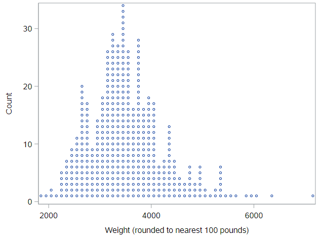
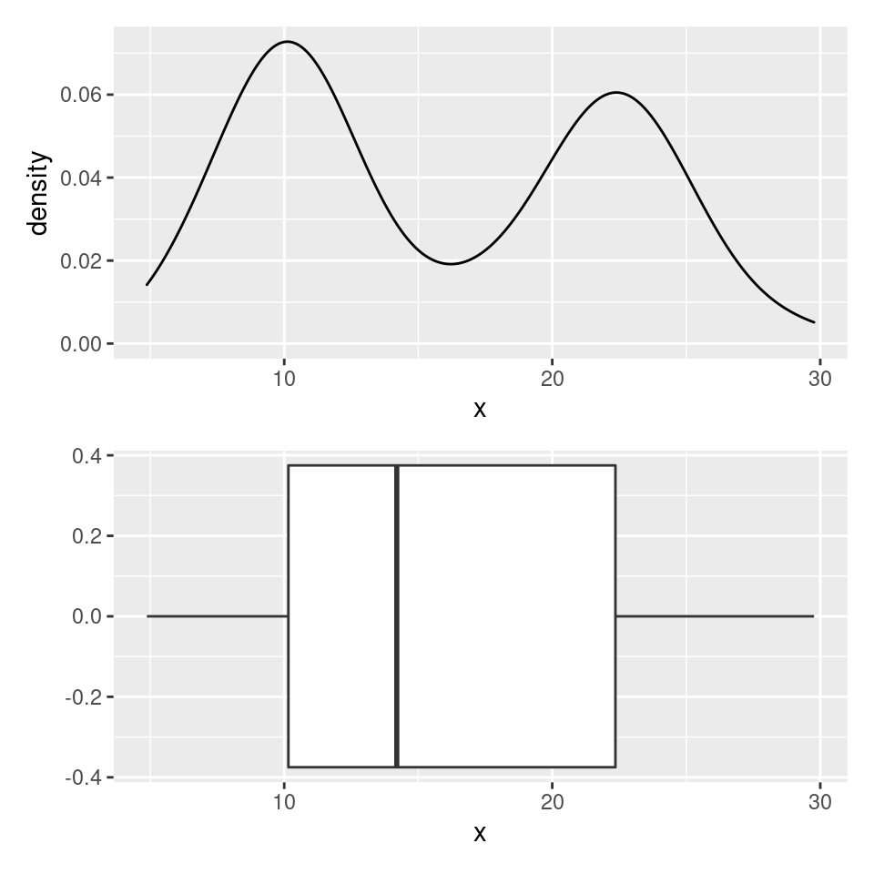

## Exploring numerical data

In this lesson, we'll broaden our tool box of exploratory techniques to encompass numerical data. Numerical data are data that take the form of number, where those numbers actually represent a value on the number line (in contrast to a number like zip code that can't be ordered on a number line).

The dataset that we'll be working with is one that has information on the cars that were for sale in the US in a certain year.

### Cars dataset

In this lesson, you'll be working with the `cars` dataset, which records characteristics on all of the new models of cars for sale in the US in a certain year. Go load and check that dataset:

```
* Initialize things if you have not done this already during this SAS session;
%include "~/my_shared_file_links/hammi002/sasprog/run_first.sas";

* Makes and checks a working copy of CARS data;
%use_data(cars);
%glimpse(cars);
```

What kinds of things to do we see?

* We see that we have 428 observations and 19 variables.

* The car names, `name`, are character strings, where it's likely that every observations takes a unique value.
* There are a number of variables with a format of `YESNO.`, which appear to only have values of 0 (for No) and 1 (for Yes). (A quick `PROC FREQ` on one or more of these variables would confirm.) Having this type of variable coded as 0/1 is very common in SAS, and doesn't even really require the format. Variables like this are often called indicator variables, where the value is 1 if the condition or characteristic is true or present. 
* We see that the last set of variables are all numeric, some discrete and some continuous. *Can you tell which is which?*  

### Numerical summaries

Before you start creating figures to see the distribution of values of the numerical variables in your data, it is often helpful to get numerical summaries of those variables. This includes measures of central tendency (like mean, median, and mode) and measure of variability (like standard deviation, variance, and different percentiles).

In SAS, this is typically done with `PROC UNIVARIATE` or `PROC MEANS`. See how the output from each of those procedures looks for the `weight` variable:

```
* Numerical summary of data, PROC UNIVARIATE;
proc univariate data=cars;
	var weight;
run;

* Numerical summary of data, PROC MEANS;
proc means data=cars;
	var weight;
run;
```

The volume of output from `PROC UNIVARIATE` is vast. Within this output, try and find the following values:

* Mean
* Median
* Standard deviation
* Interquartile range (and confirm this by finding Q1 and Q3 values)
* Minimum and maximum values

Note how this compares to the limited output from the basic `PROC MEANS`, which only shows the mean, standard deviation, minimum value, and maximum value. Thankfully, it is very easy to request other measures:

```
* Numerical summary of data, PROC MEANS, with additional requests;
proc means data=cars mean std median q1 q3 mode;
	var weight;
run;
```

See the whole list [here](https://documentation.sas.com/doc/en/pgmsascdc/9.4_3.5/proc/n1qnc9bddfvhzqn105kqitnf29cp.htm#n11nn4xu6p9wvjn1lh60wtvvn538).

Now let's construct some plots to help us explore these data.

## Dot plot

The most direct way to represent numerical data is with a *dotplot*, where each observation is a dot that's placed at it's appropriate value on the x-axis. The dots are then stacked on top of other cases with similar values.



You can think of a dotplot as a sibling to the histogram, except you know *exactly* how many observations are in each "bin," because you can count the dots. Importantly, the plot has much less information loss than a histogram, as you could almost rebuild the dataset if you were only given this plot. 
As you can imagine, these plots start to get difficult to read as the number of cases gets very large. And, unfortunately, SAS does not have a simple way to create these types of figures, so we need to move right into histograms.

## Histogram

One of the most common plots used to show the distribution of numerical data is a *histogram*. 

```
* Histogram of WEIGHT;
proc sgplot data=cars;
	histogram weight;
run;
```

Here, the height of histogram bar represents the percentage of values that fall within the limits of the bar seen on the x-axis. You can see how the shape of this histogram lines up with the shape of the dot plot above. Because of the binning (each bar is 500 pounds wide), it's not possible to perfectly reconstruct the dataset, but it allows us to gain a bigger picture of the shape of the distribution.

### Histogram bins 

If the stepwise (not continuous) nature of the histogram irks you, then you have a few options. 
First, you can play around with the width of the bars (bins) using the `binwidth` option. Or, second, you could use a density plot, which we will review later.

Regarding bin widths, here code for a histogram with a bin width of 100 pounds:

```
* Histogram of WEIGHT, with narrower bins;
proc sgplot data=cars;
	histogram weight / binwidth=100;
run;
```

While this is more detailed, it is possible to lose the sense of the shape of the distribution with narrow bin widths.

### Histogram practice

If you want to some histogram practice, use the code below to generate the following 3 histograms to demonstrate, again, the visual impact of different bin widths:

- A histogram of horsepower (i.e. `horsepwr`) with a bin width of 10
- A second histogram of horsepower with a bin width of 30
- A third histogram of horsepower with a bin width of 60

```
* Three histograms of HORSEPWR, with different bin widths;
proc sgplot data=cars;
	histogram horsepwr / binwidth=10;
run;

proc sgplot data=cars;
	histogram horsepwr / binwidth=30;
run;

proc sgplot data=cars;
	histogram horsepwr / binwidth=60;
run;
```

## Density plot

The *density plot* represents the shape of the histogram using a smooth line. You can think of the density plot as drawing a smoothed line over the top of a histogram, providing a smoother representation of the shape of the distribution. A density plot is fairly sensitive to spikiness in the data, so you'll only want to use it when you have a large number of observations.

```
* Density plot of WEIGHT;
proc sgplot data=cars;
	density weight / type=kernel;
run;
```

## Box plot

Similar to a histogram, a *box plot* does not plot the raw data. Instead, it plots summaries of the data. 
A box plot plots the center of the distribution (median), the values that mark off the middle half of the data (first and third quartiles), and the values that mark off the vast majority of the data (ends of the whiskers).

Here is the code to generate a box plot for the `weight` variable:

```
* Box plot of WEIGHT;
proc sgplot data=cars;
	hbox weight;
run;
```

The box plot is based around three summary statistics:

1) The first quartile of the data -- 25% of the data values fall below this number
2) The median (second quartile) of the data -- 50% of the data falls below this number
3) The third quartile of the data -- 75% of the data values fall below this number

These three numbers form the box in the box plot, with the median in the middle and the first and third quartiles as the edges. One thing you always know when looking at a box plot is that the middle half of the data is inside this box. Note that SAS also shows you the mean value, as a diamond.

Regarding the whiskers, the lines that extend out from the box, there are various rules for how to draw them. By default, SAS draws these down to $$Q_1 - 1.5 \times \text{IQR}$$ and  up to $$Q_3 + 1.5 \times \text{IQR}$$.

If an observation's value is beyond these "fence" values, it is plotted as a point. This is one of the handy features of a box plot; it flags for you points that are far away from the bulk of the data, a form of automated *potential* outlier detection.

## Density plots vs. box plots 

box plots really shine in situations where you need to compare several distributions at once and also as a means to detect outliers. One of their weaknesses, however, is their inability to indicate when a distribution has more than one hump or "mode".

Consider the density plot here, there are two distinct modes. If we construct a box plot of the same distribution, it sweeps this important structure under the rug and will always only provide a single box. 



Consider two other columns in the `cars` dataset: `city_mpg` and `width`. Which is the most appropriate plot for displaying the important features of their distributions?

```
* Density plot of CITY_MPG;
proc sgplot data=cars;
	density city_mpg / type=kernel;
run;

* Box plot of CITY_MPG;
proc sgplot data=cars;
	hbox city_mpg;
run;

* Density plot of WIDTH;
proc sgplot data=cars;
	density width / type=kernel;
run;

* Box plot of WIDTH;
proc sgplot data=cars;
	hbox width;
run;
```

### Box plots for outlier detection

In addition to indicating the center and spread of a distribution, a box plot provides a graphical means to detect outliers. Let's look at a box plot for the `msrp` (manufacturer's suggested retail price) variable to detect if there are unusually expensive or cheap cars. 

```
* Box plot of MSRP;
proc sgplot data=cars;
	hbox msrp;
run;
```

Looks like cars priced over $100,000 may be outliers. If you are interested in knowing more about these particular cars in the dataset, you can `PROC PRINT` those values, selected using a basic `where` statement:

```
* Look at observations with extreme MSRP;
proc print data=cars;
	where msrp > 100000;
run;
```


## Distribution of a numerical variable by a categorical variable

Everything we have discussed to this point has involved the marginal distribution (i.e., overall) of a numerical variable's values. However, we often want to look at a variable's distribution by different subgroups within the data. When those subgroups are defined by a categorical variable, we can calculate summary measures by group and/or show histograms, density plots, or box plots for each group side-by-side.

For example, let's look at the numerical summary measures for highway MPG (`hwy_mpg`) by whether or not the vehicles are pickup trucks:

```
* Basic numerical summary of HWY_MPG by PICKUP;
proc means data=cars mean std median q1 q3 maxdec=1;
	class pickup;
	var hwy_mpg;
run;
```

Based on this output, we see that the each measure (mean, median, Q1, Q3) is higher by 6 or 7 mpg among non-pickups compared to pick-ups. Let's also look at this graphically, using paneled histograms:

```
* Paneled histograms of HWY_MPG by PICKUP;
proc sgpanel data=cars;
	panelby pickup;
	histogram hwy_mpg;
run;
```

Same story. The plot also shows that the typical pickup gets much lower mileage than the typical non-pickup and that non-pickups have more variability than do the pickups.

It may be easier to compare the variability with overlaid density plots. We can do that using the following SAS code:

```
* Overlaid density plots of HWY_MPG by PICKUP;
proc sgplot data=cars;
	density hwy_mpg / group=pickup type=kernel;
run;
```

This helps us see where the different distributions overlap.

### Try it yourself!

Let's investigate the distribution of the fuel efficiency, measured by `city_mpg`, by whether the vehicle is classified as an `suv` (an indicator variable indicating whether the car is an SUV or not).

```
* Basic numerical summary of HWY_MPG by SUV;
proc means data=cars mean std median q1 q3 maxdec=1;
	class suv;
	var hwy_mpg;
run;

* Paneled histograms of HWY_MPG by SUV;
proc sgpanel data=cars;
	panelby suv;
	histogram hwy_mpg;
run;

* Overlaid density plots of HWY_MPG by SUV;
proc sgplot data=cars;
	density hwy_mpg / group=suv type=kernel;
run;
```


## Visualization in higher dimensions

In this tutorial, we've been encouraging you to think about the question of "what is the association between   this variable and that one" and "if you condition on one level of this variable, how does the distribution of another change". The answers to these questions require multivariate thinking and it is an essential skill in reasoning about the structure of real data. But why stop at only two variables?

### Plots for 3 variables

One simple extension that allows you to plot the association between three variables is the **lattice** layout in  `PROC SGPANEL`, which allows you to define panels by more than one variable, creating a matrix of subplots. Let's see how this works by building a plot that shows density plots of `msrp`, the manufacturer's suggested retail price, by whether not a vehicle is a pickup (`pickup`) and whether or not a vehicle is rear-wheel drive (`rear_wheel`).

By adding both categorical variables to the `panelby` statement and specifying that we would like `layout=lattice`, we will see distributions of `msrp` by the combination of `pickup` and `rear_wheel` values:


```
* Lattice histograms of MSRP by PICKUP and REAR_WHEEL;
proc sgpanel data=cars;
	panelby pickup rear_wheel / layout=lattice;
	histogram msrp;
run;
```

If we look at rear wheel drive pickups, there appear to actually be two modes, but in general, they're a bit cheaper than front wheel drive pickups. In non-pickups, however, its the rear-wheel drive ones that are generally a bit pricier.


You have successfully completed this tutorial.

# [< Back to Section 2](https://bghammill.github.io/ims-02-explore/)


<!-- MathJax -->

<script src="https://cdn.mathjax.org/mathjax/latest/MathJax.js?config=TeX-AMS-MML_HTMLorMML" type="text/javascript"></script>


