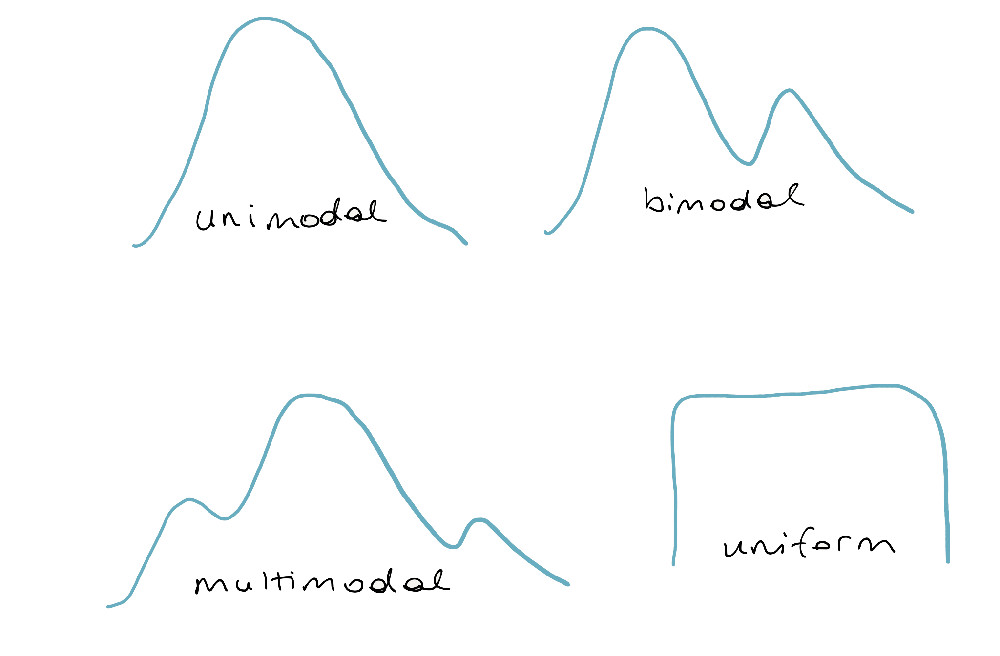
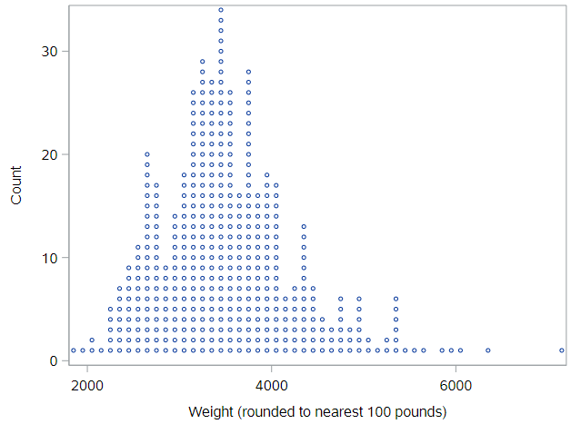
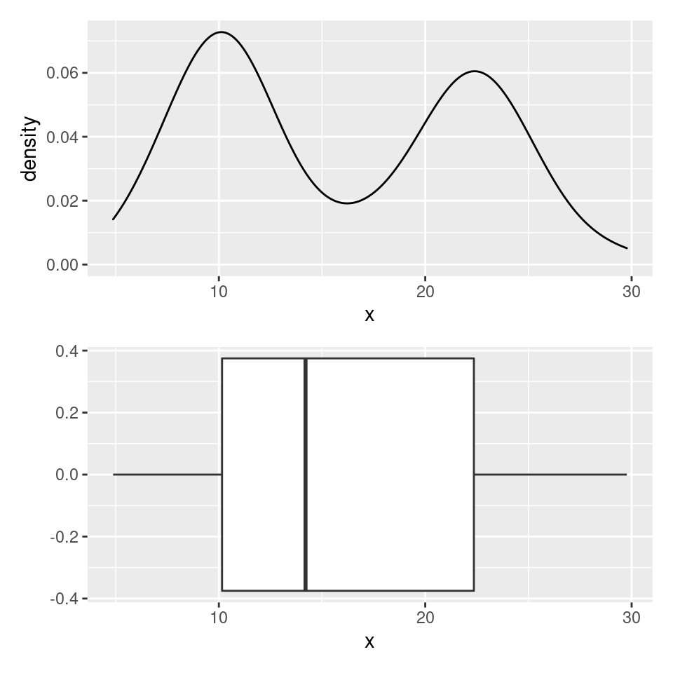

# Exploring single variables

## Categorical data

In this tutorial, you'll be exploring data from a wide range of contexts. The first dataset comes from comic books. Two publishers, Marvel and DC, have created a host of superheroes that have made their way into popular culture. You're probably familiar with Batman and Spiderman, but what about Mor the Mighty?

The comics dataset has information on all comic characters that have been introduced by DC and Marvel. Let's make a working copy of that dataset and check it out:

```
* Initialize things if you have not done this already during this SAS session;
%include "~/my_shared_file_links/hammi002/sasprog/run_first.sas";

* Makes and checks a working copy of COMICS data;
%use_data(comics);
%glimpse(comics);
```

We see that each row, or observation, is a different character and each column, or variable, is a different piece of information about that character. The top the output tells us the dimensions of this dataset: over 23,000 observations and 11 variables. In the variable list, we see that many are character types, which may indicate that they are categorical variables.

The first row in the dataset is Peter Parker, alias: Spiderman, where his alias and character name are included in the first variable `name`. The second column, `id`, shows that Peter Parker's personal identity is kept secret, and the third column tell us that his `align`ment is good; that he's a superhero, not a super villain. If you scroll the table to the right side, you will see several additional variables, including eye color and hair color.

### Frequency tables

It's clear from the first 10 records of these data that the alignment variable can be "good" or "neutral", but what other values are possible? We can see the full distribution of values in a categorical variable by using `PROC FREQ` to generate a **frequency table** for that variable. Let's generate the distribution of the each character's alignment:

```
* Check distribution of ALIGN variable;
proc freq data=comics;
	tables align;
run;
```

Inspecting the resulting table, we learn that there are, in fact, four possible alignments, "Good", "Bad", "Neutral", and "Reformed criminals", along with some missing data. Good thing we checked that! 

Also, this is the first dataset we've worked with that has some missing data. For the EDA tutorial, we will generally ignore missing data and just report percentages and generate figures for non-missing data. In practice, you'll want to consult a statistician about how best to handle missing data in analyses.

So let's re-generate this table without the `/ missing` option (i.e. let's ignore missing data):

```
* Check distribution of ALIGN variable (ignore missing);
proc freq data=comics;
	tables align;
run;
```

SAS gives us the count (Frequency column) and percentage (Percent column) of records in each alignment category. (It also gives us the cumulative frequency and cumulative percent, which is often more useful when the variable of interest is ordinal.) Notice that the percentages across all categories total to 100%.

For any category, the percent is calculated by dividing the frequency of that category by the total number of records in the analysis. Confirm, by pulling out a calcultor, a few of the percentages shown. 

*Where, in this output, can you find the total number of records in the analysis? Hint, it's 19,816.*

If we wanted to summarize the findings in this table for others, we might write this:

> Among characters in this dataset for whom alignment information was known, 9614 (48.5%) had a "Bad" alignment, 7446 (37.6%) had a "Good" alignment, 2753 (13.9%) had a "Neutral" alignment and 3 (<0.1%) were "Reformed Criminals".

Let's do one more. Here is the code to generate a frequency table for the identity variable:

```
* Check distribution of ID variable;
proc freq data=comics;
	tables id / missing;
run;
```

*How many different (non-missing) values of this variable are there?*

*In a short paragraph, describe the distribution of identity values in this dataset. Which identity is least common? most common?*

Frequency tables are basically all you need to numerically describe the distribution of a single categorical variable. You may hear this type of one-way output described as a **marginal distribution**, since the counts and percentages are calculated over the entire dataset.

### Bar charts

To graphically display the distribution of a categorical variables, you will primarily rely on bar charts. In SAS, we do that with `PROC SGPLOT`, as:  

```
* Simple bar chart of ID;
proc sgplot data=comics;
	vbar id;
run;
```

The frequencies associated with each category in this chart are are the same as in the table. We are able to see, quickly, the relative sizes of each category, even if we don't know the exact number in each category.

The default bar chart in SAS plots frequencies (see the *y*-axis in the graph you just produced). If you'd like to plot the percentages instead, use this code:

```
* Bar chart of ALIGN variable, percentage axis;
proc sgplot data=comics;
	vbar align / stat=percent;
run;
```

In a one-way analysis, the picture won't look any different. The only thing that changed was the scale on the *y*-axis, which now shows percentages.

## Numerical data

There are 4 characteristics that we need to consider when doing exploratory data analysis of numerical data:

- Center

- Variability

- Shape

- Outliers

For this, we are going to use data from the `cars` dataset, which records characteristics on all of the new models of cars for sale in the US in a certain year. Let's load and check the dataset:

```
* Makes and checks a working copy of CARS data;
%use_data(cars);
%glimpse(cars);
```

What kinds of things to do we see?

* We see that we have 428 observations and 19 variables.
* The car names, `name`, are character strings, where it's likely that every observations takes a unique value.
* There are a number of variables with a format of `YESNO.`, which appear to only have values of 0 (for No) and 1 (for Yes). (A quick `PROC FREQ` on one or more of these variables would confirm.) Having this type of variable coded as 0/1 is very common in SAS, and doesn't even really require the format. Variables like this are often called indicator variables, where the value is 1 if the condition or characteristic is true or present. 
* We see that the last set of variables are all numeric, some discrete and some continuous. *Can you tell which is which?*  

### Measures of center and variability

To summarize numerical variables, we typically present (a) some measure of central tendency, which reflects the "average" or "typical" value found in the data, and (b) some measure of variability in the observed values.

The main 3 measures of central tendency are the mean, the median, and the mode:

* The **mean** is just the simple arithmetic average.
* The **median** is the 50th percentile of the data, which represents the middle of the sorted values. "Middle" here literally means that half the observations will have a value above the median and half will have a value below the median for that particular variable.
* The **mode** is value that occurs most frequently in the dataset. For continuous data where the values are unique, there won't be a mode. In practice, we don't usually report the mode, but, instead, consider it when describing the shape of a distribution. We'll get to that soon.

Three of the most common measures of variability are the standard deviation, the interquartile range, and the (overall) range:

* The **standard deviation** (SD) is derived from the distances observed from each observation to the mean. If you square the standard deviation, you get the **variance**.
* The **interquartile range** (IQR) is the is the distance between the two numbers (Q1 and Q3) that cut-off the middle 50% of your data. Q1 is the 1st quartile, or 25th percentile, of the values, which 25% of the values in the data fall below. Q3 is the 3rd quartile, or 75th percentile, of the values, which 75% of the values in the data fall below Q3.

* The **range** is the distance between the minimum and maximum values in the data.

In SAS, we can generate this information using either `PROC UNIVARIATE` or `PROC MEANS`. See how the output from each of those procedures looks for the `weight` variable:

```
* Numerical summary of data, PROC UNIVARIATE;
proc univariate data=cars;
	var weight;
run;

* Numerical summary of data, PROC MEANS;
proc means data=cars;
	var weight;
run;
```

The volume of output from `PROC UNIVARIATE` is vast. Within this output, find the following values:

* Mean
* Median
* Standard deviation
* Interquartile range (and confirm this by finding Q1 and Q3 values and subtracting)
* Minimum and maximum values

Note how this compares to the limited output from the basic `PROC MEANS`, which only shows, by default, the mean, standard deviation, minimum value, and maximum value. Thankfully, it is very easy to request other measures:

```
* Numerical summary of data, PROC MEANS, with additional requests;
proc means data=cars mean std median q1 q3 mode;
	var weight;
run;
```

See the whole list of measures you can request [here](https://documentation.sas.com/doc/en/pgmsascdc/9.4_3.5/proc/n1qnc9bddfvhzqn105kqitnf29cp.htm#n11nn4xu6p9wvjn1lh60wtvvn538).

### Choosing measures to report 

For any dataset, you can *compute* all of these statistics, but which ones should you *report*? In practice, when summarizing numerical variables, people typically report either (a) the mean with the standard deviation, or (b) the median with the Q1 & Q3 values (bounds of the interquartile range).

There are definitely times when you'll want to avoid the mean, and that's when there are extreme values in your data. To see an example of how extreme values affect summary statistics, let's imagine that the U.S. Army started selling their Abrams M1A2C tank (which weighs 147,200 pounds) on the retail market.

Here's the code to create a new dataset, `cars_plusm1`, which includes weight info for the Abrams:

```
* Lets add the Abrams tank;
data cars_plusm1;
	set cars end=final;
	
	output;
	
	if final then do;
		name = "Abrams M1A2C tank";
		weight = 147200;
		output;
	end;
run;
```

Now let's get the mean (SD) and median (IQR)  for each dataset:

```
* Summary info for both old and new data;
proc univariate data=cars;
	title "Summary statistics, original data";
	var weight;
run;

proc univariate data=cars_plusm1;
	title "Summary statistics, with Abrams";
	var weight;
run;
```

Let's compare the results:

| Measure             | Original data | + Abrams tank | Difference |
| ------------------- | ------------- | ------------- | ---------- |
| Mean                | 3577          | 3914          | +337       |
| Standard deviation  | 760           | 6992          | +6232      |
| Median              | 3475          | 3476          | +1         |
| Interquartile range | 876           | 879           | +3         |

Yikes! The mean and the SD have both increased substantially with the addition of one data point, because both are these measures are very sensitive to extreme values. Compare this to the median and IQR, which barely budged. In statistical terms, the median and IQR are **robust** statistics, meaning they are not sensitive to extreme values.

This is a contrived example, but we see extreme values in skewed distributions of things like healthcare costs all the time. In those situations, you should prefer reporting the median (Q1, Q3) to the mean (SD).

In order to understand if a distribution is skewed, though, it's often helpful to see it. 

## Shape and transformations

We describe the shape of a distribution in terms of modality and skew, which are easiest to see using figures.

### Modality

The modality of a distribution is the number of prominent humps that show up in the distribution. If there is a single mode, as in a bell-curve, it's called "unimodal." If there are two prominent modes, it's called "bimodal." If it has three modes or more, the convention is to refer to it as "multimodal." There is one last case: when there is no distinct mode. Because the distribution is flat across all values, it is referred to as "uniform."



### Skew

If a distribution has a long tail that stretches out to the right, it's referred to as "right-skewed."

If that long tail stretches out to the left, its referred to as "left-skewed." If you have trouble remembering which is which, just remember that the name of the skew is in the direction the long tail is.

If neither tail is longer than the other, the distribution is called "symmetric."


## Dot plot

The most direct way to represent numerical data is with a *dot plot*, where each observation is a dot that's placed at it's appropriate value on the x-axis. The dots are then stacked on top of other cases with similar values. A dot plot of `weight` looks like:



You can think of a dotplot as a sibling to the histogram, except you know *exactly* how many observations are in each "bin," because you can count the dots. Importantly, the plot has much less information loss than a histogram, as you could almost rebuild the dataset if you were only given this plot. 

As you can imagine, these plots start to get difficult to read as the number of cases gets very large. And, unfortunately, SAS does not have a simple way to create these types of figures, so we need to move right into histograms.

## Histogram

One of the most common plots used to show the distribution of numerical data is a *histogram*. 

```
* Histogram of WEIGHT;
proc sgplot data=cars;
	histogram weight;
run;
```

Here, the height of histogram bar represents the percentage of values that fall within the limits of the bar, read from the x-axis. You can see how the shape of this histogram lines up with the shape of the dot plot above. Because of the binning (each bar is 500 pounds wide), it's not possible to perfectly reconstruct the dataset, but it allows us to gain a bigger picture of the shape of the distribution.

### Histogram bins 

If the stepwise (not continuous) nature of the histogram irks you, then you have a few options. 
First, you can play around with the width of the bars (bins) using the `binwidth` option. Or, second, you could use a density plot.

Regarding bin widths, here code for a histogram with a bin width of 100 pounds:

```
* Histogram of WEIGHT, with narrower bins;
proc sgplot data=cars;
	histogram weight / binwidth=100;
run;
```

While this is more detailed, it is possible to lose the sense of the shape of the distribution with narrow bin widths.

## Density plots

The *density plot* represents the shape of the histogram using a smooth line. You can think of the density plot as drawing a smoothed line over the top of a histogram, providing a smoother representation of the shape of the distribution. A density plot is fairly sensitive to spikiness in the data, so you'll only want to use it when you have a large number of observations.

```
* Density plot of WEIGHT;
proc sgplot data=cars;
	density weight / type=kernel;
run;
```

*Based on the histogram and the density plot for vehicle weight, how would you describe the modality and skew of that distribution of values?*

## Box plots & outliers

Similar to a histogram, a *box plot* does not plot the raw data. Instead, it plots summaries of the data. Here is the code to generate a box plot for the `weight` variable:

```
* Box plot of WEIGHT;
proc sgplot data=cars;
	hbox weight;
run;
```

What do you see? A box with whiskers, that extend to the left and right of the box, then some points denoted by circles.

The box represents the middle half of the data, since the width of the box is based on the first quartile (Q1, on the left) and the third quartile (Q3, on the right) of the data. The line inside the box represents the median. Note that SAS also shows you the mean value, as a diamond. In this plot, the mean is within the box, but that is not always true, especially for skewed data.

The whiskers, the lines that extend out from the box, are drawn down to $$Q_1 - 1.5 \times \text{IQR}$$ and  up to $$Q_3 + 1.5 \times \text{IQR}$$. This is the SAS default, although there are various different ways to define the length of the whiskers.

If an observation's value is beyond these "fence" values, it is plotted as a point. This is one of the handy features of a box plot; it flags for you points that are far away from the bulk of the data, a form of automated *potential* outlier detection. Outliers are, as noted at the start of this section, the fourth and final aspect of a distribution that is important to note. None of the potential outliers on this box plot are crazy far away from the rest of the distribution. If you want to see one of those, look at a box plot for MSRP:

```
* Box plot of MSRP;
proc sgplot data=cars;
	hbox msrp;
run;
```

## Density plots vs. box plots 

Box plots really shine in situations where you need to compare several distributions at once and also as a means to detect outliers. One of their weaknesses, however, is their inability to indicate when a distribution is bimodal or multimodal.

Consider the density plot here, with two distinct modes. If we construct a box plot of the same distribution, it sweeps this important structure under the rug and will always only provide a single box. 



## Variable Transformations 

Sometimes you come across across a variable with a heavy right skew. The retail  price, `msrp`, which we just looked at, is one such variable. Have a look at the histogram:

```
* Histogram + density plot of MSRP;
proc sgplot data=cars;
	histogram msrp;
	density msrp / type=kernel;
run;
```

Of note, `PROC SGPLOT` allows us to overlay different types of plots easily, as here where we see both a histogram and a density plot.

For skewed variables like this, we often use either a square-root or log transformation to make the distribution more symmetric, so we can see what's going on. Let's create a new logged version of MSRP and check that distribution: 

```
* Create logged value of MSRP in cars dataset directly;
data cars;
	set cars;
	
	log_msrp = log(msrp);
run;

* Histogram + density plot of MSRP on the log scale;
proc sgplot data=cars;
	histogram log_msrp;
	density log_msrp / type=kernel;
run;
```

This figure is difficult to interpret, because the x-axis is now on the log-scale, but just notice how much more symmetric the distribution of this transformed variable is, compared to the distribution of the untransformed variable. This symmetric shape can be very useful in regression analyses. 


## Summary

To sum up, for categorical variables, EDA is very straightforward. Make a frequency table and/or a bar chart. For numerical variables, however, EDA involves considering the center, variability, shape, and outliers of the distribution. There's a lot more to discuss.


You have successfully completed this tutorial.

# [< Back to Section 2](https://bghammill.github.io/ims-02-explore/)


<!-- MathJax -->

<script src="https://cdn.mathjax.org/mathjax/latest/MathJax.js?config=TeX-AMS-MML_HTMLorMML" type="text/javascript"></script>


