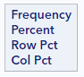
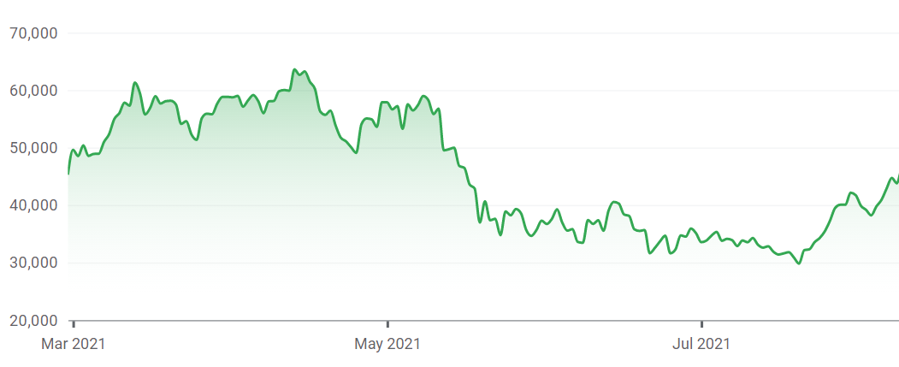

# Exploring relationships between two variables

While looking at variables one-by-one is a necessary part of exploratory data analysis, it's arguably more interesting to look at the relationships between multiple variables in your dataset. In this tutorial, we'll look at the graphical and numerical summaries available to describe the relationships between two variables.

We look at 3 different scenarios, based on the variable types involved:

* Categorical variable v. categorical variable
* Numerical variable v. numerical variable
* Categorical variable v. numerical variable

## Categorical variable x categorical variable

Let's revisit the comics dataset:

```
* Initialize things if you have not done this already during this SAS session;
%include "~/my_shared_file_links/hammi002/sasprog/run_first.sas";

* Makes and checks a working copy of COMICS data;
%use_data(comics);
%glimpse(comics);
```

Previously, we looked at the one-way distributions of alignment (`align`) and identity (`id`). Now we will look at the combination of those 2 characteristics.

But first, if you remember, there was a very small group ($$n = 3$$) with an alignment of "Reformed Criminal". Because that group was so small, we will make a new dataset, ignoring them (along with those missing alignment of identity information) for this particular analysis. This will simplify the analysis. (But remember to consult a statistician before dropping any data from an analysis that matters.)

```
* Create new dataset without reformed criminals and without missing alignment or identity info;
data comics_no_rc;
	set comics;
	where
		align ne "Reformed Criminals" and
		not missing(align) and
		not missing(id)
	;
run;
```

We'll continue to use this filtered dataset below.

### Contingency tables

A common way to represent the number and proportion of cases that fall into each combination of levels of two categorical variables is with what's called a **contingency table**. Creating a contingency table is a simple extension of the single-variable `PROC FREQ` code: 

```
* Check counts of ALIGN by ID variables;
proc freq data=comics;
	tables align * id / norow nocol;
run;
```

Some things to notice about this code and output:

* We list `align` first because we want that variable to be our row variable
* We list `id` second, because we want that variable to be our column variable
* We added the `norow` and `nocol` options here since we only wanted to look at overall counts and percentages
*  The sum of all the percentages shown in the output table is 100%

The output tells us that the most common category, with a count of 4492, was characters with "Bad" alignment with "Secret" identities. This combination represents 29.1% of all characters.

*What was the number and overall proportion of the least common combination?*

### Mosaic plot

One way to see these overall proportions visually is with a mosaic plot:

```
* Mosaic plot of ALIGN by ID;
ods graphics on;
proc freq data=comics_no_rc;
	tables align * id / norow nocol plots=mosaicplot;
run;
```

Here, the volume of each segment represents the proportion of cases with that combination of alignment and identity. It's, again, easy to see that the Bad/Secret combination is the most common. 

### Conditional proportions

Often, the overall counts and proportions are not what's of interest. Instead, we are interested in knowing if the distribution of one variable differs by the levels of another variable. 

For example, if we would like to know the proportion of public identity characters that are bad, we need to calculate our proportions among only the public identity characters. This is what's known as a conditional proportion. In conditional proportions, we do not use the total sample size as the denominator of the calculation. Instead, we use the size of the specific group of interest (here, the number of characters with public identity).

Let's rerun the previous `PROC FREQ` statement without requesting the suppression of the different percentages.

```
* Check distribution of ALIGN by ID variables;
proc freq data=comics_no_rc;
	tables align * id;
run;
```

Below each frequency count, we now see three proportions. And while this is a little busy, everything we might want to know about the distribution of these two characteristics is here. Note the legend that appears to the top left of the table:



This tell us what each number in each table cell represents. Right below the frequency is the overall percent, followed by the row percentage (or, the proportion of all records in that row that fall into the particular category denoted by the column), followed by the column percentage (or, the proportion of all records in that colume that fall into the particular category denoted by the row).

The row and column percentages are the conditional proportions. Which one you report depends on the question of interest.

Suppose you want to report the the proportion of public identity characters that are bad. Given the set-up of our contingency table (alignment as rows and id as columns), we can answer this question using the column percents (last number in each cell) within the public identity column. If you look up the public + bad cell, you can see that about 36% of public identity characters are bad.

Another example of a conditional proportion is the proportion of bad characters that are secret. Given the set-up of our contingency table, we can answer this question using the row percents (third number in each cell) within the bad alignment row. If you look up the bad + secret, you can see that nearly 63% of bad characters are secret.

*What % of neutral characters are secret?*

*What % of "no dual identity" charcters are good?*

Remember, when you condition on alignment (the value in the rows), the row percents sum to 100, since all of the characters with a particular alignment must fall into one of the identity categories. Similarly, when you condition on identity, the column percents sum to 100, since all of the characters with a particular identity must fall into one of the alignment categories.

Because `PROC FREQ` output can be busy, it is often helpful to use the `norow`, `nopct`, and `nocol` options to limit the output. For example:

```
* Check distribution of ALIGN by ID variables, row percents only;
proc freq data=comics_no_rc;
	tables align * id / nocol nopct;
run;
```

### Stacked bar charts

As the number of cells in these tables gets large, it becomes much easier to make sense of your data using graphics. The bar chart is also a good choice to show the conditional probabilities. For this, we have two options: a stacked bar chart and side-by-side bar charts.

Below is the code to create a stacked bar chart of conditional proportions. In this plot, we want to condition on the variable that is on the x-axis (`align`) and have the categories of each bar (`id`) add up to a total proportion of 1. To do this we need the `pctlevel=group` option in the `PROC SGPLOT` statement and the `stat=percent` option in the `VBAR` statement: 

```
* Bar chart of ALIGN by ID, conditional proportions;
proc sgplot data=comics_no_rc pctlevel=group;
	vbar align / group=id stat=percent;
run; 
```

Let's look carefully at how this is constructed: each colored bar segment actually corresponds to a conditional (row) proportion in our table, with the x-axis and the fill color indicating the category being plotted. We can see more quickly, in this figure, that the majority of bad characters are secret, which differs from the other alignments. 

Without those particular SAS options, by the way, `PROC SGPLOT` would have plotted raw counts of observations in each category, which makes it difficult to compare across categories of different sizes:

```
* Bar chart of ALIGN by ID, overall counts;
proc sgplot data=comics_no_rc;
	vbar align / group=id;
run; 
```

And if we flip the `align` and `id` variables, the bar chart gives us different information:

```
* Bar chart of ID by ALIGN, conditional proportions;
proc sgplot data=comics_no_rc pctlevel=group;
	vbar id / group=align stat=percent;
run; 
```

*Based on this figures, what is the least common alignment of secret characters?*

Which conditional bar chart you use depends on the question you'd like to answer.

### Side-by-side bar charts

A disadvantage of stacked bar charts is that you can't read the height of any particular bar segment off of the *y*-axis. That is more easily done by showing the same information as a side-by-side bar chart. Here is how we create a side-by-side bar chart of identity conditional on alignment in SAS:

```
* Side-by-side bar charts of ALIGN by ID, conditional proportions;
proc sgplot data=comics_no_rc pctlevel=group;
	vbar align / group=id groupdisplay=cluster stat=percent;
run;
```

Note that the total of all the bar percentages within each alignment still adds to 100%, as in the stacked bar chart. The difference is merely that the segments aren't stacked. (Know that some people have oddly strong preferences for either stacked or side-by-side bar charts.)

## Numerical variable x numerical variable

Let's move back to the `cars` dataset, which has lots of information about different cars that were on sale during a mystery year:

```
* Back to the CARS dataset;
%use_data(cars);
%glimpse(cars);
```

### Scatterplot

When exploring the relationship between two numerical variables, the go-to option is the **scatterplot**. Let's visualize the relationship between engine size (`eng_size`) and horsepower (`horsepwr`):

```
* Basic scatterplot of ENG_SIZE by HORSEPWR;
proc sgplot data=cars;
	scatter x=eng_size y=horsepwr;
run;
```

Let's pause for a moment and review what's going on in the code above.

- We use the versatile `SGPLOT` procedure to create scatterplots, too
- We are requesting a scatterplot with engine size on the x-axis and horsepower on the y-axis

When interpreting a scatterplot, you will want to report on the following 4 characteristics:

* <u>Form</u>: Is the association linear or nonlinear? Linear means a straight-ish line would capture the trend in the data well. Nonlinear means the relationship is better captured by a curve.
* <u>Direction</u>: Is the association positive or negative? If both variables tend to increase together, the relationship is positive. If both tend to decrease together, the relationship is negative.
* <u>Strength</u>: Does the association appear to be strong, weak, or somewhere in between? Very strong associations will appear almost like a line, while weak associations will look more like a cloud of points.
* <u>Outliers</u>: Do there appear to be any data points that are unusually far away from the others or that do not agree with the observed pattern?

We could describe the scatterplot we just made as follows:

> This scatterplot shows a moderately strong, positive, linear association between engine size and horsepower. This is one observations with both large engine size and horsepower, but this data point is in line with the observed relationship.

If we add a best-fit line through these points, we can see the positive relationship more clearly.

```
* Scatterplot of ENG_SIZE by HORSEPWR with regression line;
proc sgplot data=cars;
	reg x=eng_size y=horsepwr;
run;
```

Look at these other relationships from this dataset and note the form, direction, strength, and outliers of each. These three relationships exhibit very different types of associations:

```
* Scatterplot of CITY_MPG by ENG_SIZE;
proc sgplot data=cars;
	reg x=eng_size y=city_mpg;
run;

* Scatterplot of DEALER_COST by MSRP;
proc sgplot data=cars;
	reg x=msrp y=dealer_cost;
run;

* Scatterplot of MSRP by WHEEL_BASE;
proc sgplot data=cars;
	reg x=wheel_base y=msrp;
run;
```

### Line charts


Line graphs are like scatter plots in that they record a pair of data values on the graph. The difference is that a line is created that connects each data point together consecutively, as it appears in the data. In this way, the local change from point to point can be seen. Line charts also typically have the requirement that the values on the x-axis must be unique.

The most common use of line charts is for time series data. Imagine that you records total rainfall by day or stock price at the end of each trading day.  In each situation, we would only have one observation for day, so a line chart would be perfect.

Here is a line chart showing the daily price of Bitcoin over the last 6 months:



 

## Categorical variable x numerical variable

Finally, we often want to look at a numeric variable's distribution by different subgroups within the data. Most of what we'll do below is what you'd do to summarize a single numerical variable. We're just going to repeat that for each subgroup. Meaning, we can calculate summary measures by group and show histograms, density plots, or box plots for each group side-by-side. 

For example, let's look at the numerical summary measures for highway MPG (`hwy_mpg`) by whether or not the vehicles are pickup trucks:

```
* Basic numerical summary of HWY_MPG by PICKUP;
proc means data=cars mean std median q1 q3 maxdec=1;
	class pickup;
	var hwy_mpg;
run;
```

Based on this output, we see that the each measure of location (mean, median, Q1, Q3) is higher by 6 or 7 mpg among non-pickups compared to pick-ups. The variability, as measured by the standard deviation (SD) is also a bit higher for non-pickups than for pickups.

Let's also look at this graphically, using overlaid histograms:

```
* Histograms of HWY_MPG by PICKUP;
proc sgplot data=cars;
	histogram hwy_mpg / group=pickup transparency=0.5;
run;
```

We add the `transparency=0.5` option so we can see the different distributions when things overlap.

The results here confirm the `PROC MEANS` output. The plot shows that the typical pickup gets lower mileage than the typical non-pickup and that non-pickups have more variability than do the pickups.

It may be easier to compare the variability with overlaid density plots. We can do that using the following SAS code:

```
* Overlaid density plots of HWY_MPG by PICKUP;
proc sgplot data=cars;
	density hwy_mpg / group=pickup type=kernel;
run;
```

This helps us see where the different distributions overlap.

Sometimes side-by-side box plots are what you need:

```
* Side-by-side box plots of HWY_MPG by PICKUP;
proc sgplot data=cars;
	hbox hwy_mpg / group=pickup;
run;
```

Same story no matter which graphic we use. Learn to interpret each of those.

That's honestly all there is for the numerical x categorical case.


You have successfully completed this tutorial.

# [< Back to Section 2](https://bghammill.github.io/ims-02-explore/)


<!-- MathJax -->

<script src="https://cdn.mathjax.org/mathjax/latest/MathJax.js?config=TeX-AMS-MML_HTMLorMML" type="text/javascript"></script>


