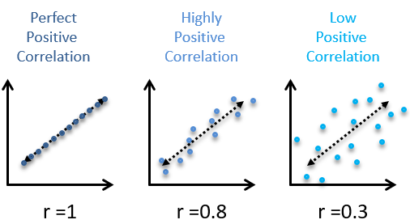
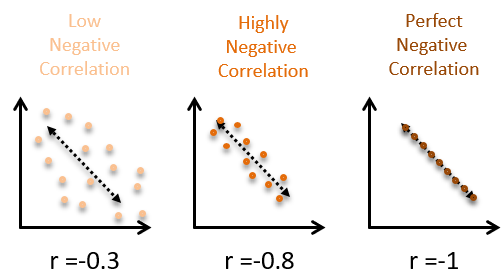
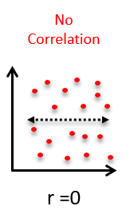
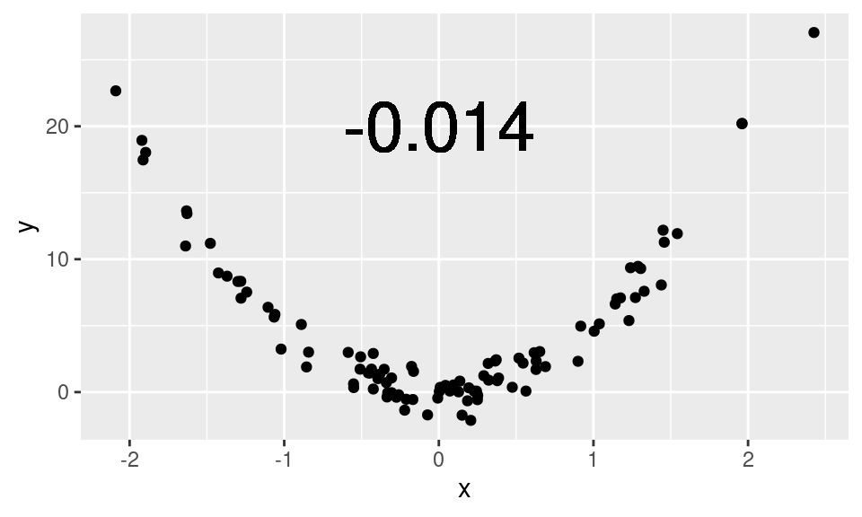
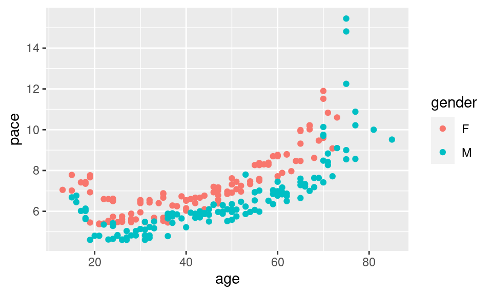

# Measures of association between two variables

In the previous lesson, we learned how to *visually* assess the strength of the relationship between two variables. In this lesson, we will learn ways to *quantify* the strength the relationship between two variables. 

As before, we will look at 3 different scenarios, based on the variable types involved:

* Categorical variable v. numerical variable
* Numerical variable v. numerical variable
* Categorical variable v. categorical variable

## Categorical variable x numerical variable

When one variable is categorical and one is numerical, the most common way to quantify the strength of the relationship between the variables is to calculate the difference in means of the numerical variable between different levels of the categorical variable.

Mean $$\Delta = mean_1 - mean_2$$

In this formula, Group 2 is the "reference" group that Group 1 is being compared to. A positive mean difference indicates that Group 1 has a higher mean on that variable than Group 2. A negative mean differences indicates that Group 1 has a lower mean on that variable than Group 2. This idea of clearly defining your reference group is critical since you can take this difference either way.

To demonstrate this straightforward idea, let's use a new dataset, BDIMS, which includes body girth measurements and skeletal diameter measurements, as well as age, weight, height, and sex, for 507 physically active individuals (247 men and 260 women).

```
* Initialize things if you have not done this already during this SAS session;
%include "~/my_shared_file_links/hammi002/sasprog/run_first.sas";

* Makes and checks a working copy of BDIMS data;
%use_data(bdims);
%glimpse(bdims);
```

We are interested in looking at the difference in elbow diameter (measured in centimeters) [`elb_di` variable] between males and females [`sex` variable]. Before we just to the two-variable relationship, let's do some single-variable exploratory data analysis to check and see if there is anything odd going on with either of these variables:

```
* Frequency table for SEX;
proc freq data=bdims;
	tables sex / missing;
run;

* 5-number summary for ELB_DI, plus number of missing values;
proc means data=bdims min q1 median q3 max nmiss;
	var elb_di;
run;

* Histogram and density for ELB_DI;
proc sgplot data=bdims;
	histogram elb_di;
	density elb_di / type=kernel lineattrs=(color=green);
run;
```

No missing data, no outliers, and no other unexpected values. Looks good to proceed.

Note a few additional options in this code, by the way:

* Explicitly requested the 5-number summary in `PROC MEANS` using the options `min q1 median q3 max`
* Additionally requested the number of missing values in `PROC MEANS` using the `nmiss` option
* Overlaid a density curve on the histogram in `PROC SGPLOT` by adding a second figure request. These are produced in the order they are requested. if you were to put the `density` statement first, it would largely get blocked by the histogram.
* Requested that the density plot show up as green using the `lineattrs` option

To get the difference in mean elbow diameter by sex, we could just request the means from `PROC MEANS` and use a calculator to subtract:

```
* Check means for elbow diameter by sex;
proc means data=bdims;
	var elb_di;
	class sex;
run;
```

You should see that mean elbow diameter for females is 12.37 cm, while mean elbow diameter for males is 14.46 cm. 

With females as the reference group, Mean $$\Delta = mean_M - mean_F = 14.46 - 12.37 = 2.09 $$ cm. You might report this as: The mean elbow diameter among males is 2.09 cm larger than it is for females.

With males as the reference group, Mean $$\Delta = mean_F - mean_M = 12.37 - 14.46 = -2.09 $$ cm. You might report this as: The mean elbow diameter among females is 2.09 cm smaller than it is for males.

There is a way to get this mean difference calculated for you by SAS using `PROC TTEST`. We'll see this procedure later when making inference about means.

```
* Use PROC TTEST to calculate the difference of elbow diameter by sex;
ods graphics on;
proc ttest data=bdims;
	var elb_di;
	class sex;
run;

```

In the first section of output, make sure you can locate:

* The mean value of `elb_di` for females
* The mean value of `elb_di` for males
* The difference between these means

You may notice that you don't really get a choice regarding your reference group here. The default is to use the 2nd ordered group as the reference. Males were automatically chosen as the reference group and the calculated mean difference is negative. If you want females to be the reference group, you just need to flip the sign on the calculated difference.


## Numerical variable x numerical variable

When both variables are numerical, we know that a scatterplot can show us the relationship. But **correlation** is a way to *quantify* the strength of that linear relationship.

The correlation coefficient is a number between -1 and 1 that indicates the strength of a linear relationship. The *sign* of the correlation coefficient corresponds to the direction—positive or negative. When 2 variables are positively correlated, they tend to increase together. When 2 variables are negatively correlated, one tends to increase by the other decreases. The *magnitude* of the correlation corresponds to its strength. Values near 0 are indicate weaker correlation and values near 1 or -1 indicate stronger correlation.

Here are some examples of positive correlations:



Here are some examples of negative correlations:



And here is what no correlation looks like:



In general, the more spread out the points in the scatterplot appear, the weaker the correlation. And a random cloud of points indicates almost no association. 

If you're looking for the right word to use when describing the strength of a relationship (weak, strong, etc.) based on a correlation coefficients, here are some general ranges that are commonly applied:

| Absolute value of correlation, \|*r*\| | Strength of Relationship |
| -------------------------------------- | ------------------------ |
| \|*r*\| < 0.3                          | None or very weak        |
| 0.3 < \|*r*\| < 0.5                    | Weak                     |
| 0.5 < \|*r*\| <0.7                     | Moderate                 |
| \|*r*\| > 0.7                          | Strong                   |

### Non-linear relationships

It is crucial to remember that the correlation coefficient only captures the strength of the *linear* relationship between two variables. It is quite common to encounter variables that are strongly-related, but in a non-linear way. Blindly computing and reporting the correlation between such variables **does not** yield meaningful results.



Here, this scatterplot shows a clear, quadratic relationship. To interpret the low correlation coefficient as evidence that *x* and *y* are unrelated would be plainly incorrect. Here, *x* and *y* are very closely related—just not in a linear fashion.

Here is another example using real data from a 10-mile run. The pace of the top 10 finishers in each age group are plotted against their age. Note how the relationship between the pace and age is non-linear: 25-year-olds tend to actually be faster than 20-year-olds, but as people age beyond their thirties, they tend to get slower. This pattern is present for both men and women.



The value of the correlation coefficient here is about 0.72, but we have some intuitive sense that pace and age are more closely-related than the correlation coefficient indicates because of this non-linearity.

## Calculating Correlations in SAS

In SAS, `PROC CORR` is the procedure to use for computing the Pearson correlation coefficient between two numerical variables. Let's stay with the BDIMS data and look at how a few different measurements correlate with elbow diameter.

Let's first look at the scatterplot between elbow diameter and wrist diameter:

```
* Scatterplot between elbow diameter and wrist diameter;
proc sgplot data=bdims;
	scatter x=elb_di y=wri_di;
run;
```

The relationship here seems pretty clear. How would you describe this relationship from the scatterplot? Is it positive or negative? Linear or non-linear? Strong or weak?

Now let's calculate the correlation coefficient:

```
* Correlation between elbow diameter and wrist diameter;
proc corr dasta=bdims noprob nosimple;
	var elb_di wri_di;
run;
```

So the correlation is +0.84, which is a strong, positive correlation.

Let's try another one. Let's look at the scatterplot between elbow diameter and thigh girth:

```
* Scatterplot between elbow diameter and thigh girth;
proc sgplot data=bdims;
	scatter x=elb_di y=thi_gi;
run;
```

This relationship here is murkier. How would you describe this relationship from the scatterplot? Is it positive or negative? Linear or non-linear? Strong or weak? 

Now let's calculate the correlation coefficient:

```
* Correlation between elbow diameter and thigh girth;
proc corr dasta=bdims noprob nosimple;
	var elb_di thi_gi;
run;
```

This correlation is positive, but very weak, at +0.21.

There are at least a dozen other numerical measurement variables on this dataset if you'd like to try and guess other correlations.

### Categorical variable x categorical variable

Before doing this section, make sure you have read the *Measures of Association* supplemental reading. It describes the 3 different measures that we will be exploring here: the risk ratio (or relative risk), the odds ratio, and the risk difference. Unfortunately, getting SAS to calculate these measures is a lot more work that it should be. If you don't have the data in exactly the right format, the output will not be as expected.

So, in order to have a little more control of the situation, we are only going to use SAS to get the numbers we need to fill in the requisite 2x2 table. We'll then use put those numbers into an Excel workbook to calculate everything. Kind of complicated, but, honestly, a lot less of a headache than fighting with SAS.

Before we get started, go to the Sakai Resources section and download the *Association-2x2.xlsx* file from the Analysis Tools folder.

For this section, we are going to explore a sample of 1000 births that occurred in NC. We will examine whether smoking (`habit`) as the exposure (compared to not smoking) is associated with low birth weight (`lowbirthweight`) as the outcome.

```
* Makes and checks a working copy of NCBIRTHS data;
%use_data(ncbirths);
%glimpse(ncbirths);
```

As before, let's look at the data first, to see if we, indeed, only have two categories in each of these variables:

```
* One-way frequency tables for HABIT and LOWBIRTHWEIGHT;
proc freq data=ncbirths;
	tables habit lowbirthweight / missing;
run;
```

There is 1 missing value on the smoking variable, so we'll just ignore that value when we make our 2x2 table. Otherwise, everything looks good. There are two levels of the exposure (Smoker, Nonsmoker) and two levels of the outcome (Low birthweight, Not low birthweight).

So let's get the counts we need for this 2x2 table:

```
* Contingency table for HABIT by LOWBIRTHWEIGHT;
proc freq data=ncbirths;
	tables habit * lowbirthweight / nocol norow nopct;
run;
```

Move these counts into the correct cells in the green section of the Excel worksheet. For this question:

* Exposure = Yes refers to Smokers
* Exposure = No refers to Nonsmokers
* Outcome = Yes refers to Low birthweight
* Outcome = No refers to Not low birthweight

Does it make sense why we have defined things this way? You should be entering 18 (Smoker, Low)  from the SAS output into the top left cell (Yes, Yes) in Excel. Fill in the rest of the cells appropriately.

The output is calculated automatically in the second section of the worksheet.  If you did this correctly, the relative risk (about 1/3 of the way down the output section) should be 1.356. If this is not the case, check that you put the correct numbers in the correct cells.

Now look at the results and make sure you can answer the following questions:

* What is the risk of low birthweight among mothers who smoked?
* What is the risk of low birthweight among mothers who did not smoke?
* What is the relative risk (risk ratio) of having a low birthweight infant for smokers, compared to nonsmokers?
  * How would you express the relative risk as a relative different (% change in risk)?
* What is the absolute risk difference of having a low birthweight infant for smokers, compared to nonsmokers? In other words, how excess low birthweight infants per hundred would we expect for mothers who smoke compared to mothers who do not smoke?
* What is the odds ratio of having a low birthweight infant for smokers, compared to nonsmokers?
  * How does this ratio compare to the relative risk?

If there are questions about this particular section, please bring them to class.


You have successfully completed this tutorial.

# [< Back to Section 2](https://bghammill.github.io/ims-02-explore/)


<!-- MathJax -->

<script src="https://cdn.mathjax.org/mathjax/latest/MathJax.js?config=TeX-AMS-MML_HTMLorMML" type="text/javascript"></script>

