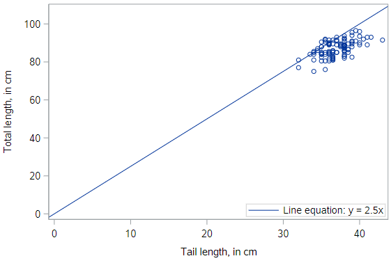
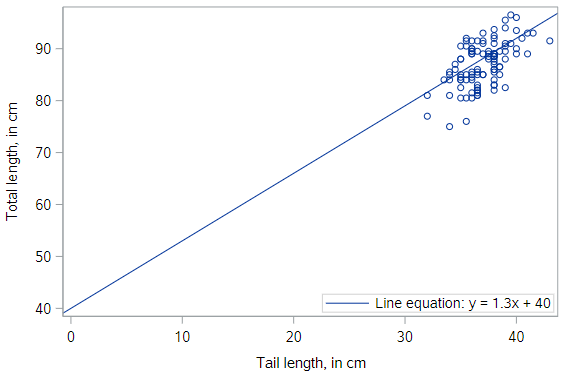

# Simple linear regression


## Visualization of linear models

Before we get into the mathematical specification for a regression model, let’s build some intuition about what a regression line is.

We are going to use the POSSUM dataset for this exploration. Let's get things set up so you can follow along.

```
* Initialize this SAS session;
%include "~/my_shared_file_links/hammi002/sasprog/run_first.sas";

* Makes and checks a working copy of POSSUM data;
%use_data(possum);
%glimpse(possum);
```

Let's first look at a scatterplot of the total length of a possum (`total_l`), and the corresponding length of its tail (`tail_l`):

```
* Scatterplot of TOTAL_L v. TAIL_L;
proc sgplot data=possum;
	scatter x=tail_l y=total_l;
run;
```

Clearly there is not a perfect relationship here: the total length of the possum varies even for possums with the same tail length. But we still have some intuitive desire to describe the relationship with a line.


So let's just draw our own line. The code for each scatterplot is below, if you want to follow along.

## Picking a line of best fit

#### Through the origin

In the plot below, we’ve superimposed a line that goes through the origin - that is, the point where both $$x$$ and $$y$$ are equal to zero. The line has a slope of 2.5 centimeters (of total length) per centimeter (of tail length). We notice that, in some sense, the line does go “through” the points, but doesn’t capture the general trend as best we could imagine.

```
* Scatterplot of TOTAL_L v. TAIL_L -- Add line y = 2.5x;
proc sgplot data=possum;
	scatter x=tail_l y=total_l;
	lineparm x=0 y=0 slope=2.5 / legendlabel="y = 2.5x";
run;
```




#### Through the origin, better fit

This line also goes through the origin, but has a gentler slope of 2.3 cm (of total length) per cm (of tail length). It seems like a “better” fit, since it cuts through the points in a more central way.

```
* Scatterplot of TOTAL_L v. TAIL_L -- Add line y = 2.3x;
proc sgplot data=possum;
	scatter x=tail_l y=total_l;
	lineparm x=0 y=0 slope=2.3 / legendlabel="y = 2.3x";
run;
```


#### Not through the origin

But why should we force the line to go through the origin? Here is a line that has a $$y$$-intercept of 40 cm, and an even gentler slope of 1.3 . It seems like an even better fit still.

```
* Scatterplot of TOTAL_L v. TAIL_L -- Add line y = 1.3x + 40;
proc sgplot data=possum;
	scatter x=tail_l y=total_l;
	lineparm x=0 y=40 slope=1.3 / legendlabel="y = 1.3x + 40";
run;
```



Do you think you could find an even better fit? In order to do so, you need some criteria for judging which line fits better. In particular, you need a numerical measurement of how good the fit of each possible line is.

#### The “best” fit line

The simple linear regression model for a numeric response as a function of a numeric explanatory variable can be visualized on the corresponding scatterplot by a straight line.

In regression, we use the *least squares* criterion to determine the best fit line. Statisticians have proven that (apart from pathological examples) if we seek the line that tries to minimize the sum of the squared distances between the line and a set of data points, a unique line exists. That line is called the “least squares regression line.”

This is what things look like if we add the least squares regression line to our scatterplot.

```
* Scatterplot of TOTAL_L v. TAIL_L with actual regression line;
proc sgplot data=possum;
	reg x=tail_l y=total_l;
run;
```


#### Uniqueness of least squares regression line

The least squares criterion implies that the slope of the regression line is unique. In practice, the slope and intercept of the line of best fit will be computed by SAS. But it's interesting to try and find the optimal values for a regression equation yourself, to get an intuitive sense of the process of minimizing the squared residuals.

Go spend a few minutes here, [https://phet.colorado.edu/sims/html/least-squares-regression/latest/least-squares-regression_en.html](https://phet.colorado.edu/sims/html/least-squares-regression/latest/least-squares-regression_en.html).


To manually fit a line to some points, do the following:

1. Select a pre-existing data relationship (Manatee Mortality vs. Time is a great choice)
2. Turn on the Squared Residuals option, so you can see the squared error (as light purple boxes) associated with individual points and can see the total squared error in the "sum" bar
3. Fiddle with the sliders to change the slope and intercept of the line 
4. When you have a line that you think is reasonable, turn on the Best-Fit Line to see how you did.

## Understanding Linear Models

Models are ubiquitous in statistics. In many cases, we assume that the value of our response variable is some function of our explanatory variable, *plus some random noise*. The latter term is important, and in a philosophical sense, is the focus of statistical thinking.

What we are saying here is that there is some mathematical function $$f$$, which can translate values of one variable into values of another, except that there is some randomness in the process.

*Response = f(explanatory) + noise*

What often distinguishes statisticians from other quantitative researchers is the way that we try to model that random noise.

#### Linear model

For a linear regression model, we simply assume that $$f$$ takes the form of a linear function. Thus, our model describes the value of the response variable in terms of what creates a line (an intercept and a slope).

*Response = intercept + slope ⋅ explanatory + noise*

#### Regression model

In a regression model, we use Greek letters for the intercept and slope, indicating that they are population parameters which we hope to estimate with our sample.

The intercept is typically notated as $$\beta_0$$ and the slope is notated as $$\beta_1$$. The noise term in a regression is often denoted $$\epsilon$$. In a regression, we assume that the noise term has a Normal distribution, centered at 0 with a known standard deviation of $$\sigma_\epsilon$$. The equation below is what we call our *population regression equation*, symbolizing that it is for the population we are interested in studying.

$$y=\beta_0 + \beta_1 x + \epsilon$$

#### Fitted values

When we estimate our population regression equation with data, we need to indicate that our intercept and slope values are estimates for the *true* population intercept and slope.

We do this by changing our equation in four ways:

1. $$y$$ is changed to $$\hat{y}$$, as we are now estimating the mean response rather than an individual response
2. The error term, $$\epsilon$$ is removed, as we are no longer modeling individual responses
3. The $$\beta_0$$ is replaced with $$\hat{\beta}_0$$ or $$b_0$$, notating that this is an estimate of the true intercept
4. The $$\beta_1$$ is replaced with $$\hat{\beta}_1$$ or $$b_1$$, notating that this is an estimate of the true slope

The resulting *estimated regression equation* looks like:

$$\hat{y} = b_0 + b_1 X$$

#### Residuals

The difference between what was observed in the data and what was predicted from the regression line is what we call a *residual*, denoted as $$e$$. 

$$e=y-\hat{y}$$

Observations that lie above the regression line exceeded their predicted value and have a positive residual. Values below the regression line are less than their predicted value and have a negative residual.

The residuals are the realization of the noise term from the population regression equation. While $$\epsilon$$ and $$e$$ play analogous roles in the regression equation, $$\epsilon$$ is an unknown, true quantity, while $$e$$ is a known, estimate of that quantity.

#### Fitting procedure

While we won’t delve into the specifics of the least squares fitting procedure, we will outline what it does. It is intuitive that we would want a line that has small residuals. As we have already noted, it is common practice to choose a line that minimizes the sum of squared residuals.

In this procedure, the residual for each observation is squared and all of the squared residuals are added up. You can think of the use of the squared error as saying that “a residual twice as large as another residual is more than twice as bad.” In other words, overestimating by 4 is more than twice as bad as overestimating by 2.

#### Least squares

Actually computing the fitted coefficients is usually a messy business for which the computer is much better suited than we are, so we won’t discuss that here. You should know that the least squares fitting procedure is a well-understood, relatively straightforward, deterministic process that can be computed efficiently. It will always return a unique solution, except in rare, unrealistic cases.

Your regression line will always have two attributes, (1) the residuals will always sum to 0, and (2) the point ($$\bar{x}, \bar{y}$$) is guaranteed to lie on the regression line. Given your understanding of correlation, it should not surprise you to learn that the regression slope and the correlation coefficient are closely-related. In fact, they are proportional to one another.

You should also be aware that there are other criteria—apart from least squares—for choosing a line of “best” fit, but we won’t talk about them in this class.

### Key concepts

It’s worth reviewing some key concepts about regression models.

- $$\hat{y}$$ is the mean value of the response, for a given value of $$x$$. In other words, $$\hat{y}$$ is our best guess for the true value of $$y$$, given what we know about $$x$$.
- $$\hat{\beta}_0, \hat{\beta}_1$$ are estimates of the true, unknown population parameters $$\beta_0, \beta_1$$
- Residual, $$e$$'s are estimates of true, unknown errors (noise), $$\epsilon$$

### Regression model output terminology

The fitted model for the poverty rate ($$PR$$) of U.S. counties as a function of high school ($$HS$$) graduation rate is:

$$\hat{PR}=64.594 - 0.591HS$$

In Hampshire County in western Massachusetts, the high school graduation rate is 92.4%. These two facts imply that the mean poverty rate in Hampshire County is... what? In order to estimate the mean outcome value for a given value of the explanatory variable, you just plug in the data:

$$\hat{PR}=64.594 - 0.591(92.4)$$

$$\hat{PR}=64.594 - 54.608$$

$$\hat{PR}=9.99$$

## Fitting a linear model “by hand”

The reading notes that, for a simple linear regression model, 

$$y=\beta_0 + \beta_1 x + \epsilon$$

it is possible to compute the estimated slope $$b_1$$ and intercept $$b_0$$ using basic summary statistics from the sample data, including $$r$$, $$s_x$$, $$s_y$$, $$\bar{x}$$, and $$\bar{y}$$.

You won't have to do this, but it's interesting to know that you could determine a regression equation directly from summary statistics. 

## Fitting a linear model in SAS

To finish this tutorial, let's fit a regression line to the POSSUM data presented above. SAS actually offers many different procedures for estimating linear regressions. For now, we will rely on `PROC REG`, since it has some advantages for model diagnostics, that we'll see later.

```
* Simple regression model;
proc reg data=possum;
	model total_l = tail_l;
run;
```

It's that simple. We are using `PROC REG` to request a linear model with total length, `total_l`, as the response variable and with tail length, `tail_l`, as the explanatory variable. You should see output similar to what's below.


For now, focus on the last section, *Parameter Estimates*. This section is showing us that the estimate of the intercept, $$b_0$$, is 41.04 and that the estimate of the slope, $$b_1$$ is 1.24, which means we can write out the estimated regression equation explicitly as

$$\hat{y} = 41.04 + 1.24 X$$

We'll talk about how to interpret these parameter estimates and about other aspects of the SAS output in the following tutorials. 


You have successfully completed this tutorial.

# [< Back to Section 3](https://bghammill.github.io/ims-03-model/)


http://openintro-ims.netlify.app/)

<!-- MathJax -->

<script src="https://cdn.mathjax.org/mathjax/latest/MathJax.js?config=TeX-AMS-MML_HTMLorMML" type="text/javascript"></script>

