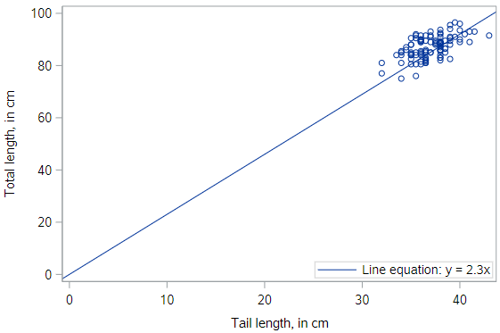

# Simple linear regression


## Visualization of linear models

Before we get into the mathematical specification for a regression model, let’s build some intuition about what a regression line is.

We are going to use the POSSUM dataset for this exploration. Let's get things set up so you can follow along.

```
* Initialize this SAS session;
%include "~/my_shared_file_links/hammi002/sasprog/run_first.sas";

* Makes and checks a working copy of POSSUM data;
%use_data(possum);
%glimpse(possum);
```

Let's first look at a scatterplot of the total length of a possum (`total_l`), and the corresponding length of its tail (`tail_l`):

```
* Scatterplot of TOTAL_L v. TAIL_L;
proc sgplot data=possum;
	scatter x=tail_l y=total_l;
run;
```

Clearly there is not a perfect relationship here: the total length of the possum varies even for possums with the same tail length. But we still have some intuitive desire to describe the relationship with a line.


## Picking a line of best fit

### Through the origin

In the plot below, we’ve superimposed a line that goes through the origin - that is, the point where both $x$ and $y$ are equal to zero. The line has a slope of 2.5 centimeters (of total length) per centimeter (of tail length). We notice that, in some sense, the line does go “through” the points, but doesn’t capture the general trend as best we could imagine.


### Through the origin, better fit

This line also goes through the origin, but has a gentler slope of 2.3 cm (of total length) per cm (of tail length). It seems like a “better” fit, since it cuts through the points in a more central way.




### Not through the origin

But why should we force the line to go through the origin? Here is a line that has a $y$-intercept of 40 cm, and an even gentler slope of 1.3 . It seems like an even better fit still.

Do you think you could find an even better fit? In order to do so, you need some criteria for judging which line fits better. In particular, you need a numerical measurement of how good the fit of each possible line is.


### The “best” fit line

The simple linear regression model for a numeric response as a function of a numeric explanatory variable can be visualized on the corresponding scatterplot by a straight line.

In regression, we use the least squares criterion to determine the best fit line. Statisticians have proven that (apart from pathological examples) if we seek the line that tries to minimize the sum of the squared distances between the line and a set of data points, a unique line exists. That line is called the “least squares regression line.”

We might consider linear regression to be a specific example of a larger class of *smooth* models. The `geom_smooth()` function allows you to draw such models over a scatterplot of the data itself. This technique is known as visualizing the model *in the data space*. The `method` argument to `geom_smooth()` allows you to specify what class of smooth model you want to see. Since we are exploring linear models, we’ll set this argument to the value `"lm"`.

We can add the line to our plot using the `geom_smooth()` function and specifying the `method` argument to be `"lm"`, which stands for “linear model”.

```
ggplot(data = possum, aes(y = total_l, x = tail_l)) +
  geom_point() + 
  geom_smooth(method = "lm")
```


### Ignore standard errors

Note that by default, this will draw the regression line in blue, with gray shading for the standard error associated with the line. That should not concern us just yet, so we can turn it off by setting the `se` argument to `FALSE`.

```
ggplot(data = possum, aes(y = total_l, x = tail_l)) +
  geom_point() + 
  geom_smooth(method = "lm", se = FALSE)
```


You’ll explore the “best fit” line on your own in these next exercise.


### Uniqueness of least squares regression line

The least squares criterion implies that the slope of the regression line is unique. In practice, the slope is computed by R. In this exercise, you will experiment with trying to find the optimal value for the regression slope for weight as a function of height in the `bdims` dataset via trial-and-error.

We’ve built a custom function for you called `add_line()`, which takes a single argument: the proposed slope coefficient and plots it on the scatterplot of height and weight.

Use the code chunk below to experiment with different values (to the nearest integer) of the `my_slope` parameter until you find one that you think fits best.


## Understanding Linear Models

Models are ubiquitous in statistics. In many cases, we assume that the value of our response variable is some function of our explanatory variable, plus some random noise. The latter term is important, and in a philosophical sense, is the focus of statistical thinking.

What we are saying here is that there is some mathematical function ff, which can translate values of one variable into values of another, except that there is some randomness in the process. What often distinguishes statisticians from other quantitative researchers is the way that we try to model that random noise.


response=f(explanatory)+noiseresponse=f(explanatory)+noise


### Linear model

For a linear regression model, we simply assume that ff takes the form of a linear function. Thus, our model describes the value of the response variable in terms of what creates a line (an intercept and a slope).


response=intercept+slope⋅explanatory+noise


### Regression model

In a regression model, we use Greek letters for the intercept and slope, indicating that they are population parameters which we hope to estimate with our sample.

The intercept is notated as β0β0 and the slope is notated as β1β1. The noise term in a regression is often denoted ϵϵ. In a regression, we assume that the noise terms have a Normal distribution, centered at 0 with a known standard deviation of σϵσϵ. The equation below is what we call our “population” regression equation, symbolizing that it is for the population we are interested in studying.


Y=β0+β1⋅X+ϵ,ϵ∼N(0,σϵ)


### Fitted values

When we estimate our population regression equation with data, we need to indicate that our intercept and slope values are estimates for the *true* population intercept and slope.

We do this by changing our equation in four ways:

1. YY is changed to y^y^, as we are now estimating the mean response rather than an individual response
2. the error terms (ϵϵ) are removed, as we are no longer modeling individual responses
3. The β0β0 is replaced with β0ˆβ0^, notating that this is an estimate of the true intercept
4. The β1β1 is replaced with β1ˆβ1^, notating that this is an estimate of the true slope

The resulting model looks like:


Y^=β^0+β^1⋅X


### Residuals

The difference between what was observed in the data and what was predicted from the regression line is what we call a “residual.” Obervations that lie above the regression line exceeded their predicted value and have a positive residual. Values below the regression line are less than their predicted value and have a negative residual.

The residuals are the realization of the noise term from the population regression equation. While ϵϵ and ee play analogous roles in the regression equation, ϵϵ is an unknown, true quantity, while ee is a known, estimate of that quantity.


e=Y−Y^


### Fitting procedure

While we won’t delve into the specifics of the least squares fitting procedure, we will outline what it does. It is intuitive that we would want a line that has small residuals. As discussed in the [Introduction to Modern Statistics textbook](https://openintro-ims.netlify.app/intro-linear-models.html#least-squares-regression), it is common practice to choose a line that minimizes the sum of squared residuals.

In this procedure, the residual for each observation is squared and all of the squared residuals are added up. You can think of the use of the squared error as saying that “a residual twice as large as another residual is more than twice as bad.” In other words, overestimating by 4 is more than twice as bad as overestimating by 2.


### Least squares

Actually computing the fitted coefficients is usually a messy business for which the computer is much better suited than we are, so we won’t discuss that here. You should know that the least squares fitting procedure is a well-understood, relatively straightforward, deterministic process that can be computed efficiently. It will always return a unique solution, except in rare, unrealistic cases.

Your regression line will always have two attributes, (1) the residuals will always sum to 0, and (2) the point (x¯,y¯)(x¯,y¯) is guaranteed to lie on the regression line. Given your understanding of correlation, it should not surprise you to learn that the regression slope and the correlation coefficient are closely-related. In fact, they are proportional to one another.

You should also be aware that there are other criteria—apart from least squares—for choosing a line of “best” fit, but we won’t talk about them in this tutorial.


### Key concepts

It’s worth reviewing some key concepts about regression models.

- Y^Y^

   

  is the mean value of the response, for a given value of

   

  XX

  - Y^Y^ is our best guess for the true value of YY given what we know about XX

- β^β^

  ’s are estimates of true, unknown

   

  ββ

  ’s

  - the estimated intercept and slope our best guess of the true value of β0β0 and β1β1

- Residuals (

  ee

  ’s) are estimates of true, unknown

   

  ϵϵ

  ’s

  - the residuals are estimates of the true, unknown noise
  - “error” may be misleading term—better: *noise*

You’ll put your understanding of regression to use in these next exercises.

Consider a linear regression model of the form:


Y=β0+β1⋅X+ϵ, where ϵ∼N(0,σϵ).Y=β0+β1⋅X+ϵ, where ϵ∼N(0,σϵ).


The slope coefficient is:

1. YY
2. β0β0
3. β1β1
4. ϵϵ


1

2

3

4

Submit Answer

### Regression model output terminology

The fitted model for the poverty rate of U.S. counties as a function of high school graduation rate is:


povertyˆ=64.594−0.591⋅hsgradpoverty^=64.594−0.591⋅hsgrad


In Hampshire County in western Massachusetts, the high school graduation rate is 92.4%. These two facts imply that the mean poverty rate in Hampshire County is ___.

exactly 11.7%

exactly 10.0%

expected to be about 10.0%

expected to be about 11.7%


## Fitting a linear model “by hand”

Recall the simple linear regression model:


y=b0+b1⋅xy=b0+b1⋅x


Two facts enable you to compute the slope b1b1 and intercept b0b0 of a simple linear regression model from some basic summary statistics.

First, the slope can be defined as:


b1=rx,y⋅sysxb1=rx,y⋅sysx


where rx,yrx,y represents the correlation (`cor()`) of xx and yy and sxsx and sysy represent the standard deviation (`sd()`) of xx and yy, respectively.

Second, the point (x¯,y¯)(x¯,y¯) is *always* on the least squares regression line, where x¯x¯ and y¯y¯ denote the average of xx and yy, respectively.

In this exercise, you will find the slope and intercept of the least squares regression line for body weight (yy) as a function of height (xx). But, you might need to do some algebra to solve for b0b0!

The `bdims_summary` table has been added to your workspace. Use the `glimpse()` function to preview what the table looks like!

R Code Start Over

 Run Code

1

2

3

\# Print bdims_summary

Now, use `mutate()` and some algebra to add the `slope` and `intercept` to the `bdims_summary` table.


You have successfully completed Lesson 3 in Tutorial 3: Introduction to Linear Models.


What’s next?

[Full list of tutorials supporting OpenIntro::Introduction to Modern Statistics](https://bghammill.github.io/)

[Tutorial 3: Introduction to Linear Models Data](https://bghammill.github.io/ims-03-model/)

- [Tutorial 3 - Lesson 1: Visualizing two variables](https://bghammill.github.io/ims-03-model/ims-03-lesson-01/)
- [Tutorial 3 - Lesson 2: Correlation](https://bghammill.github.io/ims-03-model/ims-03-lesson-02/)
- [Tutorial 3 - Lesson 3: Simple linear regression](https://bghammill.github.io/ims-03-model/ims-03-lesson-03/)
- [Tutorial 3 - Lesson 4: Interpreting regression models](https://bghammill.github.io/ims-03-model/ims-03-lesson-04/)
- [Tutorial 3 - Lesson 5: Model fit](https://bghammill.github.io/ims-03-model/ims-03-lesson-05/)
- [Tutorial 3 - Lesson 6: Parallel slopes](https://bghammill.github.io/ims-03-model/ims-03-lesson-06/)
- [Tutorial 3 - Lesson 7: Evaluating & extending parallel slopes model](https://bghammill.github.io/ims-03-model/ims-03-lesson-07/)
- [Tutorial 3 - Lesson 8: Multiple regression](https://bghammill.github.io/ims-03-model/ims-03-lesson-08/)
- [Tutorial 3 - Lesson 9: Logistic regression](https://bghammill.github.io/ims-03-model/ims-03-lesson-09/)
- [Tutorial 3 - Lesson 10: Case study ](https://bghammill.github.io/ims-03-model/ims-03-lesson-10/)

[Learn more at Introduction to Modern Statistics](http://openintro-ims.netlify.app/)

<!-- MathJax -->

<script src="https://cdn.mathjax.org/mathjax/latest/MathJax.js?config=TeX-AMS-MML_HTMLorMML" type="text/javascript"></script>

