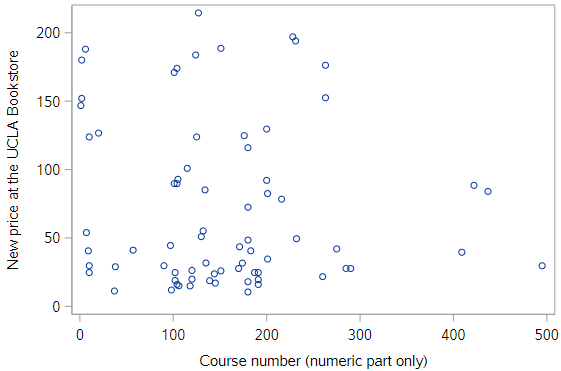
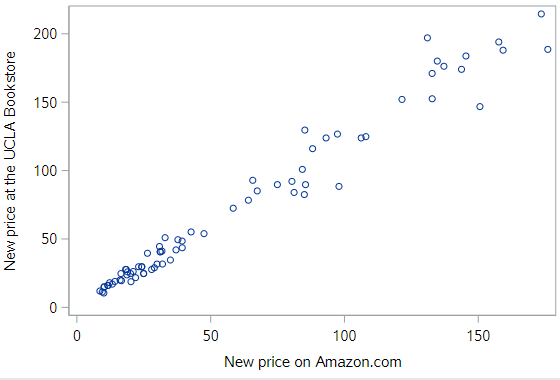
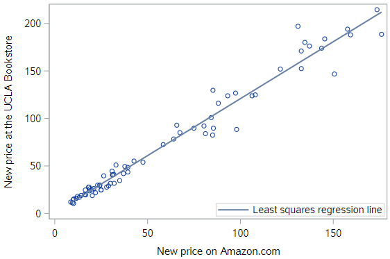

# Interpreting regression models

We spent some time building our graphical intuition about regression, as well as learning the mathematical specification of the model. Now it’s time to focus on what is often the most important thing about a regression model—interpreting the value of the coefficients.

Data were collected on 73 textbooks required for a few randomly selected courses at UCLA. For each textbook, we know the retail price at both the UCLA bookstore and on Amazon.com. We also know the department and course number for each corresponding course, and the ISBN of the book.

Let's load and take a quick look at those data:

```
* Initialize SAS session;
%include "~/my_shared_file_links/hammi002/sasprog/run_first.sas";

* Makes and checks a working copy of TEXTBOOKS data;
%use_data(textbooks);
%glimpse(textbooks);
```

#### Price by course number?

One might suppose that more advanced books cost more. Our best guess for the level of the course is to extract the course number. The scatterplot shows the relationship between the course number, `course_num` and the price of the book at the UCLA bookstore, `ucla_new`.

```
* Scatterplot for UCLA_NEW v. COURSE_NUM;
proc sgplot data=textbooks;
	scatter x=course_num y=ucla_new;
run;
```



This relationship is very weak, and if anything it appears to be negative.

#### Price relative to Amazon?

Instead, since Amazon.com provides a ready alternative for UCLA students, let’s consider the relationship between the prices of these books at the UCLA bookstore relative to their price at Amazon.

```
* Scatterplot for UCLA_NEW v. AMAZ_NEW;
proc sgplot data=textbooks;
	scatter x=amaz_new y=ucla_new;
run;
```



Here we see clear evidence of a strong, positive, linear relationship.

As noted previously, the regression line can be easily added to this scatterplot.

```
* Scatterplot w/regression line for UCLA_NEW v. AMAZ_NEW;
proc sgplot data=textbooks;
	reg x=amaz_new y=ucla_new;
run;
```



And while this provides us a way to visualize our model, it doesn’t actually tell us what the estimated coefficients are.

## Slope & intercept interpretation

To get those estimated values, we’ll use `PROC REG to actually estimate the following population regression equation,

$$y = \beta_0 + \beta_1 x$$

Or, in terms of the study,

$$Price_{UCLA} = \beta_0 + \beta_1 Price_{Amazon}$$

So we are regression the price of new books at the UCLA bookstore (response) on the price of new books at Amazon (explanatory).

```
* Regression of UCLA_NEW on AMAZ_NEW;
proc reg data=textbooks;
	model ucla_new = amaz_new;
run;
```

Again, the output from `PROC REG` is substantial, but let's pay attention to the parameter estimates in the final section. The estimated value of the intercept, $$b_0$$, is $0.93, while the estimated value of the slope, $$b_1$$, is $1.20.

### Regression equation

$$Price_{UCLA} = 0.929 + 1.199 Price_{Amazon}$$

*For the slope...*

<u>Key point</u>: The slope estimate, $$b_1$$, reflects the expected change in the mean level of the outcome with each +1-unit change in the explanatory variable.

So the estimated slope of $1.199 (let's just round to $1.20) here means that for each additional $1 that Amazon charges for a book, the mean price of books at the UCLA bookstore increases by about $1.20. In effect, the mean price of books at the UCLA bookstore is about 20% higher than those on Amazon.

*For the intercept...*

Generally, we are most interested in the slope coefficient, but occasionally the intercept coefficient is interesting as well.

<u>Key point</u>: The intercept reflects the mean value of the outcome when the explanatory variable equals 0. So the intercept is only meaningful if a value of 0 for the explanatory variable is meaningful in your sample. 

In this case, the intercept is not interesting or meaningful. It merely tells us that we should expect a book that retails for $0 on Amazon to cost about $0.93 at the UCLA bookstore. This, of course, is irrelevant, since Amazon isn't giving textbooks away.

Furthermore, since the least expensive book present in the data set cost $8.60, to discuss a book that was free on Amazon would be to *extrapolate* our findings to values *outside the range of the data* we collected. This is always dangerous because we can never know whether a model is appropriate outside of the range of explanatory values in the dataset. (This is also a key point.)

### Units and scale

When interpreting slope coefficients, one must pay careful attention to units and scales. Note that the units of the slope coefficient is the units of the response variable per unit of the explanatory variable. In this case, the prices at both bookstores are in dollars, but that is easily changed.

Suppose we represent the price at Amazon in cents, instead of dollars, and re-fit the model. Let's do that:

```
* Make Amazon price in cents;
data textbooks;
	set textbooks;
	
	amaz_cents = amaz_new * 100;
	label amaz_cents = "New price on Amazon.com (in cents)";
run;

* Regression of UCLA_NEW on AMAZ_CENTS (REG);
proc reg data=textbooks;
	model ucla_new = amaz_cents;
run;
```

Note a few things with these estimates. First, the estimate of the intercept has not changed, since the scale that has nothing to do with the Amazon price. Second, while the estimate of the slope has changed, the underlying meaning of that parameter estimate has not. Now, for each additional *cent* that a book costs on Amazon, the expected price at the UCLA bookstore increases by about $0.01199 dollars, or 1.2 cents. Thus, in both cases, the price of a book at the UCLA bookstore is about 20% higher, on average, than the corresponding price on Amazon.com.

Now let's create a variable to represent the UCLA price in cents and re-fit the regression (using cents on both sides):

```
* Make UCLA price in cents;
data textbooks;
	set textbooks;
	
	ucla_cents = ucla_new * 100;
	label ucla_cents = "New price at the UCLA bookstore (in cents)";
run;

* Regression of UCLA_CENTS on AMAZ_CENTS (REG);
proc reg data=textbooks;
	model ucla_cents = amaz_cents;
run;
```

Look at the estimates for both the intercept, $$b_0$$, and the slope, $$b_1$$. Interpret these estimates. Do you understand why they are taking on these values?


## Fitted values & residuals

One thing SAS lets you do with any regression procedure is output the fitted (predicted) values and residuals for all observations in your dataset. The fitted values are the $$\hat{y}$$ values from the estimated regression model equation; and the residuals are the differences between those predicted values of the response variable and the observed values of the response variable, $$e = \hat{y} - y$$.

By the way, when we get to talking about specific observations in the data, we will use the subscript *i* with each of those measures, where *i* indexes the observations, as $$\hat{y}_i$$ and $$e_i$$. 

The `output` statement below shows how we request the predicted values and residuals in `PROC REG`:

```
* Regression of UCLA_NEW on AMAZ_NEW;
proc reg data=textbooks;
	model ucla_new = amaz_new;
	output out=textbooks_pred predicted=pred residual=resid;
run;
```

The structure of most `output` statements in different SAS procedures takes this form. You first have to specify where to save the output dataset (using `out = <some_new_dataset>`), then you have to indicate the measures you want to save and the variable names for those measures. In our case, we are requesting the predicted values and asking that they be saved in the `pred` variable (`predicted = pred`); and we are requesting the residual values and asking that they be saved in the `resid` variable (`residual = resid`).

There are many other quantities we could request (see [*Table 100.6: Keywords for OUTPUT Statement*](https://documentation.sas.com/doc/en/pgmsascdc/9.4_3.3/statug/statug_reg_syntax10.htm) for the full list), but we are only interested in these two right now.

If you print this new dataset, you'll see how this comes out. Notice that all the other existing variables from the input dataset are copied into this output dataset.

```
* Check PROC REG output dataset;
proc print data=textbooks_pred(obs=10);
run;
```

Here are two good things to know about the fitted values and the residuals:

* The least squares fitting procedure guarantees that the mean of the residuals is zero.
* Also, the mean of the fitted values must equal the mean of the response variable.

Let's check those things using the dataset we just got from `PROC REG`:

```
* Get sums and means for RESID, PRED, UCLA_NEW;
proc means data=textbooks_pred mean sum;
	var resid pred ucla_new;
run;
```

Do you see how the sum of the residuals is basically zero? My output shows $$1.07x10^{-12}$$.

Do you also see that the mean of the predicted values is the same as the mean of the response variable, `ucla_new`? 

### Examining residuals

By examining the residuals, we can learn about whether particular textbooks appear to be under- or over-priced. Remember that a positive residual would indicate that a book's price at UCLA is higher than would be expected from this model, while a negative residual would indicate that a book's price at UCLA is lower than would be expected.

Let's sort by the size of the residuals and print all the observations so you can manually find the most over-priced and most under-priced books.

```
* Sort the data by the size of the residuals and print;
proc sort data=textbooks_pred;
	by resid;
run;

proc print data=textbooks_pred;
run;
```

In this case, the most under-priced book sells for $146.75 at UCLA (actually *less* than the Amazon price), which is nearly $35 less than the model-predicted price of $182.

And the most over-priced book sells for $197 at UCLA, which is $39 *higher* than the model-predicted price of $158. You can see that this book sells for $66 more at UCLA than at Amazon, but the model expected some of that difference, just not all of it.

### Making predictions

What about textbooks that aren’t in our original data set? Using our model to make predictions about new observations—so-called “out-of-sample” observations—is a powerful technique fundamental in machine learning.

For example, the OpenIntro book “Introductory Statistics with Randomization and Simulation” sells for $8.49 on Amazon. What would our model predict is the retail price at the UCLA bookstore?


SAS doesn't have an easy way to do this automatically (unless you create a new observation or a new dataset), but it is very straightforward to plug a new $$x$$ value into the estimated regression to get a predicted price. In this case:

$$\hat{y}_{ISRS_UCLA}= 0.929 + 1.199 (8.49) = $11.11$$

The model returns that the expected price at the UCLA bookstore is $11.11. We don’t actually know what it sells for at UCLA, but at Smith College it is selling for $11.40, a slightly steeper markup.


### Summary

In this tutorial, we treated regression as a descriptive statistical technique—thus explaining our focus on the coefficients. In a later tutorial, you will learn about inference for regression. In that application, there is a whole host of other information in the `PROC REG` output about your regression model that you’ll want to inspect. 


You have successfully completed this tutorial.

# [< Back to Section 3](https://bghammill.github.io/ims-03-model/)


<!-- MathJax -->

<script src="https://cdn.mathjax.org/mathjax/latest/MathJax.js?config=TeX-AMS-MML_HTMLorMML" type="text/javascript"></script>

