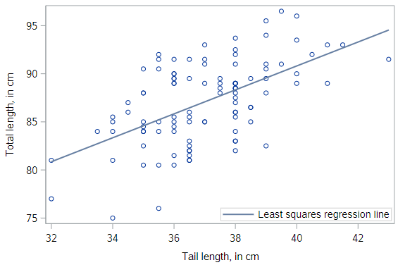
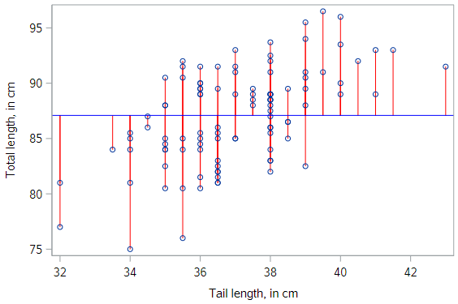

# Assessing model fit

Now that we understand what linear regression models *are* and how they *work*, a natural next question is to consider *how well* they work. To examine model fit, we will be looking at both of the datasets we have used so far, the UCLA textbook data and the possum size data.

#### Textbook recap

Let's reload the textbook data and check the regression line against the observed points again:

```
* Initialize SAS session;
%include "~/my_shared_file_links/hammi002/sasprog/run_first.sas";

* Makes and checks a working copy of TEXTBOOKS data;
%use_data(textbooks);
%glimpse(textbooks);

* Scatterplot w/regression line for UCLA_NEW v. AMAZ_NEW;
proc sgplot data=textbooks;
	reg x=amaz_new y=ucla_new;
run;
```


In an intuitive sense, it seems clear that the regression line for the textbooks fits really well.

#### Possum recap

And let's reload the possum data and check the regression line against the observed points there:

```
* Makes and checks a working copy of POSSUM data;
%use_data(possum);
%glimpse(possum);

* Scatterplot of TOTAL_L v. TAIL_L with actual regression line;
proc sgplot data=possum;
	reg x=tail_l y=total_l;
run;
```



Compared to the textbook data, the regression line for the possums fits less well, but it still seems to be useful. Can we quantify our intuition about the quality of the model fit?

### Sums of squared deviations

In fact we can. Recall that we initially considered any number of lines. We settled on the unique regression line by applying the least squares criterion. That is, we found the line that minimizes the sum of the squared residuals. For each observation, represented on the scatterplot by a point, the residual is simply the vertical distance between that point and the regression line.


Here, we have highlighted the possum residuals with red lines. If we could find a line that made those gray arrows shorter (collectively, and after squaring them) that would be our regression line; but there is no such line. This one is the best.

## Measures of model fit

One way to assess strength of fit is to consider how far off the model is for a typical case. That is, for some observations, the fitted value will be very close to the actual value, while for others it will not. The magnitude of a typical residual can give us a sense of generally how close our estimates are.

#### Sum of Squared Errors (SSE)

Recall that some of the residuals are positive, while others are negative. In fact, it is guaranteed by the least squares fitting procedure that the mean of the residuals is zero. Thus, it makes more sense to compute the square of the residuals.

If we take the sum of the squared residuals across all observations, we get a quantity call the **sum of squared errors**, or **SSE**.

#### Root Mean Squared Error (RMSE)

The SSE is a single number that captures how much our model missed by. Unfortunately, it is hard to interpret, since the units have been squared. Thus, another common way of thinking about the accuracy of a model is the **root mean squared error** or **RMSE**.

The RMSE is essentially the standard deviation of the residuals, calculated as:

$$RMSE = \sqrt{\frac{SSE}{n-2}}$$

And similar to the standard deviation of any variable, the RMSE is in the units of the response variable.

By the way, you might expect us to divide by $$n$$ here, but we instead divide by the number of *degrees of freedom*, which in this case is $$n−2$$. The concept of degrees of freedom comes up in many contexts in statistics, but a fuller discussion is beyond the scope of this tutorial.

#### Residual standard error (possums)

In the standard SAS `PROC REG` output, the SSE and RMSE are given. Let's look at that output again for the possum data:

```
* Regression of TOTAL_L on TAIL_L;
proc reg data=possum;
	model total_l = tail_l;
run;
```

Now look at these two sections:


In the top box, look at the Source = Error line. Here we see the degrees of freedom (DF) = 102 and the Sum of Squares for the Errors (SSE) is 1301.5.

In the bottom box, we see that the Root MSE (RMSE) is 3.57. Does the calculation check out?

$$RMSE = \sqrt{\frac{1301.5}{102}}=\sqrt{12.76}=3.57$$

Yes!

For the possum data, the RMSE indicates that our model yields a predicted body length that is typically within about 3.57 centimeters of the truth. That seems useful, since the possums in our data set are between 75 and 96 centimeters.

#### Residual standard error (textbooks)

Now let's look again at the regression output for the textbook data:

```
* Regression of UCLA_NEW on AMAZ_NEW;
proc reg data=textbooks;
	model ucla_new = amaz_new;
run;
```

Find the RMSE in the output. You should see that it's $10.47. Since this is bigger than 3.57 (possum data RMSE), this model doesn’t seem as useful... yet the predicted fit looked much better on the scatterplot for the textbook model than the fit looked on the scatterplot for the possum model. Reconciling these two notions will be up next.

## Comparing model fits

It’s hard to compare $10 to 3.5 centimeters. Which is “bigger”? What would be nice is if we had a way to compare the quality of a model’s fit that was unitless. To do so, it is helpful to think about a benchmark.

If you had to predict the body length of a possum, and you didn’t have any information about that particular possum, what would your prediction be? Let’s pause for a second and think.

A sensible choice would be the average length of all possum. And in fact, if you have to make the same prediction for every possum, the average is the *best* number you can pick. We can think about this as a model where $$\hat{y}$$ (the predicted value of $$y$$) is equal to $$\bar{y}$$ (the average value of $$y$$) for all observations.

#### Visualization of null model

This model is often called the **null model**. This model makes sense to use as a benchmark, since it doesn’t require any insight to make, and yet there is no reasonable model that could be any worse. It looks like this:




#### SSE of the null model

We can fit actually the null model in SAS using `PROC REG`, by including no explanatory variables in the `model` statement. 

```
* Null model for TOTAL_L;
proc reg data=possum;
	model total_l = ;
run;
```

As you should see, this results in an SSE value of 1913.826.

(In fact, if you look at the output of the possum regression above, you can see that this value is printed for us as the Corrected Total Sum of Squares!)

#### SSE of our model

Compare this null SSE to the SSE for our possum model that uses tail length as an explanatory variable. The SSE in this case is 1301.488.

```
total_tail_mod %>%
  augment() %>%
  summarize(SSE = sum(.resid^2))
```

### Coefficient of determination

The ratio of the SSE for our model to the SSE for the null model is a quantification of the *variability explained* by our model. More specifically, the SSE for the null model is often called SST, for the *total* sum of the squares. This is a measure of the overall variability in the response variable.

By building a regression model, we hope to explain some of that variability. The portion of the SST that is *not* explained by our model is the SSE. The portion that of that SST that *is* explained by our model is the sum of squares due to *regression* (SSR). It makes sense that SSR = SST – SSE. Again, if we look at the output of the possum regression above, you can see that the Model Sum of Squares is reported as 612.3, which is the SST minus the SSE. 

We can use these ideas to come up with a formula for the “coefficient of determination,” usually referred to as $$R^2$$. All 3 of the following are equivalent:

$$R^2 = 1 - \frac{SSE}{SST}$$

$$R^2 = \frac{SSR}{SST}$$

$$R^2 = 1 - \frac{Var(e)}{Var(y)}$$

We interpret $$R^2$$ as the proportion of the variability in the response variable that is explained by our model. It is the most commonly cited measure of the quality of the fit of a linear regression model.

So let's calculate the $$R^2$$ values for each of these regressions:

$$R^{2}_{Possum} = \frac{612.3}{1913.8} = 0.32$$

$$R^{2}_{Textbooks} = \frac{248477}{256263} = 0.97$$

This makes things much clearer.

We see that our model based on tail length explains about 32% of the variability in body length for these possums.

For the textbooks, the $$R^2$$ value is much higher. We can explain 97% of the variability in UCLA price using Amazon's prices. Indeed, the $$R^2$$ comparison helps to confirm our graphical intuition that the textbook model is a better fit to the textbook data than the possum model is to the possum data.

Side note: Of course, we don't need to calculate the $$R^2$$ values manually. SAS outputs this quantity by default, clearly labeled as "R-Square". See if you can find it in the regression output for both of these regressions.

#### Connection to correlation

We have already seen a connection between the value of the correlation between $$X$$ and $$Y$$ and the slope of the regression line. In fact, the value of the correlation coefficient is also closely related to the value of $$R^2$$. For least squares regression models with a single explanatory variable, the value of $$R^2$$ is just the square of the correlation coefficient $$r$$ between variables $$X$$ and $$Y$$.

Why, then, do we need both concepts? Correlation is strictly a bivariate quantity. It can only be between a single response and a single explanatory variable. However, regression is a much more flexible modeling framework. Each regression model has its own value of $$R^2$$, but in future lessons you will learn how such models can incorporate many explanatory variables, unlike correlation.

### Over-reliance on R2R2

While $$R^2$$ is certainly a useful and ubiquitous measure of model fit, it is not the be-all-and-end-all of statistical modeling. A high $$R^2$$ alone doesn’t mean that you have a “good” model, and low $$R^2$$ doesn’t mean that you have a lousy model. A model with a high $$R^2$$ may be overfit, or it may violate the conditions for inference that we will discuss in a later lesson. And a model with a low $$R^2$$ can still provide substantial insight into a complex problem.

We’ll close by invoking the words of famed statistician George Box:

> “Essentially, all models are wrong, but some are useful”.


You have successfully completed this tutorial.

# [< Back to Section 3](https://bghammill.github.io/ims-03-model/)


<!-- MathJax -->

<script src="https://cdn.mathjax.org/mathjax/latest/MathJax.js?config=TeX-AMS-MML_HTMLorMML" type="text/javascript"></script>

