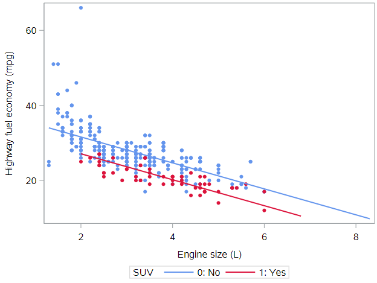
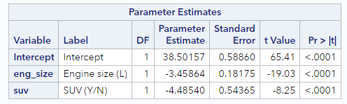

# Parallel slopes model

## Multiple regression

In the next few lessons, we will extend simple linear regression models to include additional explanatory variables (multiple regression), which can be a mixture of numeric and categorical. Instead of just having $$x$$, we will have $$x_1$$ and $$x_2$$, even possibly even more.

Regression models are abstract things, and as such we human beings have developed various ways of characterizing them:

- Mathematical
- Geometric
- Syntactic

Models can be described by mathematical equations. In many cases, they can be visualized as geometric objects in two- or three-dimensions. And of course, they can be communicated to SAS via a suggestive syntax. Going forward, we will emphasize the connections between these three characterizations of models, and illustrate how an understanding of one can lead to a deeper understanding of another.

#### Mathematical

A multiple regression model can be expressed as an equation for the response variable $$y$$ in terms of some explanatory variables $$x_1$$ and $$x_2$$. The coefficients of the model— $$\beta_0$$, $$\beta_1$$, $$\beta_2$$—allow us to translate our knowledge about $$x$$ into information about $$y$$. A statistical model will always include an error term like $$\epsilon$$ that captures our uncertainty. These errors—which are manifest as residuals—are critical to the process of statistical inference—but that is a subject for a later course. For now, we will focus on the variables and the coefficients.

- Equation: $$y = \beta_0 + \beta_1 x_1 + \beta_2 x_2 + \epsilon$$
- Residuals: $$\epsilon ~ N(0, \sigma)$$
- Coefficients: $$\beta_0$$, $$\beta_1$$, $$\beta_2$$

This mathematical representation will extend naturally to accommodate additional variables.

#### Geometric

Math isn’t everyone’s cup of tea, and while this doesn’t make it any less important, we will develop geometric intuition about regression models in this tutorial. Our data live in a “space,” and we will refer to this as the “data space.” As we add complexity, the data space will increase from two to three—and even more—dimensions, and the class of geometric objects that we can use to describe models will broaden to include multiple lines, planes, and even multiple planes.

Unfortunately, while the mathematical and syntactic characterizations will scale easily to an arbitrary number of explanatory variables, human beings are limited in our ability to visually process more than three numeric dimensions. We will get creative to push this boundary as far as we can, but we are doomed to fail.

#### Syntactic

Finally, SAS doesn’t really understand math or geometry. But of course, SAS is really good at performing the computations that we will need in order to fit and visualize our models. We will use special procedures (e.g., `PROC REG`) and specific statements (`model`) to communicate models to SAS. This syntax is less specific and more suggestive than a mathematical equation, but can be put into a 1:1 correspondence with it. As with the mathematical representation, the syntactic representation of models in SAS also extends naturally to accommodate additional variables.

But let's start by adding a basic, 2-level categorical variable to a simple linear regression.

## Fuel efficiency by engine size example

Let’s consider a situation in which simple linear regression might not be sophisticated enough to suit our needs. We'll use the CARS dataset for this:

```
* Initialize this SAS session;
%include "~/my_shared_file_links/hammi002/sasprog/run_first.sas";

* Makes and checks a working copy of CARS data;
%use_data(cars);
%glimpse(cars);
```

Let's start with a scatterplot showing the relationship between highway fuel economy (`hwy_mpg`) and engine size (`eng_size`) among these 428 carsfor 77 configurations of manual transmission cars popular from 1999 to 2008.

```
* Scatterplot of HWY_MPG by ENG_SIZE;
proc sgplot data=cars;
	scatter x=eng_size y=hwy_mpg / markerattrs=(symbol=circlefilled);
run;
```

It appears as though there is a negative relationship between engine size and fuel economy—which should make sense, as bigger engines tend to go in bigger cars, which tend to be heavier, and which tend to get worse mileage.

We could certainly fit a linear regression line through these points, but that would only tell us part of the story.

#### Fuel efficiency for SUVs vs. non-SUVs

Of course, the size of the engine is not the only contributor to the weight of the vehicle (which, again, we believe may be strongly associated with fuel economy). SUVs are larger and heavier than non-SUVs. Does fuel economy differ by these two classes of vehicle? Side-by-side box plots can help us see if that's true.

```
* Scatterplot of HWY_MPG by ENG_SIZE;
proc sgplot data=cars;
	scatter x=eng_size y=hwy_mpg;
run;
```

Oh, yes, it does. The fuel economy among SUVs is markedly lower than among non-SUVs. But is that because SUVs have larger engines, in general? Or do SUVs have worse fuel economy than non-SUVs even with similar sized motors?

## A parallel slopes model

What we really want is a model that will assess the effects of engine size and SUV status simultaneously. That is, we want to understand the effect of SUV status on fuel economy, *after controlling for* engine size. (And, similarly, we want to understand the effect of engine size on fuel economy, controlling for SUV status.)

Here we see a visual depiction of a parallel slopes model. These models occur when one of the explanatory variables is numeric and the other is categorical. In this case, the SUV variable has two levels, and the model accordingly consists of two parallel lines. 



Let's build toward this...

#### Adding a new variable

Consider a regression model that looks like this:

$$hwy\_mpg = \beta_0 + \beta_1 eng\_size + \beta_2 SUV + \epsilon$$ 

Multiple regression allows us to build such models by simply adding another variable—and another coefficient—to our model.

#### Adding a new variable in SAS

As you might suspect, telling SAS about the second variable in our regression model is just as easy. We simply add another term to the right-hand-side of the `model` statement. Here is the syntax for our parallel slopes model:

```
* Multiple regression model of HWY_MPG by ENG_SIZE + SUV;
proc reg data=cars;
	model hwy_mpg = eng_size suv;
run;
```

## Visualizing parallel slopes models

#### Three variables, one plot

This SAS code for a scatterplot uses color to differentiate the SUVs from non-SUVs. Note that we've added a few additional options to make the graph easier to read.

```
* Scatterplot of HWY_MPG by ENG_SIZE, colors by SUV status;
proc sgplot data=cars;
	styleattrs datacontrastcolors=(cornflowerblue crimson);
	scatter x=eng_size y=hwy_mpg / group=suv
		markerattrs=(symbol=circlefilled);
run;
```

What do you notice about the red points relative to the blue points?

In this manner, we have depicted three variables—two numeric and one categorical—on the same scatterplot. Thus, this plot will enable us to visualize our parallel slopes model in the data space.

#### Setting up the model

A key point for `PROC REG` is that it is best to include 2-level categorical variables to the model coded as 0 and 1. There are more advanced SAS regression procedures that do not require us to use specific codes for categorical variables, but `PROC REG` does. Thankfully, the `suv` variable is already coded this way:

* `suv = 1` if the vehicle is an SUV
* `suv = 0` if the vehicle is not an SUV

Given that our population regression model has this equation

$$hwy\_mpg = \beta_0 + \beta_1 eng\_size + \beta_2 SUV + \epsilon$$ 

we’re going to use a little high school algebra to inform our understanding of the geometry of our model. We can express our model mathematically using the following equations.

#### Two types of vehicles

<u>For SUVs</u>, `suv = 1`, so the population regression model for SUVs looks like this:

$$hwy\_mpg = \beta_0 + \beta_1 eng\_size + \beta_2 \cdot 1 + \epsilon$$ 

$$hwy\_mpg = \beta_0 + \beta_1 eng\_size + \beta_2 + \epsilon$$ 

which we can rearrange to, essentially create a new intercept

$$hwy\_mpg = (\beta_0 + \beta_2) + \beta_1 eng\_size  + \epsilon$$ 

<u>For non-SUVs</u>, `suv = 0`, so the population regression model for SUVs looks like this:

$$hwy\_mpg = \beta_0 + \beta_1 eng\_size + \beta_2 \cdot 0 + \epsilon$$ 

$$hwy\_mpg = \beta_0 + \beta_1 eng\_size + \epsilon$$ 

No rearranging needed.

And we can estimate all the parameters needed above with the `PROC REG` code already shown. Let's run that now.

```
* Multiple regression model of HWY_MPG by ENG_SIZE + SUV;
proc reg data=cars;
	model hwy_mpg = eng_size suv;
run;
```

Based on these results, we can plug in and simplify to reveal the estimated equations for each line described above. 

For SUVs, the estimated regression line is given by:

$$\hat{hwy\_mpg_{SUV}} = (38.5 - 4.5) - 3.5 \cdot eng\_size = 34.0 - 3.5 \cdot eng\_size$$ 

And for non-SUVs, the estimated regression line is given by:

$$\hat{hwy\_mpg_{NonSUV}} = 38.5 - 3.5 \cdot eng\_size$$ 

Notice the following:

* Both lines have the same slope of -3.5 mpg per liter, meaning for each additional liter of engine size, we expect the average highway mpg to decrease by 3.5 mpg. We have constrained this to be true for SUV and non-SUVs alike.
* The intercepts differ between equations by -4.5 mpg, which is the value of the parameter estimate associated with SUVs. This has the effect of offsetting the SUV line by 4.5 mpg below the non-SUV line. Question: Is the intercept meaningful/interpretable in either of these equations?

#### Two parallel lines

Thus, our model gives us two parallel lines: one for SUVs and one for non-SUVs. The two lines are parallel because they have the same slope, but they are not the same line, because they have different intercepts.

This is why models with one numeric explanatory variable and one categorical explanatory variable are called parallel slopes models.

#### Parallel lines on the scatterplot

We can easily visualize this type of model in the data space as two parallel lines. To do this, you will first need to output the model predicted values from `PROC REG`:

```
proc reg data=cars;
	model hwy_mpg = eng_size suv;
	output out=cars_pred predicted=pred;
run;
```

Now we’ll overlay two things on a figure:

- A scatterplot showing the data, with color separating the points into groups
- A line for each value of the categorical variable

````
* Scatterplot of HWY_MPG by ENG_SIZE, colors by SUV status,
* parallel lines;
proc sgplot data=cars_pred;
	styleattrs datacontrastcolors=(cornflowerblue crimson);
	scatter x=eng_size y=hwy_mpg / group=suv markerattrs=
		(symbol=circlefilled);
	reg x=eng_size y=pred / group=suv nomarkers name="reg";
run;
````

You should have a plot that looks like the one above.

## Interpreting parallel slopes coefficients

#### Intercept interpretation

Most often, our primary interest in models like this one is interpreting the value of the coefficients. What does the model tell us about the relationship between fuel economy and engine size in the context of whether or not the vehicle was an SUV?

Looking at the parameter estimates from the model you ran above:



Let’s start with the main intercept. The value is 38.50 and the units are the same as those of the response variable—miles per gallon. Recall that this is the expected fuel economy for a non-SUV that had an engine size of 0 liters. Of course, in this case, this value has little meaning, since there was no such thing as a car with an engine size of 0 liters in these data, (Note: Pre-EV data.), but that is the literal interpretation of the role that 38.50 plays in our model.

As we saw above, the coefficient for SUV status can also be thought of as part of the intercept term for SUVs. Here, SAS is telling us that SUV get about 4.5 miles per gallon worse gas mileage than non-SUVs, after controlling for engine size. Meaning, even when an SUV and a non-SUV have the same size engine, SUVs have worse gas mileage. This is a key finding, and we’ll return to this in just a minute.

#### Slope interpretation

How did we “control for engine size”?

By including the `eng_size` variable in our model, we also obtain a coefficient for engine size. This is our slope coefficient, and it tells us that each extra liter of engine size is associated with a decrease in expected fuel economy of 3.46 miles per gallon, after controlling for SUV status. This is the negative relationship we saw earlier, that larger engines tend to be associated with less fuel efficiency. The difference now is that we are able to estimate the size of that effect while simultaneously considering whether or not the car is an SUV.

#### Avoiding misunderstandings

The interpretation of coefficients in a multiple regression model can get complicated, so let’s quickly review a few common issues.

First, *there is only one slope* in the parallel slopes models that we have considered thus far. Yes, there are two explanatory variables, but only the one numeric explanatory variable is associated with a slope. Later, we will consider more complex models that have more than one “slope.”

Second, *pay careful attention to the reference level* of your categorical variables. This is clear when you manually code indicator (two-level) variables using 0 (reference!) & 1; but in other SAS procedures, you can set the reference level or, more typically, have SAS do it by default, and you need to understand which level it is assigning as the reference. 

Third, *units are important*. Every coefficient has units that relate to the units of the response variable. Intercepts are in the same units as the response variable, and slope coefficients are in the units of the response *per* unit of the explanatory variable.

Finally, the key difference in multiple regression is that *coefficients must be interpreted in the context of the other explanatory variables*. The “after controlling for” phrasing is crucial to having a valid understanding of your model.


You have successfully completed this tutorial.

# [< Back to Section 3](https://bghammill.github.io/ims-03-model/)


<!-- MathJax -->

<script src="https://cdn.mathjax.org/mathjax/latest/MathJax.js?config=TeX-AMS-MML_HTMLorMML" type="text/javascript"></script>

