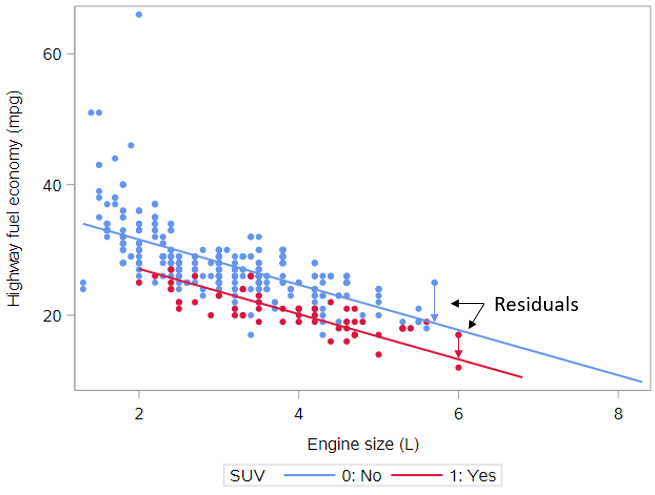
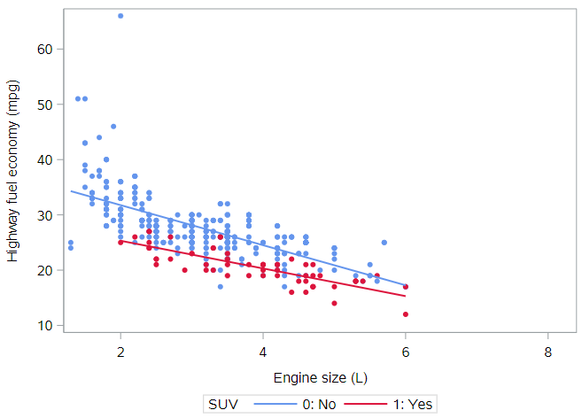

# Evaluating and extending the parallel slopes model

This lesson covers model evaluation and interaction terms. By looking at different properties of the model, including the adjusted $$R^2$$, you’ll learn to compare models so that you can select the best one. You’ll also learn about adding interaction terms to linear models for added flexibility in fit.

Let's re-load the CARS dataset:

```
* Initialize this SAS session;
%include "~/my_shared_file_links/hammi002/sasprog/run_first.sas";

* Makes and checks a working copy of CARS data;
%use_data(cars);
%glimpse(cars);
```

## Model fit, residuals, and prediction

### Residuals



One of the most natural questions we might have about our model is: “How well does it fit?” We measure this by computing—for each observation—the difference between the actual value of the response variable and the fitted value from our model. This distance is called a **residual**. Residuals for two observations are illustrated in this plot with vertical arrows. Just as in simple linear regression, the model fitting procedure will automatically minimize the length of those arrows across all of the points.

In a parallel slopes model, our model is represented by two lines, but only one of the lines is relevant for each observation. In the plot, the red points—each corresponding to an SUV—are compared to the red line, and the blue points—each corresponding to a non-SUV—are compared to the blue line.

If you want to look at the model-based residuals for individual observations, you can output those from SAS as:

```
* Regression of HWY_MPG by ENG_SIZE + SUV,
* output predicted values and residuals;
proc reg data=cars;
	model hwy_mpg = eng_size suv;
	output out=cars_pred predicted=pred residual=resid;
run;
```

Have a look at a few records:

```
* Print 10 sample records with model input and output;
proc print data=cars_pred(obs=10);
	var name hwy_mpg eng_size suv pred resid;
run;
```

Here, we are showing the model outcome (`hwy_mpg`), the model inputs (`eng_size`, `suv`), and some model outputs (`pred` for predicted values and `resid` for residual values).

Note that estimating two lines necessarily makes our parallel slopes model more flexible than a simple linear regression model. The two lines are constrained to be parallel, but we still have two lines instead of one. If the best fit occurs when the two lines are very close together, then the coefficient of the SUV variable will be very small, and the parallel slopes model will be very similar to the simple linear regression model. If the best fit occurs when the two lines are clearly differentiated, then the coefficient of the SUV variable will be "large", and the parallel slopes model will be adding explanatory value, when compared to the simple linear regression model.

### Model Fit

#### $$R^2$$ and Adjusted $$R^2$$

It would be nice to have a way to compare model fit between the simple linear regression model (with engine size as the only predictor) and the parallel slopes regression model (with engine size and SUV as the predictors).

The coefficient of determination—usually called R-squared or $$R^2$$—carries over from simple linear regression, so this might work. Recall that the sum of the squared residuals (or errors) is denoted SSE. If the model fits the data better, then the residuals are smaller, the SSE is smaller, and the $$R^2$$ value is higher. The total sum of the squares—denoted SST—is a function of the response variable alone and does not depend on the model.

In general, a higher $$R^2$$ may be a sign of a better model fit, but the situation becomes more complicated in multiple regression because *additional explanatory variables will always increase* $$R^2$$. Because of this, model fits in multiple regression are often compared using the *adjusted* $$R^2$$ value, defined as:

$$R^{2}_{adj} = 1 − \frac{SSE(n-1)}{SST(n - p - 1)}$$ 

or

$$R^{2}_{adj} = 1 − \frac{(1 - R^2)(n-1)}{(n - p - 1)}$$ 

Note that the only difference from the basic $$R^2$$ formula is that a penalty is applied as the number of explanatory variables, *p*, increases. (*p* does not count the intercept, only the number of explanatory variables.) Unlike $$R^2$$, adjusted $$R^2$$ will not necessarily increase as new explanatory variables are added—it could go up or down because of this penalty term.

The regression output generated by the `PROC REG` code above shows both the $$R^2$$ and $$R^{2}_{adj}$$ values:

* $$R^2$$ = 0.576
* $$R^{2}_{adj} = 0.574$$, calculated as $$R^{2}_{adj} = 1 − \frac{SSE(n-1)}{SST(n - p - 1)} = 1 − \frac{(5683.4)(414-1)}{(13403)(414-2-1)}= 0.574$$

In order to understand if the parallel slopes model is performing better than the model based on engine size only, let's get the $$R^{2}_{adj}$$ value from that simpler model:

```
* Regression of HWY_MPG on ENG_SIZE;
proc reg data=cars;
	model hwy_mpg = eng_size;
run;
```

You should see that $$R^{2}_{adj} = 0.505$$ here.

So, the parallel slopes model explains over 57% of the variation in highway MPG, which is substantially higher than the simple regression model, which explains just about 50% of the variation in highway MPG.

#### RMSE

We can also compare the Root Mean Squared Error (RMSE) between models. Remember that the RMSE represents the standard deviation of the residuals. This is useful value to know because it gives us an idea of the average distance between the observed data values and the predicted data values. When comparing models, we want to see smaller RMSE values.

Find the Root MSE (as it's labeled in SAS output) from the output for both regressions.

You should see that:

* RMSE, simple regression model = 4.0
* RMSE, parallel slopes model = 3.7

By this measure of fit as well, the parallel slopes model indicates better fit than the simple regression model.

### Prediction

Once we have fit a regression model, we can retrieve the fitted values using the code below. (This is the same code as above, just repeated for emphasis). 

```
* Regression of HWY_MPG by ENG_SIZE + SUV,
* output predicted values and residuals;
proc reg data=cars;
	model hwy_mpg = eng_size suv;
	output out=cars_pred predicted=pred residual=resid;
run;
```

As before, have a look at a few records:

```
* Print 10 sample records with model input and output;
proc print data=cars_pred(obs=10);
	var name hwy_mpg eng_size suv pred resid;
run;
```

The fitted values are found in the `pred` variable.

We can also used a fitted regression model to make predictions for other combinations of the input variables. SAS does not offer an easy way to do this, but applying the equation for the estimated regression line to other explanatory variable values is straightforward.

The estimated regression for the parallel slopes model is given by:

$$\hat{y} = 38.5 - 3.5 \cdot EngSize - 4.5 \cdot SUV$$

For a new SUV with a 3.7L engine, we would expect the highway MPG to be 21.1 mpg, calculated as:

$$\hat{y} = 38.5 - 3.5 \cdot 3.7 - 4.5=21.1$$

## Understanding Interaction

Thus far we have considered models where the regression lines for two groups were constrained to be parallel. But what if the lines didn’t have to be parallel? In this plot, we illustrate the model when the lines are allowed to have their own slopes. 



We see that the parallel lines model was a decent approximation of reality, but it does appear that the slopes of these two lines are slightly different. In other words, the slope of the association between engine size and highway fuel economy varies by, or interacts with, SUV status.

#### Adding interaction terms

Mathematically, we achieve an interaction by adding yet another term to our model. This third explanatory variable is the product of `suv` and `eng_size`, and it is called an **interaction term**.

If we want to stay with `PROC REG`, then we will have to create this interaction effect on our own in a data step. (Other regression modeling procedures in SAS allow this to happen more automatically during modeling.) We'll create the interaction term, `suv_engsize`, as `suv` x `eng_size`:

```
* Create interaction variable;
data cars;
	set cars;
	
	suv_engsize = suv * eng_size;
	label suv_engsize = "Intx between SUV and ENG_SIZE";
run;
```

Adding this new term to our population regression model gives us:

$$HwyMPG = \beta_0 + \beta_1 EngSize + \beta_2 SUV + \beta_3 EngSize \cdot SUV + \epsilon$$

And because the SUV variable only takes two values, we can again write the equations for each type of vehicle.

*For SUVs*

$$HwyMPG = \beta_0 + \beta_1 EngSize + \beta_2 (1) + \beta_3 EngSize \cdot (1) + \epsilon$$

$$HwyMPG = \beta_0 + \beta_1 EngSize + \beta_2 + \beta_3 EngSize + \epsilon$$

$$HwyMPG= (\beta_0 + \beta_2) + (\beta_1 + \beta_3) EngSize + \epsilon$$

The first set of parentheses reflects the intercept of the SUV line; the second set of parentheses reflects the slope of the SUV line.

*For non-SUVs*

$$HwyMPG = \beta_0 + \beta_1 EngSize + \beta_2 (0) + \beta_3 EngSize \cdot (0) + \epsilon$$

$$HwyMPG = \beta_0 + \beta_1 EngSize + \epsilon$$

As you should see, the new term, $$\beta_3$$ acts to change the slope of the equation for SUVs, while leaving the slope of the equation for non-SUVs unchanged. This extends the parallel slopes model, as now both the intercepts *and* the slopes are different.

### Interaction interpretation

Let's first estimate this interaction model:

```
* Create interaction variable;
data cars;
	set cars;
	
	suv_engsize = suv * eng_size;
	label suv_engsize = "Intx between SUV and ENG_SIZE";
run;
```

Interpreting the coefficients in an interaction model becomes more complicated. But if we use the equations above as our guide, here's what's what:

* $$b_0 = 39.0$$ is the intercept of the non-SUV equation line
* $$b_1 = -3.6$$ is the slope of the non-SUV equation line
* $$b_2 = -8.7$$ is the difference between the intercepts of the non-SUV equation line and the SUV equation line
* So $$b_0 + b_2 = 39.0 - 8.7=30.3$$ is the actual intercept of the SUV equation line
* $$b_3 = 1.1$$ is the difference between the slopes of the non-SUV equation line and the SUV equation line
* So $$b_1 + b_3 = -3.6 +1.1=-2.5$$ is the actual slope of the SUV equation line

Note the difference between the fitted coefficients of the parallel slopes model with the interaction model. The original slope of -3.5 mpg per liter for all cars is now separated into two slopes: -3.6 mpg per liter for non-SUVs and -2.5 mpg per liter for SUVs. Thus, while fuel economy for SUVs is lower overall, it declines less rapidly as engine size increases compared to the decline as engine size increases among non-SUVs.

This might suggest that the added weight of SUVs is more work for smaller engines, but that larger engines are less affected by this extra weight.

By the way, the adjusted $$R^2$$ are not that different between the interaction model and the parallel slopes model, so it's hard to tell if this interaction term is really needed. When we get to talking about inference, we'll be able to assess statistically whether or not this interaction term is adding explanatory power to the model or not. 

### Visualizing interaction models

As we just discussed, interaction allows the slope of the regression line in each group to vary. These models are easy to visualize in the data space with ``PROC SGPLOT` by simply regression by-group scatterplots with regression lines. The code used to generate the figure above is:

```
* Scatterplot of HWY_MPG by ENG_SIZE, allow slopes to differ
* by SUV status;
proc sgplot data=cars;
	styleattrs datacontrastcolors=(cornflowerblue crimson);
	reg x=eng_size y=hwy_mpg / group=suv markerattrs=(symbol=circlefilled);
run;
```


You have successfully completed this tutorial.

# [< Back to Section 3](https://bghammill.github.io/ims-03-model/)


<!-- MathJax -->

<script src="https://cdn.mathjax.org/mathjax/latest/MathJax.js?config=TeX-AMS-MML_HTMLorMML" type="text/javascript"></script>

