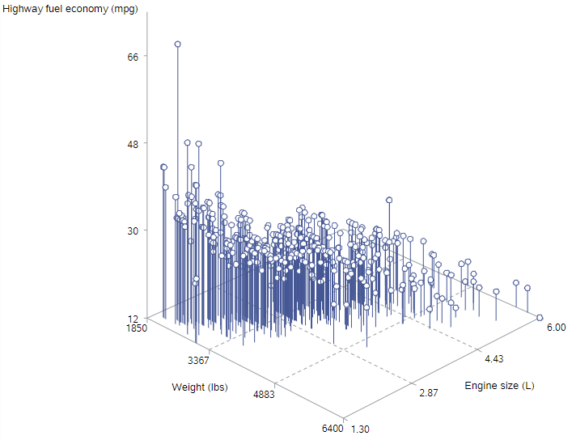
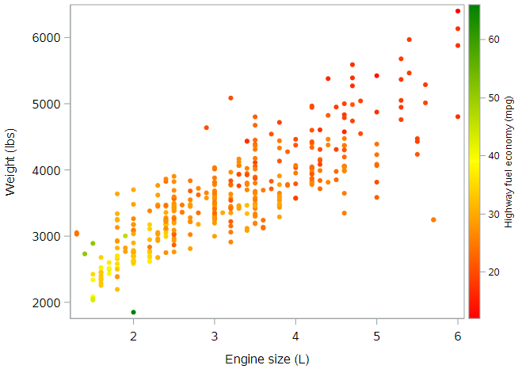
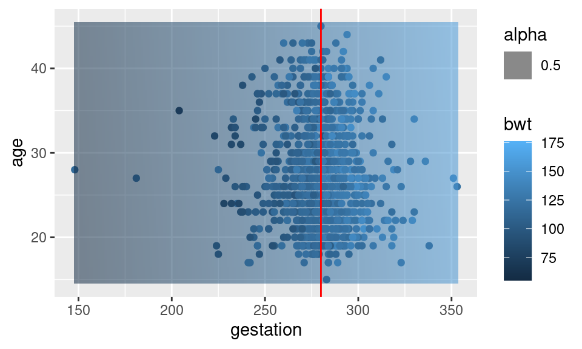

## Multiple regression

Thus far, we’ve only considered multiple regression models with one numeric explanatory variable. In this lesson, we will explore models that have at least two numeric explanatory variables.

### Adding a second numeric explanatory variable

*Mathematically*, adding a second numeric explanatory variable to a regression model is trivial—we just add another term to our model.

$$HwyMPG = \beta_0 + \beta_1 EngSize + \beta_2 Weight + \epsilon$$

In this example, we are modeling the highway fuel economy (in MPG) of cars as a function of both engine size (in liters) and vehicle weight (in pounds). [We've been talking about SUV status as a proxy for weight, but why don't we just use weight?!] Note that both engine size and weight are numeric variables, so this is not a parallel slopes model.

*Syntactically*, fitting this model in SAS is similarly trivial—we simply extend the model statement to incorporate both the engine size and weight variables, just as we did before.

```
* Regression of HWY_MPG on ENG_SIZE + WEIGHT;
proc reg data=cars;
	model hwy_mpg = eng_size weight;
run;
```

Unfortunately, while the mathematical and syntactical formulations of multiple regression models are easy extensions of things we already know, a *graphical* formulation of these models becomes trickier.

### Graphics for 3D data space

Our data space is now three dimensional, because `hwy_mpg`, `eng_size`, and `weight` are all numeric variables that our model encapsulates. So we will need to get a little bit creative in order to create a meaningful visualization of our model.

#### 3D projections

One way to visualize a 3D model is to use SAS `PROC G3D` to actually render a 3D display:

```
* Scatterplot of HWY_MPG by ENG_SIZE & WEIGHT;
proc g3d data=cars;
	scatter eng_size * weight = hwy_mpg / shape="balloon" size=.5 rotate=-45;
run;
quit;
```

You usually need to fiddle with the `rotate` option to get an angle that works for your data.



This is kind of helpful. The highest mileage (points "higher" on the z-axis) is found for smaller engines in lighter cars, and the lowest mileage ("lower" points) is found for larger engines in heavier cars. 

#### Tiling the plane

Another way to visualize a 3D model is to tile the plane. That is, we will create a 2D plot that covers all combinations of our two explanatory variables, and we will use color to reflect the response variable. We can do this within `PROC SGPLOT`, with only a minor change to the syntax:

```
* Scatterplot of HWY_MPG by ENG_SIZE & WEIGHT;
proc sgplot data=cars;
	scatter x=eng_size y=weight / colorresponse=hwy_mpg
		markerattrs=(symbol=circlefilled) colormodel=(red yellow green); 
	where not missing(hwy_mpg);
run;
```

The main change is the addition of the `colorresponse = hwy_mpg` option to indicate that colors should be assigned by values of `hwy_mpg`. We did also explicitly tell SAS which colors to use; and we had to explicitly remove values with missing data on the outcome, since they otherwise showed up as gray dots. Here's the result:



In this figure, orange and red dots reflect cars with lower highway fuel economy, while yellow and green dots reflect cars with higher highway fuel economy. The interpretation is the same as above. Which graph do you find easier to "see"?


### 3D visualization

A perhaps more natural way to visualize a multiple regression model is as a plane through a cloud of points in three dimensions. Here, we use the plotly package to illustrate our model for the birthweight of babies. Note how the plane cuts through the data points. The residual associated with each observation is the vertical distance between that point and the plane. Believe it or not, this plane is the one that uniquely minimizes the sum of of the squared residuals between itself and these data points.

The `plot_ly` syntax is similar to that of ggplot. In this case, the `add_markers()` function draws the points, while the `add_surface()` function draws the plane. The x, y, and plane objects were created in code that we aren’t showing here due to its complexity. Using the plot below, trying moving the model around with your mouse. Visualizing the structure from different angles helps a lot to see what is going on.


### Fitting a MLR model

In terms of the R code, fitting a multiple linear regression model is easy: simply add variables to the model formula you specify in the `lm()` command.

In a parallel slopes model, we had two explanatory variables: one was numeric and one was categorical. Here, we will allow both explanatory variables to be numeric.

The dataset `mariokart` is already loaded in your workspace.

- Fit a multiple linear regression model for total price as a function of the duration of the auction and the starting price.

### Tiling the plane

One method for visualizing a multiple linear regression model is to create a [heatmap](https://en.wikipedia.org/wiki/Heat_map) of the fitted values in the plane defined by the two explanatory variables. This heatmap will illustrate how the model output changes over different combinations of the explanatory variables.

This is a multistep process:

- First, create a grid of the possible pairs of values of the explanatory variables. The grid should be over the actual range of the data present in each variable. We’ve done this for you and stored the result as a data frame called `grid`.
- Use `augment()` with the `newdata` argument to find the y^y^’s corresponding to the values in `grid`.
- Add these to the `data_space` plot by using the `fill` aesthetic and `geom_tile()`.

The model object `mod` is already in your workspace.

- Use `augment()` to create a `data.frame` that contains the values the model outputs for each row of `grid`.
- Use `geom_tile` to illustrate these predicted values over the `data_space` plot. Use the `fill` aesthetic and set `alpha = 0.5`.


### Models in 3D

An alternative way to visualize a multiple regression model with two numeric explanatory variables is as a plane in three dimensions. This is possible in R using the **plotly** package.

We have created three objects that you will need:

- `x`: a vector of unique values of `duration`
- `y`: a vector of unique values of `start_pr`
- `plane`: a matrix of the fitted values across all combinations of `x` and `y`

Much like `ggplot()`, the `plot_ly()` function will allow you to create a plot object with variables mapped to `x`, `y`, and `z` aesthetics. The `add_markers()` function is similar to `geom_point()` in that it allows you to add points to your 3D plot.

Note that `plot_ly` uses the pipe (`%>%`) operator to chain commands together.

- Run the `plot_ly` command to draw 3D scatterplot for `total_pr` as a function of `duration` and `start_pr` by mapping the `z` variable to the response and the `x` and `y` variables to the explanatory variables. Duration should be on the x-axis and starting price should be on the y-axis.
- Use `add_surface()` to draw a plane through the cloud of points by setting `z = ~plane`.

## Conditional interpretation of coefficients

What do the coefficients in a multiple regression model mean?

### Two slope coefficients

Consider the fitted coefficients for our model for the birthweight of babies shown below.

```
lm(bwt ~ gestation + age, data = babies)
## 
## Call:
## lm(formula = bwt ~ gestation + age, data = babies)
## 
## Coefficients:
## (Intercept)    gestation          age  
##    -15.5226       0.4676       0.1657
```

Since both of our explanatory variables are numeric, the coefficients of both gestation and age represent slopes. But slopes of what? A line certainly can’t have two slopes, but as we saw previously, our model is not a line: it is a plane. And a plane can have two slopes.

Note that in this case both slopes are positive, but have different magnitudes.

### Tiled plane

When we depicted our model as a tiled surface in the plane, we noticed that the color of the tiles got lighter and bluer as we moved towards the upper right hand corner of the plot. This reflects the fact that our model predicts higher birthweights for babies with longer gestational periods born to older mothers. But at what rate does this color change?

```
model_space
```


### Tiled plane plus first slope

For a 30-year-old mother, the increase in expected birthweight is 0.47 ounces per day, and this can be viewed on the plot as the rate of color change as you move horizontally through the plot along a straight line. It is in this sense that the coefficient of gestation is a slope.

However, this rate of change is constant across mothers of all ages. It doesn’t matter whether you are 20, 30, or 40. While the expected birthweight does depend on the mother’s age, the rate of change in birthweight with respect to gestational length does not depend on the the mother’s age.

Thus, the coefficient of 0.47 ounces per day on gestation reflects the slope of the plane for a fixed value of age. And since this slope doesn’t change with respect to age, we often say that it reflects the effect of gestational length upon birthweight, while holding age constant.

```
model_space + 
  geom_hline(yintercept = 30, color = "red")
```


### Tiled plane plus second slope

Similarly, at the typical gestational length of 40 weeks (or 280 days), the expected birthweight increases at a rate of 0.17 ounces per year of the mother’s age. That is, our model predicts that the birthweight of a 36-year-old mother is about one-sixth of an ounce heavier than the birthweight of a 35-year-old mother, when both mothers carry full term. But again, that rate of change is the same irrespective of the gestational length, so we would expect the same difference for babies born at 35 weeks, 40 weeks, and 42 weeks.

So the coefficient of 0.17 ounces per year is the slope of the plane for a fixed length of gestation. Again, since this slope is the same for all gestational lengths, we can interpret this coefficient as the effect of the mother’s age on birthweight, while holding gestational length constant.

It’s also apparent from the plot that the colours change more rapidly as you move horizontally as opposed to vertically. This reflects the fact that the coefficient on gestation is bigger than the coefficient on age.

```
model_space + 
  geom_vline(xintercept = 280, color = "red")
```




### Coefficient interpretation

Now, you might be tempted to think that bigger coefficients are always more important, but this is not true. The value of the coefficients depend on the units of the explanatory variables. In this case, one variable is in the units of days (of gestational length), while the other is in the units of years (of mother’s age). They are not directly comparable.

```
lm(bwt ~ gestation + age, data = babies)
## 
## Call:
## lm(formula = bwt ~ gestation + age, data = babies)
## 
## Coefficients:
## (Intercept)    gestation          age  
##    -15.5226       0.4676       0.1657
```

When you interpret coefficients from a multiple regression model, be sure to always include a phrase to the effect of “holding x constant.” Another good alternative is “after controlling for x.” This information is crucial to having a valid understanding of a regression model.

### Coefficient magnitude

The coefficients from our model for the total auction price of MarioKarts as a function of auction duration and starting price are shown below.

```
## 
## Call:
## lm(formula = total_pr ~ duration + start_pr, data = mariokart)
## 
## Coefficients:
## (Intercept)     duration     start_pr  
##      51.030       -1.508        0.233
```

A colleague claims that these results imply that the duration of the auction is a more important determinant of final price than starting price, because the coefficient is larger.

*Hint:* Whether a coefficient is positive or negative doesn’t effect how important it is.

This interpretation is false because.

The coefficient on duration is negative.

Smaller coefficients are more important.

The coefficients have different units (dollars per day and dollars per dollar, respectively) and so they are not directly comparable.

The intercept coefficient is much bigger, so it is the most important one.

Submit Answer


### Practicing interpretation

Fit a multiple regression model for the total auction price of an item in the `mariokart` data set as a function of the starting price and the duration of the auction. Compute the coefficients and choose the correct interpretation of the `duration` variable.

- For each additional day the auction lasts, the expected final price declines by $1.51, after controlling for starting price.
- For each additional dollar of starting price, the expected final price increases by $0.23, after controlling for the duration of the auction.
- The duration of the auction is a more important determinant of final price than starting price, because the coefficient is larger.
- The average auction lasts 51 days.

*Hint:* Remember, the inclusion of another variable in your model is sometimes referred to as “controlling for” that variable.

## Adding a third (categorical) variable

### How could we forget about smoking?

- Mathematical:


bwt^=β^0+β^1⋅gestation+β^2⋅age+β^3⋅smokebwt^=β^0+β^1⋅gestation+β^2⋅age+β^3⋅smoke


- Syntactical:

No study of birthweight is complete without some discussion of the effect of smoking, which is known to have all kinds of undesirable health consequences. Mothers in the babies data set have their smoking status recorded as a binary variable: either she was or was not a smoker.

```
## 
## Call:
## lm(formula = bwt ~ gestation + age + smoke, data = babies)
## 
## Coefficients:
## (Intercept)    gestation          age        smoke  
##     -4.6037       0.4455       0.1069      -8.0143
```

Adding this third explanatory variable to our model is again easy. Since this variable is encoded as 0 or 1, no transformation is necessary and we can simply add another term to the mathematical model and the formula syntax to specify our new model.

### Geometry

- 1 numeric + 1 categorical: parallel lines
- 2 numeric: a plane
- 2 numeric + 1 categorical: parallel planes!

But here again the geometric changes are not as easy to see. However, our emphasis on the geometry of these models should give you some intuition. Recall that the addition of a categorical explanatory variable to a numeric explanatory variable changed a line into parallel lines. Moreover, a model with two numeric explanatory variables was a plane. Can you guess how the addition of a categorical explanatory variable will change the geometry of a model with two numeric explanatory variables?

If you guess parallel planes, you’re right!

### Drawing parallel planes in 3D

```
grid <- babies %>%
  modelr::data_grid(
    gestation = seq_range(gestation, n = 50),
    age = seq_range(age, n = 50), 
    smoke = seq_range(smoke, n = 2)
  )

mod_bwt <- lm(bwt ~ gestation + age + smoke, data = babies)

tidy_planes <- mod_bwt %>%
  augment(newdata = grid)

x <- unique(grid$gestation)
y <- unique(grid$age)

plane0 <- tidy_planes %>%
  filter(smoke == 0) %>%
  pull(.fitted) %>%
  matrix(nrow = length(x), byrow = TRUE)

plane1 <- tidy_planes %>%
  filter(smoke == 1) %>%
  pull(.fitted) %>%
  matrix(nrow = length(x), byrow = TRUE)

color <- matrix(0, nrow = nrow(plane0), ncol = ncol(plane0))

plot_ly(data = babies, z = ~bwt, x = ~gestation, y = ~age, opacity = 0.6, colors = c("black", "yellow")) %>%
  add_markers(color = ~factor(smoke), text = ~case, marker = list(size = 2)) %>%
  add_surface(
    x = ~x, y = ~y, z = ~plane0, showscale = FALSE, 
    cmin = 0, cmax = 1, cauto = FALSE,
    surfacecolor = color
  ) %>%
  add_surface(
    x = ~x, y = ~y, z = ~plane1, showscale = FALSE, 
    cmin = 0, cmax = 1, cauto = FALSE,
    surfacecolor = color + 1
  )
```


Once again, we can use plotly to create a 3D image of our model in the data space. Here we have used the `add_surface()` function twice: once to add a plane for non-smokers, and again to add another plane for smokers. The plane on “top” is the one for non-smokers—can you think of why this might be case? We’ll return to this question in a minute.


### Coefficient interpretation

The interpretations that we developed previously still hold—we just need to think carefully about how they apply to our new model. The coefficients on gestation and age still reflect slopes. And since the planes are parallel, both slopes are the same in both planes. The coefficient on smoke is the distance between the two planes, and this distance is constant across all possible values of gestation and age. In this sense, we are modeling the effect of smoking as being the same regardless of gestational length and the mother’s age. However, we have estimated the size of that effect in the context of gestational length and the mother’s age.

The coefficient of gestation is 0.45 ounces per day, which is only slightly less than it was in our previous model that did not consider smoking. Our interpretation is that each additional day of gestation was associated with an increase in expected birthweight of 0.45 ounces, after controlling for the mother’s age and smoking status. Each additional year of the mother’s age was associated with an increase in expected birthweight of just 0.11 ounces per year, after controlling for gestational length and the mother’s smoking status. Note that the effect of the mother’s age on birthweight appears lower than in the previous model.

```
lm(bwt ~ gestation + age, data = babies)
## 
## Call:
## lm(formula = bwt ~ gestation + age, data = babies)
## 
## Coefficients:
## (Intercept)    gestation          age  
##    -15.5226       0.4676       0.1657
```

Let’s focus now on the effect of smoking. The coefficient on smoke is -8.01 ounces. Thus, our model predicts that mothers who smoke will deliver babies that weight 8 ounces less, on average, than mothers of the same age and gestational length who don’t smoke. That is, the negative effect of smoking on expected birthweight is 8 ounces (or half a pound), after controlling for gestational length and the mother’s age. This is a *huge* effect compared to the influence of the other two variables we have considered.

```
lm(bwt ~ gestation + age + smoke, data = babies)
```

### Visualizing parallel planes

By including the duration, starting price, and condition variables in our model, we now have two explanatory variables and one categorical variable. Our model now takes the geometric form of two parallel planes!

The first plane corresponds to the model output when the condition of the item is `new`, while the second plane corresponds to the model output when the condition of the item is `used`. The planes have the same slopes along both the duration and starting price axes - it is the zz-intercept that is different.

Once again we have stored the `x` and `y` vectors for you. Since we now have two planes, there are matrix objects `plane0` and `plane1` stored for you as well.

- Use `plot_ly` to draw 3D scatterplot for `total_pr` as a function of `duration`, `start_pr`, and `cond` by mapping the `z` variable to the response and the `x` and `y` variables to the explanatory variables. Duration should be on the x-axis and starting price should be on the y-axis. Use color to represent `cond`.
- Use `add_surface()` (twice) to draw two planes through the cloud of points, one for new MarioKarts and another for used ones. Use the objects `plane0` and `plane1`.

### Parallel plane interpretation

The coefficients from our parallel planes model is shown below.

```
## 
## Call:
## lm(formula = total_pr ~ duration + start_pr + cond, data = mariokart)
## 
## Coefficients:
## (Intercept)     duration     start_pr     condused  
##     53.3448      -0.6560       0.1982      -8.9493
```

Choose the right interpretation of β3β3 (the coefficient on `condUsed`):

*Hint:* The reference level specified needs to be kept in mind when interpreting factor coefficients.

Choose the right interpretation of beta the coefficient on `condUsed`

The expected premium for new (relative to used) MarioKarts is $8.95, after controlling for the duration and starting price of the auction.

The expected premium for used (relative to new) MarioKarts is $8.95, after controlling for the duration and starting price of the auction.

For each additional day the auction lasts, the expected final price declines by $8.95, after controlling for starting price and condition.

## Higher dimensions

### Adding more variables

- Mathematical:


bwt^=β^0+β^1⋅gestation+β^2⋅age+β^3⋅smoke+bwt^=β^0+β^1⋅gestation+β^2⋅age+β^3⋅smoke+

+β^4⋅height+β^5⋅weight+β^6⋅parity+β^4⋅height+β^5⋅weight+β^6⋅parity


- Syntactical:

```
## 
## Call:
## lm(formula = bwt ~ gestation + age + smoke + height + weight + 
##     parity, data = babies)
## 
## Coefficients:
## (Intercept)    gestation          age        smoke       height       weight  
##   -80.41085      0.44398     -0.00895     -8.40073      1.15402      0.05017  
##      parity  
##    -3.32720
```

- Syntactical (same model, but note order of coefficients)

```
## 
## Call:
## lm(formula = bwt ~ . - case, data = babies)
## 
## Coefficients:
## (Intercept)    gestation       parity          age       height       weight  
##   -80.41085      0.44398     -3.32720     -0.00895      1.15402      0.05017  
##       smoke  
##    -8.40073
```

By now, you may have caught on to the fact that there are no mathematical or syntactical hurdles to adding more variables to a multiple regression model. You can add as many terms as you want and R will happily fit the model for you.

In this case we added explanatory variables for the mother’s height and weight, and a variable called parity that denotes whether this child was her first pregnancy. It seems reasonable to think that any of these variables might play a role in determining a child’s birthweight, and so there may be valid scientific reasons for including any or all of these variables in our model.

In R, you can use the dot operator in a formula to mean *all other variables in the data.frame*. In the last expression above, we have built the “kitchen sink” model by throwing everything in with the dot operator—with one exception. There are often variables that are recorded that will not make sense to include in a model. The case variable in the babies data set simply identifies each case—it is not an observed property of each birth. Therefore, we exclude it explicitly. You can read the `. - case` formula as *all variables except for the one named case*.


### Higher dimensional geometry

You may also have caught on to the fact that a geometric interpretation of these higher order models is extremely difficult. There are things called hyperplanes which generalize the notion of a plane to higher dimensions, but since we humans can’t visualize more than three spatial dimensions anyway, there isn’t much hope of visualizing our higher dimensional models in their full glory.

We can of course employ tricks like mapping variables to color, creating small multiples for categorical variables, and projecting into a lower-dimensional space by hard-coding the values of some variables. We won’t explore that further here since these plots are unlikely to reinforce your geometric intuition.


### Interpretation in large models

```
## 
## Call:
## lm(formula = bwt ~ gestation + age + smoke + height + weight + 
##     parity, data = babies)
## 
## Coefficients:
## (Intercept)    gestation          age        smoke       height       weight  
##   -80.41085      0.44398     -0.00895     -8.40073      1.15402      0.05017  
##      parity  
##    -3.32720
```

The interpretation of the coefficients in larger models remains the same. We can still think of the coefficients on numeric explanatory variables as being slopes, and we can still think of the coefficients on categorical explanatory variables as being intercepts. The main thing we have to be careful about is remembering to include language specifying the other variables in the model. Here, our main finding would likely be that the expected birthweight of babies born to mothers who smoke is 8.4 ounces lower than mothers who don’t, after controlling for gestational length, and her age, height, weight, and whether she had previous pregnancies.


### Interpretation of coefficient in a big model

This time we have thrown even more variables into our model, including the number of bids in each auction (`nBids`) and the number of `wheels`. Unfortunately this makes a full visualization of our model impossible, but we can still interpret the coefficients.

```
## 
## Call:
## lm(formula = total_pr ~ duration + start_pr + cond + wheels + 
##     n_bids, data = mariokart)
## 
## Coefficients:
## (Intercept)     duration     start_pr     condused       wheels       n_bids  
##     39.3741      -0.2752       0.1796      -4.7720       6.7216       0.1909
```

*Hint:* The coefficient on `wheels` represents how the number of wheel affects the price when you take into account all the other variables in the model.

Choose the correct interpretation of the coefficient on the number of wheels

The average number of wheels is 6.72.

Each additional wheel costs exactly $6.72.

Each additional wheel is associated with an increase in the expected auction price of $6.72.

Each additional wheel is associated with an increase in the expected auction price of $6.72, after controlling for auction duration, starting price, number of bids, and the condition of the item.

You have successfully completed Lesson 3 in Tutorial 4: Multiple and Logistic Regression.


What’s next?

[Full list of tutorials supporting OpenIntro::Introduction to Modern Statistics](https://bghammill.github.io/)

[Tutorial 3: Introduction to Linear Models Data](https://bghammill.github.io/ims-03-model/)

- [Tutorial 3 - Lesson 1: Visualizing two variables](https://bghammill.github.io/ims-03-model/ims-03-lesson-01/)
- [Tutorial 3 - Lesson 2: Correlation](https://bghammill.github.io/ims-03-model/ims-03-lesson-02/)
- [Tutorial 3 - Lesson 3: Simple linear regression](https://bghammill.github.io/ims-03-model/ims-03-lesson-03/)
- [Tutorial 3 - Lesson 4: Interpreting regression models](https://bghammill.github.io/ims-03-model/ims-03-lesson-04/)
- [Tutorial 3 - Lesson 5: Model fit](https://bghammill.github.io/ims-03-model/ims-03-lesson-05/)
- [Tutorial 3 - Lesson 6: Parallel slopes](https://bghammill.github.io/ims-03-model/ims-03-lesson-06/)
- [Tutorial 3 - Lesson 7: Evaluating & extending parallel slopes model](https://bghammill.github.io/ims-03-model/ims-03-lesson-07/)
- [Tutorial 3 - Lesson 8: Multiple regression](https://bghammill.github.io/ims-03-model/ims-03-lesson-08/)
- [Tutorial 3 - Lesson 9: Logistic regression](https://bghammill.github.io/ims-03-model/ims-03-lesson-09/)
- [Tutorial 3 - Lesson 10: Case study ](https://bghammill.github.io/ims-03-model/ims-03-lesson-10/)

[Learn more at Introduction to Modern Statistics](http://openintro-ims.netlify.app/)

<!-- MathJax -->

<script src="https://cdn.mathjax.org/mathjax/latest/MathJax.js?config=TeX-AMS-MML_HTMLorMML" type="text/javascript"></script>

