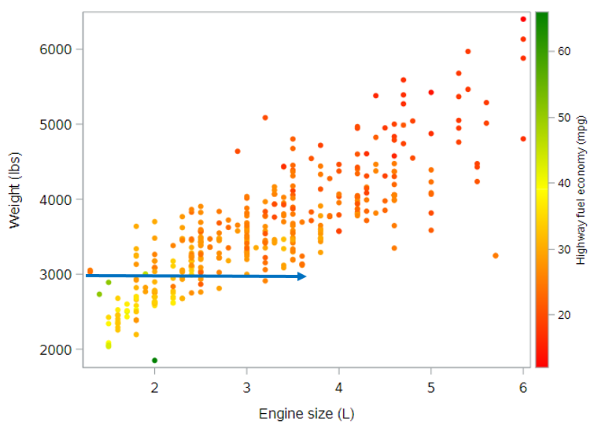
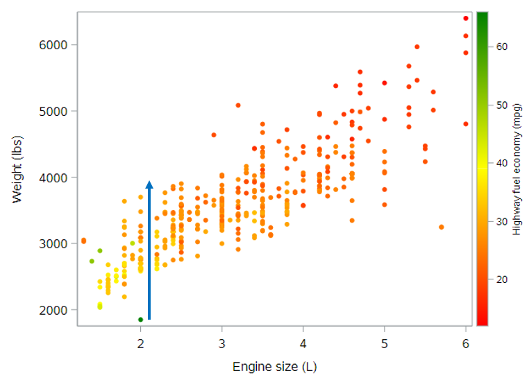

## Multiple regression

Thus far, we’ve only considered multiple regression models with one numeric explanatory variable. In this lesson, we will explore models that have at least two numeric explanatory variables.

Let's reload the CARS dataset for this:

```
* Initialize this SAS session;
%include "~/my_shared_file_links/hammi002/sasprog/run_first.sas";

* Makes and checks a working copy of CARS data;
%use_data(cars);
%glimpse(cars);
```

### Adding a second numeric explanatory variable

*Mathematically*, adding a second numeric explanatory variable to a regression model is trivial—we just add another term to our model.

$$HwyMPG = \beta_0 + \beta_1 EngSize + \beta_2 Weight + \epsilon$$

In this example, we are modeling the highway fuel economy (in MPG) of cars as a function of both engine size (in liters) and vehicle weight (in pounds). [We've been talking about SUV status as a proxy for weight, but why don't we just use weight?!] Note that both engine size and weight are numeric variables, so this is not a parallel slopes model.

*Syntactically*, fitting this model in SAS is similarly trivial—we simply extend the model statement to incorporate both the engine size and weight variables, just as we did before.

```
* Regression of HWY_MPG on ENG_SIZE + WEIGHT;
proc reg data=cars;
	model hwy_mpg = eng_size weight;
run;
```

Unfortunately, while the mathematical and syntactical formulations of multiple regression models are easy extensions of things we already know, a *graphical* formulation of these models becomes trickier.

### Graphics for 3D data space

Our data space is now three dimensional, because `hwy_mpg`, `eng_size`, and `weight` are all numeric variables that our model encapsulates. So we will need to get a little bit creative in order to create a meaningful visualization of our model.

#### 3D projections

Perhaps the most natural way to visualize a multiple regression model is as a cloud of points in three dimensions. In SAS, we can use `PROC G3D` to actually render a 3D display:

```
* Scatterplot of HWY_MPG by ENG_SIZE & WEIGHT;
proc g3d data=cars;
	scatter eng_size * weight = hwy_mpg / shape="balloon" size=.5 rotate=-45;
run;
quit;
```

You usually need to fiddle with the `rotate` option to get an angle that works for your data.


This is kind of helpful. The highest mileage data points ("higher" on the z-axis) are found for smaller engines in lighter cars, the lowest mileage data points ("lower" on the z-axis) are found for larger engines in heavier cars, and there generally seems to be a sloped plane between those sections

#### Tiling the plane

Another way to visualize a 3D model is to tile the plane. That is, we will create a 2D plot that covers all combinations of our two explanatory variables, and we will use color to reflect the response variable. We can do this within `PROC SGPLOT`, with only a minor change to the syntax:

```
* Scatterplot of HWY_MPG by ENG_SIZE & WEIGHT;
proc sgplot data=cars;
	scatter x=eng_size y=weight / colorresponse=hwy_mpg
		markerattrs=(symbol=circlefilled) colormodel=(red yellow green); 
	where not missing(hwy_mpg);
run;
```

The main change is the addition of the `colorresponse = hwy_mpg` option to indicate that colors should be assigned by values of `hwy_mpg`. We did also explicitly tell SAS which colors to use; and we removed values with missing data on the outcome, since they otherwise showed up as gray dots. Here's the result:


In this figure, orange and red dots reflect cars with lower highway fuel economy, while yellow and green dots reflect cars with higher highway fuel economy. The interpretation is the same as above. Which graph do you find easier to "see"?

## Conditional interpretation of coefficients

If you haven't already fitted the regression model described above, let's do that:

```
* Regression of HWY_MPG on ENG_SIZE + WEIGHT;
proc reg data=cars;
	model hwy_mpg = eng_size weight;
run;
```

How do we interpret these coefficients? Since both of our explanatory variables are numeric, the coefficients of both engine size and weight represent slopes. But slopes of what? A line certainly can’t have two slopes, but as we saw previously, our model is not a line. It is a plane. And a plane can have two slopes.

In the second figure above, we noticed that the color of the data points got more yellow and green as we moved toward the bottom left of the plot. This means our model should predict higher highway fuel economy for lighter cars with smaller engines. The slope estimates reflect the rate of these changes for each variable.

#### Slope for engine size

The slope for engine size, based on the regression output is -0.99 mpg per additional liter. This negative slope can be seen on the plot below as the rate of color change as you move horizontally through the plot along a straight line. Look at the points along the line below for a car that weighs 3000 pounds.



It is important to note, however, that this rate of change, based on our model, is constant across cars of all weights. It doesn’t matter whether the car weighs 3000 pounds or 5000 pounds. While the expected highway fuel economy does also depend on the car's weight, the rate of change in highway fuel economy with respect to engine size does not depend on the car's weight. (If it did, that would require an interaction term.)

Thus, the coefficient of -1 mpg per liter of engine size reflects the slope of the plane for any fixed value of weight. And since this slope doesn’t change with respect to weight, we often say that it reflects the effect of engine size on highway fuel economy, while controlling for weight (or while holding weight constant).

In the end, a good interpretation of this effect might be: *Controlling for a car's weight, we expect the average highway fuel economy to drop by 0.99 mpg per additional liter in the car's engine size.*

(By the way, if you compare this parameter estimate to the parameter estimate for engine size from the simple regression model, you will see that it's smaller here. This is entirely due to having an additional variable in the model to capture some of the variation in highway fuel economy that was previously being attributed to engine size alone.)

#### Slope for weight

We can do the same for the parameter estimate for weight. The slope for weight, based on the regression output is -0.005 mpg per additional pound.

Actually, before we move on, let's change the scale here. It will be easier to understand if we talk about the change in fuel economy for an additional 1000 pounds. If $$b_2 = -0.005$$, then $$1000b_2 = -5$$. Meaning, we can also interpret the slope for weight as -5 mpg per additional 1000 pounds.

Again, this negative slope can be seen on the plot below as the rate of color change as you move vertically through the plot along a straight line. Look at the points along the line below for a car that has a 2L engine.



Again, this slope is constant across all engine sizes, from 1.5L all the way up to 6L. So the coefficient of -5 mpg per 1000 pounds reflects the slope of the plane for any fixed value of engine size. And a good interpretation of this effect might be: *Controlling for engine size, we expect the average highway fuel economy to drop by 5 mpg per additional 1000 pounds of a car's weight.*

#### More on coefficient interpretation

You might be tempted to think that bigger coefficients are always more important, but this is not true. The value of the coefficients depend on the units of the explanatory variables. In this case, one variable is in the units of pounds, while the other is in the units of liters. They are not directly comparable.

When you interpret coefficients from a multiple regression model, be sure to always include a phrase to the effect of “holding *x* constant.” Another good alternative is “after controlling for *x*.” This information is crucial to having a valid understanding of a regression model.

### Quick note on model fit

As we did in the last tutorial, we can again check the fit of the model to see if there was an improvement in the predictive ability of this model compared to the previous models for highway fuel economy. I've summarized those measures here:

| Regression Model                           | Adjusted $$R^2$$ | Root MSE |
| ------------------------------------------ | ---------------- | -------- |
| Simple (Engine size only)                  | 0.505            | 4.0      |
| Parallel slopes (Engine size + SUV status) | 0.574            | 3.7      |
| Multiple (Engine size + Weight)            | 0.635            | 3.4      |

Both of these measures show substantial improvement with the multiple regression model. With the multiple regression model, we can now explain over 63% of the variation in highway fuel economy, and standard deviations of the residuals is lower than for other models, indicating tighter fit for the observed data points.

## Adding a third (categorical) variable

You know what? Let's add that SUV indicator variable into this model to see what happens. The mathematical and syntactic representations of the model are, again, simple to extend.

*Mathematically*, we now have:

$$HwyMPG = \beta_0 + \beta_1 EngSize + \beta_2 Weight + \beta_3 SUV + \epsilon$$

And *syntactically*, we now have this SAS code:

```
* Regression of HWY_MPG on ENG_SIZE + WEIGHT + SUV;
proc reg data=cars;
	model hwy_mpg = eng_size weight suv;
run;
```

*Graphically*, what do you think we're dealing with here? As a remind of what we have seen so far:

- 1 numeric explanatory variable describes a *line* 
- 1 numeric + 1 categorical explanatory variable describes *parallel lines*
- 2 numeric explanatory variables describes a *plane*
- 2 numeric + 1 categorical explanatory variables describes *what*?

Our emphasis on the geometry of these models should give you some intuition. If you guessed parallel planes, you're right. Since the addition of a categorical explanatory variable to a numeric explanatory variable changed a line into parallel lines. Adding a categorical explanatory variable to two numeric explanatory variables will change the geometry of a model from a plane to parallel planes. (In case you're wondering, we won't be visualizing these parallel planes in SAS.)

### Coefficient interpretation

The interpretations that we developed previously still hold—we just need to think about how they apply to our new model. The coefficients on engine size and weight still reflect slopes. And since the planes are parallel, both slopes are the same in both planes. The coefficient on SUV status is the distance between the two planes, and this distance is constant across all possible values of engine size and weight. In this sense, we are modeling the effect of SUV status as being the same regardless of engine size and weight. 

We can interpret the new parameter estimates as follows (based on the output from the SAS code above):

* <u>Engine size</u>: We expect the average highway fuel economy to drop by 1.25 mpg per additional liter in the car's engine size, controlling for a car's weight and SUV status
* <u>Vehicle weight</u>: We expect the average highway fuel economy to drop by 4 mpg per additional 1000 pounds of a car's weight, controlling for engine size and SUV status
* <u>SUV</u>: We expect SUVs to have an average highway fuel economy that is 2.2 mpg lower than non-SUVs, controlling for a car's weight and engine size 

For the SUV variable, remember that we need to know the coding and which value of that variable is the reference category. Here SUV = No (= 0) is the reference value.

Side note: It's interesting to see that each of these variables appears to have a meaningful, independent effect on highway fuel economy. None of these parameter estimates is very near to zero, which would indicate "no effect".

## Higher dimensions

By now, you may have caught on to the fact that there are no mathematical or syntactic hurdles to adding more variables to a multiple regression model. You can add as many terms as you want and SAS will happily fit the model for you.

If we want to add explanatory variables that indicate whether the vehicle is a sports car or an all-wheel drive vehicle, we can do that easily.

*Mathematically*, we would have:

$$HwyMPG = \beta_0 + \beta_1 EngSize + \beta_2 Weight + \beta_3 SUV + \beta_4 SportsCar + \beta_5 AllWheel + \epsilon$$

And *syntactically*, we would use this SAS code:

```
* Regression of HWY_MPG on ENG_SIZE + WEIGHT + SUV + SPORTS_CAR + ALL_WHEEL;
proc reg data=cars;
	model hwy_mpg = eng_size weight suv sports_car all_wheel;
run;
```

It seems reasonable to think that any of these variables might play a role in determining a vehicle's highway fuel economy, and so there may be valid scientific reasons for including any or all of these variables in our model.

*Graphically*, we've reached the limit on our ability to visualize such complex models. There are things called *hyperplanes* which generalize the notion of a plane to higher dimensions, but since we humans can’t visualize more than three spatial dimensions anyway, there isn’t much hope of visualizing our higher dimensional models in their full glory.

The *interpretation* of coefficients in larger models remains the same. We can still think of the coefficients on numeric explanatory variables as being slopes, and we can still think of the coefficients on categorical explanatory variables as being intercepts. The main thing we have to be careful about is remembering to include language specifying the other variables in the model. 

And, finally, the notion of *model fit* also remains the same regardless of the size of the model.


You have successfully completed this tutorial.

# [< Back to Section 3](https://bghammill.github.io/ims-03-model/)


<!-- MathJax -->

<script src="https://cdn.mathjax.org/mathjax/latest/MathJax.js?config=TeX-AMS-MML_HTMLorMML" type="text/javascript"></script>

