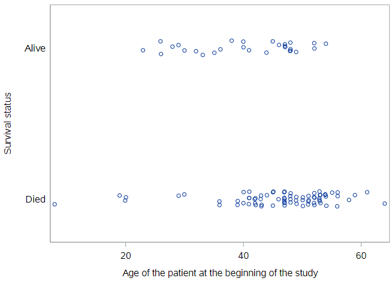
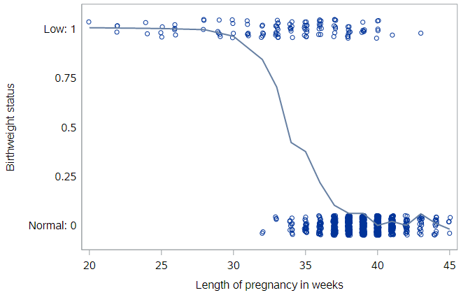
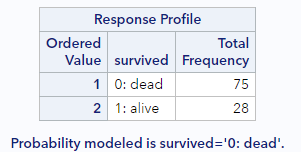
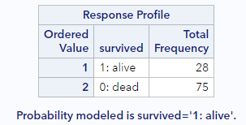
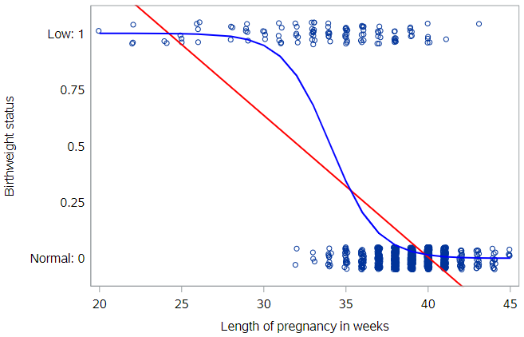
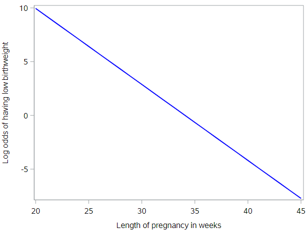
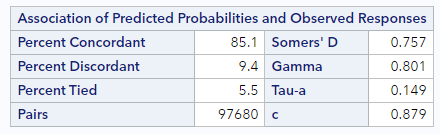
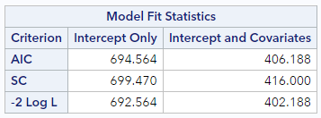
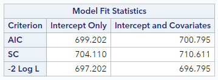

*don't think we're doing this*

# Logistic regression

Thus far, we have only built models for a numeric response variable. But what if we have a dichotomous response variable? That's what logistic regression is used for.

We have previously looked at the birthweight of infants as a continuous variable, but one way that researchers often classify infants is into groups of (a) low birthweight and (b) normal birthweight. For this exploration of logistic regression, let's look at a sample of North Carolina births so we can focus on modeling low birthweight. 

```
* Initialize this SAS session;
%include "~/my_shared_file_links/hammi002/sasprog/run_first.sas";

* Make a copy of the NCBIRTHS data;
%use_data(ncbirths);

* Recode low birthweight as 0/1;
data ncbirths;
	set ncbirths;
	lowbwt = ifn(lowbirthweight = 1, 1, 0);
	label lowbwt = "Low Birthweight";
	format lowbwt yesno.;
run;

* Check data;
%glimpse(ncbirths);
```

The code above creates a new variable, `lowbwt`, to capture low birthweight as a 0/1 variable. (The `lowbirthweight` source variable is coded as 1/2, which is less intuitive.)

We can take a look at low birthweight status by weeks of gestation using a dot plot (with some jitter so we can see all the points):



This plot illustrates the strong, and unsurprising, relationship between gestational age and birthweight. In these data, all babies born prior to 32 weeks were of low birthweight, and almost all full-term babies (37+ weeks) were of normal birthweight. 

If we fit a smoothed line to these points, we can see where the transition between these two extremes occurs.



Because our outcome variable is coded as 0 (normal birthweight) and 1 (low birthweight), the vertical axis can be thought of as the probability of a baby having low birthweight , and the line represents the probability of a baby having low birthweight, given its gestational age. For example, it appears that about 25% of the births to babies with 35 weeks gestation were low birthweight.

From this plot, we can see that the shape of this relationship is not linear. (The shape is, in fact, a terrific example of a logistic curve.) So while there is nothing preventing us from fitting a linear regression model here, you should already have the sense that a straight line will not be the best fit these data.

If you fit a linear regression to these data, the estimated line would look like this:


### Limitations of linear regression

It’s not hard to see that the line doesn’t fit very well. There are other problems as well…

First, what does this model predict as the probability that a baby with 42 weeks gestation will be low birthweight? It would be some number less than zero, which doesn’t make sense as a probability. We see similar problems at the other end of the line, with probabilities above 1.0 for babies with gestational age < 25 weeks or so. Because the regression line always extends to infinity in either direction, it will make predictions that are not between 0 and 1, sometimes even for reasonable values of the explanatory variable.

Second, the variability in a binary response may violate a number of other assumptions that we make when we do inference in multiple regression. You’ll learn about those assumptions in the tutorial on inference for regression.

### Generalized linear models

Thankfully, a modeling framework exists that generalizes regression to include response variables that are non-normally distributed. This family is called **generalized linear models** or GLMs for short. One member of the family of GLMs is called **logistic regression**, and this is the one that models a binary response variable.

A full treatment of GLMs is beyond the scope of this tutorial, but the basic idea is that you apply a so-called link function to appropriately transform the scale of the response variable to match the output of a linear model. The link function used by logistic regression is the **logit** function. For the logistic regression, the equation for the *population regression model* looks like:

$$logit(\pi) = ln(\frac{\pi}{1−\pi})=\beta_0 + \beta_1 x + \epsilon$$

where $$\pi$$ is the probability that the event or outcome of interest occurs, $$Pr(y = 1)$$. The logit function constrains the fitted values of the model to always lie between 0 and 1, as a valid probability must.

By the way, in the equation for the *estimated regression model* here, we replace $$\pi$$ with $$p$$:

$$logit(p) = ln(\frac{p}{1−p})=b_0 + b_1 x$$

#### Log-odds

If you look more closely at the logit function, you should notice that the quantity inside the parentheses is the odds of an event, which we have previously talked about:

$$Odds = \frac{p}{1-p}$$

If you remember, the odds of an event range from 0, when the probability of an event is very near 0, to $$\infty$$, when the probability of an event is very near 1.

If we tried to model the odds directly, we would have a few problems. First, we could still end up with negative predicted values, which are not allowed on the odds scale, as they are not allowed on the probability scale. And, second, the entire scale itself is non-linear. The distance from 0 to 1 on the odds scale represents all situations where the probability of an event is less than 0.5, whereas the distance from 1 to $$\infty$$ represents all situations where the probability of an event is greater than 0.5. What we need is a scale where a 1-unit change has the same meaning across all ranges of the variable.

Taking the natural log of the odds solves these problems for us. The log-odds (or logit) function maps probabilities onto a scale that ranges from $$-\infty$$ (when the probability is ) to $$+\infty$$ (so no out-of-range predictions) and allows a consistent interpretation of a 1-unit change regardless of where we are on the scale.

### Fitting a GLM in SAS

Specifying a logistic regression model in SAS is very similar to specifying a linear regression model. The major difference is that we will be working with `PROC LOGISTIC` instead of `PROC REG`, even though the `model` statement looks the same:

```
* Logistic regression of LOWBWT on WEEKS;
proc logistic data=ncbirths descending;
	model lowbwt = weeks;
run;
```

There is one critical option, `descending`, usually needed with `PROC LOGISTIC`.  This option tells SAS how to order the outcome values for prediction. By default, SAS predicts the "first" outcome, in alphanumeric order. For a variable coded with 0/1, this means it will predict 0, which is often not what we want.

Notice that the first set of `PROC LOGISTIC` output includes this information:



SAS is explicitly telling us here that it is modeling the probability of low birthweight (`lowbwt `= 1)death. Without the `descending` option, it would be modeling the probability of normal birthweight, which is not the goal. *Always make sure you check this section of the output to ensure that SAS is predicting the outcome you intend.*



### Visualizing logistic regression

We showed you the simple regression line through the birthweight data. Let's add the logistic regression curve through these data as well.



Notice how the blue logistic regression line is curved—most noticeably at the ends. The logistic regression line will never reach 0 or 1, eliminating the invalid predicted probabilities that would result from the red simple regression line. 

Again, we can read off predicted probabilities from the logistic regression line. For an infant born after 34 weeks of gestation, the chances of having low birthweight are about 50%. The notion of probability here is very intuitive. It’s easy to understand what we mean when we say that the probability of having low birthweight 50%.

Unfortunately, since our model is now non-linear, it’s harder to succinctly characterize how those probabilities decline as the weeks of gestation increase. We can no longer say that “each additional week of gestation is associated with a particular change in the probability of having low birthweight,” because that change in probability is not constant across ages. Thus, while the probability scale is natural, it can be cumbersome to work with.

### Predicted probabilities 

As a side note, in order to estimate the probability of having low birthweight for a specific gestational age from the model, we need to reverse the logit transformation shown above. This is done as follows:

$$\hat{p}=\frac{1}{1 + e^{-1\cdot(b_0 + b_1 x}}$$

Of course, SAS will compute this for you for existing observations:

```
* Logistic regression of LOWBWT on WEEKS, output predicted probabilities;
proc logistic data=ncbirths descending;
	model lowbwt = weeks;
	output out=nc_pred predicted=pred;
run;

* Check a few;
proc print data=nc_pred(obs=10);
	var weeks lowbwt pred;
run;
```

Based on the first record printed out in the last step, we can see, for an infant born after 39 weeks of gestation, that the model predicts they will be low birthweight 2.97% of the time.

This also means that the intercept estimate can be used to calculate the probability of the outcome when all the $$x$$ variable values are zero,

$$\hat{p_0}=\frac{1}{1 + e^{-1\cdot(b_0}}$$

although this is rarely done in practice.

### Log-odds scale

As an alternative to the probability scale for the *y* variable, we could consider the odds scale. If the probability of having low birthweight is 75%, then the odds of having low birthweight are 3:1, since you are three times more likely to have low birthweight than you are to have normal birthweight. Odds are commonly used to express uncertainty in a variety of contexts, most notably gambling.

And while the odds scale is more useful than the probability scale for certain things, it is still non-linear in the current context. So statisticians also think about logistic regression models on the log-odds scale, which is formed by taking the **natural log** of the odds. 

$$log\-odds(\hat{p}) = ln(\frac{\hat{p}}{1-\hat{p}})$$

This, in fact, is just the logit function presented earlier.  When we plot predicted log-odds of having low birthweight by gestational age, we get a graph like the following:



The benefit to this approach is clear. The logistic regression model can be visualized as a line! Unfortunately, understanding what the log of the odds of an event means is very difficult for humans. 

### Odds ratios

Because the predicted logistic model looks like this:

$$ln[odds(p)] = ln(\frac{p}{1−p})=b_0 + b_1 x$$

we can exponentiate both sides so that we're working directly with the odds of an event:

$$odds(p) = exp(b_0 + b_1 x)$$

A useful notation is $$odds(p|x) $$ to indicate that this is the estimated odds of the event (having estimated probability $$p$$) for a given value of $$x$$.

In order to understand the effect of a 1-unit increase in $$x$$, then, let's calculate the $$odds(p|x)$$ and $$odds(p|x+1)$$ and compare.

$$odds(p|x) = exp(b_0 + b_1 x)=e^{b_0}e^{b_1 x}$$

$$odds(p|x+1) = exp(b_0 + b_1 (x+1)) = exp(b_0 + b_1 x+ b_1))=e^{b_0}e^{b_1 x}e^{b_1}$$

If we take of the ratio of $$odds(p|x+1)$$ to $$odds(p|x)$$, we get:

$$\frac{odds(p|x+1)}{odds(p|x)} = \frac{e^{b_0}e^{b_1 x}e^{b_1}}{e^{b_0}e^{b_1 x}}=e^{b_1}

This is the **odds ratio**, the most common way to interpret logistic regression coefficients. In other words, the effect of a 1-unit increase in *x* on the odds of the outcome *y* is given by an odds ratio (OR) equal to $$e^{b_1}$$.

From the estimated logistic regression model, we see that $$b_1= -.71$$. If we exponentiate this estimate, we get an odds ratio of 0.49 (b/c $$e^{-.71} = 0.49). We would interpret estimate by saying that the odds of having low birthweight are reduced by about 50% for each additional week of gestation. Or we could just report that the odds ratio for having low birthweight associated with gestational age is 0.49, indicating a substantial reduction in risk with every additional week of gestation.

As for any ratio, our interest is in how this number differs from 1. If it’s greater than one, then the odds (risk) of the event are increased. Conversely, if it’s less than one, then the odds (risk) of the event are decreased. And, as we talked about when discussion metrics of association for 2x2 tables, the odds ratio approximates the risk ratio when the incidence of an event is low.  That's true whether the odds ratio is estimated from a 2x2 table or from a logistic regression.

## Logistic regression model fit

Unlike linear regression, there are no intuitive, readily-interpretable measures of model fit like $$R^2$$ () or RMSE for logistic regression. But there are a few measures that get reported and/or used for  comparisons of model fit.

### C-statistic

The C-statistic (sometimes called the “concordance” statistic or C-index) is a measure of goodness-of-fit for a logistic regression model. The C-statistic gives the probability that a randomly selected observation that experienced the outcome has a higher predicted risk (from the model) than another randomly selected observation who did not experience the outcome. It ranges from 0.5 to 1, where higher values indicate better fit, and generally has the following interpretation:

* A value of 0.5 means that the model is no better than predicting an outcome than random chance
* Values over 0.7 indicate a good model
* Values over 0.8 indicate a strong model
* A value of 1 means that the model perfectly predicts which observations will experience the outcome and which will not

People do sometimes report the C-statistic for their logistic regression model. It can also be used for comparing models.

For the low birthweight regression, you can find the C-statistic in the bottom right of the table labeled "Associated of Predicted Probabilities and Observed Responses":



For this model, the C-statistic is 0.88, which is very high, since the relationship between weeks of gestation and birthweight is extremely correlated.

### AIC (Akaike information criterion)

The Akaike information criterion (AIC) is an estimator of prediction error and another measure of model quality. Like the $$R^{2}_{adj}$$, it accounts for both the fit of the model and the complexity of the model, adding a penalty when there are too many variables. The AIC is almost exclusively a metric used for model comparison and selection, where lower AIC is better. 

For the low birthweight regression, you can find the AIC in the top row of the table labeled "Model Fit Statistics":



The AIC for this model is 406.2, which is only meaningful in comparison to another model. So, here's the model fit information from a very poor model, predicting low birthweight status based only on the sex of the baby (which is essentially unpredictive):



Compared to this AIC (=700.8), the model with weeks of gestation as a predictor has a considerably lower AIC and therefore fits the data much better.


You have successfully completed this tutorial.

# [< Back to Section 3](https://bghammill.github.io/ims-03-model/)


<!-- MathJax -->

<script src="https://cdn.mathjax.org/mathjax/latest/MathJax.js?config=TeX-AMS-MML_HTMLorMML" type="text/javascript"></script>

