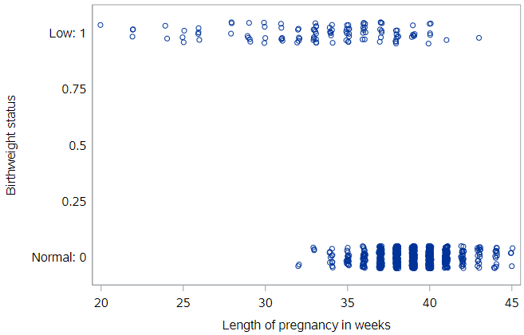
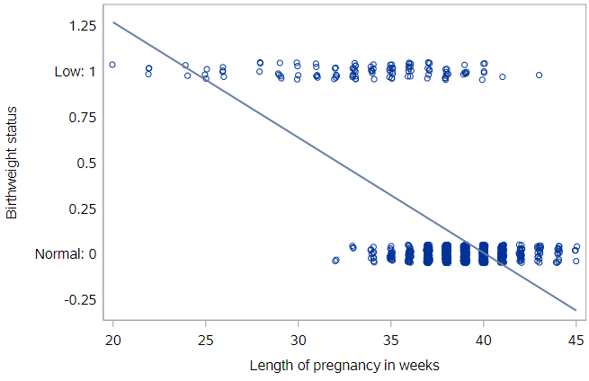
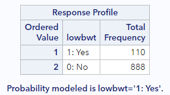
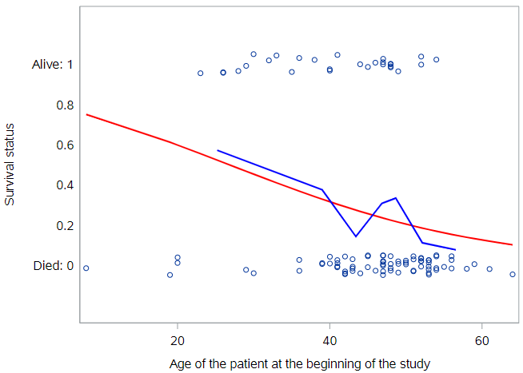
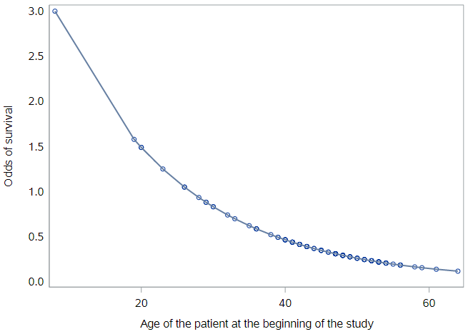

*don't think we're doing this*

# Logistic regression

Thus far, we have only built models for a numeric response variable. But what if we have a categorical response variable?

A well-known Stanford University study on heart transplants tracked the five-year survival rate of patients with dire heart ailments. The purpose of the study was to assess the efficacy of heart transplants, but for right now we will simply focus on modeling the survival rates of these patients.

Let's load these data:

```
* Initialize this SAS session;
%include "~/my_shared_file_links/hammi002/sasprog/run_first.sas";

* Makes and checks a working copy of HEART_TRANSPLANT data;
%use_data(heart_transplant);
%glimpse(heart_transplant);
```

We can take a look a survival by age using a dot plot (with some jitter so we can see all the points):



This plot illustrates how those patients who were older when the study began were more likely to be dead when the study ended five years later.

There is nothing preventing us from fitting a simple linear regression model to these data, and in fact, in certain cases this may be an appropriate thing to do. If you fit a regression *line* to these data, it would look like this:



Because our outcome variable is already coded as 0 (Died) and 1 (Alive, outcome of interest), the vertical axis can be thought of as the probability of being alive at the end of the study, and the line represents the probability of being alive at the end of the study, given one’s age at the beginning.

### Limitations of linear regression

It’s not hard to see that the line doesn’t fit very well. There are other problems as well…

First, what would this model predict as the probability of a 70-year-old patient being alive? It would be a number less than zero, which doesn’t make sense as a probability. Because the regression line always extends to infinity in either direction, it will make predictions that are not between 0 and 1, sometimes even for reasonable values of the explanatory variable.

Second, the variability in a binary response may violate a number of other assumptions that we make when we do inference in multiple regression. You’ll learn about those assumptions in the tutorial on inference for regression.

### Generalized linear models

Thankfully, a modeling framework exists that generalizes regression to include response variables that are non-normally distributed. This family is called **generalized linear models** or GLMs for short. One member of the family of GLMs is called **logistic regression**, and this is the one that models a binary response variable.

A full treatment of GLMs is beyond the scope of this tutorial, but the basic idea is that you apply a so-called link function to appropriately transform the scale of the response variable to match the output of a linear model. The link function used by logistic regression is the **logit** function. For the logistic regression, the equation for the population regression model looks like:

$$logit(\pi) = ln(\frac{\pi{1−\pi})=\beta_0 + \beta_1 x + \epsilon$$

where $$\pi$$ is the probability of the event of interest. The logit function constrains the fitted values of the model to always lie between 0 and 1, as a valid probability must.

By the way, in the equation for the estimated regression model here, we replace $$\pi$$ with $$p$$:

$$logit(p) = ln(\frac{p{1−p})=\b_0 + \b_1 x$$

#### Log-odds

If you look more closely at the logit function, you should notice that the quantity inside the parentheses is the odds of an event:

$$Odds = \frac{p}{1-p}$$

The reason that statisticians use log-odds for regressions is that...


### Fitting a GLM in SAS

Specifying a logistic regression model in SAS is very similar to specifying a linear regression model. The major difference is that we will be working with `PROC LOGISTIC` instead of `PROC REG`, even though the `model` statement looks the same:

```
* Logistic regression for death;
proc logistic data=heart_transplant;
	model survived = age;
run;

* Logistic regression for survival;
proc logistic data=heart_transplant descending;
	model survived = age;
run;
```

There is one critical option, `descending`, that is usually needed with `PROC LOGISTIC`.  The first code block above does not include this option while the second block does. This option tells SAS how to order the outcome values for prediction. By default, SAS predicts the "first" outcome, in alphanumeric order. For a variable coded with 0/1, this means it will predict 0.

Notice that the first set of output includes this information:



SAS is explicitly telling us that it is modeling the probability of death, which is not what we want here. Only when we tell SAS to order the value in "descending" order does it choose to model when the outcome variable equals 1. With the `descending` option, here's how that Response Profile output looks:


This is what we want. *Always make sure you check this section of the output to ensure that SAS is predicting the outcome you intend.*

## Visualizing logistic regression

We showed you the simple regression line through the heart transplant data. Let's add the logistic regression curve through these data as well.


Notice how the logistic regression line is curved—most noticeably at the ends. The red logistic regression line will never reach 0 or 1, eliminating the invalid predicted probabilities that would result from the blue simple regression line. In this case, for most ages, the simple linear regression line and the logistic regression line don’t differ by very much, and you might not lose much by using the simpler regression model. But for older people, the logistic model should perform much better.

How can we visually assess how well the logistic model fits the data? Since the actual observations are all at 0 or 1, but our predictions are always between 0 and 1, we will always be off by some amount. In particular, our model predicts a 50% chance of survival for patients that are about 27 years old. Is that accurate?

#### Using bins

One way to address this question is to separate the observations into bins based on age, and then compute the average probability of being alive for each age group. On the figure below, the red line reflects just this. We separated the data into seven bins such that each bin contained roughly the same number of observations, then calculated the survival in each bin, plotted against the average age of each bin. In general, it seems clear that the probability of being alive declines with age.



The blue line is the same logistic regression line as above. With the binned observations in red, we can now see how the blue logistic regression line fits “through” these binned points.

## Three scales approach to interpretation

### Probability scale

For the Stanford heart transplant patients, we’ve observed how the probability of survival seems to decline with age. The notion of probability here is very intuitive: it’s easy to understand what we mean when we say that the five-year survival rate is 75%. In order to estimate the survival rate for a specific age from the model, we need to reverse the logit transformation shown above. This is done as follows:

$$\hat{p}=\frac{1}{1 + e^{-1(\b_0 + \b_1 x}}$$

Of course, SAS will compute this for you for existing observations:

```
* Logistic regression for survival;
proc logistic data=heart_transplant descending;
	model survived = age;
	output out=heart_pred predicted=pred;
run;

* Check a few;
proc print data=heart_pred(obs=10);
	var age survived pred;
run;
```

For a patient aged 53 at implant, this model predicts an expected survival of 17.7%. 

Let's plot all the predicted values for these data:

```
* Plot predicted values;
proc sgplot data=heart_pred noautolegend;
	loess x=age y=pred;
run;
```

The loess function just plots a smooth line over a set of points.


Unfortunately, since our model is now non-linear, it’s harder to succinctly characterize how those probabilities decline as the patients age. We can no longer say that “each additional year of age is associated with a particular change in the probability of surviving,” because that change in probability is not constant across ages. Thus, while the probability scale is natural, it can be cumbersome to work with.

### Odds scale

To combat the problem of the scale of the y variable, we can change the scale of the variable on the y-axis. Instead of thinking about the probability of survival, we can think about the odds. While these two concepts are often conflated, they are not the same. They are however, related by the simple formula below. The **odds** of a binary event are the ratio of how often it happens, to how often it doesn’t happen.

$$odds(\hat{p}) = \frac{\hat{p}}{1-\hat{p}}$$

again where $$\hat{p}$$ is the predicted probability of the modeled event.

Thus, if the probability of survival is 75%, then the odds of survival are 3:1, since you are three times more likely to survive than you are to die. Odds are commonly used to express uncertainty in a variety of contexts, most notably gambling.

If we were to plot the predicted odds based on the logistic regression, we would see this:



If we change the y-scale to odds, then our model must change shape as well. In fact, our model now has the form of an exponential function. In this case, the odds of survival decrease exponentially as people age.

### Log-odds scale

While the odds scale is more useful than the probability scale for certain things, it isn’t entirely satisfying. Statisticians also think about logistic regression models on the log-odds scale, which is formed by taking the **natural log** of the odds. 

$$log\-odds(\hat{p}) = ln(\frac{\hat{p}}{1-\hat{p}})$$

This, in fact, is just the logit function presented earlier.  When we plot predicted log-odds by age, we get a graph like the following:


The benefit to this approach is clear. The logistic regression model can be visualized as a line!


This is why statisticians use log-odds to model dichotomous outcomes. Because log-ods


Unfortunately, understanding what the log of the odds of an event means is very difficult for humans.

### Comparison

- Probability scale
  - Scale: intuitive, easy to interpret
  - Function: non-linear, hard to interpret
- Odds scale
  - Scale: harder to interpret
  - Function: exponential, harder to interpret
- Log-odds scale
  - Scale: impossible to interpret
  - Function: linear, easy to interpret

So we’ve identified three different scales when working with logistic regression models. Each has its own strengths but also weaknesses, and so you really can’t stick with one scale and ignore the others.

The probability scale is the easiest to understand, but it makes the logistic function difficult to interpret. Conversely the logistic function becomes a line on the log-odds scale. This makes the function easy to interpret, but the log of the odds is hard to grapple with. The odds scale lies somewhere in between.

### Odds ratios


OR=odds(y^|x+1)odds(y^|x)=exp(β^0+β^1⋅(x+1))exp(β^0+β^1⋅x)=expβ1OR=odds(y^|x+1)odds(y^|x)=exp⁡(β^0+β^1⋅(x+1))exp⁡(β^0+β^1⋅x)=exp⁡β1


```
## (Intercept)         age 
##   4.7797050   0.9432099
```

Moreover, it is the odds scale that leads to the most common interpretation of the coefficients in a logistic regression model. As noted previously, interpreting the coefficients on the probability scale is hard because the model is non-linear, while interpreting them on the log-odds scale is hard because the scale is abstruse. However, on the odds scale we can form the ratio of the odds when the explanatory variable increases by one unit. This works out mathematically to be equal to the exponential of β1β1, or eβ1eβ1, the “slope” coefficient.

Our interest is in how this number differs from 1. If it’s greater than one, then the odds increase. Conversely, if it’s less than one, then the odds decrease. In our case, our model suggests that each additional year of age is associated with a 6% decrease in the odds of survival.

Keeping careful track of which scale you are working on will help you get these interpretations right.


You have successfully completed this tutorial.

# [< Back to Section 3](https://bghammill.github.io/ims-03-model/)


<!-- MathJax -->

<script src="https://cdn.mathjax.org/mathjax/latest/MathJax.js?config=TeX-AMS-MML_HTMLorMML" type="text/javascript"></script>

