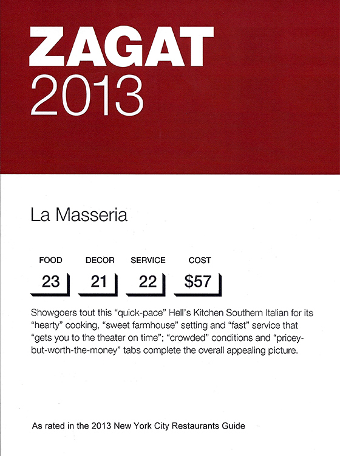

## Case Study: Italian restaurants in NYC

Explore the relationship between price and the quality of food, service, and decor for Italian restaurants in NYC.

No matter where you are, or where you’ve been, if you’re taking this tutorial, my guess is that you’ve been to a restaurant before. And if you’re in Europe or North America, there’s an excellent chance that you’ve been to an Italian restaurant. The Italian restaurants in New York City are legendary, and it’s time to put your newly-developed regression modeling skills to work to understand how they operate.

What are the factors that contribute to a price of a meal at Italian restaurants in New York City? We will address this question with a series of multiple regression models.


### Zagat guide

The Zagat guide is an influential review of restaurants. They are made famous by their use of selective quotes from actual diners to build a pithy description of each restaurant. But we won’t be working with the text. Rather, we’ll be working with the numeric reviews you see posted here. Each restaurant is rated on a scale of 0 to 30 for the quality of its food, decor, and service. The average price of a meal—which includes one drink and a tip—will be our response variable. How do these factors influence the average price of a meal?




### Exploring the data

```
glimpse(nyc)
## Rows: 168
## Columns: 7
## $ Case       <dbl> 1, 2, 3, 4, 5, 6, 7, 8, 9, 10, 11, 12, 13, 14, 15, 16, 17, …
## $ Restaurant <chr> "Daniella Ristorante", "Tello's Ristorante", "Biricchino", …
## $ Price      <dbl> 43, 32, 34, 41, 54, 52, 34, 34, 39, 44, 45, 47, 52, 35, 47,…
## $ Food       <dbl> 22, 20, 21, 20, 24, 22, 22, 20, 22, 21, 19, 21, 21, 19, 20,…
## $ Decor      <dbl> 18, 19, 13, 20, 19, 22, 16, 18, 19, 17, 17, 19, 19, 17, 18,…
## $ Service    <dbl> 20, 19, 18, 17, 21, 21, 21, 21, 22, 19, 20, 21, 20, 19, 21,…
## $ East       <dbl> 0, 0, 0, 0, 0, 0, 0, 1, 1, 1, 1, 1, 1, 1, 1, 1, 1, 1, 1, 1,…
```

Our data come in the form of Zagat reviews from 168 Italian restaurants in New York City from 2001. The `glimpse()` function can help you get a sense of how the variables are encoded and what values they typically take on. The `East` variable records whether the restaurant is located east or west of Fifth Avenue, which historically divides the island of Manhattan.


### EDA

```
nyc %>%
  select(-Restaurant) %>%
  pairs()
```


Before we can sensibly build models, we should spend some time exploring the data. How are the variables distributed? How are they related to one another? What patterns are present? The `pairs()` function can help us explore these relationships visually. It shows a grid of scatterplots for each pair of variables in the `nyc` data frame. It’s easy to see that, for example, `Price` and `Decor` are strongly correlated, while `Case` and `Food` are uncorrelated.


### Exploratory data analysis

Multiple regression can be an effective technique for understanding how a response variable changes as a result of changes to more than one explanatory variable. But it is not magic – understanding the relationships among the explanatory variables is also necessary, and will help us build a better model. This process is often called **exploratory data analysis** (EDA) and is covered in the previous tutorial on Summarizing and Visualizing Data.

One quick technique for jump-starting EDA is to examine all of the pairwise scatterplots in your data. This can be achieved using the `pairs()` function. Look for variables in the `nyc` data set that are strongly correlated, as those relationships will help us check for **multicollinearity** later on.

R Code Start Over Hint

 Run Code

1

2

3

Which pairs of variables appear to be strongly correlated?

`Case` and `Decor`.

`Restaurant` and `Price`.

`Price` and `Food`.

`Price` and `East`.


### SLR models

Based on your knowledge of the restaurant industry, do you think that the quality of the food in a restaurant is an important determinant of the price of a meal at that restaurant? It would be hard to imagine that it wasn’t. We’ll start our modeling process by plotting and fitting a model for `Price` as a function of `Food`.

On your own, interpret these coefficients and examine the fit of the model. What does the coefficient of `Food` mean in plain English? “Each additional rating point of food quality is associated with a…”

- Use `ggplot` to make a scatter plot for `Price` as a function of `Food`.
- Use `lm()` to fit a simple linear regression model for `Price` as a function of `Food`.

## Incorporating another variable

### Fifth Avenue

Fifth Avenue is one the most well-known streets in the world, renowned for its flagship stores for shopping, landmark hotels, and internationally-recognized sites. A walk down 5th Avenue from Central Park to Washington Square Park would take you past the Plaza Hotel, Trump Tower, Saks Fifth Avenue, the New York Public Library, the Empire State Building, and the Flatiron building.


### CUNY

It would also take you past the Graduate Center of the City University of New York, where one of the authors studied for their doctoral degree. Good times!


### Dividing the City

5th Avenue divides the island of Manhattan vertically. The city’s east side has historically been home to expensive residences and opulent attractions. Maybe everything is more expensive on the East side. Maybe even food is more expensive on the east side. Do Italian restaurants located on the east side of 5th Avenue tend to charge more? How much more?


### The price of location

```
nyc %>% 
  group_by(East) %>% 
  summarize(mean_price = mean(Price))
```


| East<dbl> | mean_price<dbl> |
| --------: | --------------: |
|         0 |        40.43548 |
|         1 |        44.01887 |

2 rows

It’s certainly true that the average price of a meal for restaurants located on the east side of Manhattan was higher than it was for restaurants on the west side. The table above shows that they charged about $3.58 more, on average. But does this figure really represent the premium for being on the east side? Could it be the case that the restaurants on the east side also had better food, and that is what was driving the increase in price? You’ll explore this question in the exercises.

### Service

Another important consideration in dining out is the quality of the service. Are people willing to pay more for higher quality service, even if the food doesn’t taste any better? How much more? How does the average price of meal vary with respect to the quality of the food and the service? It’s up to you to figure it out.


### Parallel lines with location

In real estate, a common mantra is that the three most important factors in determining the price of a property are “location, location, and location.” If location drives up property values and rents, then we might imagine that location would increase a restaurant’s costs, which would result in them having higher prices. In many parts of New York, the east side (east of 5th Avenue) is more developed and perhaps more expensive. [This is increasingly less true, but was more true at the time these data were collected.]

Let’s expand our model into a parallel slopes model by including the `East` variable in addition to `Food`.

- Use `lm()` to fit a parallel slopes model for `Price` as a function of `Food` and `East`.
- Interpret the coefficients and the fit of the model.
- Can you explain the meaning of the coefficient on `East` in simple terms? Did the coefficient on `Food` change from the previous model? If so, why? Did it change by a lot or just a little?

Identify the statement that is *FALSE*:


Each additional rating point of food quality is associated with a $2.88 increase in the expected price of meal, after controlling for location.

The premium for an Italian restaurant in NYC associated with being on the east side of 5th Avenue is $1.46, after controlling for the quality of the food.

The change in the coefficient of food from $2.94 in the simple linear model to $2.88 in this model has profound practical implications for restaurant owners.

### A plane in 3D

One reason that many people go to a restaurant - apart from the food - is that they don’t have to cook or clean up. Many people appreciate the experience of being waited upon, and we can all agree that the quality of the service at restaurants varies widely. Are people willing to pay more for better restaurant `Service`? More interestingly, are they willing to pay more for better service, after controlling for the quality of the food?

Multiple regression gives us a way to reason about these questions. Fit the model with `Food` and `Service` and interpret the coefficients and fit. Did the coefficient on `Food` change from the previous model? What do the coefficients on `Food` and `Service` tell you about how these restaurants set prices?

Next, let’s visually assess our model using `plotly`. The `x` and `y` vectors, as well as the `plane` matrix, have been created for you.

- Use `lm()` to fit a multiple regression model for `Price` as a function of `Food` and `Service`.
- Use `plot_ly` to draw 3D scatterplot for `Price` as a function of `Food` and `Service` by mapping the `z` variable to the response and the `x` and `y` variables to the explanatory variables. Place the food quality on the x-axis and service rating on the y-axis.
- Use `add_surface()` to draw a plane through the cloud of points using the object `plane`.

## Higher dimensions

### Decor

The last criteria for the Zagat review is decor. This refers to the visual presentation of the restaurant: the furniture, the wall adornments, and the overall ambiance. Clearly, restaurants vary widely in the quality of their decor. But how does the perceived quality of decor vary with the price of a meal? And how is the effect moderated by the quality of food and service?


### Building a full model

In what follows, you will build more complex models for the price of a meal at an Italian restaurant in New York City using the Zagat ratings. The possible explanatory variables include `Food`, `Service`, `Decor`, and `East`. Other variables recorded in the data set that should not be considered explanatory variables are `Case` (which records an ID number for each restaurant), and `Restaurant` (which records the name of the restaurant).

- Response variable:
  - `Price`
- Explanatory variables
  - `Food`
  - `Service`
  - `Decor`
  - `East` (categorical)
- Unusable
  - `Case`
  - `Restaurant`

Consider for a moment what a full model that included all of these explanatory variables would look like.


### Collinearity

```
nyc %>%
  mutate(Price_cents = Price / 100) %>%
  summarize(cor_collinear = cor(Price, Price_cents))
```


| cor_collinear<dbl> |
| -----------------: |
|                  1 |

1 row

If one variable is a constant multiple of another variable, then they are said to be collinear. If two collinear variables are explanatory variables in a model, the second one won’t tell you anything, because it is providing redundant information. A solution would be to simply drop one of the variables from the model. Which one you drop doesn’t matter, since they are providing the same information.

Here we demonstrate collinearity between Price measured in dollars and Price measured in cents. The values of the two variables aren’t the same, but they are perfectly correlated. If you already know the price in dollars, you don’t get any additional information from knowing the price in cents.

Real data hardly ever lines up perfectly, so you’ll rarely have perfect collinearity. However, variables that are highly correlated will be approximately collinear. Furthermore, the collinearity does not have to be one-to-one. It might be the case that one variable is collinear with a linear combination of several other variables. This can make it much harder to figure out which variable might be appropriate to drop.


### Multicollinearity

- Explanatory variables are highly correlated
- Unstable coefficient estimates
- Doesn’t affect R2R2
- Be sceptical of surprising results

As we add more explanatory variables to our model, it becomes more likely that we will encounter multicollinearity. A full discussion of multicollinearity and how you can work around it is beyond the scope of this tutorial, but you should be familiar with the basic problem.

The main problem with multicollinearity is that it makes the coefficient estimates unstable. This means that small changes to the values in one variable (say, changing the food rating of a few restaurants) can result in dramatic changes to the best-fit coefficients. This instability makes our results less robust. However, multicollinearity does not compromise the explanatory power of the model as a whole. The R2R2 values are still valid.

While there are a number of approaches to diagnosing and correcting for multicollinearity, at this stage you should exercise great caution when interpreting coefficients in a model where you have highly correlated explanatory variables. If you see results that seem strange, counterintuitive, or surprising, it might be that multicollinearity is to blame.


### Parallel planes with location

We have explored models that included the quality of both food and service, as well as location, but we haven’t put these variables all into the same model. Let’s now build a parallel planes model that incorporates all three variables.

Examine the coefficients closely. Do they make sense based on what you understand about these data so far? How did the coefficients change from the previous models that you fit?

- Use `lm()` to fit a parallel planes model for `Price` as a function of `Food`, `Service`, and `East` from the dataset `nyc`..

### Interpretation of location coefficient

The fitted coefficients from the parallel planes model are listed below.

```
## 
## Call:
## lm(formula = Price ~ Food + Service + East, data = nyc)
## 
## Coefficients:
## (Intercept)         Food      Service         East  
##    -20.8155       1.4863       1.6647       0.9649
```

Reason about the magnitude of the `East` coefficient.

*Hint:* Does being on the East side increase or decrease the price of a meal?

Which of the following statements is **FALSE**?

The premium for being on the East side of 5th Avenue is just less than a dollar, after controlling for the quality of food and service.

The impact of location is relatively small, since one additional rating point of either food or service would result in a higher expected price than moving a restaurant from the West side to the East side.

The expected price of a meal on the East side is about 96% of the cost of a meal on the West side, after controlling for the quality of food and service.

### Impact of location

The impact of location brings us to a modeling question: should we keep this variable in our model? In a later tutorial, you will learn how we can conduct formal hypothesis tests to help us answer that question. In this tutorial, we will focus on the size of the effect. Is the impact of location big or small?

One way to think about this would be in terms of the practical significance. Is the value of the coefficient large enough to make a difference to your average person? The units are in dollars so in this case this question is not hard to grasp.

Another way is to examine the impact of location in the context of the variability of the other variables. We can do this by building our parallel planes in 3D and seeing how far apart they are. Are the planes close together or far apart? Does the `East` variable clearly separate the data into two distinct groups? Or are the points all mixed up together?

- Use `plot_ly` to draw 3D scatterplot for `Price` as a function of `Food`, `Service`, and `East` by mapping the `z` variable to the response and the `x` and `y` variables to the numeric explanatory variables. Use color to indicate the value of `East`. Place `Food` on the x-axis and `Service` on the y-axis.
- Use `add_surface()` (twice) to draw two planes through the cloud of points, one for restaurants on the West side and another for restaurants on the East side. Use the objects `plane0` and `plane1`.

### Full model

One variable we haven’t considered is `Decor`. Do people, on average, pay more for a meal in a restaurant with nicer decor? If so, does it still matter after controlling for the quality of food, service, and location?

By adding a third numeric explanatory variable to our model, we lose the ability to visualize the model in even three dimensions. Our model is now a hyperplane – or rather, parallel hyperplanes – and while we won’t go any further with the geometry, know that we can continue to add as many variables to our model as we want. As humans, our spatial visualization ability taps out after three numeric variables (maybe you could argue for four, but certainly no further), but neither the mathematical equation for the regression model, nor the formula specification for the model in R, is bothered by the higher dimensionality.

Use `lm()` to fit a parallel planes model for `Price` as a function of `Food`, `Service`, `Decor`, and `East` using the dataset `nyc`.

R Code Start Over Solution

 Run Code

1

2

3

\# Price by Food and Service and East and Decor

R Code Start Over

 Run Code

1

2

3

lm(Price ~ ___ + ___ + ___ + ___, data = nyc)

Notice the dramatic change in the value of the `Service` coefficient.

*Hint:* If the coefficient on `Service` changes so much, how likely is it that any interpretation relying on the estimate is valid?

Which of the following interpretations is invalid?

Since the quality of food, decor, and service were all strongly correlated, multicollinearity is the likely explanation.

Once we control for the quality of food, decor, and location, the additional information conveyed by service is negligible.

Service is not an important factor in determining the price of a meal.

None of the above.

## Congratulations!

You have successfully completed Lesson 1 in Tutorial 4: Multiple and Logistic Regression.

We hope that you’ve found this tutorial to be illuminating and useful.

You learned about a variety of multiple regression models by focusing on the interplay between the mathematical, geometric, and syntactical representations of these models. You extended many of those same ideas to logistic regression, which covers the case in which we have a binary response variable.

We discussed this material as a branch of descriptive statistics. That is, we focused on how the models work, how we should interpret them, and how they can be used, but we didn’t talk at all about inference. Statisticians have developed many techniques for performing inference on the parameters of these regression models. Those techniques help us answer questions about whether the effects we observe are within the realm of statistical noise, or not. Without inference, we can only state how big the effect we observed was—we can’t make any claims about whether that effect was likely the result of chance alone, or whether it represents a meaningful characterization of the underlying phenomenon.

To complete your understanding, you should learn about inferential techniques for regression in the tutorial on Inference for Regression.


What’s next?

[Full list of tutorials supporting OpenIntro::Introduction to Modern Statistics](https://bghammill.github.io/)

[Tutorial 3: Introduction to Linear Models Data](https://bghammill.github.io/ims-03-model/)

- [Tutorial 3 - Lesson 1: Visualizing two variables](https://bghammill.github.io/ims-03-model/ims-03-lesson-01/)
- [Tutorial 3 - Lesson 2: Correlation](https://bghammill.github.io/ims-03-model/ims-03-lesson-02/)
- [Tutorial 3 - Lesson 3: Simple linear regression](https://bghammill.github.io/ims-03-model/ims-03-lesson-03/)
- [Tutorial 3 - Lesson 4: Interpreting regression models](https://bghammill.github.io/ims-03-model/ims-03-lesson-04/)
- [Tutorial 3 - Lesson 5: Model fit](https://bghammill.github.io/ims-03-model/ims-03-lesson-05/)
- [Tutorial 3 - Lesson 6: Parallel slopes](https://bghammill.github.io/ims-03-model/ims-03-lesson-06/)
- [Tutorial 3 - Lesson 7: Evaluating & extending parallel slopes model](https://bghammill.github.io/ims-03-model/ims-03-lesson-07/)
- [Tutorial 3 - Lesson 8: Multiple regression](https://bghammill.github.io/ims-03-model/ims-03-lesson-08/)
- [Tutorial 3 - Lesson 9: Logistic regression](https://bghammill.github.io/ims-03-model/ims-03-lesson-09/)
- [Tutorial 3 - Lesson 10: Case study ](https://bghammill.github.io/ims-03-model/ims-03-lesson-10/)

[Learn more at Introduction to Modern Statistics](http://openintro-ims.netlify.app/)

<!-- MathJax -->

<script src="https://cdn.mathjax.org/mathjax/latest/MathJax.js?config=TeX-AMS-MML_HTMLorMML" type="text/javascript"></script>

