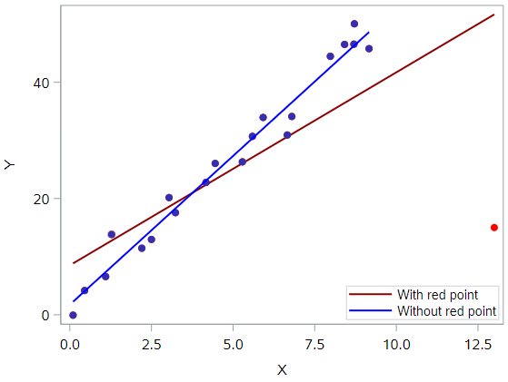

## Outliers, Leverage, and Influence

No discussion of model fit would be complete without a discussion of extreme data points. In regression analysis, we make a distinction between outliers and high leverage observations.

- An **outlier** is a data point whose response *y* does not follow the general trend of the rest of the data. In other words, this data point will have a large residual value.
- A data point has high **leverage** if it has "extreme" predictor *x* values. With a single predictor, an extreme *x* value is simply one that is particularly high or low with respect to the rest of the *x* values. With multiple predictors, extreme x values may be particularly high or low for one or more predictors, or may be "unusual" combinations of predictor values (e.g., with two predictors that are positively correlated, an unusual combination of predictor values might be a high value of one predictor paired with a low value of the other predictor).

Note that, for our purposes, we consider a data point to be an outlier *only if* it is extreme with respect to the other *y* values, not the *x* values.

Further, a data point is **influential** if it unduly influences any part of a regression analysis, such as the predicted responses, the estimated slope coefficients, or the hypothesis test results. Both outliers and high leverage data points have the *potential* to be influential, but we generally have to investigate further to determine whether or not they are actually influential.

One advantage of the case in which we have only one predictor is that we can look at simple scatter plots in order to identify any outliers and high leverage data points. In multiple regression, we will have to rely on regression diagnostic metrics to identify such points. Let's take a look at a few examples that should help to clarify the distinction between the two types of extreme values, and the relationship between these concepts and *influence*.

#### Example #1

Based on the definitions above, do you think the following data set contains any outliers? Or, any high leverage data points?


All of the data points follow the general trend of the rest of the data, so there are no outliers (in the *y* direction). And, none of the data points are extreme with respect to *x*, so there are no high leverage points. Overall, none of the data points would appear to be influential with respect to the location of the best fitting line.

#### Example #2

How about this example? Do you think the following data set contains any outliers? Or, any high leverage data points?


Of course! Because the red data point does not follow the general trend of the rest of the data, it would be considered an outlier. However, this point does not have an extreme *x* value, so it does not have high leverage. Is the red data point influential? An easy way to determine if the data point is influential is to find the best fitting line twice—once with the red data point included and once with the red data point excluded. The following plot illustrates the two best fitting lines:


It's hard to even tell the two estimated regression equations apart! The red line represents the estimated regression equation with the red data point included, while the blue line represents the estimated regression equation with the red data point excluded. The slopes of the two lines are very similar—5.04 and 5.12, respectively.

If I showed you the SAS `PROC REG` output for each line, you would see very minor differences between these models. For example:

* When the red data point in included, the $$R^2$$ values decreases slightly, but the relationship between *y* and *x* is still strong.

- The standard error of *b*1, which will be important for inference later, is larger when the red data point is included, but not in a way that changes any conclusions we would draw from these data.

In short, the regression model is not meaningfully affected by the inclusion of the red data point. Therefore, that data point is not deemed influential. In summary, the red data point is an outlier, but does not have high leverage, and is not influential.

#### Example #3

How about this example? Do you think the following data set contains any outliers? Or, any high leverage data points?


In this case, the red data point does follow the general trend of the rest of the data. Therefore, it is *not* deemed an outlier here. However, this point does have an extreme *x* value, so it does have high leverage. Is the red data point influential? It certainly appears to be far removed from the rest of the data (in the *x* direction), but is that sufficient to make the data point influential in this case?

The following plot illustrates two best fitting lines — one obtained when the red data point is included and one obtained when the red data point is excluded:


Again, it's hard to even tell the two estimated regression equations apart! The red line represents the estimated regression equation with the red data point included, while the blue line represents the estimated regression equation with the red data point excluded.

With respect to the model estimates and metrics, we see very few changes in the slope (4.927 v. 5.117, with and without red point, respectively), the $$R^2$$ (97.3% v. 97.7%), or the standard error of $$b_1$$.

In short, the data point is not deemed influential. In summary, the red data point is not influential, nor is it an outlier, but it does have high leverage.

#### Example #4

One last example! Do you think the following data set contains any outliers? Or, any high leverage data points?


In this case, the red data point is most certainly an outlier and has high leverage! The red data point does not follow the general trend of the rest of the data and it also has an extreme *x* value. And, in this case the red data point is influential. The two best fitting lines—one obtained when the red data point is included and one obtained when the red data point is excluded—look like this:



The are (not surprisingly) substantially different. The red line represents the estimated regression equation with the red data point included, while the blue line represents the estimated regression equation with the red data point excluded. The existence of the red data point significantly reduces the slope of the regression line—dropping it from 5.117 to 3.320—and the $$R^2$$ drops from 97.3% (without the red point) to 55.2% (with the red point).

So the regression model is clearly affected by the presence of the red data point. In this case, the red data point is deemed both high leverage and an outlier, and it turned out to be influential too.

#### Summary

The above examples—through the use of simple plots—have highlighted the distinction between outliers and high leverage data points. There were outliers in examples 2 and 4. There were high leverage data points in examples 3 and 4. However, only in example 4 did the data point that was both an outlier and a high leverage point turn out to be influential. That is, not every outlier or high leverage data point strongly influences the regression analysis. It is your job as a regression analyst to always determine if your regression analysis is unduly influenced by one or more data points.

This is easy to do for simple linear regression, when we can rely on simple scatterplots to elucidate matters. Unfortunately, we don't have that luxury in the case of multiple linear regression. In that situation, we have to rely on various measures to help us determine whether a data point is an outlier, high leverage, or both. Once we've identified such points we then need to see if the points are actually influential.

## Real data example

Now let's look at some real data for extreme data points. For this analysis, we will use a database of salaries for employees of the city of Virginia Beach.

```
* Initialize SAS session;
%include "~/my_shared_file_links/hammi002/sasprog/run_first.sas";

* Makes and checks a working copy of TEXTBOOKS data;
%use_data(va_beach);
%glimpse(va_beach);
```

In fact, we are going to look at salaries within one specific department, the Registrar's office, so let's make a new data with just that department's data:

```
* Extract data for registrars office;
data va_beach_grd;
	set va_beach;
	where dept = "GRD";
run;
```

Our hypothesis for this analysis is that an employee's length of employment in Virginia Beach is associated with a higher salary. Let's see, with a scatterplot, if this seems like an appropriate hypothesis:

```
* Scatterplot for SALARY by TOTALEXP;
proc sgplot data=va_beach_grd;
	scatter x=totalexp y=salary;
run;
```

Looks like a weak relationship, but there is some indication of a trend up in salary over time. Let's proceed.

And first, are there any data points in this plot that look to be outliers, per the definition of above? How about high leverage data points?

There is clearly one outlier. With a salary of nearly $140,000, this is definitely out of line from the rest of the data. If we draw a regression line to these data, that point is going to have a large residual, guaranteed.

And you might point out the right-most data point as one with high leverage. With over 25 years of experience, this employee has been with Virginia Beach for 10 years longer than the next longest tenured employee in the department. (We'll refer to this employee as the "department veteran".)

Before we run any regressions, it can be helpful to look at the data to see if we can learn anything about the outliers and leverage points.

```
* Print out dataset to check records;
proc print data=va_beach_grd;
run;
```

Based on this output, there is nothing necessarily special about the department veteran. He or she has just been around a long time. The outlier, however, is definitely in a different class of job. That high salary belongs to the Director of Elections. This is good to know. We'll revisit that shortly.

Now let's run three regressions:

1) All data
2) Without the director
3) Without the department veteran

```
* Run regression with all observations;
proc reg data=va_beach_grd;
	model salary = totalexp;
run;

* Run regression without director;
proc reg data=va_beach_grd;
	model salary = totalexp;
	where salary < 100000;
run;

* Run regression without department veteran;
proc reg data=va_beach_grd;
	model salary = totalexp;
	where totalexp < 25;
run;
```

Based on that output, fill out the following table:

| Regression Quantity      | All observations | Without director | Without veteran |
| ------------------------ | ---------------- | ---------------- | --------------- |
| Intercept estimate       |                  |                  |                 |
| Intercept standard error |                  |                  |                 |
| Slope estimate           |                  |                  |                 |
| Slope standard error     |                  |                  |                 |
| $$R^2$$                  |                  |                  |                 |

To assess influence, we're looking for things like:

* Did the $$R^2$$ increase substantially when the data point was removed?
* Did the magnitude of the parameter estimates change when the data point was removed?
* Did the standard errors of the parameter estimates reduce in size when the data point was removed?

Based on these questions, it seems clear that the data point associated with the director was influential (large jump in $$R^2$$, smaller standard errors for parameter estimates). It's less clear that the department veteran's data point was influential.

## Dealing with outliers

If we have determined that an influential observation is affecting the regression model in a way that potentially undermines the scientific merit of your model, what can you do about it?

The short answer is that there isn’t much you can do about it other than removing the outliers. As the statistical analyst, this is a decision you can make, but it’s crucial that you understand the ramifications of this decision and act in good scientific faith.

When removing influential data points, the questions you should ask yourself are:

- What is the justification for removing the data point(s)?
- How does the scope of inference change?

Anytime you are thinking about removing outliers, you should ask yourself what the justification is. “Because it improves my results” is not a good justification. Indeed, conscious ignorance of valid data is not intellectually honest, and has been the cause of more than a few retractions of previously published scientific papers. Be skeptical. The burden of proof is on you to make a strong argument as to why data should be omitted.

Second, you must consider how this changes the scope of inference. If you are studying countries, are you omitting only the poorest countries? If so, then your results no longer apply to all countries, just non-poor countries. Misunderstanding how the scope of inference changes can be a fatal flaw in your analysis.

#### Virginia Beach data

In the Virginia Beach data, we saw one influential data point (director) and one potentially influential data point (department veteran). Let's take these one at a time.

*What would be the justification and impact on removing the director's data?*

The justification may be that the Director of Elections is in an entirely different class of job from the other jobs in this department. If we knew more about how that job is filled, we may find out that it's not even really possible for someone in a lower lever job to ever expect to be able to move into that job, should it become vacant. Whereas the other jobs appear to be on a sort of ladder, with longer-tenured employees filling the senior staff-level jobs.

So if we remove this observation, it's possible that the scope of the inference actually becomes clearer. Our results would apply to non-director-level jobs in the registrar's office, which represent all the jobs in the office except one. 

An argument for *not* removing this observation would be that we are no longer describing all the jobs with the Virginia Beach government. If that's the goal, then keeping this observation in may be very important.

*What would be the justification and impact on removing the department veteran's data?*

Here, there really aren’t any good arguments as to why this should be done. First, the point is less clearly influential, so whether we include it or not, it won’t affect our conclusions much. More importantly, because this employee was just a regular employee, there is no reason to think that he somehow he or she doesn’t belong with the larger group of employees. If, hypothetically, there was something exceptional about this employee, then you could try and make the case on that basis. But there is nothing like that going on here, and so we have no scientific reason to exclude them.

## Summary

Observations can be extreme or unusual data points for a number of different reasons, not all of them in ways that matter. Statisticians must always be careful—and more importantly, transparent—when dealing with these extreme data point. Sometimes, a better model fit can be achieved by simply removing influential data points and re-fitting the model. However, one must have strong justification for doing this. A desire to have a higher $$R^2$$ is not a good enough reason!


You have successfully completed this tutorial.

# [< Back to Section 3](https://bghammill.github.io/ims-03-model/)


*Thanks to this [PSU](https://online.stat.psu.edu/stat462/node/170/) for the first half of the content above.*


<!-- MathJax -->

<script src="https://cdn.mathjax.org/mathjax/latest/MathJax.js?config=TeX-AMS-MML_HTMLorMML" type="text/javascript"></script>

