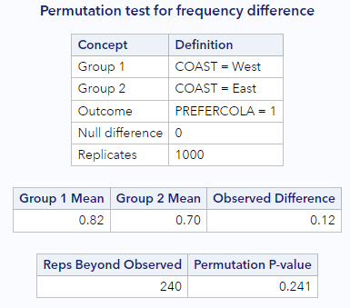

# Sampling variability

## What is statistical inference?

Statistical inference is _the process of making claims about a population based on information from a sample_ of data. 

Typically, the data represent only a small portion of the larger group which you'd like to summarize. For example, you might be interested in how a drug treats diabetes. Your interest is in how the drug treats all people with diabetes, not just the few dozen people in your study.

At first glance, the logic of statistical inference seems to be backwards, but as you become more familiar with the steps in the process, the logic will make much more sense.


Consider a situation where you are trying to convince your marketing director that people on the East Coast prefer cola versus orange soda at a different rate than people on the West Coast.

To make the argument, the first step is to assume that the two populations, East Coast people and West Coast people, prefer cola to orange soda at the same rate. Under this assumption, if you were to draw random samples from each population and ask them about their soda preference, *you would expect* the proportion who prefer cola to orange soda to be similar in both samples.

The second step in the process is to investigate data from actual samples of each population. What you're looking to see is if soda preferences in these samples looks different from what you would expect under the assumption made above. If it is, you can try and argue that the assumption is wrong.

Let's imagine we conduct a few different studies:

* In Study #1, we find that 60% of the East Coast sample and 58% of the West Coast sample prefers cola to orange soda. That's pretty similar, and might lead you to believe your assumption is correct.
* In Study #2, we find that 60% of the East Coast sample and 32% of the West Coast sample prefers cola to orange soda. That's quite different, and might lead you to believe your assumption is incorrect.

### Null & Alternative Hypotheses

At this point, it is important for you to know some new vocabulary to describe the previous setting.

The claim that is not interesting—that soda preference is the same on the two coasts—is called the *null hypothesis* and is denoted $$H_0$$ (pronounced "H-naught"). Null hypotheses always include some statement of equality.

The claim that corresponds to the research hypothesis—that people on the East Coast prefer cola at a higher rate than those on the West Coast— is called the *alternative hypothesis* and is denoted by $$H_A$$ (pronounced "H-A"). (You may also see this listed as $$H_1$$.) Alternative hypotheses are statements of difference and typically represent what you hope to show.

Note that it is almost always the case that the *goal is to disprove the null hypothesis and claim that the alternative hypothesis is true.*

When you write out null and alternative hypotheses, write them in terms of involve parameters about a population. Let's do this for the hypotheses described above. We will let $$\pi_W$$ represent the true proportion of the West Coast population that prefers cola, and let $$\pi_E$$ represent the true proportion of the East Coast population that prefers cola.

Our null hypothesis would be $$H_0: \pi_W = \pi_E$$. If we rearrange things, we can also write this as $$H_0: \pi_W - \pi_E = 0$$.

Our null hypothesis would be $$H_0: \pi_W \neq \pi_E$$. If we rearrange things, we can also write this as $$H_0: \pi_W - \pi_E \neq 0$$.

**<u>Example: Cheetah speed</u>**

Suppose you're conducting research to compare the average running speed of two different subspecies of cheetahs, Asian & African.

The *null hypothesis* is that Asian and African cheetahs run at the same speed, on average.

The *alternative hypothesis* is that African cheetahs are faster than Asian cheetahs, on average.

**<u>Example: Election</u>**

Or consider a dataset collected to measure whether, in an election, Candidate X will win the popular vote. The number of interest is the true proportion of votes that Candidate X will receive. That number is *a population measure.*

The *null hypothesis* is that candidate X will get half the votes in the population.

The *alternative hypothesis* is that candidate X will get more than half the votes in the population, that is, will win the election.

## Understanding the null distribution

The idea behind statistical inference is to imagine that we:

1. Take many samples from our hypothetical population where the null hypothesis is true,
2. Summarize each of these null samples by calculating one statistic from each sample, and
3. Look at the distribution of these statistics from the null population, to see if our observed data are inconsistent with the null hypothesis.

Through randomization, we can actually make this happen with data we have. Continuing with the example from above, we will create *null samples* from our data by randomly shuffling the soda preference values among the observations so there is no dependency on location. 

We will then summarize each of these null samples by calculating the difference in the proportion of West Coast people who prefer cola as compared with the proportion of East Coast people who prefer cola, $$\Delta = p_W - p_E$$, where each of the sample proportions is denoted $$p_W$$ or $$p_E$$. 

This $$\Delta$$ will change with each sample and, if we do this enough times, will eventually yield a distribution of differences, the *null distribution*, that we can summarize with a histogram or other summary statistics.

**<u>Data example</u>**

Suppose our original data included 100 people, 50 from the West Coast and 50 from the East Coast and that the observed data looked like:

| Preference | West Coast (n = 50) | East Coast (n = 50) |
| ---------- | ------------------- | ------------------- |
| Cola       | 41 (82%)            | 35 (70%)            |
| Orange     | 9 (18%)             | 15 (30%)            |

This gives us observed sample proportions of $$p_W = 0.82$$ for the West Coast and $$p_E = 0.70$$ for the East Coast, for a difference of $$p_W - p_E = 0.12$$. Note that the overall proportion of those preferring cola over orange soda was 0.76. 

Run the data yourself, so you can see that this is true:

```
* Initialize things if you have not done this already during this SAS session;
%include "~/my_shared_file_links/hammi002/sasprog/run-first.sas";

* Make a copy of the SODA dataset and check;
%use_data(soda);
%glimpse(soda);

* Show observed preferences;
proc freq data=soda;
	tables coast * prefercola / nocol nopct;
run;
```

Now we randomize. My first 5 null samples looked like this:

*First null sample, $$\Delta = 0.00$$*

Right away we get a sample where the proportions are equal for each coast.

| Preference | West Coast (n = 50) | East Coast (n = 50) |
| ---------- | ------------------- | ------------------- |
| Cola       | 38 (76%)            | 38 (76%)            |
| Orange     | 12 (24%)            | 12 (24%)            |

*Second null sample, $$\Delta = 0.12$$*

In this sample, the data match our observed data.

| Preference | West Coast (n = 50) | East Coast (n = 50) |
| ---------- | ------------------- | ------------------- |
| Cola       | 41 (82%)            | 35 (70%)            |
| Orange     | 9 (18%)             | 15 (30%)            |

*Third null sample, $$\Delta = -0.04$$*

In this sample, the East Coast actually shows a higher proportion of favoring cola.

| Preference | West Coast (n = 50) | East Coast (n = 50) |
| ---------- | ------------------- | ------------------- |
| Cola       | 37 (74%)            | 39 (78%)            |
| Orange     | 13 (26%)            | 11 (22%)            |

*Fourth null sample, $$\Delta = 0.20$$*

Now we get a $$\Delta$$ that is *greater* than what we observed in our sample.

| Preference | West Coast (n = 50) | East Coast (n = 50) |
| ---------- | ------------------- | ------------------- |
| Cola       | 43 (86%)            | 33 (66%)            |
| Orange     | 7 (14%)             | 17 (34%)            |

*Fifth null sample, $$\Delta = 0.04$$*

And here we see a difference that is between equal proportions and what we actually observed.

| Preference | West Coast (n = 50) | East Coast (n = 50) |
| ---------- | ------------------- | ------------------- |
| Cola       | 39 (78%)            | 37 (74%)            |
| Orange     | 11 (22%)            | 13 (26%)            |

We can plot these if we want, but, with only 5 null samples, it isn't terribly informative yet.


Each null sample's difference is represented by a dot, the solid red line is our observed difference, and the dotted red line is the negative value of the observed difference. This will be important later, as we try and figure out which null samples yields differences that *were more extreme* than the observed difference. Because we didn't indicate a specific direction in our null hypothesis, we need to look for more extreme values in both directions from the null value. 

<u>Key point</u>: This idea of looking in both directions away from the null value is very typical in statistical analysis. Directional hypotheses—for example, $$H_0: \pi_W \geq \pi_E$$, $$H_A: \pi_W < \pi_E$$— are certainly allowed, but not that common.

Before we continue, you should run some of your own null samples.

```
* Load randomization macros;
%include "~/my_shared_file_links/hammi002/sasprog/load-randomization.sas";

* Run this a few times to see different null sample results;
%permute_once(ds = soda, groupvar = coast, compvar = prefercola, useproc = freq);
%permute_once(ds = soda, groupvar = coast, compvar = prefercola, useproc = freq);
%permute_once(ds = soda, groupvar = coast, compvar = prefercola, useproc = freq);
```

That first statement loads a macro to perform called %permute_once that allows you to generate a single permutation (null sample) of your observed data. SAS doesn't really have a standard way to generate null samples, so we needed a custom macro to do it. If you want to see how that macro works, just open up that program and take a look.

When we use that macro, we need to specify:

* GROUPVAR as the variable name that defines the groups to compare
* COMPVAR as the variable name that defines the comparison (outcome) variable
* USEPROC as either "freq" to request a GROUPVAR * COMPVAR contingency table or "means" to request means of COMPVAR for each level of GROUPVAR.

So the second set of statements just runs the %permute_once macro 3 times. What kinds of differences did you see?

Here are results for the first 50 null samples I produced:


Generally, the simulated null differences are between -0.2 and 0.2, and about 20% of the differences are as or more extreme than the observed difference of 0.12. To get a true sense of the degree of variability under the null hypothesis, it is necessary to permute this dataset many more times than 50.

### Randomization distribution

By repeating the permutation process 1000 times, the true distribution of the null differences starts to appear. We see that the null differences range from approximately -0.3 to +0.3, although the majority of the differences are between -0.1 and 0.1. On this histogram, the observed data difference of 0.12 doesn't seem *too* extreme, does it?


You should try and run 1000 samples, using the code below.

```
* Run 1000 null samples;
%permute_freq(
	ds = soda,
	groupvar = coast,
	g1value = West,
	g2value = East,
	compvar = prefercola,
	cvalue = 1,
	reps = 1000
);
```

Does your histogram look like the above? What shape does the curve have? When we run multiple permutations, we typically want to run at least 1000 null samples, so we can really understand the shape of this distribution.

Unlike the previous SAS macro, the macro in the code block above, will produce as many null samples as you'd like. There are a few additional options here:

* G1VALUE is the value of the group variable (GROUPVAR) that represents the first group. This macro assumes we're only interested in 2 groups, which will usually be true.
* G2VALUE is the value of the group variable that represents the second group. This group will act as the reference group.
* CVALUE is the value of the comparison variable (COMPVAR) that we are interested in summarizing. In our data 1 = Yes, which is what we're after. For all 3 of these variables, you must enter the value exactly as it is stored in the variable. So while we might have a format on PREFERCOLA to indicate that a value of 1 indicates a value of Yes, we need to use the unformatted value, 1, in this macro call.

By the way, if you look below the histogram on the output, you should see:

* A summary of the observed data
* Information about how many null samples were as or more extreme than the observed data

## Using the randomization distribution

Recall that the logic of statistical inference is to compare the observed statistic to the distribution of statistics that come from a null distribution. You've now seen how to create that null distribution with your own SAS code. The next question to ask is: **How do we use the information in the null distribution?**

Remember that each observation that appears in the histogram is from a different permutation of the data. We use the null differences to define the scenario that we are not interested in. Because, again, the goal is to show that our observed data *are not consistent* with these null differences. We want our observed data to be different from so that we can claim the alternative hypothesis to be true.

Recall that our observed statistic—the difference in the % who prefer cola between the West Coast and the East Coast—was 0.12 or 12%. On the histogram above, the values that are more extreme than our observed statistic, are to the right of the solid line and to the left of the dotted line. We can see that about 20% of the null statistics are as or more extreme than what we observed.

To be more precise, just look at the data table below the histogram.



At the bottom, we can see that SAS counted the number of times the null data were more extreme than the observed data for us. It happened 240 of 1000 times, or 24.1% of the time (when we include the observed data in the calculation). This percentage tells us that our observed difference of 0.12 is not that extreme. The null distribution, then, gives us evidence that our observed data are consistent with the null distribution. We have no evidence that rates of cola preference differ by coast.

Consider how different the story would have been if our observed sample difference was 0.28. Based on the histogram of null differences, there are only a handful of null statistics more extreme than 0.28 in the null distribution. Let's assume it happened 2% or 3% of the time. That means that our observed sample difference was really rare, and would have been evidence that out observe data were *inconsistent* with the null distribution. Meaning, we could more easily say that it was evidence of a difference in cola preference by coast.

We'll discuss how to make better conclusions based on these %s in the next lesson.


You have successfully completed this tutorial.

# [< Back to Section 4](https://bghammill.github.io/ims-04-foundations/)


- <!-- MathJax -->

<script src="https://cdn.mathjax.org/mathjax/latest/MathJax.js?config=TeX-AMS-MML_HTMLorMML" type="text/javascript"></script>

