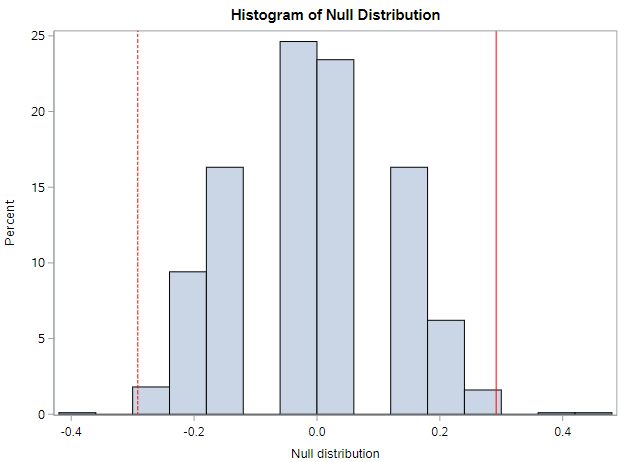
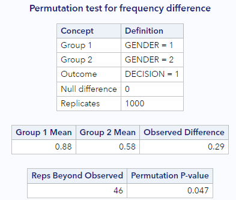

*Note: I'm going to confuse you in this lesson by flipping between "Randomization" and "Permutation". For our purposes, they are the same thing.*

# Randomization test

The example in this lesson is taken from a paper on the _“Influence of sex role stereotypes on personnel decisions”_ by Rosen and Jerdee, 1974.

```
* Initialize this SAS session;
%include "~/my_shared_file_links/hammi002/sasprog/run_first.sas";

* Makes a working copy of PROMOTION data and check;
%use_data(promotion);
%glimpse(promotion);
```

Forty-eight male bank supervisors were given personnel files and asked to judge whether the person should be promoted to a branch manager position. The files were all identical except that *half of them* indicated that the candidate was *male* and *the other half* indicated that the candidate was *female*.

The data were then collected showing that 14 out of the 24 female files were selected for promotion and 21 of the 24 male files were selected for promotion. 

Let's confirm those findings:

```
* Observed promotion decisions by gender;
proc freq data=promotion;
	tables gender * decision / nocol nopct;
run;
```

The difference in promotion decisions by gender is more easily seen using rates. You can see in the output from about that 58.3% of the women were promoted whereas 87.5% of the men were promoted, for a difference of 0.29. The important statistical question to ask after looking at the data is as follows: *is it plausible to observe such a difference in proportions in a scenario where men and women are equally likely to be promoted?*

Just as in the last lesson, we'll rely on a custom SAS macro to answer this question. Let's load those macros now:

```
* Load randomization macros;
%include "~/my_shared_file_links/hammi002/sasprog/load-randomization.sas";
```


### Random chance?

Just as we did before, let's first set up our hypotheses.

$$H_0: \pi_{Men} - \pi_{Women} = 0$$

$$H_A: \pi_{Men} - \pi_{Women} \neq 0$$

Remember, statements of equality appear in the null hypothesis. Under this hypothesis, gender and promotion are not linked in any way, and we would expect the promotion rates to be similar. But sampling variability exists, so we should expect that some null samples will show women getting promoted more and some null samples will show men getting promoted more. We just need to determine the shape and spread of the distribution of null differences.

That is to say, if we shuffle the data so that gender and promotion are not linked in any way, what sort of chance differences are observed? 

If I shuffle the data once, I get $$\Delta = 0.125$$

| Preference   | Male (n = 24) | Female (n = 24) |
| ------------ | ------------- | --------------- |
| Promoted     | 19 (79.2%)    | 16 (66.7%)      |
| Not promoted | 5 (20.8%)     | 8 (33.3%)       |

What do you get?

```
* Run one permutation;
%permute_once(ds = promotion, groupvar = gender, compvar = decision, useproc = freq);
```

Keep in mind that a fixed number of male and female resumes were given out, 24 of each. Additionally, we assume that there were a fixed number of people allowed to be promoted, here 35. However, the shuffling process breaks the relationship between gender and promotion decision, which allows us to understand the variability of the differences in promotion rates assuming there is no connection between the two variables.

Even though here gender doesn't play a role in determining promotion, we still typically don't have a difference of zero. That's because of the natural variability associated with which manager gets which file. But the point of the randomization process is to identify how different the proportions can be naturally and, on the other hand, how big a difference would have to be to make us think something unusual was going on.

By shuffling the promotion variable repeatedly, not only do we see the variability in the null differences, but we also see that the observed statistic of 0.29 is on the extreme end of the plausible values generated by natural variability. Look at this histogram of the differences from 1000 null samples:



Ignore the chunkiness of the histogram. That's due to the relative small sample sizes. Do you see the same general shape if you generate 1000 null samples?

```
* Run 1000 null samples;
%permute_freq(
	ds = promotion,
	groupvar = gender,
	g1value = 1,
	g2value = 2,
	compvar = decision,	
	cvalue = 1,
	reps = 1000
);
```

And do you also see that something like 4.7% of these null samples generate a difference that was as or ore extreme than our observed data?




## Distribution of statistics

As a side note, we specified our research hypotheses above in term of differences in proportions (compared to 0, for no difference). Accordingly, we also calculated our observed and null statistics as differences in proportions.

But there isn't anything magical about differences in proportions. We could also have used ratios of proportions (compared to 1, for no difference). Such hypotheses would be specified as:

$$H_0: \frac{\pi_{Men}}{\pi_{Women}} = 1$$

$$H_A: \frac{\pi_{Men}}{\pi_{Women}} \neq 1$$

And we would shuffle the outcomes among the observations and calculate, essentially, risk ratios. The extreme-ness of our observed data should still be evident.

See if this ratio-based randomization macro works for you (still kind of testing...):

```
* Run 1000 null samples, with ratio statistics;
%permute_ratio(
	ds = promotion,
	groupvar = gender,
	g1value = 1,
	g2value = 2,
	compvar = decision,	
	cvalue = 1,
	reps = 1000
);
```

I get a similar proportion of null differences that are as or more extreme whether I use ratios of proportions of differences of proportions.

You'll note that two figures are generated by the %permute_ratio macro. The second one shows the histogram of the logged values. This one should look more bell-shaped to you than the histogram of the risk ratios themselves.

Anyway, back to looking at differences.

## P-values

A p-value is the _probability of observing data as or more extreme than what we actually got, assuming the null hypothesis is true_.

This is exactly what we have been talking about already. In our example (using my output from the table just above), the proportion of null differences that were as or more extreme than our observed difference was 0.047. That's also the p-value! Interpreted... we would say that the p-value of 0.047 is the _probability of observing a difference of 0.2917 or larger, in either direction, assuming that promotion rates do not vary across gender_.

In short, a p-value measures the degree of disagreement between the observed data and the null hypothesis. We'll talk about how we can use a p-value to draw specific conclusions later.

Let's look at a few properties of p-values.

### Effect of sample size on p-values

There are two additional datasets available that vary from the original on sample size:

* PROMOTION_SMALL has only 32 records total, 16 males and 16 females. The difference in promotion rates in this sample is 0.25. It's not the same as before (actually smaller), but should be close enough to demonstrate the effect of sample size on p-values.
* PROMOTION_LARGE has 96 records total, 48 males and 48 females. The difference in promotion rates in this sample is the same as in the original sample, 0.29.

Go ahead and run the randomization test for both of these samples:

```
* Makes a working copy of PROMOTION_SMALL and PROMOTION_LARGE;
%use_data(promotion_small);
%use_data(promotion_large);

* Run 1000 null samples for PROMOTION_SMALL;
%permute_freq(
	ds = promotion_small,
	groupvar = gender,
	g1value = 1,
	g2value = 2,
	compvar = decision,	
	cvalue = 1,
	reps = 1000
);

* Run 1000 null samples for PROMOTION_LARGE;
%permute_freq(
	ds = promotion_large,
	groupvar = gender,
	g1value = 1,
	g2value = 2,
	compvar = decision,	
	cvalue = 1,
	reps = 1000
);
```

What p-value do you get for the smaller sample size? How about the larger sample size? Remember that our original p-value was something near 0.035.

If your results were anything like mine, you should have seem something like the following:

| Dataset                        | p-value for difference |
| ------------------------------ | ---------------------- |
| Original size (PROMOTION)      | 0.047                  |
| Smaller size (PROMOTION_SMALL) | 0.221                  |
| Larger size (PROMOTION_LARGE)  | 0.002                  |

Remember that the observed differences in each case were the same or very similar. So we get very different p-values and would make very different conclusions based on sample size alone.  I'd summarize what we're seeing as:

* For a given observed difference, reducing the sample size will yield a larger p-value (more consistent with the null hypothesis)
* For a given observed difference, increasing the sample size will yield a smaller p-value (less consistent with the null hypothesis)

These are great points to remember. We'll see this happen for the rest of the semester.

### Effect of observed difference on p-values

There are two MORE datasets available that vary from the original on the observed difference:

* PROMOTION_WEAK has 48 records, 24 males and 24 females, just like the original dataset. But the difference in promotion rates in this sample is only 0.08, which is smaller than in the original dataset.
* PROMOTION_STRONG also has 48 records, 24 males and 24 females, but the difference in promotion rates in this sample is 0.50 (50%!), which is a much bigger difference than in the original dataset.

Go ahead and run the randomization test for both of these samples:

```
* Makes a working copy of PROMOTION_WEAK and PROMOTION_STRONG;
%use_data(promotion_weak);
%use_data(promotion_strong);

* Run 1000 null samples for PROMOTION_WEAK;
%permute_freq(
	ds = promotion_weak,
	groupvar = gender,
	g1value = 1,
	g2value = 2,
	compvar = decision,	
	cvalue = 1,
	reps = 1000
);

* Run 1000 null samples for PROMOTION_STRONG;
%permute_freq(
	ds = promotion_strong,
	groupvar = gender,
	g1value = 1,
	g2value = 2,
	compvar = decision,	
	cvalue = 1,
	reps = 1000
);
```

What p-value do you get for the weaker difference? How about the stronger difference? Again, our original p-value was something near 0.047.

If your results were anything like mine, you should have seem something like the following:

| Dataset                                        | p-value for difference |
| ---------------------------------------------- | ---------------------- |
| $$\Delta = 0.29$$ (PROMOTION)                  | 0.047                  |
| $$\Delta = 0.08$$, weaker (PROMOTION_WEAK)     | 0.742                  |
| $$\Delta = 0.50$$, stronger (PROMOTION_STRONG) | 0.003                  |

Remember here that the sample sizes in each case were the same. So we get very different p-values and would make very different conclusions based on the effect size alone.  I'd summarize what we're seeing as:

* For a given sample size, having a weaker effect (smaller observed difference) will yield a larger p-value (more consistent with the null hypothesis)
* For a given sample size, having a stronger effect (larger observed difference) will yield a smaller p-value (less consistent with the null hypothesis)

Again, great points to remember. 

### Calculating one-sided p-values

What if the original research hypothesis had focused on a *directional* difference in promotion rates between men and women instead of focusing on *any* difference? For example, what if we were only interested in whether or not men were *more likely* to be promoted than women? In this case, we would only be interested in the number of null differences in *one* of the tails of the histogram of null differences, not both.

The hypotheses would be:

$$H_0: \pi_{Men} - \pi_{Women} \leq 0$$

$$H_A: \pi_{Men} - \pi_{Women} > 0$$

If you run this analysis, you will get, in general, a p-value that is about half of the two-sided p-value. (Sorry, we haven't talked about that yet. Because we have been looking in both directions for a difference, we have been calculating two-sided p-values.) 

Rerun the original randomization analysis, and look at the very bottom of the output for the 1-sided p-values.

```
* Run 1000 null samples;
%permute_freq(
	ds = promotion,
	groupvar = gender,
	g1value = 1,
	g2value = 2,
	compvar = decision,	
	cvalue = 1,
	reps = 1000
);
```

It's the "upper" tail that tells us how many null differences were larger (only, not smaller, of any magnitude) than our observed difference. My 1-sided upper p-value was .024, which is about half of the two-sided p-value I got.

By the way, now's a good time to mention that you should feel free to run 5,000 or 10,000 randomization samples. We're dealing with very small number of records in the tails. More samples will give us more confidence of the true size of the tail in cases like this where the observed data are somewhat extreme.

Go ahead and run 10,000 null samples!

```
* Run 1000 null samples;
%permute_freq(
	ds = promotion,
	groupvar = gender,
	g1value = 1,
	g2value = 2,
	compvar = decision,	
	cvalue = 1,
	reps = 10000
);
```


That's it for now...


You have successfully completed this tutorial.

# [< Back to Section 4](https://bghammill.github.io/ims-04-foundations/)


<!-- MathJax -->

<script src="https://cdn.mathjax.org/mathjax/latest/MathJax.js?config=TeX-AMS-MML_HTMLorMML" type="text/javascript"></script>

