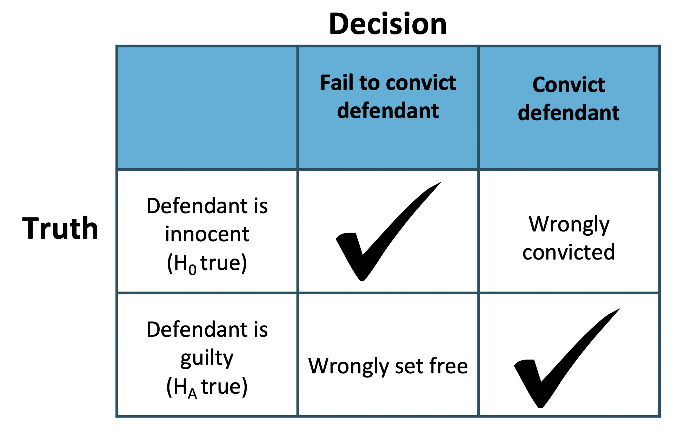

# Worked example

In this lesson, we'll look at data from a study on opportunity cost from Frederick et al. The researchers investigated whether reminding students about saving money would make it less likely for them to spend money on a DVD. Let's load the data first, then talk about the study:

```
* Initialize this SAS session;
%include "~/my_shared_file_links/hammi002/sasprog/run_first.sas";

* Makes a working copy of DVD data and check;
%use_data(dvd);
%glimpse(dvd);
```

In this study, 150 students were randomly assigned to a control or treatment group with different instructions. The 75 students assigned to the control group were presented with two options: (a) buy the DVD, or (b) do not buy the DVD. The 75 students assigned to the treatment group were presented with slightly different options: (a) buy the DVD, or (b) do not buy the DVD, while being reminded that the money could also be saved.

Let's walk through this analysis step by step.

### State hypotheses

Before we look at the data, let's state the research hypotheses. In words, the null hypothesis is that the two sets of choices don't impact buying habits; while the research, or alternative, hypothesis is that, in this setting, a reminder might make people buy the DVD at a different rate. Or...

* $$H_0$$: Reminding students that they can save money for later purchases will not have any impact on students' spending decisions.
* $$H_A$$: Reminding students that they can save money for later purchases will *change* the chance they will continue with a purchase.

In order to formally state our hypotheses, let's answer the following questions:

* What type of parameters are involved? We are interested in proportions (of students in each group buying the DVD). Population proportions are denoted by $$\pi$$.
* How many parameters are involved? Since we have two groups being compared, there are two parameters. Let's label those as "T" for the treatment group and "C" for the control group.
* What is the nature of the difference being hypothesized, directional or non-directional? In this case, there is no interest in directionality, and we will have a 2-sided test of no difference.

So the formal hypotheses would be:

$$H_0: \pi_T - \pi_C = 0$$

$$H_A: \pi_T - \pi_C \neq 0$$

### Observed results

Now we get to look at our data to see the observed results and calculate our statistic that will be compared to the null distribution.

```
* Look at DVD purchase rates by group;
proc freq data=dvd;
	tables group * buydvd / nocol nopct;
run;
```

Of the 75 students assigned to the control group, 56, or about 75%, bought the DVD. Of the 75 students assigned to the treatment group, 41, or about 55%, bought the DVD. Our observed statistic ($$p_T - p_C$$) is -0.20. 

### Generate the null distribution

As before, you will use a null distribution to determine whether the difference of -20% could be attributed to random variability. We're going to generate 10,000 null samples.

```
* Run 1000 null samples;
%permute_freq(
	ds = dvd,
	groupvar = group,
	g1value = Treatment,
	g2value = Control,
	compvar = buydvd,	
	cvalue = 1,
	reps = 10000
);
```

Based on the resulting histogram alone, does it look like our observed data are consistent or inconsistent with the null hypothesis? In order to quantify things, we are going to look to the p-value and the critical regions. (Typically, you would only do one of these things, but we are doing both to demonstrate how you will arrive at the same answer regardless of the method you choose to use to establish statistical significance.)


### Statistical significance, using p-value

Now go find the appropriate p-value in your output. Remember that this is a 2-sided test. What did you get? My p-value was 0.017.

Remember that this p-value represents the proportion of null differences with a magnitude larger (in either direction) than our observed statistic of -0.20. In my output, only 171 null differences were that large, which is why the p-value is so small.

In order to call something statistically significant, let's compare that p-value to 0.05. Since it's smaller, that is a strong indication that the observed data are inconsistent with the null hypothesis.  We should reject the null claim and conclude that financial advice does affect the likelihood of purchase.

### Statistical significance, using critical regions

Again, go back to your output and find the 5% critical region defined by the 2.5% and 97.5% quantiles. For me, those quantiles are -0.15 and +0.15, meaning 5% of the null differences have a (positive or negative) magnitude greater than or equal to 0.15. 

Does our difference of -0.20 fall into one of those tail critical regions. Yes! Again, this is a strong indication that the observed data are inconsistent with the null hypothesis. And just as above with the p-value method, we should reject the null claim and conclude that financial advice does affect the likelihood of purchase.

### Conclusions

<u>Significance</u>: Whether you use a p-value or the critical region method, the difference in observed proportions is not consistent with the null hypothesis. We conclude that it was not simply random variability that led to fewer students buying the DVD when being reminded to save.

<u>Causation</u>: Because the study was randomized, that is, the individuals were randomly assigned the choices, there was nothing systematically different about the participants in the treatment and control groups. The only difference in the two groups was the set of options they received. Therefore, any difference in DVD buying rates is due to the options given, that is, being reminded to save. A causal inference can be made in this setting.

<u>Generalizability</u>: The 150 individuals in the sample were not randomly sampled. Indeed, they were said to be students. Students are certainly different from the adult population in many ways. This study is not going to generalize very widely, if at all.

## Errors and their consequences

From the null distribution that you just created, it seems that reminding students to save does have a causal impact on the likelihood that they will buy a DVD. That's because the observed difference is not consistent with the null differences.  [Remember, we are only allowed to make a causal claim because the DVD study was an **experiment** where the explanatory variable was assigned randomly by the researcher, so the resulting differences must be due to the questions asked and not any other confounding variables.]

But what is the consequence of concluding that a reminder causes students to be less likely to buy DVDs? What if our conclusion is wrong? Before completing the hypothesis test, it is important to understand how and why things can go wrong with statistical inference.

### Errors in hypothesis testing

Notice that there are two possible decisions to make in hypothesis testing. Either the observed data are inconsistent with the null hypothesis, in which case the null hypothesis is rejected. Or the observed data are consistent with the null hypothesis, in which case the null hypothesis is not rejected and no conclusion is made about a larger population.


There are also two possible “truth” states: either the null hypothesis is true or the alternative hypothesis is true. *Keep in mind, however, that we can't ever know the true state of the population*.

Because the research statement is almost always the same as the alternative hypothesis, the goal of the scientific study is to be in the bottom box where the alternative hypothesis is true and the data provide convincing evidence to reject the null hypothesis. However, any of the other three boxes are also possible. We cannot know which row has resulted, but we do know which conclusion has been made, thereby specifying the column.

Which is to say, if the null hypothesis is rejected, then either the science is correct or a Type I error has been made. If the null hypothesis is not rejected, it has either been done so correctly or a Type II error has been made.

Recall that the decision being made controls the Type I error rate, that is the false positive rate, at, for example, 0.05, for both mathematical and historical reasons.

### Errors in US judicial system




The logic of hypothesis testing shares many key elements with the US judicial system. The jury does not know whether the defendant committed the crime, but they must decide whether or not to convict the individual. The jury is presented with evidence, akin to data, and asked whether the evidence is consistent with innocence. If the evidence is outside of what would be expected, the defendant is convicted of a crime.

Here's a question... what decision should jurors make if the goal is to never make a Type II error (false negative, setting a criminal free)? Perversely, it's to convict everybody. In that situation, they would only ever be committing Type I errors. But that means they would be wrongly convicting some people in order to never let a true criminal go free, which is a different kind of problem.

This is the type of balance that hypothesis testing, in general, has to strike and why 5% has typically been used in science as an "acceptable" rate of Type I errors.


observed statistic, `diff_obs`, are available in your workspace.

Use `opp_perm` to compute the two-sided p-value, or twice the proportion of permuted differences that are less than or equal to the original difference.

```
# Calculate the two-sided p-value
opp_perm %>%
  summarize(p_value = ___)
```

<div id="opportunity_costs-hint">
**Hint:** This should be double what you calculated as one-tailed p-value before.
</div>

```
# Calculate the two-sided p-value
opp_perm %>%
  summarize(p_value = 2 * mean(stat <= diff_obs))
```

Great work! Take a moment to remind yourself why you used the proportion of permuted statistics that are smaller than (instead of bigger than) the observed value. Hint: Look at the histogram of permuted statistics.


You have successfully completed this tutorial.

# [< Back to Section 4](https://bghammill.github.io/ims-04-foundations/)


<!-- MathJax -->

<script src="https://cdn.mathjax.org/mathjax/latest/MathJax.js?config=TeX-AMS-MML_HTMLorMML" type="text/javascript"></script>

