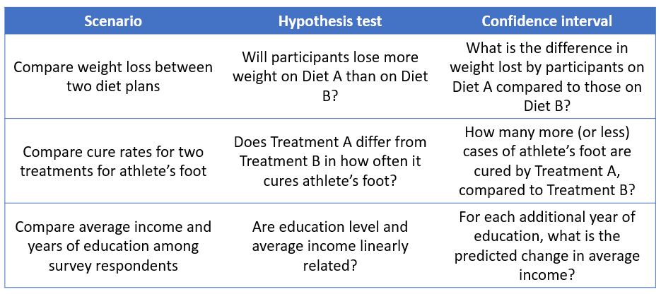
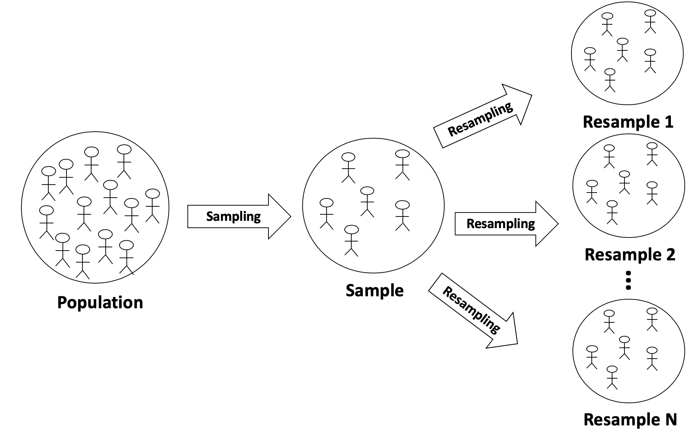
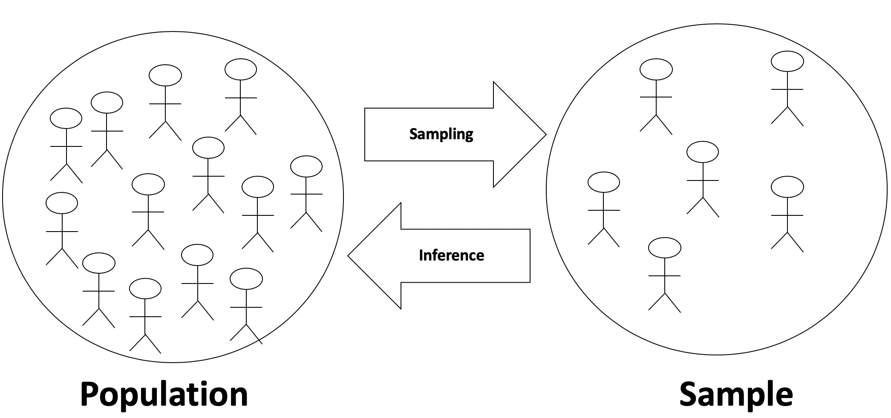
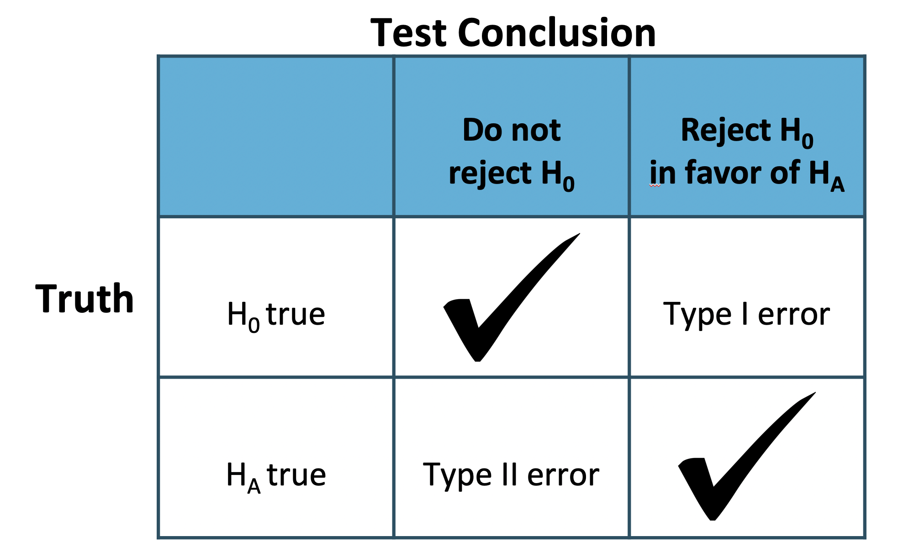
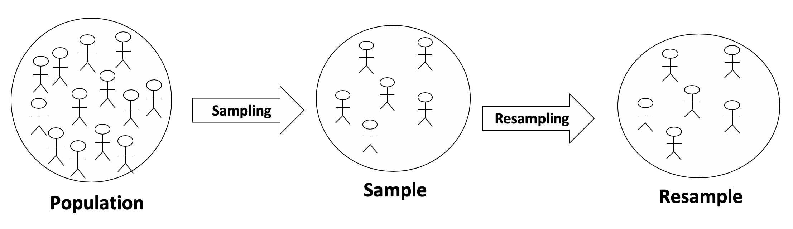

## Parameters and confidence intervals

Remember that once we have calculated a statistic from our data, we need to figure out a way to convey our uncertainty about that statistic—uncertainty due to sampling variability.

Until now, the way that we have managed this uncertainty was to perform hypothesis testing. By using randomization distributions, we were able to make a Yes/No decision regarding the point estimate derived from the observed data. Specifically, is that point estimate consistent or inconsistent with a specified null hypothesis?

Some people might see that methodology as somewhat limiting. Hypothesis testing only allows us choose between two prespecified hypotheses. Another approach to dealing with uncertainty might be to ignore the idea of a null value and null hypothesis and instead convey a range of plausible values that are consistent with our observed data. This is called a confidence interval. 

Both hypothesis testing and confidence intervals can be applied to the same data scenario. See some examples in the table below.



For example, in the first scenario, “Will participants lose more weight on Diet A than on Diet B?” is a Yes/No question that is best answered using a hypothesis test. Compare that to the question, "What is the difference in weight lost by participants on Diet A compared to those on Diet B?", which is asking for a quantification of the effect. This is where we would use confidence intervals.

The questions for the other two scenarios are similar to these. "Does Treatment A differ..." and "Are education level and income linearly related?" are both Yes/No questions, for which we would use hypothesis tests, while "How many more...?" and "...what is the change...?" are both questions looking for actual values as answers, for which we would use confidence intervals.

Recall that a parameter is a _numerical value from the population_. So in the first example above, the parameter is the true difference in mean weight loss among dieters on one diet compared to diets on the other diet. In the second example, the parameter is the difference in the proportion of athlete's foot cases cured by the different treatments. And the last parameter is the change in average income of all individuals in the population when increasing education by one year.

While you have already learned how to calculate point estimates for these types of differences from a sample of data, we need to calculate and report **confidence intervals** as a range of numbers that hopefully captures the true parameter value of interest. For example, at the end of the lesson, we'll be able to make conclusions along the lines of “We are 95% confident that Diet A leads to weight loss that is between 2.4 to 4.3 pounds higher than Diet B.”

## Bootstrapping


With hypothesis testing, it is important to understand how samples from a null population vary. By repeatedly sample from a null population, we get a sense for the variability of our statistic under the random chance model.

In contrast, with confidence intervals, we do not need to worry about a null population. We are simply interested in how the estimate itself would vary among many different samples from the population.  

But how do we do this when we only have data from a single sample? **Bootstrapping**. Bootstrapping is a method that allows us to estimate the variability of a statistic by repeatedly re-sampling *from our sample data*.



Each time we resample, the data are sampled from the original data with replacement. It turns out that the process of resampling from the original sample is an excellent approximation for sampling from a population!

We will denote bootstrapped statistics using a superscript \*. For example, we refer to the population parameter for a proportion as $$\pi$$ and the sample statistic for a proportion as $$p$$, so we will refer to a bootstrapped statistic for a proportion as $$p^*$$, which is the proportion of successes in a single resample.

### The bootstrapping method

The method of bootstrapping is fairly simple to implement:

* First, you compute the statistic of interest from the original data
* Second, you generate a large number (typically 5,000 or 10,000) of re-samples from the observed sample data. This re-sampling is to be done *with replacement*, meaning some of the observations from your sample may get selected multiple times for a particular re-sample, while other observations from your sample may not get selected at all. (Sampling done without replacement would yield identical re-samples to the original dataset every time.) Each re-sample should have the same number of records as your observed sample data.
* Third, within each re-sample, re-estimate the statistic of interest. This will yield a distribution of plausible values based on your original data.
* Fourth, using this bootstrap distribution, compute an estimate of the confidence interval.

That's pretty much it. Let's walk through an an example.

### Data example

For this analysis we are going to look at birthweight of infants in the BABIES dataset:

```
* Initialize this SAS session;
%include "~/my_shared_file_links/hammi002/sasprog/run_first.sas";

* Makes a working copy of BABIES data and check;
%use_data(babies);
%glimpse(babies);
```

Suppose we want to estimate and provide an estimate of uncertainty for how different the birthweight of infants born to mothers who smoked was from the birthweight of infants born to mothers who didn't smoke. This is *not* a question that requires a hypothesis test. We are really trying to quantify the difference. So we need a confidence interval to go with our point estimate.

The first step is to ensure that you understand the parameters involved and know what statistic you will need to calculate. Again, let's answer some questions:

* *What type of parameters are involved*? We are interested in means (of birthweight to different groups of methods). Population means are denoted by $$\mu$$.
* *How many parameters are involved*? Since we have two groups being compared, there are two parameters. Let's label those as "S" for the smoking group and "NS" for the non-smoking group.

So we are interested in $$\Delta = \mu_S - \mu_{NS}$$, which can be estimated in our original sample as $$d = \bar{X}_{S} - \bar{X}_{NS}$$ and in our bootstrapped re-samples as $$d^* = \bar{X}_{S}^* - \bar{X}_{NS}^*$$.

So let's go ahead and estimate that observed difference, $$d$$:

```
* Calculate mean birthweight by smoking status;
proc means data=babies n mean maxdec=1;
	var bwt;
	class smoke;
run;
```

Based on the output, we see that $$\bar{X}_{S} = 114.1$$ ounces and $$\bar{X}_{NS} = 123.0$$ ounces for a difference of $$d = -8.9$$ ounces.

Now let's generate those bootstrap samples and calculate the differences $$d^*$$ within each.


To start, consider a totally unrealistic situation on voter preference, where we actually know the true population parameter is that 60% of people prefer candidate X. As a way of trying to measure the variability of $\hat{p}$ we have set up a scenario, again, totally unrealistic, where we are taking many samples from the same population. For each of the samples, $\hat{p}$ is calculated. The standard error is exactly the number we need to know and is calculated to be 0.085. But it is unrealistic to think we could take many samples from the population. Typically, the researcher has exactly one sample from the population.

It turns out that the variability of the statistic $\hat{p}$ can be measured without taking repeated samples from the population. Instead, we take repeated samples from the original observed data.

Here, we generate 1000 resamples from one pool of data. An important characteristic of resampling is that it must be done with replacement, otherwise every resample would be identical.

Notice that the resampled $\hat{p}^*$ values have a standard deviation of 0.084, which is very close to the number 0.085 from the previous, unrealistic slide.

```
# Generate 1000 resamples of one poll
one_poll_boot_30 <- one_poll %>%
  rep_sample_n(30, replace = TRUE, reps = 1000)

# Compute p-hat for each resampled poll
ex2_props <- one_poll_boot_30 %>%
  summarize(prop_yes = mean(vote == "yes"))

# Variability of p-hat
ex2_props %>%
  summarize(sd(prop_yes))
```


### Resampling from a sample


To investigate how much the estimates of a population proportion change from sample to sample, you will set up two sampling experiments.

In the first experiment, you will simulate repeated samples from a population. In the second, you will choose a single sample from the first experiment and repeatedly resample from that sample: a method called *bootstrapping*. More specifically:

**Experiment 1**: Assume the true proportion of people who will vote for Candidate X is 0.6.  Repeatedly sample 30 people from the population and measure the variability of $\hat{p}$ (the *sample* proportion).  

**Experiment 2**: Take *one* sample of size 30 from the same population. Repeatedly sample 30 people (with replacement!) from the original sample and measure the variability of $\hat{p}^*$ (the *resample* proportion).

It's important to realize that the first experiment relies on knowing the population and is typically impossible in practice. The second relies only on the sample of data and is therefore easy to implement for any statistic. Fortunately, as you will see, the variability in $\hat{p}$, or the proportion of "successes" in a sample, is approximately the same whether we sample from the population or resample from a sample.

We have created 1000 random samples, each of size 30, from the population. The resulting data frame, `all_polls`, is available in your workspace. Take a look before getting started.

(1) 

- Compute the sample proportion for each of the 1000 original samples, assigning to `ex1_props`.
    - Group by `poll`.
    - Summarize to calculate `stat` as the `mean()` of cases of `vote` that equal `"yes"`.

```
# Compute p-hat for each poll
ex1_props <- all_polls %>% 
  # Group by poll
  ___(___) %>% 
  # Calculate proportion of yes votes
  ___(stat = ___(___))
  
# Review the result
ex1_props
```

```
all_polls %>% 
  group_by(poll) %>% 
  ___(stat = ___(___))
```

```
all_polls %>% 
  group_by(poll) %>% 
  summarize(stat = mean(vote == "yes"))
```

```
# Compute p-hat for each poll
ex1_props <- all_polls %>% 
  # Group by poll
  group_by(poll) %>% 
  # Calculate proportion of yes votes
  summarize(stat = mean(vote == "yes"))
  
# Review the result
ex1_props
```


(2) 

- Select one poll from which to resample, as `one_poll`.
    - Filter out data for every poll except the first poll. That is, only keep `poll` when `poll` equals `1`.
    - Select the `vote` column.
- Compute $\hat{p}^*$ for each resampled poll, as `ex2_props`, using tolls from the infer package.
    - Specify the `response` as `vote`. The `success` value is `"yes"`.
    - Generate `1000` replicates of type `"bootstrap"`.
    - Calculate the `"prop"`ortion summary statistic.
- Note that because you are looking for an interval estimate, you have not made a hypothesis claim about the proportion (thus, there is no `hypothesize()` step needed in the infer pipeline).


```
# Select one poll from which to resample
one_poll <- all_polls %>%
  # Filter for the first poll
  ___(___) %>%
  # Select vote
  ___(___)
  
# Compute p-hat* for each resampled poll
ex2_props <- one_poll %>%
  # Specify vote as the response, where yes means success
  ___(response = ___, success = ___) %>%
  # Generate 1000 reps of type bootstrap
  ___(reps = ___, type = ___) %>% 
  # Calculate the summary stat "prop"
  ___(stat = ___)
```

```
one_poll <- all_polls %>%
  filter(poll == 1) %>%
  ___
```

```
one_poll <- all_polls %>%
  filter(poll == 1) %>%
  select(vote)
```

```
ex2_props <- one_poll %>%
  specify(response = vote, success = "yes") %>%
  ___(reps = ___, type = ___) %>% 
  ___(stat = ___)
```

```
ex2_props <- one_poll %>%
  specify(response = vote, success = "yes") %>%
  generate(reps = 1000, type = "bootstrap") %>% 
  ___(stat = ___)
```

```
# Select one poll from which to resample
one_poll <- all_polls %>%
  # Filter for the first poll
  filter(poll == 1) %>%
  # Select vote
  select(vote)
  
# Compute p-hat* for each resampled poll
ex2_props <- one_poll %>%
  # Specify vote as the response, where yes means success
  specify(response = vote, success = "yes") %>%
  # Generate 1000 reps of type bootstrap
  generate(reps = 1000, type = "bootstrap") %>% 
  # Calculate the summary stat "prop"
  calculate(stat = "prop")
```


 (3)


- Using `ex1_props`, calculate the variability of $\hat{p}$. In the call to `summarize()`, set `variability` to the standard deviation, `sd()`, of `stat`.
- Do the same with `ex2_props` to calculate the variability of $\hat{p}^*$.
- Again, because you are looking for an interval estimate, you have not made a hypothesis claim about the proportion (thus, there is no `hypothesize()` step needed in the infer pipeline).


```
# From previous steps
ex1_props <- all_polls %>% 
  group_by(poll) %>% 
  summarize(stat = mean(vote == "yes"))

ex2_props <- all_polls %>%
  filter(poll == 1) %>%
  select(vote) %>%
  specify(response = vote, success = "yes") %>%
  generate(reps = 1000, type = "bootstrap") %>% 
  calculate(stat = "prop")
  
# Calculate variability of p-hat
ex1_props %>% 
  summarize(variability = ___)
  
# Calculate variability of p-hat*
ex2_props %>% 
  ___
```

<div id="resampling3-hint">
**Hint:** Use the `sd()` function in the `summarize()` call to calculate `variability`.
</div>

```
# From previous steps
ex1_props <- all_polls %>% 
  group_by(poll) %>% 
  summarize(stat = mean(vote == "yes"))
ex2_props <- all_polls %>%
  filter(poll == 1) %>%
  select(vote) %>%
  specify(response = vote, success = "yes") %>%
  generate(reps = 1000, type = "bootstrap") %>% 
  calculate(stat = "prop")
  
# Calculate variability of p-hat
ex1_props %>% 
  summarize(variability = sd(stat))
  
# Calculate variability of p-hat*
ex2_props %>% 
  summarize(variability = sd(stat))
```

Great work! The variability in the proportion of "successes" in a sample is approximately the same whether we sample from the population or resample from a sample.

### Visualizing the variability of $\hat{p}$

In order to compare the variability of the sampled $\hat{p}$ and $\hat{p}^*$ values in the previous exercises, it is valuable to visualize their distributions. To recall, the exercises walked through two different experiments for investigating the variability of $\hat{p}$ and $\hat{p}^*$:

* **Experiment 1**: Sample ($n = 30$) repeatedly from an extremely large population (gold standard, but unrealistic)
* **Experiment 2**: Resample ($n = 30$) repeatedly with replacement from a single sample of size 30


 (1)

- Combine data from both experiments using the function `bind_rows()`, with inputs `ex1_props` and `ex2_props`. Call this new dataset `both_ex_props`. The code specifies thatn an ID column named `experiment` should be created.
- Using `both_ex_props`, plot `stat` colored by `experiment`.
- Add a density curve using `geom_density()`, setting the bandwidth argument (`bw`), to `0.1`.

```
# Select one poll from which to resample
one_poll <- all_polls %>%
  filter(poll == 1) %>%
  select(vote)

ex1_props <- all_polls %>% 
  group_by(poll) %>% 
  summarize(stat = mean(vote == "yes"))
  
ex2_props <- one_poll %>%
  specify(response = vote, success = "yes") %>%
  generate(reps = 1000, type = "bootstrap") %>% 
  calculate(stat = "prop")
```

```
# Combine data from both experiments
both_ex_props <- ___(___, ___, .id = "experiment")

# Using both_ex_props, plot stat colored by experiment
ggplot(___, aes(___, color = ___)) + 
  # Add a density layer with bandwidth 0.1
  ___(bw = ___)
```

```
both_ex_props <- bind_rows(ex1_props, ex2_props, .id = "experiment")
```

```
ggplot(both_ex_props, aes(stat, color = experiment)) + 
  ___(bw = ___)
```

```
# Combine data from both experiments
both_ex_props <- bind_rows(ex1_props, ex2_props, .id = "experiment")

# Using both_ex_props, plot stat colored by experiment
ggplot(both_ex_props, aes(stat, color = experiment)) + 
  # Add a density layer with bandwidth 0.1
  geom_density(bw = 0.1)
```

Note that the curves are quite similar in shape.  The sampled $\hat{p}$ values are centered around the true (typically **unknown** parameter) parameter (black); the resampled $\hat{p}^*$ values are centered around the estimate from the very first poll (green). Great work!

### Always resample the original number of observations

In the bootstrap examples, exactly 30 observations have been repeatedly resampled from the original sample.  The choice of 30 was given because the original sample had 30 observations.  If we had resampled 3 observations instead, the resampled $\hat{p}^*$ value could have ranged from 0 to 1 (producing a much larger $SE(\hat{p}^*)$ than desired).  If we had resampled 300 observations instead, the resampled $\hat{p}^*$ value would have been close to the same number each time (producing a much smaller $SE(\hat{p}^*)$ than desired).

```
question("Generally, if $n$ represents the size of the original sample, how many observations should we resample with replacement when bootstrapping?",
  correct = "That's right.  Resamples with replacement are an excellent model for the process of taking the original sample from the population.  Remember, in research problems, you don't have an ability to take more than one original sample, but you can take as many resamples as you like.",
  allow_retry = TRUE,
  answer("Resample fewer than $n$ observations because otherwise every sample will include the same observations.", message = "Incorrect.  The resamples are done *with replacement*, so no matter the sample size, the resample will have different observations than the original sample.  Additionally, you want to mimic the process of sampling from a population.  So the variability of the resamples should be the same size as the variability of the original sample."),
  answer("Resample exactly $n$ observations so that we have the exact same observations as the original sample.", message = "Incorrect.  The resamples are done *with replacement*, so no matter the sample size, the resample will have different observations than the original sample."),
  answer("Resample exactly $n$ observations because then the variability of $\\hat{p}^*$ will be most similar / representative of the original sampling process.", correct = TRUE),
  answer("Resample more than $n$ observations in order to minimize the variability.", message = "Incorrect. You want to mimic the process of sampling from a population.  So the variability should be based on resamples of the same size as the original sample.")
)
```


## Variability in $\hat{p}$


Remember the goal of creating a confidence interval is to find a range of plausible values for the true population parameter. The observed statistic is a good estimate, but it is impossible to know whether it is one of the $\hat{p}$ values, which is very close to the true parameter or whether it is one of the $\hat{p}$ values, which is in the tail of the distribution of observed statistics. We won't know how far away the statistic is from the parameter just by looking at the sample of data.  We can however, get a sense for the distance between the statistic ($\hat{p}$) and the parameter (p) by looking at how much the re-sampled proportions ($\hat{p}^*$) vary.

The image below shows that the re-sampled proportions center around $\hat{p}$, but the true proportion may be one of the values near $\hat{p}$ (red) or one of the values in the tail (blue).

```
set.seed(4747)
all_polls %>%
  group_by(poll) %>%
  summarize(prop_yes = mean(vote == "yes")) %>%
  sample_n(200) %>%
  arrange(prop_yes) %>%
  mutate(pointer = c(rep("col1", 90), "col2", rep("col1", 105), "col3", rep("col1", 3))) %>%
ggplot() + 
  geom_dotplot(aes(x = prop_yes, fill = pointer, color = pointer), binwidth = 0.01) +
  xlab("re-sampled proportions") +
  theme(axis.title.y = element_blank(), axis.text.y.left = element_blank(),
        axis.ticks.y = element_blank(), panel.grid.major.y = element_blank(),
        panel.grid.minor = element_blank(), panel.grid.major.x = element_line(),
        legend.position = "none") +
  scale_x_continuous(breaks = seq(0.2,0.9,0.1), limits = c(0.2,0.9)) +
  scale_color_manual(values = c(COL[5,1], COL[4,1], COL[1,1])) +
  scale_fill_manual(values = c(COL[5,1], COL[4,1], COL[1,1]))
```


The variability of the $\hat{p}$ statistics gives a measure for how far apart any given observed $\hat{p}$ and the parameter are expected to be. 


### Standard error of $\hat{p}$


Note that bootstrapping, or resampling with replacement the same number of observations as were in the original sample, provided approximately the same standard error as sampling many $\hat{p}$ values from the population. The standard error is measured by the width of the distribution and here we can see that the green bootstrap distribution is approximately the same width as the black distribution, which measured the true variability of $\hat{p}$ values from the population.

```
data.frame(samp = dnorm(seq(0.2,1,.01), mean = 0.6, sd = 0.09), boot = dnorm(seq(0.2,1,.01), mean = 0.72, sd = 0.09), ex = seq(0.2,1,.01), col1 = rep(openintro::COL[5,1], length(seq(0.2,1,.01))), col2 = rep(openintro::COL[2,1], length(seq(0.2,1,.01)))) %>% 
ggplot() + 
  geom_line(aes(x = ex, y = samp, col = "sample from population")) +
  geom_point(x = 0.6, y = dnorm(0.507, 0.6,0.09), col = openintro::COL[5,1]) +
  geom_segment(x = 0.51, xend = 0.69, y = dnorm(0.507, 0.6, 0.09), yend = dnorm(0.507, 0.6, 0.09),
               lty = 3, col = openintro::COL[5,1]) + 
  geom_segment(x = 0.69, xend = 0.69, y = 0, yend = dnorm(0.507, 0.6, 0.09),
               lty = 3, col = openintro::COL[5,1]) + 
  geom_segment(x = 0.51, xend = 0.51, y = dnorm(0.507, 0.6, 0.09), yend = 0,
               lty = 3, col = openintro::COL[5,1]) + 
  geom_line(aes(x = ex, y = boot, col = "bootstrap sample")) +
  geom_point(x = 0.72, y = dnorm(0.807, 0.72, 0.09), col = openintro::COL[2,1]) +
  geom_segment(x = 0.63, xend = 0.81, y = dnorm(0.807, 0.72, 0.09), yend = dnorm(0.807, 0.72, 0.09),
               lty = 2, col = openintro::COL[2,1]) +
  geom_segment(x = 0.81, xend = 0.81, y = 0, yend = dnorm(0.807, 0.72, 0.09),
               lty = 2, col = openintro::COL[2,1]) + 
  geom_segment(x = 0.63, xend = 0.63, y = dnorm(0.807, 0.72, 0.09), yend = 0,
               lty = 2, col = openintro::COL[2,1]) +   
  xlab("distribution of sample proportions") +
  theme(axis.title.y = element_blank(), axis.text.y.left = element_blank(),
        axis.ticks.y = element_blank(), panel.grid.major.y = element_blank(),
        panel.grid.minor = element_blank(), panel.grid.major.x = element_line()) +
  scale_color_manual(name="", values = c(openintro::COL[2,1],openintro::COL[5,1])) +
  scale_x_continuous(breaks = seq(0.2,1,0.1))
```


Lucky for us that bootstrapping works because in real life we only have one dataset!

We can use the value of the standard error to count the number of sample $\hat{p}$s, which are close to the parameter.

It turns out that because the distribution of $\hat{p}$ values is symmetric and bell shaped, roughly 95% of samples will produce $\hat{p}$s that are within two standard errors of the center. This idea is called the **empirical rule** and comes from theory which describes bell-shaped distributions.

```
data.frame(samp = dnorm(seq(0.2,1,.01), mean = 0.6, sd = 0.09), boot = dnorm(seq(0.2,1,.01), mean = 0.72, sd = 0.09), ex = seq(0.2,1,.01), col1 = rep(openintro::COL[5,1], length(seq(0.2,1,.01))), col2 = rep(openintro::COL[2,1], length(seq(0.2,1,.01)))) %>% 
ggplot() + 
  geom_line(aes(x = ex, y = samp, col = "sample from population")) +
  geom_point(x = 0.6, y = dnorm(0.507, 0.6,0.09), col = openintro::COL[5,1]) +
  geom_segment(x = 0.42, xend = 0.78, y = dnorm(0.507, 0.6, 0.09), yend = dnorm(0.507, 0.6, 0.09),
               lty = 3, col = openintro::COL[5,1]) + 
  geom_segment(x = 0.78, xend = 0.78, y = 0, yend = dnorm(0.507, 0.6, 0.09),
               lty = 3, col = openintro::COL[5,1]) + 
  geom_segment(x = 0.42, xend = 0.42, y = dnorm(0.507, 0.6, 0.09), yend = 0,
               lty = 3, col = openintro::COL[5,1]) + 
  geom_line(aes(x = ex, y = boot, col = "bootstrap sample")) +
  geom_point(x = 0.72, y = dnorm(0.807, 0.72, 0.09), col = openintro::COL[2,1]) +
  geom_segment(x = 0.54, xend = 0.90, y = dnorm(0.807, 0.72, 0.09), yend = dnorm(0.807, 0.72, 0.09),
               lty = 2, col = openintro::COL[2,1]) +
  geom_segment(x = 0.90, xend = 0.90, y = 0, yend = dnorm(0.807, 0.72, 0.09),
               lty = 2, col = openintro::COL[2,1]) + 
  geom_segment(x = 0.54, xend = 0.54, y = dnorm(0.807, 0.72, 0.09), yend = 0,
               lty = 2, col = openintro::COL[2,1]) +   
  xlab("distribution of sample proportions") +
  theme(axis.title.y = element_blank(), axis.text.y.left = element_blank(),
        axis.ticks.y = element_blank(), panel.grid.major.y = element_blank(),
        panel.grid.minor = element_blank(), panel.grid.major.x = element_line()) +
  scale_color_manual(name="", values = c(openintro::COL[2,1],openintro::COL[5,1])) +
  scale_x_continuous(breaks = seq(0.2,1.2,0.1), limits = c(0.2, 1.2)) +
  geom_label(label = "approximately 95% of\n samples will produce\n p-hats that are within\n 2SE of the center",
             x = 1, y = 3.8, color = openintro::COL[5,1])
```

Note that in the exercises, we refer to the intervals created from the empirical rule as t-intervals. The “t” is simply the label that statisticians use and we provide that label here for you in case you want to learn more about these types of intervals in future tutorials.

Here, in red, we see all the sample $\hat{p}$ values that are close to the true parameter. If our data is one of the red dots, our confidence interval will correctly capture the true parameter.

```
set.seed(4747)
all_polls %>%
  group_by(poll) %>%
  summarize(prop_yes = mean(vote == "yes")) %>%
  sample_n(200) %>%
  arrange(prop_yes) %>%
  mutate(pointer = ifelse(prop_yes <= .42, "col1", ifelse(prop_yes >= 0.78, "col1", "col2"))) %>%
ggplot() + 
  geom_dotplot(aes(x = prop_yes, fill = pointer, color = pointer), binwidth = 0.01) +
  xlab("sample p-hat values") +
  theme(axis.title.y = element_blank(), axis.text.y.left = element_blank(),
        axis.ticks.y = element_blank(), panel.grid.major.y = element_blank(),
        panel.grid.minor = element_blank(), panel.grid.major.x = element_line(),
        legend.position = "none") +
  scale_x_continuous(breaks = seq(0.2,0.9,0.1), limits = c(0.2,0.9)) +
  scale_color_manual(values = c(COL[1,1], COL[4,1])) +
  scale_fill_manual(values = c(COL[1,1], COL[4,1])) +
  geom_label(label = "approximately 95% of\n samples will produce\n p-hats that are within\n 2SE of the center",
             x = .8, y = .8, color = openintro::COL[5,1])
```


### Empirical Rule


Many statistics we use in data analysis (including both the sample average and sample proportion) have nice properties that are used to better understand the population parameter(s) of interest.  

One such property is that if the variability of the sample proportion (called the *standard error*, or $SE$) is known, then approximately 95% of $\hat{p}$ values (from different samples) will be within $2SE$ of the true population proportion.

To check whether that holds in the situation at hand, let's go back to the polls generated by taking many samples from the same population.

The `all_polls` dataset contains 1000 samples of size 30 from a population with a probability of voting for Candidate X equal to 0.6.

Note that you will use the R function `sd()` which calculates the variability of any set of numbers.  In statistics, when `sd()` is applied to a *variable* (e.g., price of house) we call it the *standard deviation*.  When `sd()` is applied to a *statistic* (e.g., set of sample proportions) we call it the *standard error*.


- Run the code to generate `props`, the proportion of individuals who are planning to vote yes in each poll. *This is based upon `ex1_props` from previous exercises.*
- Add a column, `is_in_conf_int` that is `TRUE` when the sampled proportion of yes votes is less than `2` standard errors away from the true population proportion of yes votes. That is, the `abs()`solute difference between `prop_yes` and `true_prop_yes` is less than twice `sd()` of `prop_yes`.
- Calculate the proportion of sample statistics in the confidence interval, `prop_in_conf_int`, by taking the `mean()` of `is_in_conf_int`.


```
# Proportion of yes votes by poll
props <- all_polls %>% 
  group_by(poll) %>% 
  summarize(prop_yes = mean(vote == "yes"))

# The true population proportion of yes votes
true_prop_yes <- 0.6

# Proportion of polls within 2SE
props %>%
  # Add column: is prop_yes in 2SE of 0.6
  mutate(is_in_conf_int = abs(___ - ___) < ___ * sd(___)) %>%
  # Calculate  proportion in conf int
  summarize(prop_in_conf_int = ___(___))
```

<div id="emperical_rule_1-hint">
**Hint:** 
Inside the call to `mutate()`, calculate `is_in_conf_int` using the following: 

- The difference from truth is `abs(prop_yes - true_prop_yes)`. 
- The limit of the confidence interval is `2 * sd(prop_yes)`.
- Inside the call to `summarize()`, calculate `prop_in_conf_int` as `mean(is_in_conf_int)`.
</div>

```
# Proportion of yes votes by poll
props <- all_polls %>% 
  group_by(poll) %>% 
  summarize(prop_yes = mean(vote == "yes"))

# The true population proportion of yes votes
true_prop_yes <- 0.6

# Proportion of polls within 2SE
props %>%
  # Add column: is prop_yes in 2SE of 0.6
  mutate(is_in_conf_int = abs(prop_yes - true_prop_yes) < 2 * sd(prop_yes)) %>%
  # Calculate  proportion in conf int
  summarize(prop_in_conf_int = mean(is_in_conf_int))
```


Great work! In this example, it looks like 96.6% are within 2 standard errors of the true population parameter.


### Bootstrap t-confidence interval


The previous exercises told you two things:  

1. You can measure the variability associated with $\hat{p}$ by resampling from the original sample.  
2. Once you know the variability of $\hat{p}$, you can use it as a way to measure how far away the true proportion is.  

Note that the *rate* of closeness (here 95%) refers to how often a sample is chosen so that it is close to the population parameter. You won't ever know if a particular dataset is close to the parameter or far from it, but you do know that over your lifetime, 95% of the samples you collect should give you estimates that are within $2SE$ of the true population parameter.

The votes from a single poll, `one_poll`, and the data from 1000 bootstrap resamples, `one_poll_boot` are available in your workspace. These are based on Experiment 2 from earlier in the lesson.

As in the previous exercise, when discussing the variability of a statistic, the number is referred to as the *standard error*.


- Calculate $\hat{p}$ and assign the result to `p_hat`. In the call to `summarize()`, calculate `stat` as the `mean()` of `vote`s that equal `"yes"`.
- Find an interval of values that are plausible for the true parameter by calculating $\hat{p} \pm 2SE$.
    - The `lower` bound of the confidence interval is `p_hat` minus twice the standard error of `stat`. Use `sd()` to calculate the standard error.
    - The `upper` bound is `p_hat` plus twice the standard error of `stat`.

```
# From previous exercises
one_poll <- all_polls %>%
  filter(poll == 1) %>%
  select(vote)

one_poll_boot <- one_poll %>%
  specify(response = vote, success = "yes") %>%
  generate(reps = 1000, type = "bootstrap") %>% 
  calculate(stat = "prop")
  
p_hat <- one_poll %>%
  # Calculate proportion of yes votes
  summarize(stat = ___)

# Create an interval of plausible values
one_poll_boot %>%
  summarize(
    # Lower bound is p_hat minus 2 std errors
    lower = ___,
    # Upper bound is p_hat plus 2 std errors
    upper = ___
  )
```

<div id="bootstrap-hint">
**Hint:** `p_hat` is the `mean()` of `vote == "yes"` and $SE$ is indicated by `sd(stat)`.
</div>

```
# From previous exercises
one_poll <- all_polls %>%
  filter(poll == 1) %>%
  select(vote)
one_poll_boot <- one_poll %>%
  specify(response = vote, success = "yes") %>%
  generate(reps = 1000, type = "bootstrap") %>% 
  calculate(stat = "prop")
  
p_hat <- one_poll %>%
  # Calculate proportion of yes votes
  summarize(stat = mean(vote == "yes"))

# Create an interval of plausible values
one_poll_boot %>%
  summarize(
    # Lower bound is p_hat minus 2 std errors
    lower = p_hat - 2 * sd(stat),
    # Upper bound is p_hat plus 2 std errors
    upper = p_hat + 2 * sd(stat)
  )
```


Remember that a confidence level describes how likely you are to have gotten a sample that was close enough to the true parameter.  Indeed, with the sample at hand, the confidence interval of plausible values *does* contain the true population parameter of 0.6. Luckily!


### Bootstrap percentile interval


The main idea in the previous exercise was that the distance between the original sample $\hat{p}$ and the resampled (or bootstrapped) $\hat{p}^*$ values gives a measure for how far the original $\hat{p}$ is from the true population proportion.  

The same variability can be measured through a different mechanism.  As before, if $\hat{p}$ is sufficiently close to the true parameter, then the resampled (or bootstrapped) $\hat{p}^*$ values will vary in such a way that they overlap with the true parameter.  

Instead of using $\pm 2 SE$ as a way to measure the middle 95% of the sampled $\hat{p}$ values, you can find the middle of the resampled $\hat{p}^*$ values by removing the upper and lower 2.5%.  Note that this second method of constructing bootstrap intervals also gives an intuitive way for making 90% or 99% confidence intervals as well as 95% intervals.

The bootstrapped resamples, `one_poll_boot`, and the proportion of yes votes, `p_hat` are available in your workspace.

```
one_poll <- all_polls %>%
  filter(poll == 1) %>%
  select(vote)
  
p_hat <- one_poll %>%
  summarize(mean(vote == "yes")) %>%
  pull()

# Bootstrap to find the SE of p-hat: one_poll_boot
one_poll_boot <- one_poll %>%
  specify(response = vote, success = "yes") %>%
  generate(reps = 1000, type = "bootstrap") %>% 
  calculate(stat = "prop")
```


 (1)

- Run the code to remind yourself of the t-interval from the previous exercise.
- Calculate the `95` percent interval of the bootstrapped $\hat{p}^*$ values contained in `one_poll_boot`.
    - Summarize to calculate the lower end at the 2.5% `quantile()` of `stat` by setting `p` to `0.025`.
    - Calculate the upper 97.5% `quantile()` in a similar way.


```
# From previous exercise: bootstrap t-confidence interval
one_poll_boot %>%
  summarize(
    lower = p_hat - 2 * sd(stat),
    upper = p_hat + 2 * sd(stat)
  )
  
# Manually calculate a 95% percentile interval
one_poll_boot %>%
  summarize(
    lower = ___(stat, p = ___),
    upper = ___
  )
```

<div id="bootstrap_percentile-hint">
**Hint:** 

- Inside the `summarize()` call, calculate `lower` as the `0.025` `quantile()` of stat.
- Calculate `upper` as the `0.975` quantile of `stat`.
</div>

```
# From previous exercise: bootstrap t-confidence interval
one_poll_boot %>%
  summarize(
    lower = p_hat - 2 * sd(stat),
    upper = p_hat + 2 * sd(stat)
  )
  
# Manually calculate a 95% percentile interval
one_poll_boot %>%
  summarize(
    lower = quantile(stat, 0.025),
    upper = quantile(stat, 0.975)
  )
```


Excellent! Note that the two intervals were created using different methods. Because the methods are different, the intervals are expected to be a bit different as well. In the long run, however, the intervals should provide the same information.


 (2)


Perform the same calculation using infer's convenience function, `get_confidence_interval()`. This function has two arguments (inputs), (1) a dataset with calculated statistics, and (2) the level to be used to create the confidence interval. For the interval call the output `percentile_ci`, and use `level = 0.95`.


```
# From previous step
one_poll_boot %>%
  summarize(
    lower = quantile(stat, 0.025),
    upper = quantile(stat, 0.975)
  )
  
# Calculate the same interval, more conveniently
percentile_ci <- one_poll_boot %>% 
  ___
  
# Review the value
percentile_ci
```

<div id="bootstrap_percentile_2-hint">
**Hint:** After the pipe, get the confidence interval by calling `get_confidence_interrval()` and setting `level` to `0.95`.
</div>


```
# From previous step
one_poll_boot %>%
  summarize(
    lower = quantile(stat, 0.025),
    upper = quantile(stat, 0.975)
  )
  
# Calculate the same interval, more conveniently
percentile_ci <- one_poll_boot %>% 
  get_confidence_interval(level = 0.95)
  
# Review the value
percentile_ci
```


 (3)


- Finally, use the `visualize()` function to plot the distribution of bootstrapped proportions with the middle 95 percent highlighted.  
    - Set the `endpoints` argument to be `percentile_ci`.
    - Set the `direction` of the shading to `"between"`, to highlight in-between those endpoints.


```
# From previous step
percentile_ci <- one_poll_boot %>% 
  get_confidence_interval(level = 0.95)
  
one_poll_boot %>% 
  # Visualize in-between the endpoints given by percentile_ci
  ___
```

<div id="bootstrap_percentile_3-hint">
**Hint:** After the pipe, visualize the interval by calling `visualize()`, setting `endpoints` to `percentile_ci` and `direction` to `"between"`.
</div>

```
# From previous step
percentile_ci <- one_poll_boot %>% 
  get_confidence_interval(level = 0.95)
  
one_poll_boot %>% 
  # Visualize in-between the endpoints given by percentile_ci
  visualize(endpoints = percentile_ci, direction = "between")
```

Excellent! Again, the same caveat applies: because the two intervals were created using different methods, the intervals are expected to be a bit different as well. In the long run, however, the intervals should provide the same information.

## Interpreting CIs and technical conditions


### Creating CIs

By using the bootstrapped $\hat{p}$ values in the previous exercises, you were able to find two different intervals for the true parameter of interest, the proportion of the population who will vote for candidate X.

The first interval was based on the empirical rule, which extended two standard errors from the sample proportion to create the interval.

The second interval used the natural variability of the resampled $\hat{p}$ values to characterize the distance from the true parameter. Remember, as in previous exercises, the quantile function finds the value which gives 2.5% of the bootstrapped proportions below and the value which gives 97.5% of the bootstrapped proportions below.

We can see that the two intervals are different because they used different methods, but they are consistent because they are based on the same observations.

```
set.seed(47)
one_poll <- all_polls %>%
  filter(poll == 1) %>%
  select(vote)
one_poll_boot <- one_poll %>%
  specify(response = vote, success = "yes") %>%
  generate(reps = 1000, type = "bootstrap") %>% 
  calculate(stat = "prop")
```


```
# Look at the bootstrap t-confidence interval for comparison
one_poll_boot %>%
  summarize(lower = stat - 2 * sd(stat),
            upper = stat + 2 * sd(stat))

one_poll_boot

# Find the 2.5% and 97.5% of the p-hat values
one_poll_boot %>%
  summarize(q025_prop = quantile(stat, p = .025),
            q975_prop = quantile(stat, p = .975))
```

### Motivating CIs


Remember that the goal is to find an interval estimate of the parameter: the true proportion who will vote for candidate X, when the only information is the sample, which gives the proportion of individuals in the data who will vote for candidate X.

Ideas about the variability of $\hat{p}^*$ are used to estimate how far the observed $\hat{p}$ was from the population proportion.

Because we don't know whether the sample is close to the population or far from it, we don't know whether the confidence interval actually captures the true parameter. To that end, we interpret the interval using a confidence percentage. That is, we say _*we are 95% confident that the true proportion of people planning to vote for candidate X is between 0.536 and 0.864*_.


### Technical conditions


In this lesson, we have provided two ways for creating bootstrap confidence intervals.

These methods work for __any__ statistic and parameter, as long as the following technical conditions hold: (1) the distribution of the statistic is reasonably symmetric and bell-shaped, (2) the sample size is reasonably large, and (3) the sample was representative of the population. 

A plot of the bootstrap $\hat{p}^*$ values will give a good indication for whether the technical conditions are valid.

Both the bootstrap t-confidence interval and the bootstrap percentile interval measured the variability of the resampled proportions. And both methods will be used in later tutorials, along with more advanced methods, to find intervals for other parameters.


### Sample size effects on bootstrap CIs


In a previous multiple choice exercise, you realized that if you resampled the data with the wrong size (e.g. 300 or 3 instead of 30), the standard error (SE) of the sample proportions was off.  With 300 resampled observations, the SE was too small.  With 3 resampled observations, the SE was too large.

Here, you will use the *incorrect* standard error (based on the incorrect sample size) to create a confidence interval. The idea is that when the standard error is off, the interval is not particularly useful, nor is it correct.


- A function for calculating the bootstrapped t-confidence interval, `calc_t_conf_int()`, is shown is the script. Read the code and try to understand what it is doing. You can use the function by typing `calc_t_conf_int()` in the code. 
- Use the `calc_t_conf_int()` function on `one_poll_boot` to calculate the correct t-confidence interval.
- Do the same on `one_poll_boot_300`, to find an incorrect interval for the resamples of size 300.
- Do the same on `one_poll_boot_3`, to find an incorrect interval for the resamples of size 3.


```
one_poll <- all_polls %>%
  filter(poll == 1) %>%
  select(vote)

one_poll_boot <- one_poll %>%
  rep_sample_n(30, replace = TRUE, reps = 1000) %>%
  summarize(stat = mean(vote == "yes"))
  
# Resample the data using samples of size 300 (an incorrect strategy!)
one_poll_boot_300 <- one_poll %>%
  rep_sample_n(300, replace = TRUE, reps = 1000) %>%
  summarize(stat = mean(vote == "yes"))
  
# Resample the data using samples of size 3 (an incorrect strategy!)
one_poll_boot_3 <- one_poll %>%
  rep_sample_n(3, replace = TRUE, reps = 1000) %>%
  summarize(stat = mean(vote == "yes")) 

p_hat <- one_poll %>%
  summarize(mean(vote == "yes")) %>%
  pull()
```

```
calc_t_conf_int <- function(resampled_dataset) {
  resampled_dataset %>%
    summarize(
      lower = p_hat - 2 * sd(stat),
      upper = p_hat + 2 * sd(stat)
    )
}

# Find the bootstrap t-confidence interval for 30 resamples
calc_t_conf_int(___)

# ... and for 300 resamples
___

# ... and for 3 resamples
___
```

<div id="bootstrap_ci-hint">
**Hint:** Use `calc_t_conf_int()` on `one_poll_boot`, `one_poll_boot_300`, and `one_poll_boot_3`, in that order.
</div>

```
calc_t_conf_int <- function(resampled_dataset) {
  resampled_dataset %>%
    summarize(
      lower = p_hat - 2 * sd(stat),
      upper = p_hat + 2 * sd(stat)
    )
}

# Find the bootstrap t-confidence interval for 30 resamples
calc_t_conf_int(one_poll_boot)

# ... and for 300 resamples
calc_t_conf_int(one_poll_boot_300)

# ... and for 3 resamples
calc_t_conf_int(one_poll_boot_3)
```


Notice how the resampled interval with size 300 was way too small and the resampled interval with size 3 was way too big. Great job!


### Sample proportion value effects on bootstrap CIs


One additional element that changes the width of the confidence interval is the sample parameter value, $\hat{p}$.  
Generally, when the true parameter is close to 0.5, the standard error of $\hat{p}$ is larger than when the true parameter is closer to 0 or 1.  When calculating a bootstrap t-confidence interval, the standard error controls the width of the CI, and here (given a true parameter of 0.8) the sample proportion is higher than in previous exercises, so the width of the confidence interval will be narrower.

- The function `calc_p_hat()` is shown in the script, and can be used to calculate the sample proportions.
- The `calc_t_conf_int()` function from the previous exercise has been updated to now use any value of `p_hat` as an argument! Read the function and try to understand what it's doing. 
- Run the code to calculate the bootstrap t-confidence interval for the original population.
- Consider a new population where the true parameter is 0.8, saved as the dataset `one_poll_0.8`. 
- Calculate $\hat{p}$ of this new sample, using the same technique as with the original dataset. Assign it to the variable `p_hat_0.8`.
- Find the bootstrap t-confidence interval using the new bootstrapped data, `one_poll_boot_0.8`, and the new $\hat{p}$. *Notice that it is narrower than previously calculated.*


```
set.seed(47)

one_poll <- all_polls %>%
  filter(poll == 1) %>%
  select(vote)

# Bootstrap to find the SE of p-hat: one_poll_boot
one_poll_boot <- one_poll %>%
  specify(response = vote, success = "yes") %>%
  generate(reps = 1000, type = "bootstrap") %>% 
  calculate(stat = "prop") 

set.seed(470)  
# Collect 30 observations from a population with true proportion of 0.8
one_poll_0.8 <- data_frame(vote = ifelse(rbinom(30, 1, .8) == 1L, "yes", "no"))

# Bootstrap to find the SE of p-hat: one_poll_boot
one_poll_boot_0.8 <- one_poll_0.8 %>%
  specify(response = vote, success = "yes") %>%
  generate(reps = 1000, type = "bootstrap") %>% 
  calculate(stat = "prop")
```

```
calc_p_hat <- function(dataset) {
  dataset %>%
    summarize(stat = mean(vote == "yes")) %>%
    pull()
}
calc_t_conf_int <- function(resampled_dataset, p_hat) {
  resampled_dataset %>%
    summarize(
      lower = p_hat - 2 * sd(stat),
      upper = p_hat + 2 * sd(stat)
    )
}

# Find proportion of yes votes from original population
p_hat <- calc_p_hat(one_poll)

# Review the value
p_hat  

# Calculate bootstrap t-confidence interval (original 0.6 param)
calc_t_conf_int(one_poll_boot, p_hat)

# Find proportion of yes votes from new population
p_hat_0.8 <- calc_p_hat(___)
  
# Review the value
p_hat_0.8  
  
# Calculate the bootstrap t-confidence interval (new 0.8 param)
calc_t_conf_int(___, ___)
```

<div id="bootstrap_ci_2-hint">
**Hint:**   

- `p_hat_0.8` is calculated in the same way as `p_hat`, but starting with `one_poll_0.8`.
- To calculate the new confidence interval, call `calc_t_conf_int()`, passing `one_poll_boot_0.8` and `p_hat_0.8`.
</div>

```
calc_p_hat <- function(dataset) {
  dataset %>%
    summarize(stat = mean(vote == "yes")) %>%
    pull()
}
calc_t_conf_int <- function(resampled_dataset, p_hat) {
  resampled_dataset %>%
    summarize(
      lower = p_hat - 2 * sd(stat),
      upper = p_hat + 2 * sd(stat)
    )
}

# Find proportion of yes votes from original population
p_hat <- calc_p_hat(one_poll)

# Review the value
p_hat  

# Calculate bootstrap t-confidence interval (original 0.6 param)
calc_t_conf_int(one_poll_boot, p_hat)

# Find proportion of yes votes from new population
p_hat_0.8 <- calc_p_hat(one_poll_0.8)
  
# Review the value
p_hat_0.8  
  
# Calculate the bootstrap t-confidence interval (new 0.8 param)
calc_t_conf_int(one_poll_boot_0.8, p_hat_0.8)
```


Nice job! You have found the bootstrap t-confidence interval. Note that it's narrower than previously calculated because the sample proportion itself was close to 1.


### Percentile effects on bootstrap CIs


Most scientists use 95% intervals to quantify their uncertainty about an estimate.  That is, they understand that over a lifetime of creating confidence intervals, only 95% of them will actually contain the parameter that they set out to estimate.  

There are studies, however, which warrant either stricter or more lenient confidence intervals (and subsequent error rates).

The previous bootstrapped $\hat{p}^*$ values have been loaded for you and are available in `one_poll_boot`.


- Calculate a 95% percentile interval by calling `get_confidence_interval()`, setting `level` to `0.95`.  
- Do the same for a 99% interval,
- ... and a 90% interval.
- The results you just got have been stored in a dataframe called `conf_int_data`. With this dataset, plot `ci_endpoints` (y-axis) vs. `ci_percent` (x-axis). 
- And add a line layer using `geom_line()`.

```
set.seed(47)

one_poll <- all_polls %>%
  filter(poll == 1) %>%
  select(vote)
  
p_hat <- one_poll %>%
  summarize(mean(vote == "yes")) %>%
  pull()

# Bootstrap to find the SE of p-hat: one_poll_boot
one_poll_boot <- one_poll %>%
  specify(response = vote, success = "yes") %>%
  generate(reps = 1000, type = "bootstrap") %>% 
  calculate(stat = "prop")
  
p <- c(0.005, 0.025, 0.05, 0.95, 0.975, 0.995) 
intervals <- paste0(c(99, 95, 90), "%")
conf_int_data <- data_frame(
  p = p,
  ci_endpoints = quantile(one_poll_boot$stat, p),
  ci_percent = c(intervals, rev(intervals))
)
```


```
# Calculate a 95% bootstrap percentile interval
one_poll_boot %>% 
  ___(___) 

# Calculate a 99% bootstrap percentile interval
___ %>% 
  ___(___) 

# Calculate a 90% bootstrap percentile interval
___ %>% 
  ___(___) 

# Plot ci_endpoints vs. ci_percent to compare the intervals
ggplot(conf_int_data, aes(___, ___)) +
  # Add a line layer
  ___()
```

<div id="bootstrap_ci_3-hint">
**Hint:** 

- Call `get_confidence_interval()` with `level = p`, replacing `p` with `0.95` then `0.99` then `0.9`.
- Inside the call to `aes()`, map `x` to `ci_percent` and `y` to `ci_endpoints`.
</div>

```
# Calculate a 95% bootstrap percentile interval
one_poll_boot %>% 
  get_confidence_interval(level = 0.95) 

# Calculate a 99% bootstrap percentile interval
one_poll_boot %>% 
  get_confidence_interval(level = 0.99) 

# Calculate a 90% bootstrap percentile interval
one_poll_boot %>% 
  get_confidence_interval(level = 0.90) 

# Plot ci_endpoints vs. ci_percent to compare the intervals
ggplot(conf_int_data, aes(ci_percent, ci_endpoints)) +
  # Add a line layer
  geom_line()
```


Amazing! Congratulations on finishing the tutorial! 


## Summary of statistical inference

### Inference

Throughout the entire tutorial, we have focused on making claims about a population using information from a sample of data.



### Testing

Hypothesis testing is used to test a particular claim about the population.

Remember, the claim to refute is called the null hypothesis, while the claim you want is called the alternative hypothesis. For example, in the gender discrimination example, the null hypothesis is that there is no gender discrimination in hiring. The alternative hypothesis is that men are more likely to be promoted than women.

These ideas are important to remember because the entire process of hypothesis testing will be repeated with different types of data and research questions in later tutorials.

* **$H_0$**: There is no gender discrimination in hiring  
* **$H_A$**: Men are more likely to be promoted than women



### Estimation

Estimation is used to understand the value of a population parameter.

> What proportion of the voters will select candidate X?

Using measures of variability of the statistic, we can estimate how far $\hat{p}$ is from the true proportion. In particular, the variability of $\hat{p}$ can be measured using resamples from the original data. This process is called bootstrapping.



As with hypothesis testing, the entire bootstrap process will be repeated with different data structures and research questions in later tutorials.


### Standard error

Remember that the **standard error** describes *the variability of a statistic*. For confidence intervals, the standard error (or SE, for short) of whatever statistic we are using is key, since it determines the width of interval around our point estimate. The bootstrap process is an excellent approximation for estimating how variable the statistic is. 


You have successfully completed this tutorial.

# [< Back to Section 4](https://bghammill.github.io/ims-04-foundations/)


<!-- MathJax -->

<script src="https://cdn.mathjax.org/mathjax/latest/MathJax.js?config=TeX-AMS-MML_HTMLorMML" type="text/javascript"></script>

