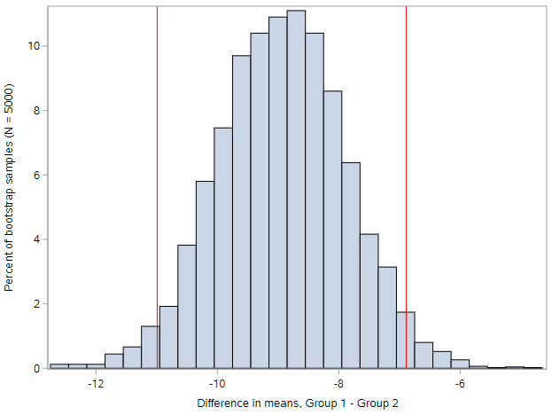
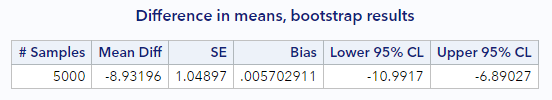

## Parameters and confidence intervals

Remember that once we have calculated a statistic from our data, we need to figure out a way to convey our uncertainty about that statistic—uncertainty due to sampling variability.

Until now, the way that we have managed this uncertainty was to perform hypothesis testing. By using randomization distributions, we were able to make a Yes/No decision regarding the point estimate derived from the observed data. Specifically, is that point estimate consistent or inconsistent with a specified null hypothesis?

Some people might see that methodology as somewhat limiting. Hypothesis testing only allows us choose between two prespecified hypotheses. Another approach to dealing with uncertainty might be to ignore the idea of a null value and null hypothesis and instead convey a range of plausible values that are consistent with our observed data. This is called a confidence interval. 

Both hypothesis testing and confidence intervals can be applied to the same data scenario. See some examples in the table below.


For example, in the first scenario, “Will participants lose more weight on Diet A than on Diet B?” is a Yes/No question that is best answered using a hypothesis test. Compare that to the question, "What is the difference in weight lost by participants on Diet A compared to those on Diet B?", which is asking for a quantification of the effect. This is where we would use confidence intervals.

The questions for the other two scenarios are similar to these. "Does Treatment A differ..." and "Are education level and income linearly related?" are both Yes/No questions, for which we would use hypothesis tests, while "How many more...?" and "...what is the change...?" are both questions looking for actual values as answers, for which we would use confidence intervals.

Recall that a parameter is a _numerical value from the population_. So in the first example above, the parameter is the true difference in mean weight loss among dieters on one diet compared to diets on the other diet. In the second example, the parameter is the difference in the proportion of athlete's foot cases cured by the different treatments. And the last parameter is the change in average income of all individuals in the population when increasing education by one year.

While you have already learned how to calculate point estimates for these types of differences from a sample of data, we need to calculate and report **confidence intervals** as a range of numbers that hopefully captures the true parameter value of interest. For example, at the end of the lesson, we'll be able to make conclusions along the lines of “We are 95% confident that Diet A leads to weight loss that is between 2.4 to 4.3 pounds higher than Diet B.”

## Bootstrapping


With hypothesis testing, it is important to understand how samples from a null population vary. By repeatedly sample from a null population, we get a sense for the variability of our statistic under the random chance model.

In contrast, with confidence intervals, we do not need to worry about a null population. We are simply interested in how the estimate itself would vary among many different samples from the population.  

But how do we do this when we only have data from a single sample? **Bootstrapping**. Bootstrapping is a method that allows us to estimate the variability of a statistic by repeatedly re-sampling *from our sample data*.


Each time we resample, the data are sampled from the original data with replacement. It turns out that the process of resampling from the original sample is an excellent approximation for sampling from a population!

We will denote bootstrapped statistics using a superscript \*. For example, we refer to the population parameter for a proportion as $$\pi$$ and the sample statistic for a proportion as $$p$$, so we will refer to a bootstrapped statistic for a proportion as $$p^*$$, which is the proportion of successes in a single resample.

### The bootstrapping method

The method of bootstrapping is fairly simple to implement:

* First, you compute the statistic of interest from the original data
* Second, you generate a large number (typically 5,000 or 10,000) of re-samples from the observed sample data. Here's what you need to know about this re-sampling:
  * Each re-sample should have the same number of records as your observed sample data. Meaning, if your observed sample data has 30 observations, you must generate re-samples with 30 observations. We have seen how much sample size affect the distribution of a statistic. That's true here, too. 
  * Always re-sample *with replacement*, meaning some of the observations from your sample may get selected multiple times for a particular re-sample, while other observations from your sample may not get selected at all. (Sampling done without replacement would yield identical re-samples to the original dataset every time.)
* Third, within each re-sample, re-estimate the statistic of interest. This will yield a distribution of plausible values based on your original data, which allows us to understand the variability of that statistic.
* Fourth, using this bootstrap distribution, compute an estimate of the confidence interval.

That's pretty much it. Let's walk through an an example.

### Data example

For this analysis we are going to look at birthweight of infants in the BABIES dataset:

```
* Initialize this SAS session;
%include "~/my_shared_file_links/hammi002/sasprog/run_first.sas";

* Makes a working copy of BABIES data and check;
%use_data(babies);
%glimpse(babies);
```

Suppose we want to estimate and provide an estimate of uncertainty for how different the birthweight of infants born to mothers who smoked was from the birthweight of infants born to mothers who didn't smoke. This is not a question that requires a hypothesis test. We are really trying to quantify the difference. So we need a confidence interval to go with our point estimate.

The first step is to ensure that you understand the parameters involved and know what statistic you will need to calculate. Again, let's answer some questions:

* *What type of parameters are involved*? We are interested in means (of birthweight to different groups of methods). Population means are denoted by $$\mu$$.
* *How many parameters are involved*? Since we have two groups being compared, there are two parameters. Let's label those as "S" for the smoking group and "NS" for the non-smoking group.

So we are interested in $$\Delta = \mu_S - \mu_{NS}$$, which can be estimated in our original sample as $$d = \bar{X}_{S} - \bar{X}_{NS}$$ and in our bootstrapped re-samples as $$d^* = \bar{X}_{S}^* - \bar{X}_{NS}^*$$.

So let's go ahead and estimate that observed difference, $$d$$, as the first step in this process:

```
* Calculate mean birthweight by smoking status;
proc means data=babies n mean maxdec=1;
	var bwt;
	class smoke;
run;
```

Based on the output, we see that $$\bar{X}_{S} = 114.1$$ ounces and $$\bar{X}_{NS} = 123.0$$ ounces for a difference of $$d = -8.9$$ ounces, meaning infants born to mothers who smoked are just over a half a pound lighter than infants born to mother who did not smoke.

### Generating bootstrap results in SAS

Now let's generate many bootstrap samples, calculate the differences $$d^*$$ within each, and visualize the distribution of the bootstrapped differences.

Again, you will need to load the randomization macros, since SAS doesn't offer a simple way to bootstrap these estimates. (Actually, it does for a difference of means, but doesn't give you all the output that is helpful to see what's going on. So we're still going to use these macros.)

```
* Load bootstrap macros;
%include "~/my_shared_file_links/hammi002/sasprog/load-randomization.sas";

* Run 5000 bootstrap samples;
%boot_means(
	ds = babies,
	groupvar = smoke,
	g1value = 1,
	g2value = 0,
	compvar = bwt,	
	reps = 5000
);
```

This macro outputs lots of information. First, it produces a histogram of the differences calculated in these 5,000 bootstrap samples. This is what might looked like.



Here are a few things you should notice about this histogram:

* The distribution of these bootstrapped differences is symmetric and unimodal
* The distribution is centered at our observed difference of about -9 ounces
* There is variability in the estimated differences due to the resampling (just as there would have been if we had resampled from the original population)... with some differences in birthweight for infants born to mothers who smoked, compared to those who didn't smoke, as low as -5 ounces and some as high as -12 ounces

So now let's figure out how to create a range of plausible values for the true population parameter based on this distribution.


## Variability in $$d^*$$

Look at the last part of the output from the bootstrap macro:



We see here an estimate of the standard deviation of the estimated differences. And remember, because the estimated difference is a statistic, it's standard deviation is called the standard error (SE).

If you remember the **empirical rule**, we can actually leverage this SE value to tell us more about the variability of $$d^*$$. Because the distribution of $$d^*$$ values is symmetric and bell shaped, roughly 95% of samples will produce $$d^*$$s that are within two standard errors of the center. For our data, that means 95% of the estimated differences should be within the interval, centered at our observed difference, defined as $$-8.9 \pm 2(1.0) = (-10.9, -6.9)$$ ounces.

This interval is based on our sample data, of course, but it allows us to say that 95% of the time, we would expect this interval to contain the value of the population parameter. I know this may feel backwards, but it is important to know that over your lifetime, 95% of the samples you collect should give you estimates that are within $$2SE$$ of the true population parameter. So if we believe (and we should) that bootstrapping gives us unbiased estimates for the SE of a difference for a particular sample size from the population, then we can apply this logic to our sample estimate.

### Bootstrap percentile interval

Variability can be measured through a different, more direct, mechanism, however.  As before, if $$d^*$$ is sufficiently close to the true parameter, then the resampled (or bootstrapped) $$d^*$$ values will vary in such a way that they overlap with the true parameter.  

Instead of using $\pm 2 SE$ as a way to measure the middle 95% of the sampled $$d^*$$ values, you can find the middle of the resampled $$d^*$$ values by removing the upper and lower 2.5% of values.  Note that this second method of constructing bootstrap intervals also gives an intuitive way for making 90% or 99% confidence intervals as well as 95% intervals. 

<u>Side note</u>: We have already talked about $$\alpha$$ as the significance level, or how often we are willing to tolerate making a Type I error in hypothesis testing. The same $$\alpha$$ is used for determining the **confidence level** of an interval. A 95% confidence interval is associated with $$\alpha = 0.05$$. A 99% confidence interval is associated with $$\alpha = 0.01$$. In general, the confidence level of an interval is reported as $$100(1-\alpha)%$$ confidence. And, just as we will rely on $$\alpha = 0.05$$ for hypothesis testing, unless otherwise specified, we will also report 95% confidence intervals, unless otherwise specified. (For 2-sided intervals, remember to allocate $$\alpha / 2$$ in each tail of the distribution.)

We see estimates of these **confidence limits** in the SAS output above:

* The lower 2.5% value of the distribution (or the 2.5% percentile) is -11.0. This is called the **lower confidence limit**, or LCL.
* The upper 2.5% value of the distribution (or the 97.5% percentile) is -6.9. This is called the **upper confidence limit**, or UCL. 

So our bootstrap percentile interval is (-11.0, -6.9) ounces, which differs slightly from our SE-based (empirical rule) interval above. Because these two methods are different, the resulting intervals are expected to be a little different as well. In the long run, however, the intervals should provide the same information.

## Interpreting CIs and technical conditions

By using the bootstrapped $$d^*$$ values in the previous exercises, you were able to find two different intervals for the true parameter of interest, the difference in birthweight of infants born to mothers who smoked was from the birthweight of infants born to mothers who didn't smoke. 

Because we don't know whether our sample is close to the population or far from it, we don't know whether the confidence interval actually captures the true parameter. To that end, we interpret the interval using a confidence percentage. That is, we say _*we are 95% confident that the true difference in birthweight of infants born to mothers who smoked was from the birthweight of infants born to mothers who didn't smoke is between -11.0 and -6.9 ounces*_.

This wording is key: *We are $$(1-\alpha)%$$ confident that the true parameter is between [LCL] and [UCL].*


The bootstrap method describe above works for *any* statistic and parameter, as long as the following technical conditions hold: (1) the distribution of the statistic is reasonably symmetric and bell-shaped, (2) the sample size is reasonably large, and (3) the sample was representative of the population. A plot of the calculated bootstrap statistics will give a good indication for whether the technical conditions are valid.


### Confidence levels and interval width

As noted above, most scientists use 95% confidence intervals to quantify their uncertainty about an estimate.  That is, they understand that over a lifetime of creating confidence intervals, only 95% of them will actually contain the parameter that they set out to estimate.  There are studies, however, which warrant either stricter or more lenient confidence intervals (and subsequent error rates).

Let's re-run the bootstrap results for the above sample data using 90% confidence and 99% confidence to see how this affects our interval estimates.

Here is the code to run a 90% confidence interval with bootstrapping. The only change is the `alpha =` option:

```
* Run 5000 bootstrap samples, 90% confidence;
%boot_means(
	ds = babies,
	groupvar = smoke,
	g1value = 1,
	g2value = 0,
	compvar = bwt,	
	alpha = 0.10,
	reps = 5000
);
```

Find the limits of the 90% confidence interval in the output. Is the interval wider or narrower than the 95% confidence interval.

```
* Run 5000 bootstrap samples, 99% confidence;
%boot_means(
	ds = babies,
	groupvar = smoke,
	g1value = 1,
	g2value = 0,
	compvar = bwt,	
	alpha = 0.01,
	reps = 5000
);
```

Find the limits of the 99% confidence interval in the output. Is the interval wider or narrower than the 95% confidence interval.

Here were my results:

| Confidence level | $$\alpha$$ | LCL   | UCL  | Interval Width |
| ---------------- | ---------- | ----- | ---- | -------------- |
| 90%              | 0.10       | -10.6 | -7.2 | 3.4            |
| 95%              | 0.05       | -11.0 | -6.9 | 4.1            |
| 99%              | 0.01       | -11.7 | -6.2 | 5.5            |

The basic rule is that requiring more confidence results in a wider interval and requiring less confidence results in a narrower interval.


You have successfully completed this tutorial.

# [< Back to Section 4](https://bghammill.github.io/ims-04-foundations/)


<!-- MathJax -->

<script src="https://cdn.mathjax.org/mathjax/latest/MathJax.js?config=TeX-AMS-MML_HTMLorMML" type="text/javascript"></script>

