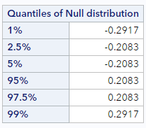

# Critical regions of the null distribution

Another way to measure how far the observed statistic is from the hypothesize null value is to compare the observed statistic to specific quantiles of the null statistics.

Let's reload the promotion data, calculate our observed statistic, and generate a null distribution using randomization:

```
* Initialize this SAS session;
%include "~/my_shared_file_links/hammi002/sasprog/run_first.sas";

* Makes a working copy of PROMOTION data and check;
%use_data(promotion);
%glimpse(promotion);

* Observed promotion decisions by gender;
proc freq data=promotion;
	tables gender * decision / nocol nopct;
run;

* Load randomization macros;
%include "~/my_shared_file_links/hammi002/sasprog/load-randomization.sas";

* Run 1000 null samples;
%permute_freq(
	ds = promotion,
	groupvar = gender,
	g1value = 1,
	g2value = 2,
	compvar = decision,	
	cvalue = 1,
	reps = 1000
);
```

After we've generated 1000 different permutations of the original data, we find these quantiles of the null distribution at the bottom of the output. Here is what my output looked like:



We can see that the 5% quantile is -0.208. That is, 5% of the observations in the null distribution are at -0.208 or below. And the 95% quantile is 0.208. That is, 95% of the null differences are at 0.208 or below, meaning that our observed statistic of 0.29 is larger than 95% of the null statistics, and, therefore, less extreme that *under* 5% of the null statistics in the upper tail. 

Quantiles, like these, that describe the tails of the null distribution determine help us define what is called the **critical region**. People often use the critical region, instead of p-values, to determine when an observed statistic is considered "consistent" with the null distribution. For example, if our alternative hypothesis was a one-sided hypothesis in this direction (i.e., that male candidates had higher promotion rates than female candidates), we would typically conclude that our data were *inconsistent* with the null hypothesis, since our observed data were clearly within the 5% critical region.

Because we are interested in a 2-sided hypothesis of no difference in promotion rates, however, we are actually interested in both tails. To define a 5% critical region using both tails we would look at both the 2.5% quantile (-0.208) and the 97.5% quantile (0.208) value. (We basically always put half of the 2-sided critical region in each tail). So now we can say that in the 2-sided critical region, 5% of the observations in the null distribution are either smaller than or equal to -0.208 or larger than or equal to 0.208. The fact that these values are symmetric around the hypothesized null difference is very typical, especially when the number the null samples generated is large.

Even using a 2-sided critical region, it is still clear that our data are in the most extreme 5%, since our observed difference is above the 97.5% quantile. And, again, we would typically conclude that our data were inconsistent with the null hypothesis.


## Why 0.05 (or 5%)?

The choice above to look at critical region that contained the most extreme 5% of null differences (whether 1-sided or 2-sided) is somewhat arbitrary, but commonly done in statistics. The reasons to use a 5% cutoff are historical, ingrained in much of science, and somewhat intuitive.  

As it turns out, the 5% cutoff value is consistent with what many of us consider to be unusual. Consider a situation where you as the researcher are trying to decide whether a coin is fair or not.


Would you think that flipping one head is evidence that the coin is unfair? Probably not. What about two heads in a row? Three heads in a row?

At what number of heads in a row would you start thinking that maybe this coin isn't actually a fair coin?

For many of you, four or five heads in a row would seem unusual. Interestingly, four or five heads in a row correspond to probabilities that are very close to 0.05. Some of you might need six or seven heads in a row before you start to doubt the fairness of the coin. The notion of statistical significance is similar. Using a cutoff of 0.01 instead of 0.05 indicates a higher degree of skepticism that an observed result is not simply due to random noise. Which is to say that the cutoff of 0.05 is personal and subjective, but not meaningless. 

### Sample size and critical region

Just as we did for the p-value, it is interesting to see what happens to the critical regions when the sample size changes, while the observed difference does not.

Let's re-generate the randomization distributions for the small and big datasets, this time noting the values of the 2.5% and 97.5% quantiles in each.

```
* Makes a working copy of PROMOTION_SMALL and PROMOTION_LARGE;
%use_data(promotion_small);
%use_data(promotion_large);

* Run 1000 null samples for PROMOTION_SMALL;
%permute_freq(
	ds = promotion_small,
	groupvar = gender,
	g1value = 1,
	g2value = 2,
	compvar = decision,	
	cvalue = 1,
	reps = 1000
);

* Run 1000 null samples for PROMOTION_LARGE;
%permute_freq(
	ds = promotion_large,
	groupvar = gender,
	g1value = 1,
	g2value = 2,
	compvar = decision,	
	cvalue = 1,
	reps = 1000
);
```

If your results were anything like mine, you should have seen something like the following:

| Dataset                        | 2.5% quantile | 97.5% quantile |
| ------------------------------ | ------------- | -------------- |
| Original size (PROMOTION)      | -0.208        | 0.208          |
| Smaller size (PROMOTION_SMALL) | -0.250        | 0.250          |
| Larger size (PROMOTION_LARGE)  | -0.167        | 0.167          |

Notice how the differences in proportions must be much larger to be "significant" (here, at the 5% level) if the sample size is small. While with a big sample size, a smaller difference in proportions can be "significant".

## Summary of gender discrimination

Whether we use a p-value or compared the observed results to a critical region, the observed gender discrimination data is not really consistent with the permuted null differences. Only ~35 of the 1000 permuted differences were larger than or equal to the observed statistic in magnitude. That is, we would have observed data like ours only between 3-4% of the time if men and women were equally likely to be promoted. 

And because both the p-value and critical region method point to the fact that our data would be expected less than 5% of the time (a typical, useful cutoff), we decide to reject the null hypothesis in favor of the alternative, claiming that men are promoted at a rate different from women. That is, we conclude that it was not simply random variability which led to a higher proportion of men being promoted.

Let's think back to an earlier lesson about causality and generalizability...

Because the study was randomized, that is, they randomly assigned the resumes to the managers, there is nothing systematically different about the two groups except the name on the resume. The only difference in the two groups, both the participants as well as the resumes, was the name on the top of the resume. Therefore, we can conclude that *any difference in promotion rates is due to the gender of the applicant*. That is, we can infer a causal connection between the gender of the applicant being male and a higher promotion rate.

The 35 individuals in the sample were not randomly sampled from all possible American bank managers, however; they were at a management training session. So we should not have any assumption about the generalizability of these findings here. In order to generalize the results of the study to a larger population, we would need more information about the study and careful thinking about who the study participants might represent.


You have successfully completed this tutorial.

# [< Back to Section 4](https://bghammill.github.io/ims-04-foundations/)


<!-- MathJax -->

<script src="https://cdn.mathjax.org/mathjax/latest/MathJax.js?config=TeX-AMS-MML_HTMLorMML" type="text/javascript"></script>

