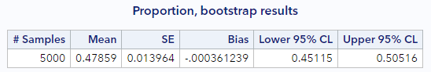
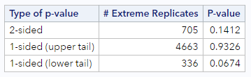
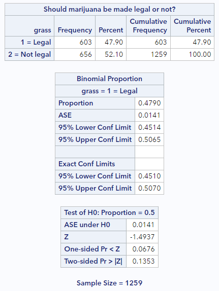

# Inference for a single proportion

In this lesson you will learn how to perform statistical inference on a single proportion, as a summary of a categorical variable. As we have already discussed, "inference" typically refers to both (a) performing hypothesis testing and (b) producing confidence intervals. We will do both of these things using both randomization-based methods and mathematical methods. 

### The General Social Survey

Since proportions are how we summarize categorical data, we're going to use data from the General Social Survey, which is a rich trove of categorical data. Every year, researchers visit the homes of Americans and ask them a long list of questions about their history, behavior, and opinions on a number of topics of interest to social scientists.

There are generally a few thousand people surveyed every year, but researchers would like to make general statements about the opinions and social trends of the entire United States. This process of inference from the sample to the population is possible because the researchers are careful to select their respondents in such a way that their sample is representative of the population of all Americans. The result is a data set where each sampled respondent is one row and each column is their response to a single question. 

We have made available for you a sample of data from the General Social Survey in a dataset called `gss2010`. 

```
* Initialize this SAS session;
%include "~/my_shared_file_links/hammi002/sasprog/run_first.sas";

* Makes a working copy of GSS2010 data and check;
%use_data(gss2010);
%glimpse(gss2010);
```

If we glimpse the dataset, we see a few different variables. The one we're interested in here is `grass`, which records if respondents think marijuana should be legal or not. We're curious to learn what the distribution of responses were to this question in 2010.

Because there are some missing data in there, let's limit the dataset to only include records with a response to that particular question. After we do that, we'll check the distribution of `grass` to confirm... and also to see what proportion of those surveyed believed marijuana should be legal.

```
* Limit to data not missing question response;
data gss2010;
	set gss2010(
		where = (not missing(grass))
	);
run;
	
* Calculate proportion of sample favoring legality of marijuana;
proc freq data=gss2010;
	tables grass;
run;
```

So the proportion of the sample that indicated that they believe marijuana should be legal is 0.479 (or 47.9%). This should be a good estimate of the percent of all Americans that believe marijuana should be legal, but it's not a sure thing since we only asked a small proportion of them.

### Confidence interval via bootstrapping

In order to get a plausible range of values for the proportion of Americans that believe marijuana should be legal, we can calculate a 95% confidence interval around this observed proportion. (Again, unless otherwise noted, 95% is the default confidence level to use.) You have already seen how we do this with randomization methods. (If you want to review the process of bootstrapping, go review the confidence interval tutorial in the prior section.)

Using thousands of bootstrap samples we can calculate the CI using either the bootstrap SE or using bootstrap percentiles. Both types of intervals are based on information that is output from our SAS bootstrapping macro. So let's run that 5,000 times for this proportion:

```
* Load bootstrap macros;
%include "~/my_shared_file_links/hammi002/sasprog/load-randomization.sas";

* Bootstrap confidence interval, single proportion, 5000 samples;
%boot_1prop(
	ds = gss2010,
	dovar = grass,
	uselevel = 1,
	alpha = .05,
	reps = 5000
);
```

The relevant macro here is `%boot_1prop` and you need to specify the dataset, variable name, the (unformatted) value of that variable that you would like to calculate a proportion for, the alpha level, and the number of bootstrap samples to generate. Here, since 1 = Legal, we are estimating proportions where people think marijuana should be legal.

Here are my relevant results:



Do yours look similar?

<u>Bootstrap percentile interval</u>

Let's start with the easier confidence interval. The 95% bootstrap percentile confidence interval is (0.451, 0.505), meaning that we expect, with 95% confidence, that the true proportion of Americans who believe marijuana should be legalized is between 45.1% and 50.5%.

<u>Bootstrap SE-based interval</u>

The other way to calculate a confidence interval here is to rely on the empirical rule, which states that an approximate 95% confidence interval can be found as $$CI = p \pm 2 \cdot SE$$, where, in this case, the standard error we will use is the bootstrap standard error. Here this interval is:

$$CI = 0.479 \pm 2(0.014) = (45.1, 50.7)$$

which is very close to the bootstrap percentile interval and would have a similar interpretation.


### Hypothesis testing via randomization

Suppose someone wanted to use these data to test if the proportion of Americans supporting legalization of marijuana was the same as those not supporting legalization. This would be the same as testing whether the proportion who believe marijuana should be legal equals 50%. Let's do that, by running through the 5 steps of hypothesis testing:

1. State your research hypotheses in terms of a null (H_0) hypothesis and an alternative (H_A) hypothesis
2. Specify the significance level (α)
3. Calculate the test statistic (from observed data) and corresponding p-value
4. Draw a conclusion
5. Interpret the conclusion/decision in terms of the subject matter (if possible)

Our hypotheses only involve a single parameter—the proportion of the Americans supporting legalization of marijuana—which we represent with $$\pi$$.

$$H_0: \pi = 0.50$$

$$H_A: \pi \neq 0.50$$

Because a significance level is not given, we will specify $$\alpha = 0.05$$.

To calculate the observed statistic and the p-value, we will create simulated datasets having the same sample size as ours, where the true proportion of those who favor legalization is 0.50, the null value. This will give us a null distribution, from which we can calculate the % of samples with proportions as or more extreme (in either direction from the null value) than our observed proportion.

```
* Simulate the null distribution of a single proportion, 5000 samples;
%sim_1freq(
    ds = gss2010,
    dovar = grass,
    usevalue = 1,
    reps = 5000,
    nullval = 0.50
);
```

If we look at the output, we can confirm, in the first table, that the observed statistic (observed proportion) is 0.479. We also see the histogram of null proportions and our randomization-based p-values. This is how mine test turned out.



I found that 705 of our 5000 simulated datasets resulted in a proportion that was more extreme than 0.479, for a two-sided p-value of 0.141. Hopefully, your p-value was in that neighborhood. If we had a directional hypothesis, we could have used one of the 1-sided p-values.

Based on this p-value, what can we conclude? Because p (=0.141) is greater than our specified $$\alpha$$, we cannot reject the null hypothesis. We do not have enough evidence to conclude that the proportion of Americans who support legalization of marijuana is different from the proportion who do not support legalization.

Now let's see how the mathematical approximation methods would proceed for these same questions.


## Mathematical model for proportions

There is another method for statistical inference that entirely skips all the thousands of computations that took place above, and relies upon a mathematic approximation.

A useful result in mathematics says that if you have <u>independent observations</u> and a <u>sufficiently large sample size</u>, then proportions calculated from samples will follow a normal distribution with a known standard deviation. This distribution is called the sampling distribution of p-hat and it's very similar to the bootstrap distribution in that it captures the variability of our estimate across many possible data sets.

The underlined phrases above are the two **model assumptions** that must be met in order for us to use the normal distribution as an approximation for the sampling distribution of a single proportion.

How do we check that we have "independent observations"?

* This depends on the sampling and/or data collection method. If the sample included multiple sets of family members, for example, it's possible their answers to this survey might not be independent of each other, since they may share many views in common. Similarly, if these data included information from two data collection waves of an annual survey, where the respondents are the same from year to year, we know that that person's answers in the second year will be related to (i.e., not independent of) their answers in the first year. You really just want to see one observation per sample member and you want there to be no obvious interconnections between sample members.

What is a "sufficiently large" sample size?

* For hypothesis testing, the general rule of thumb is that $$n\pi$$ and $$n(1-\pi)$$ should both be greater than or equal to 10, where *n* is the sample size and $$\pi$$ is the hypothesized true proportion
* For confidence interval calculations, where $$\pi$$ is unknown (and there is no null value), we substitute in $$p$$, the observed proportion, and require that $$np$$ and $$n(1-p)$$ are both greater than or equal to 10

For our data, these assumptions are more than met. The sampling scheme of the GSS assures independence of observations. And we have 1259 observations. So whether we use the hypothesized proportion of 0.50 or the observed proportion of 0.48,  our $$np$$ and $$n(1-p)$$ values are both much larger than 10.

### Standard error of a proportion

When these assumptions hold, the estimate of the standard error for a proportion is:

$$SE = \sqrt{\frac{ p \times (1 - p)}{n}}$$ 

We can use this estimate in the formulas for both the confidence intervals and the *z* test statistic.

For our data, where the observed proportion is 0.479, the estimate of the standard error is:

$$SE = \sqrt{\frac{ 0.479 \times 0.521}{1259}} = 0.014$$.

How does this compare to our original computational approach using the bootstrap? When rounded to 3 decimal places, it was exactly the same 0.014, which is remarkable.

### Confidence interval via approximation

The approximation shortcut offers an alternative method of describing the sampling distribution. So let's use the SE calculated above to estimate a confidence interval.

Remember, when building _any_ confidence interval, you use three ingredients: (1) the point estimate, (2) the SE, (3) and the number of standard errors to add and subtract (*z\**). We already have the first two of these ingredients. We just need *z\** for a 95% confidence level. If you look that up for the standard normal distribution, you'll see it's 1.96. So our confidence interval is just:

$$CI = 0.479 \pm 1.96(0.014) = (45.2, 50.6)$$

Again, this is remarkably close to both of the bootstrap CIs. And, as above, we still interpret this interval the same way. With 95% confidence, that the true proportion of Americans who believe marijuana should be legalized is between 45.2% and 50.6%.

### Hypothesis testing via approximation

Following on the test described above, where the hypotheses where

$$H_0: \pi = 0.50$$

$$H_A: \pi \neq 0.50$$

and the significance level is $$\alpha = 0.05$$, we can calculate a *z* statistic as:

$$z = \frac{Observed Statistic - Null value}{SE}

For out data, this is:

$$z = \frac{0.479 - 0.5}{0.014} = -1.5$$

To get a p-value, we just look up this *z* in a probability table or using some p-value calculator. If you do this, you'll see that $$p = 0.134$$. This is pretty close to the simulation-based p-value from above, but not the same. Regardless, we still end up drawing the same conclusion.

Because our p-value (= 0.134) is greater than our specified $$\alpha$$, we cannot reject the null hypothesis. We do not have enough evidence to conclude that the proportion of Americans who support legalization of marijuana is different from the proportion who do not support legalization.

### Approximation results via SAS

Of course, you don't have to do this by hand all the time. SAS will do this for you if you specify things correctly. The way to request a test for a single proportion along with a confidence interval for that proportion is using PROC FREQ, as follows:

```
* Calculate proportion of sample favoring legality of marijuana;
proc freq data=gss2010;
	tables grass / binomial(p = .5 level='1 = Legal');
run;
```

The `binomial` option is the key here. You specify the null value for testing (`p = .5`) and indicate the level of the variable you would like to calculate the proportion for (`level = '1 = Legal'`). The `level` option is tricky. What goes in there must be the formatted value of the variable, if the variable is formatted. Otherwise, it must be the raw value of interest. But, even if this raw value is a numeric value, you must put it in quotes. (For instance, if this variable had been unformatted, I would still be interested in level = 1, but I would specify this as `level = '1'`.)

If you run this code, you'll see some new output following the frequency table, like this:



Here's what to notice:

* In the Binomial Proportion table, confirm that the first line (Proportion) is reflecting the level of the variable you want
* Directly below that is the ASE (or asymptotic standard error). That's what we calculated above.
* And directly below the ASE are the approximation-based confidence limits, lower and upper. You can change the confidence level by specifying a different alpha as an option to the `tables` statement (e.g., `tables grass / binomial(...) alpha=.10`).
* The last few lines of the output report the hypothesis test results. This section indicates the null proportion, repeats the ASE, reports the calculated *z* statistic, and gives you 1-sided and 2-sided p-values. The p-value we calculated above is slightly different because we didn't maintain as much precision in our calculations as SAS does.

You have successfully completed this tutorial!

As we'll see, most data scenarios have mathematical approximations that we can leverage. But they won't all rely on the normal distribution. So it's important to keep tabs on which approximations or distributions go with which data scenarios.


# [< Back to Section 5](https://bghammill.github.io/ims-05-infer/)


<!-- MathJax -->

<script src="https://cdn.mathjax.org/mathjax/latest/MathJax.js?config=TeX-AMS-MML_HTMLorMML" type="text/javascript"></script>

