## Inference for a single parameter

In this lesson you will learn how to perform statistical inference on a single parameter that describes categorical data. This includes both resampling based methods and approximation based methods for a single proportion.

## The General Social Survey

Welcome to Inference for Categorical Data! Categorical data arises in any situation where the values that you are recording are categories, not simply numbers.

One particularly rich trove of categorical data can be found in the General Social Survey.


### 

Every year, researchers visit the homes of Americans and ask them a long list of questions about their history, behavior, and opinions on a number of topics of interest to social scientists.

```

```

### 

There are generally a few thousand people that are surveyed every year, but researchers...

```

```

### 

would like to make general statements about the opinions and social trends of the entire United States.

```

```

### 

This process of inference from the sample to the population is possible because the researchers are careful to select their respondents in such a way that their sample is representative of the population of all Americans. The result is a data set where each sampled respondent is one row and each column is their response to a single question.

```

```

### Exploring GSS

We have made available for you a sample of data from the General Social Survey in a data frame called `gss`. 

If we glimpse the data frame, we learn that there are 25 variables: a unique identifier for each respondent, then a series of demographic variables like age and sex. Note that while these two are numerical data, represented as double and integer, the remaining variables are factors, R's term for categorical data. If we go farther down we get into the opinion questions. 

The happy variable records if respondents on balance feel happy or unhappy. We're curious to learn what the distribution of responses are to this question in the most recent year of the survey, 2016.

```
glimpse(gss)
```

### GSS 2016 and `happy`

We're going to focus on data from 2016, so we'll filter the data set to only include those rows and save it as a new data set called `gss2016`.

```
gss2016 <- gss %>%
  filter(year == 2016)
```

We'll focus on the `happy` variable, which is categorical, so we'll visualize it with a bar chart. We learn that the most common response was "happy".

```
ggplot(gss2016, aes(x = happy)) +
  geom_bar()
```

### 

But let's go a step farther and calculate exact proportion of the sample that responded this way.

To do that we want to summarize the happy variable with a single proportion.  Look to the middle of this line we ask for which respondents their happy value is exactly equal to "happy". This results in a column of `TRUE`s and `FALSE`s. You can find the proportion of `TRUE`s by simply taking the mean. We'll save that as `p_hat`. 

```
p_hat_happy <- gss2016 %>%
  summarize(prop_happy = mean(happy == "HAPPY")) %>%
  pull()

p_hat_happy
```

We learn that around 77% of our sample is "happy". This should be a good estimate of the percent of all Americans that are very happy, but it's not a sure thing since we only asked a small proportion of them.

## 95% confidence interval

The 95% confidence interval can be calculated as the sample proportion plus or minus two standard errors of the sample proportion:

$$(\hat{p} - 2 \times SE, \hat{p} + 2 \times SE)$$

We can estimate the standard error by using the bootstrap. Let's review how we can construct the bootstrap distribution.

### The bootstrap

We start with our full dataset and specify the variable that we'd like to focus on.

```

```

### 

This is done with the `specify()` function.

```

```

### 

Next we draw a sample from that variable with replacement that is of the same size as our original dataset. This recreates the random variation that creeps in when you draw a sample from a population.

```
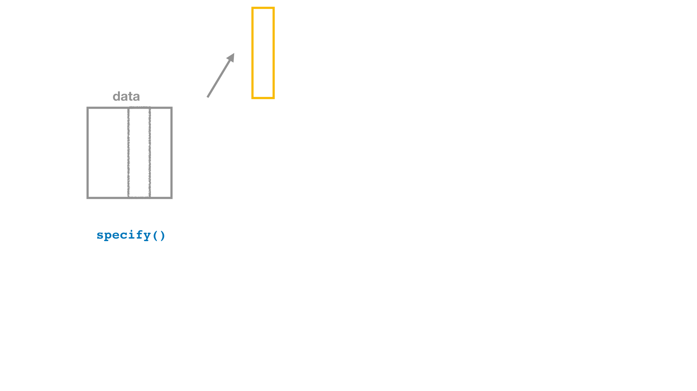
```

### 

We do this many times to create many bootstrap replicate data sets.

```
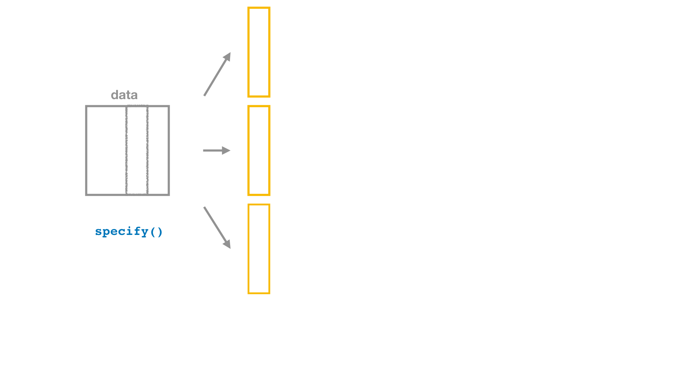
```

### 

This is done with the `generate()` function.

```
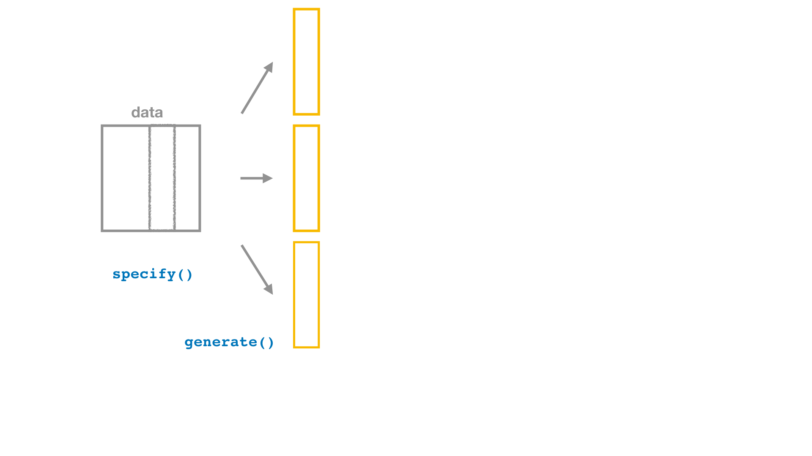
```

### Bootstrap

Next, for each replicate, we calculate the sample statistic, in this case: the proportion of respondents that said "happy".

```
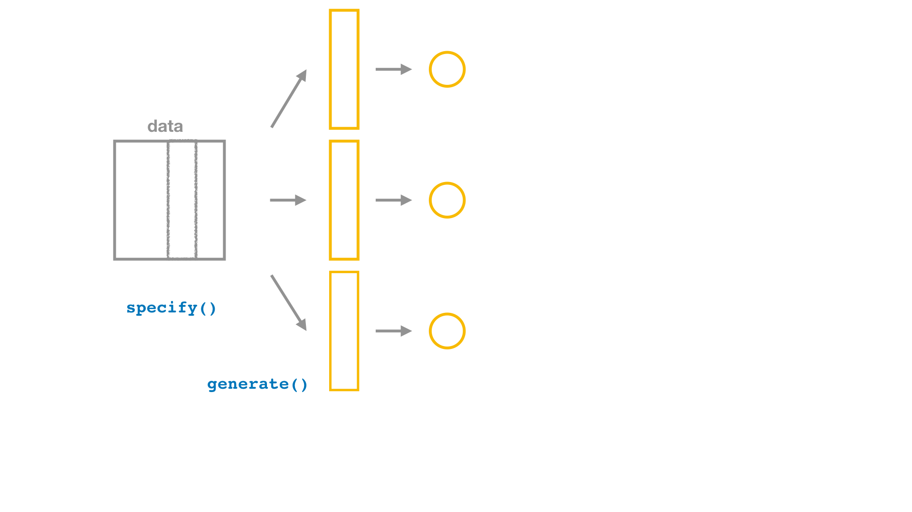
```

### 

This is done with the `calculate()` function.

```
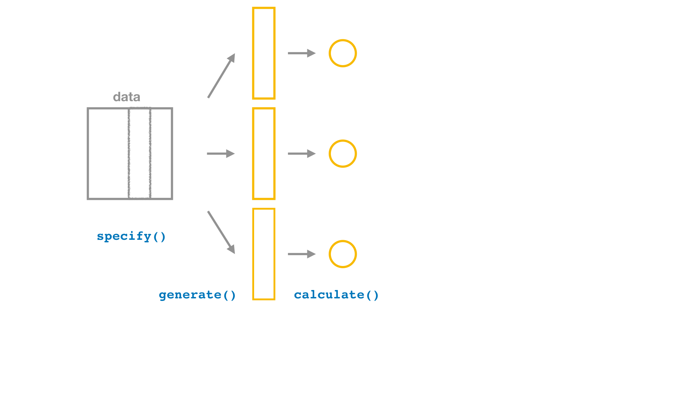
```

### 

At this point, we should save this object: the collection of statistics from repeated resampling of our data set.

```
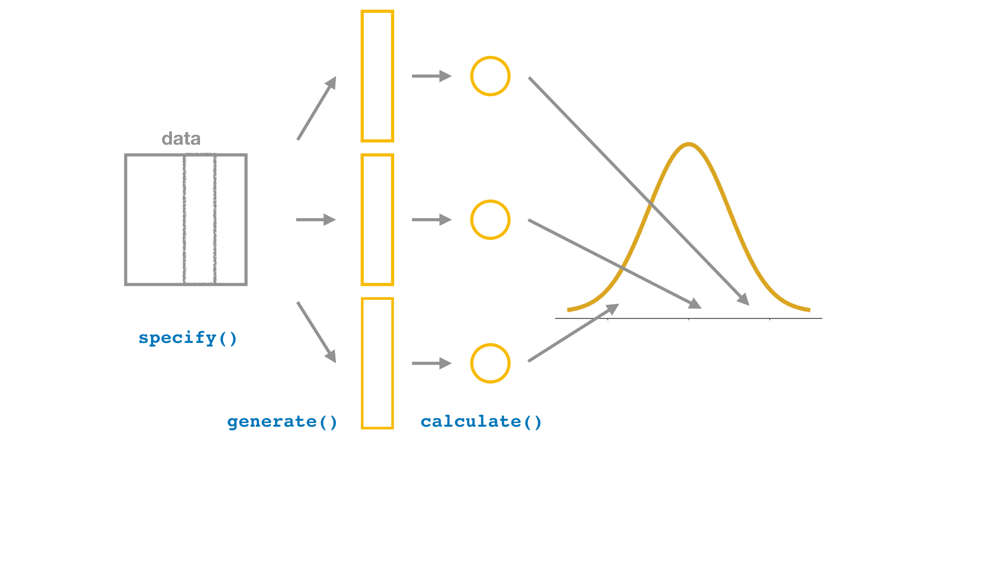
```

### 

From here, we can visualize its distribution using the `ggplot()` function. This is called the **bootstrap** distribution.

```
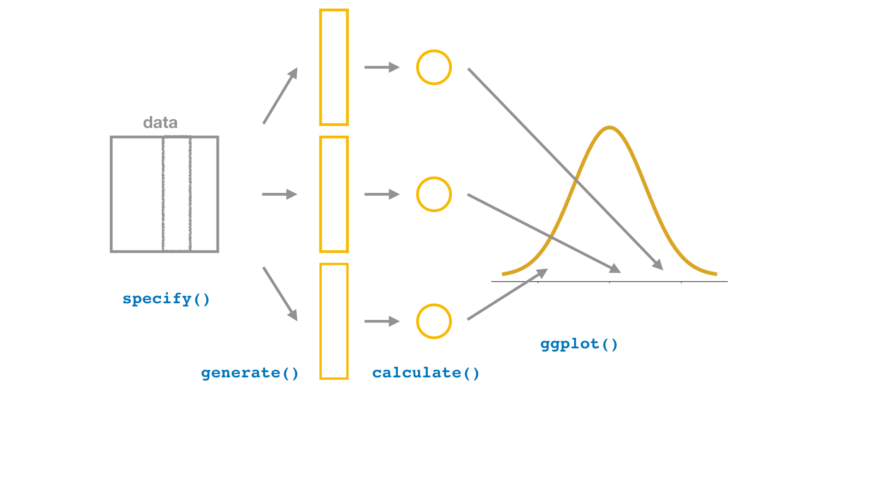
```


### 

The standard deviation of this distribution is a good estimate of the standard error. 

```
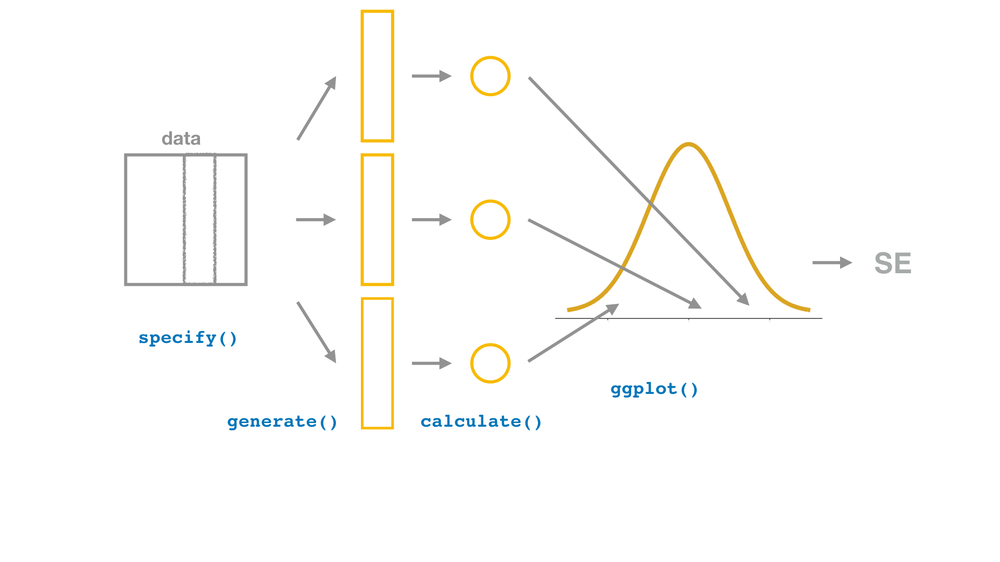
```

###

So our last step is to extract that using summarize.

```
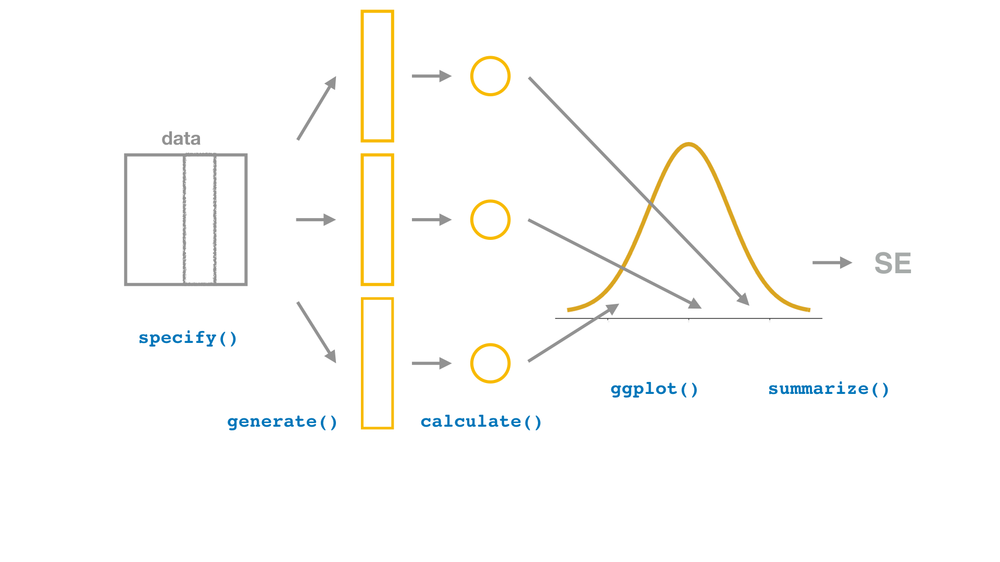
```

## Bootstrap confidence interval with infer

To implement this, we start with our gss2016 data and then *specify* that we will focus on the happy column. Next we *generate* 500 replicate data sets through bootstrapping and for each one *calculate* the proportion that are "happy". 

When we print this new object, we see we now have a data frame that contains 500 p-hats.

```
boot_dist_happy <- gss2016 %>%
  specify(response = happy, success = "HAPPY") %>%
  generate(reps = 500, type = "bootstrap") %>%
  calculate(stat = "prop")

boot_dist_happy
```

### 

If we create a density plot of these statistics we see that it's unimodal and symmetric and ranges from roughly 0.70 to 0.85.

```
ggplot(boot_dist_happy, aes(x = stat)) +
  geom_density()
```

### 

The standard deviation of the `stat` variable in this data frame (the bootstrap distribution) is the **bootstrap standard error** and it can be calculated using the `summarize()` function.

```
SE_happy <- boot_dist_happy %>%
  summarize(se = sd(stat)) %>%
  pull()

SE_happy
```

### 

We can use this value, along with our point estimate, to roughly calculate a 05% confidence interval:

$$(\hat{p} - 2 \times SE, \hat{p} + 2 \times SE)$$ 

```
c(p_hat_happy - 2 * SE_happy, p_hat_happy + 2 * SE_happy)
```

### Exploring confidence in science

The General Social Survey asks about far more topics than just happiness. Next we'll turn our attention to the question of how much confidence people had in the scientific community in 2016, which is captured in the `consci` variable.

The `gss2016` data frame and the tidyverse package are already loaded for you. Construct a bar plot of the distribution of `consci`. 

```
ggplot(gss2016, aes(x = ___)) +
  ___
```

```
ggplot(gss2016, aes(x = ___)) +
  geom_bar()
```

```
ggplot(gss2016, aes(x = consci)) +
  geom_bar()
```

##

Next, we compute the sample proportion of people that reported having "High" confidence.

```
p_hat_consci <- ___ %>%
  summarize(prop_high = mean(___ == "___")) %>%
  pull()

p_hat_consci
```

<div id="ex2-hint">
**Hint:** Inside `summarize()`, use the `mean()` function calculate a proportion with something like `mean(column == "value")`.
</div>


```
p_hat_consci <- gss2016 %>%
  summarize(prop_high = mean(consci == "High")) %>%
  pull()

p_hat_consci
```

### Generating via bootstrap

To quantify your uncertainty in this estimate of the number of people that have "High" confidence in the scientific community, you need to calculate the standard error. To do so, we'll start by considering how different the data might look in just a single bootstrap sample.

Using the `gss2016` data, create a single bootstrap data set. The infer package is already loaded for you.

- `specify` the variable of interest (`consci`) and designate that `"High"` values constitute a success.
- `generate` just one bootstrap replicate.
- Finally, make a bar plot of the distribution of `consci` in this single bootstrap sample.

```
set.seed(47)
```

```
# Create single bootstrap data set
boot_1_consci <- gss2016 %>%
  # Specify the response
  ___(response = ___, success = "___") %>%
  # Generate one bootstrap replicate
  ___(reps = ___, type = "___")

# Make a bar plot
ggplot(___) +
  ___
```

```
boot_1_consci <- gss2016 %>%
  specify(response = consci, success = "___") %>%
  ___(reps = ___, type = "___")
```

```
boot_1_consci <- gss2016 %>%
  specify(response = consci, success = "High") %>%
  ___(reps = ___, type = "___")
```

```
boot_1_consci <- gss2016 %>%
  specify(response = consci, success = "High") %>%
  generate(reps = ___, type = "___")
```

```
# Create single bootstrap data set
boot_1_consci <- gss2016 %>%
  # Specify the response
  specify(response = consci, success = "High") %>%
  # Generate one bootstrap replicate
  generate(reps = 1, type = "bootstrap")

# See the result
ggplot(boot_1_consci, aes(x = consci)) +
  geom_bar()
```

### 

We can guess-timate what the sample proportion of people that reported having "High" confidence based on the bar plot and we can also calculate it directly.

```
# Calculate proportion with High confidence
boot_1_consci %>%
  summarize(prop_high = ___) %>%
  pull()
```

<div id="ex4-hint">
**Hint:** Use `mean()` to calculate a proportion by doing something like `mean(column == "value")`.
</div>

```
# Calculate proportion with High confidence
boot_1_consci %>%
  summarize(prop_high = mean(consci == "High")) %>%
  pull()
```

### Constructing the CI

You've seen one example of how p-hat can vary upon resampling, but we need to do this many many times to get a good estimate of its variability.  Here you will compute a full bootstrap distribution to estimate the standard error (SE) that will be used to form a confidence interval. You'll use an additional verb from infer, `calculate()`, to streamline this process of calculating many statistics from many data sets.

Take a moment to inspect the output of calculate. This function reduces your data frame to just two columns: one for the "stat"s and another for the "replicate" they correspond to.

When you plot your bootstrap distribution, you'll find that it's bell-shaped. It's this shape that allows you to add and subtract two SEs to get a 95% interval.

Create a bootstrap distribution called `boot_dist_consci` using the following steps:

- `specify` that you're interested in the `consci` variable where success is indicated by having `"High"` confidence.
- `generate` 500 bootstrap replicates.
- `calculate` a proportion statistic by setting `stat` to "prop".

```
set.seed(47)
```

```
# Create bootstrap distribution for proportion with High conf
boot_dist_consci <- gss2016 %>%
  # Specify the response and success
  specify(response = ___, ___ = "___") %>%
  # Generate 500 bootstrap reps
  generate(___ = ___, type = "bootstrap") %>%
  # Calculate proportions
  calculate(stat = "___")

# See the result
boot_dist_consci
```

```
boot_dist_consci <- gss2016 %>%
  specify(response = consci, success = "High") %>%
  generate(___ = ___, type = "bootstrap") %>%
  calculate(stat = "___")
```

```
boot_dist_consci <- gss2016 %>%
  specify(response = consci, success = "High") %>%
  generate(reps = 500, type = "bootstrap") %>%
  calculate(stat = "___")
```

```
# Create bootstrap distribution for proportion with High conf
boot_dist_consci <- gss2016 %>%
  # Specify the response and success
  specify(response = consci, success = "High") %>%
  # Generate 500 bootstrap reps
  generate(reps = 500, type = "bootstrap") %>%
  # Calculate proportions
  calculate(stat = "prop")

# See the result
boot_dist_consci
```

### Visualizing the CI

Next, let's visualize the bootstrap distribution you constructed earlier, `boot_dist_consci`, in a density plot using `geom_density()`.

```
ggplot(boot_dist_consci, aes(x = ___)) +
  ___
```

```
ggplot(boot_dist_consci, aes(x = ___)) +
  geom_density()
```

```
ggplot(boot_dist_consci, aes(x = stat)) +
  geom_density()
```

### Calculating the bootstrap SE

And let's also calculate the standard error by `summarize`ing the distribution with its standard deviation, `sd()`, then `pull()` it out.

```
SE_consci <- boot_dist_consci %>%
  ___(se = ___) %>%
  ___

SE_consci
```

```
boot_dist_consci %>%
  summarize(se = sd(___)) %>%
  ___
```

```
boot_dist_consci %>%
  summarize(se = sd(stat)) %>%
  ___
```

```
SE_consci <- boot_dist_consci %>%
  summarize(se = sd(stat)) %>%
  pull()

SE_consci
```

### 

And finally, let's use that SE to construct an approximate 95% confidence interval around `p_hat_consci` by adding and subtracting twice the standard error (this is the same `p_hat_consci` that you calculated in a previous exercise).

```
c(___, ___)
```

<div id="ex8-hint">
**Hint:** The lower bound of the confidence interval is `p_hat - 2 * SE`.
</div>

```
c(p_hat_consci - 2 * SE_consci, p_hat_consci + 2 * SE_consci)
```

### Why more bootstraps?

If we had used 5000 instead of 500 bootstrap samples, which of the following would be true?

*Hint:* Remember, bootstrapping is a method for approximating a distribution. The more samples you have, the better your approximation is.

```
question("If we had used 5000 instead of 500 bootstrap samples, which of the following would be true?",
  answer("The bootstrap distribution would appear smoother.", correct = TRUE, message = "The shape will be smoother as the number of bootstrap samples increase."),
  answer("The standard error would decrease.", message = "We don't know whether the standard error will decrease -- we just know it will become more accurate!"),
  answer("The standard error would increase.", message = "We don't know whether the standard error will increase -- we just know it will become more accurate!"),
  answer("`p_hat` would be 10 times larger.", message = "`p_hat` is still calculated on the same data set, regardless of how many times it is bootstrapped."),
  allow_retry = TRUE
)
```

## Interpreting a Confidence Interval

### Confidence intervals

**Conclusion:** The true proportion of Americans that are happy is between 0.71 and 0.84.

What do we mean by *confident*? 

Let's look deeper into this by starting with the confidence interval that we've already formed.

### Happiness in 2016

The data from which this interval was constructed is from 2016, and we can plot both p-hat and the resulting interval on a number line here. To understand what is meant by confident, we need to consider how this interval fits into the big picture.

```
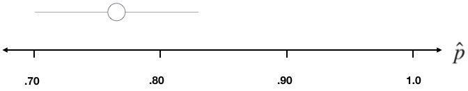
```

### The unknown proportion: p

In classical statistical inference, there is thought to be a fixed but unknown parameter of interest, in this case the population proportion of Americans that are happy.

```
knitr::include_graphics("images/p-01.png")
```

### 

The 2016, the survey drew a small sample of this population...

```
knitr::include_graphics("images/p-02.png")
```

### 

calculated $\hat{p}$ to estimate the parameter, $p$,

```
knitr::include_graphics("images/p-03.png")
```

### 

and quantified the uncertainty in that estimate with a confidence interval.

```
knitr::include_graphics("images/p-04.png")
```

### 

Now imagine what would happen if we were to draw a new sample...

```

```

### 

of the same size from that population and come up with a new p-hat and a new interval. It wouldn't be the same as our first, but it'd likely be similar.

```
knitr::include_graphics("images/p-06.png")
```

### 

We can imagine doing this a third time: a new data sample,

```
knitr::include_graphics("images/p-07.png")
```

### 

a new p-hat and a new interval.

```
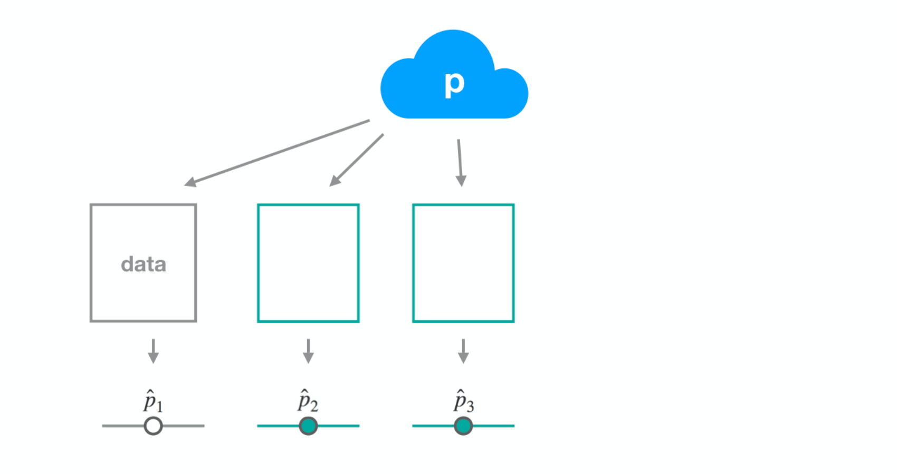
```

### 

We can keep this thought experiment going

```
knitr::include_graphics("images/p-09.png")
```

### 

but what we want to focus on is the properties of this collection of confidence intervals that are accumulating.

```
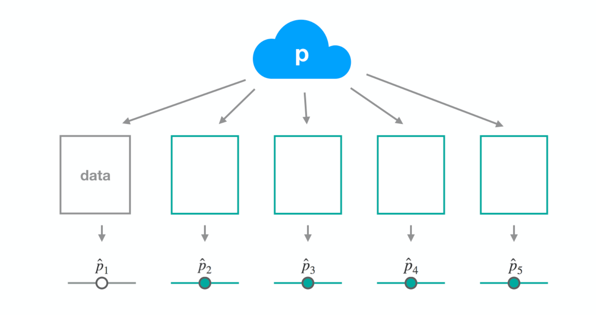
```

### Happiness in 2014

Now let's do the same for another year from the GSS: 2014.

While we can't go out right now and knock on doors to collect a new sample of data, we do have data from previous years that we can treat as separate samples. Let's look at the data from 2014. In that sample, the proportion that are happy is about 0.89.

When we compute a 95% confidence interval, we see it stretches from about 0.83 to 0.94.

```
set.seed(1234)
```

```
gss2014 <- gss %>%
  filter(year == 2014)

p_hat_happy <- gss2014 %>%
  summarize(prop_happy = mean(happy == "HAPPY")) %>%
  pull()

SE_happy <- gss2014 %>%
  specify(response = happy, success = "HAPPY") %>%
  generate(reps = 500, type = "bootstrap") %>%
  calculate(stat = "prop") %>%
  summarize(se = sd(stat)) %>%
  pull()

c(p_hat_happy - 2 * SE_happy, p_hat_happy + 2 * SE_happy)
```

```
knitr::include_graphics("images/gss2014-happy.png")
```

### Happiness in 2012 

Now let's do the same for another year from the GSS: 2012.

When we compute a 95% confidence interval, we see it stretches from about 0.76 to 0.89.

```
set.seed(1234)
```

```
gss2012 <- gss %>%
  filter(year == 2012)

p_hat_happy <- gss2012 %>%
  summarize(prop_happy = mean(happy == "HAPPY")) %>%
  pull()

SE_happy <- gss2012 %>%
  specify(response = happy, success = "HAPPY") %>%
  generate(reps = 500, type = "bootstrap") %>%
  calculate(stat = "prop") %>%
  summarize(se = sd(stat)) %>%
  pull()

c(p_hat_happy - 2 * SE_happy, p_hat_happy + 2 * SE_happy)
```

```
knitr::include_graphics("images/gss2012-happy.png")
```

### 

If we were to continue this process many times, we'd get many different $\hat{p}$s and many different intervals. These intervals aren't arbitrary: they're designed to capture that unknown population parameter $p$.

```
knitr::include_graphics("images/gssMany-happy.png")
```

### 

You can see in this plot that almost all of our intervals succeeded in capturing p, but not all of them. 

This interval missed the mark. If these are 95% confident intervals, they will have the property that if we form a very large collection of intervals, we'd expect that 95% of them would capture the parameter and 5% of them would not.

```
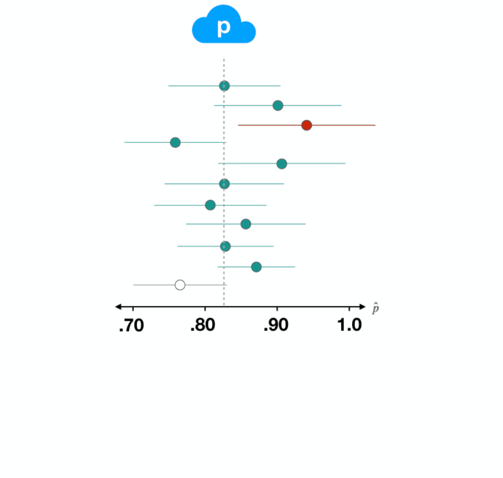
```

### Confidence Intervals

**Interpretation:** "We’re 95% confident that the true proportion of Americans that are happy is between 0.71 and 0.84."

Width of the interval affected by

- `n` 
- confidence level 
- `p` 

This is what is meant by 95% confident. It's a statement about the way that these intervals behave across many samples of data. Another property of intervals that is important to consider is their width, which is effected by three factors: the sample size, n, the confidence level, and the value of the parameter, p.

In the following exercises you'll get the chance to explore these factors and how they effect confidence intervals.

### CIs and confidence level

We learned that for a 95% confidence interval (a confidence level of .95), if we were to take many samples of the same size and compute many intervals, we would expect 95% of the resulting intervals to contain the parameter. Based on the set of confidence intervals plotted here, what is your best guess at the confidence level used in these intervals?

The population proportion is represented by the p in the cloud and the dotted line and each confidence interval is represented by a segment that extends out from it's p-hat. Intervals that capture the true value are in green; those that miss it are in red.

```

```

You can guess the confidence level using the proportion of intervals that contain the true parameter value.

```
question("What is your best guess at the confidence level used in these intervals?",
  answer("0.05", message = "Nope, too low. If the confidence level were this low, nearly all of the intervals would be missing the parameter and be colored red."),
  answer("0.35", message = "Nope, that's a bit off. If the confidence level were 0.35, we'd expect around 0.35 of the intervals to capture the parameter, that is they would be colored green."),
  answer("0.65", correct = TRUE, message = "Great job! About 65% of the intervals plotted contain the true parameter."),
  answer("0.95", message = "Nope, too high. If the confidence level were this high, nearly all of the intervals would be hitting the parameter and be colored green."),
  allow_retry = TRUE
)
```

### SE with less data

The less data that you have to make an estimate, the more uncertainty you will have in that estimate. This is reflected in the standard error. In this exercise you'll develop a feel for this relationship by looking at data sets of different sizes.

Two new smaller data sets have been created for you from `gss2016`: `gss2016_small`, which contains 50 observations, and `gss2016_smaller` which contains just 10 observations.

Using `gss2016_small`, create a bootstrap distribution called `boot_dist_small_n` using the familiar steps:

- `specify` that you're interested in the `consci` variable where success is indicated by having `"High"` confidence.
- `generate` 500 bootstrap replicates.
- `calculate` the `prop`ortion for each.

```
set.seed(47)
```

```
# Create bootstrap distribution for proportion
boot_dist_small_n <- ___ %>%
  # Specify the variable and success
  ___ %>%
  # Generate 500 bootstrap reps
  ___ %>%
  # Calculate the statistic
  ___

# See the result
glimpse(boot_dist_small_n)
```

```
boot_dist_small_n <- gss2016_small %>%
  specify(response = consci, success = "High") %>%
  ___ %>%
  ___
```

```
boot_dist_small_n <- gss2016_small %>%
  specify(response = consci, success = "High") %>%
  generate(reps = 500, type = "bootstrap") %>%
  ___
```

```
boot_dist_small_n <- gss2016_small %>%
  specify(response = consci, success = "High") %>%
  generate(reps = 500, type = "bootstrap") %>%
  calculate(stat = "___")
```

```
# Create bootstrap distribution for proportion
boot_dist_small_n <- gss2016_small %>%
  # Specify the variable and success
  specify(response = consci, success = "High") %>%
  # Generate 500 bootstrap reps
  generate(reps = 500, type = "bootstrap") %>%
  # Calculate the statistic
  calculate(stat = "prop")

# See the result
glimpse(boot_dist_small_n)
```

### 

Next, summarize the `boot_dist_small_n`'s SE with its standard deviation then pull it out and save it to `SE_small_n`.

```
set.seed(47)

boot_dist_small_n <- gss2016_small %>%
  specify(response = consci, success = "High") %>%
  generate(reps = 500, type = "bootstrap") %>%
  calculate(stat = "prop")
```

```
SE_small_n <- ___ %>%
  summarize(se = ___) %>%
  pull()

SE_small_n
```

```
SE_small_n <- boot_dist_small_n %>%
  summarize(se = sd(___)) %>%
  pull()

SE_small_n
```

```
SE_small_n <- boot_dist_small_n %>%
  summarize(se = sd(stat)) %>%
  pull()

SE_small_n
```

### 

Now repeat the process of generating the bootstrap distribution for `gss2016_smaller` and save it to `boot_dist_smaller_n`. *Save yourself some time by copying and pasting the previous code block and swapping the dataset name.*

```
set.seed(47)
```

```
boot_dist_smaller_n <-___ %>%
  ___ %>%
  ___ %>%
  ___

glimpse(boot_dist_smaller_n)
```

```
boot_dist_smaller_n <- gss2016_smaller %>%
  specify(response = consci, success = "High") %>%
  ___ %>%
  ___
```

```
boot_dist_smaller_n <- gss2016_smaller %>%
  specify(response = consci, success = "High") %>%
  generate(reps = 500, type = "bootstrap") %>%
  ___
```

```
boot_dist_smaller_n <- gss2016_smaller %>%
  specify(response = consci, success = "High") %>%
  generate(reps = 500, type = "bootstrap") %>%
  calculate(___)
```

```
boot_dist_smaller_n <- gss2016_smaller %>%
  specify(response = consci, success = "High") %>%
  generate(reps = 500, type = "bootstrap") %>%
  calculate(stat = "prop")

glimpse(boot_dist_smaller_n)
```

### 

Also repeat this process of extracting the SE of `boot_dist_smaller_n` and save it to `SE_smaller_n`. *Copy and paste comes in handy here again.*

```
set.seed(47)
boot_dist_smaller_n <- gss2016_smaller %>%
  specify(response = consci, success = "High") %>%
  generate(reps = 500, type = "bootstrap") %>%
  calculate(stat = "prop")
```

```
SE_smaller_n <- ___ %>%
  ___ %>%
  ___
```

```
SE_smaller_n <- boot_dist_smaller %>%
  summarize(se = sd(stat)) %>%
  ___
```

```
SE_smaller_n <- boot_dist_smaller %>%
  summarize(se = sd(stat)) %>%
  pull()
```

### 

Finally compare the two results! Run the code in the exercise below to see which comparison yields `TRUE`. Based on these results, *how does sample size affect standard error?*

```
set.seed(47)
boot_dist_small_n <- gss2016_small %>%
  specify(response = consci, success = "High") %>%
  generate(reps = 500, type = "bootstrap") %>%
  calculate(stat = "prop")

SE_small_n <- boot_dist_small_n %>%
  summarize(se = sd(stat)) %>%
  pull()

set.seed(47)
boot_dist_smaller_n <- gss2016_smaller %>%
  specify(response = consci, success = "High") %>%
  generate(reps = 500, type = "bootstrap") %>%
  calculate(stat = "prop")

SE_smaller_n <- boot_dist_smaller_n %>%
  summarize(se = sd(stat)) %>%
  pull()
```

```
SE_smaller_n > SE_small_n
SE_small_n > SE_smaller_n
```

### SE with different p

You just saw the effect that _sample size_ can have on inference, but that's not the only variable in play here. Let's return now to our full data set and see what happens to the SE when we consider a category that has a different _population proportion_, p.

Remember that the proportion of "High" confidence in science in 2016 was pretty close to 0.50.

In this exercise, you'll be looking at the variable `meta_region`, which records whether or not the respondent lives in the pacific region of the US. These respondents were fairly rare, which allows you to study how SEs behave in a setting where the proportion is is very far from 0.5, e.g. like the proportion of pacific or not pacific in the plot below.

```
gss2016 <- gss2016 %>%
  mutate(meta_region = fct_collapse(region, pacific = "PACIFIC", other_level = "not pacific"))

ggplot(gss2016, aes(x = meta_region)) +
  geom_bar()
```

### 

Create the bootstrap distribution for the proportion of people that live in the `"pacific"` `meta_region`. Then, calculate the SE of the bootstrap distribution, and compare the SE you calculated to the one from earlier (this is available in your environment as `SE_consci`).

```
set.seed(47)
```

```
boot_dist_low_p <- gss2016 %>%
  ___ %>%
  generate(reps = 500, type = "bootstrap") %>%
  calculate(stat = "prop")

SE_low_p <- boot_dist %>%
  ___(se = ___) %>%
  ___

SE_low_p
```

```
boot_dist_low_p <- gss2016 %>%
  specify(response = meta_region, success = "pacific") %>%
  generate(reps = 500, type = "bootstrap") %>%
  calculate(stat = "prop")
```

```
SE_low_p <- boot_dist_low_p %>%
  summarize(se = sd(stat)) %>%
  pull()
```

```
# Construct the bootstrap distribution
boot_dist_low_p <- gss2016 %>%
  specify(response = meta_region, success = "pacific") %>%
  generate(reps = 500, type = "bootstrap") %>%
  calculate(stat = "prop")

# Calculate the standard error
SE_low_p <- boot_dist_low_p %>%
  summarize(se = sd(stat)) %>%
  pull()

# Compare SEs
c(SE_low_p, SE_consci)
```

## The approximation shortcut

### Confidence Intervals

You calculated two new standard errors.

One when there was less data, and the other where p-hat was low. 

The different values that you observed demonstrate some important properties of standard errors: they will increase  when n is small and also when p is close to 0.5.

In summary, standard errors increase when 

- `n` is small 
- `p` is close to 0.5 


### 

So far we've estimated them using the computational approach of bootstrapping.

```
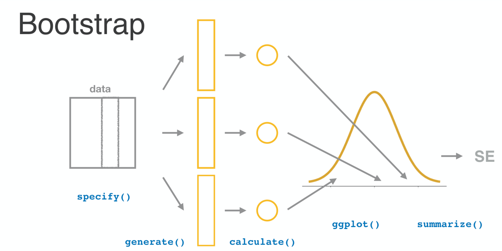
```

### 

There is another method, however, that skips the computation entirely and relies upon an approximation.

```
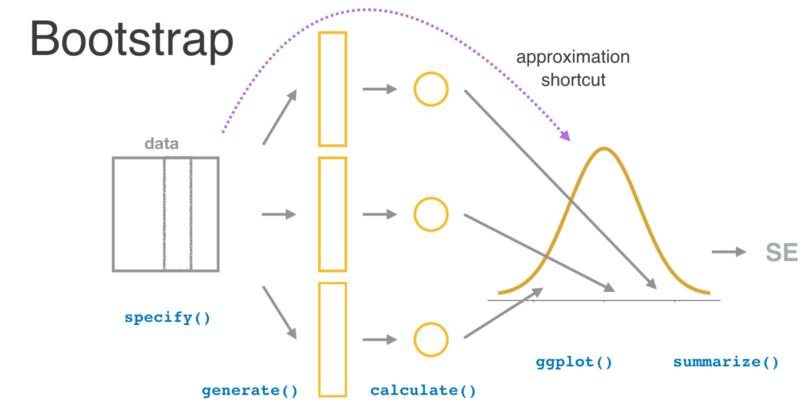
```

### The normal distribution

A.K.A the "bell curve".

**If** 

- observations are independent 
- `n` is large 

**Then** 

- $\hat{p}$ follows a normal distribution  

```
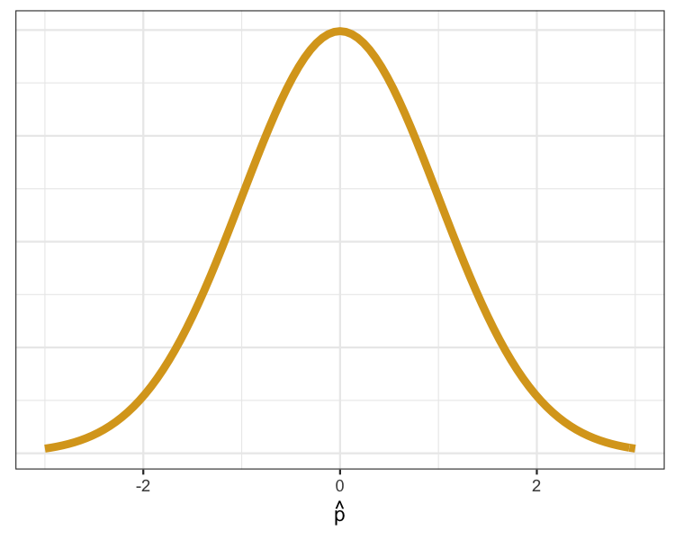
```

That approximation is the normal distribution, also known as the bell curve. A useful result in mathematics says that if you have independent observations and a sufficiently large sample size, then p-hat will follow a normal distribution with a known standard deviation. This distribution is called the sampling distribution of p-hat and it's very similar to the bootstrap distribution in that it captures the variability of our estimate across many possible data sets.

### Standard deviation

$$\sqrt{\frac{ \hat{p} \times (1 - \hat{p})}{n}}$$ 

This standard deviation formula, then, can be used to estimate the standard error for use in a confidence interval.

### Assessing model assumptions

How do we check "observations are independent"? 

- This depends upon the data collection method. 

What does "n is large" mean? 

- $n \times \hat{p} \gt 10$ 
- $n \times(1 - \hat{p}) \gt 10$ 

When applying this result in practice, it's important to be sure that the assumptions of independence and a large sample aren't wildly off base. To assess independence, you need to consider the method by which the data was collected. A handy rule of thumb to determine if your sample size is large enough is to check that n times p-hat and n times 1 - p-hat are both greater than or equal to 10.

### Calculating standard error: approximation

OK, let's try our hand at using this shortcut to find the standard error for the proportion of people that were happy. Let's recompute p-hat, then ask the number of rows in the `gss2016`. That's the sample size, `n`. 

Let's check the rule-of-thumb to see if our sample size is large enough by multiplying n times p-hat and n times 1 minus p-hat. This gives 116 and 35, so our sample size should be sufficiently large. We also know that the gss uses random sampling to draw these observations, so is safe to assume that one person's answer is independent of the next. 

```
p_hat_happy <- gss2016 %>%
  summarize(mean(happy == "HAPPY")) %>%
  pull()

n <- nrow(gss2016)

c(n * p_hat_happy, n * (1 - p_hat_happy))
```

This all means that the shortcut to calculate the standard error should be a reasonably good approximation. This method gives a value of about 0.034.

```
SE_happy_approx <- sqrt(p_hat_happy * (1 - p_hat_happy) / n)
SE_happy_approx
```

### Calculating standard error: computation

How does it compare to our original computational approach using the bootstrap? Well, if we construct the bootstrap distribution for p-hat, then summarize it by finding it's standard deviation, we estimate a standard error of about 0.032. Those are remarkably similar values! Let's go a step farther.

```
boot_dist_happy <- gss2016 %>%
  specify(response = happy, success = "HAPPY") %>%
  generate(reps = 500, type = "bootstrap") %>%
  calculate(stat = "prop")
SE_happy_boot <- boot_dist_happy %>%
  summarize(sd(stat)) %>%
  pull()
SE_happy_boot
```

### Shape of sampling distributions

Let's also take a look at the shape of this bootstrap distribution. A density plot suggests that it's unimodal and symmetric. Let's add a layer to this plot that contains the normal curve that's centered at p-hat has uses the equation to find the standard deviation. And yes, let's make that curve purple.

```
ggplot(boot_dist_happy, aes(x = stat)) +
  geom_density()
```

We see that the normal approximation looks fairly similar to the density curve of our bootstrap distribution. This will be a recurring theme: that when an approximation method exists, it will tend to give very similar results to the computational method when the assumptions of that approximation are reasonable.

### 

Let's add a layer to this plot that contains the normal curve that's centered at p-hat has uses the equation to find the standard deviation. And yes, let's make that curve purple.

```
ggplot(boot_dist_happy, aes(x = stat)) +
  geom_density() +
  stat_function(
    fun = dnorm,
    color = "purple",
    args =
      list(
        mean = p_hat_happy,
        sd = SE_happy_approx
      )
  )
```

We see that the normal approximation looks fairly similar to the density curve of our bootstrap distribution. This will be a recurring theme: that when an approximation method exists, it will tend to give very similar results to the computational method when the assumptions of that approximation are reasonable.

### CI via approximation

The approximation shortcut offers an alternative method of describing the sampling distribution. In this exercise, you will apply the approximation shortcut to build a confidence interval for the proportion of respondents that live in the pacific region.

When building _any_ confidence interval, note that you use three ingredients: the point estimate (here, `p_hat`), the SE, and the number of standard errors to add and subtract. For a sampling distribution that is bell-shaped, adding and subtracting two SEs corresponds to a confidence level of 95%. When you use the bootstrap, you can check that the distribution is bell-shaped because you have a have the bootstrap distribution to plot. When you use the approximation, you're flying blind -- well, not quite blind, but you _are_ dependent on the "rule of thumb" to ensure that you're working with a bell shape.

### CI for meta region

- Calculate the sample size, `n`, which is the number of rows in the `gss2016` data frame.
- Calculated the observed statistic, `p_hat`, as the proportion of people in the "pacific" meta-region.

```
# Calculate n as the number of rows
n <- ___(gss2016)

# Calculate p_hat as the proportion in pacific meta region
p_hat_meta <- gss2016 %>%
  ___(prop_pacific = ___(___ == "___")) %>%
  pull()

# View the result
p_hat_meta
```

```
n <- nrow(gss2016)
```

```
p_hat_meta <- gss2016 %>%
  summarize(prop_pacific = mean(meta_region == "pacific")) %>%
  pull()
```

```
# Calculate n as the number of rows
n <- nrow(gss2016)

# Calculate p_hat as the proportion in pacific meta region
p_hat_meta <- gss2016 %>%
  summarize(prop_pacific = mean(meta_region == "pacific")) %>%
  pull()

# View the result
p_hat_meta
```


### 

Now we'll construct the confidence interval around this proportion.

- Check the rules-of-thumb for the normal distribution being a decent approximation.
- Calculate the standard error using the approximation formula $\sqrt{\frac{\hat{p} \times (1 - \hat{p})}{n}}$.
- Use `SE_meta_approx` to form a confidence interval for `p_hat`. The limits should be two standard errors either side of `p_hat`.

```
# From previous step
n <- nrow(gss2016)
p_hat_meta <- gss2016 %>%
  summarize(prop_pacific = mean(meta_region == "pacific")) %>%
  pull()

# Check conditions
n * p_hat_meta >= ___
n * (1 - p_hat_meta) >= ___

# Calculate SE
SE_meta_approx <- ___

# Form 95% CI
c(___, ___)
```

```
n * p_hat_meta >= 10
n * (1 - p_hat_meta) >= 10
```

```
SE_approx <- sqrt(p_hat_meta * (1 - p_hat_meta) / n)
```

```
# From previous step
n <- nrow(gss2016)
p_hat <- gss2016 %>%
  summarize(prop_pacific = mean(meta_region == "pacific")) %>%
  pull()

# Check conditions
n * p_hat >= 10
n * (1 - p_hat) >= 10

# Calculate SE
SE_approx <- sqrt(p_hat * (1 - p_hat) / n)

# Form 95% CI
c(p_hat - 2 * SE_approx, p_hat + 2 * SE_approx)
```

### Methods compared

Now you have seen two ways to construct a confidence interval for a proportion. Which of the following about the two methods is true?

*Hint:* The approximation method is the classical approach. Computers are needed to make bootstrapping possible, and they haven't been common for that long.

```
question(
  "Which of the following statements is correct?",
  answer("Once the rule-of-thumb condition is violated, the approximation method instantly becomes extremely inaccurate."),
  answer("At a very small sample size, both approaches will perform poorly. Inference on very small data sets is not recommended!", correct = TRUE),
  answer("In traditional surveys and scientific research, the bootstrap approach is more commonly used than the approximation approach.")
)
```

## Congratulations!

You have successfully completed Lesson 1 in Tutorial 5: Statistical Inference.  

What's next?

[Full list of tutorials supporting OpenIntro::Introduction to Modern Statistics](https://bghammill.github.io/)

[Tutorial 5: Statistical Inference](https://bghammill.github.io/ims-05-infer/)

- [Tutorial 5 - Lesson 1: Inference for a single proportion](https://bghammill.github.io/ims-05-infer/ims-05-lesson-01/)
- [Tutorial 5 - Lesson 2: Hypothesis tests to compare proportions](https://bghammill.github.io/ims-05-infer/ims-05-lesson-02/)
- [Tutorial 5 - Lesson 3: Chi-square test of independence](https://bghammill.github.io/ims-05-infer/ims-05-lesson-03/)
- [Tutorial 5 - Lesson 4: Chi-square test for goodness of fit](https://bghammill.github.io/ims-05-infer/ims-05-lesson-04/)
- [Tutorial 5 - Lesson 5: Bootstrapping to estimate a parameter](https://bghammill.github.io/ims-05-infer/ims-05-lesson-05/)
- [Tutorial 5 - Lesson 6: T-distribution](https://bghammill.github.io/ims-05-infer/ims-05-lesson-06/)
- [Tutorial 5 - Lesson 7: Inference for difference in two means](https://bghammill.github.io/ims-05-infer/ims-05-lesson-07/)
- [Tutorial 5 - Lesson 8: Comparing many means](https://bghammill.github.io/ims-05-infer/ims-05-lesson-08/)

[Learn more at Introduction to Modern Statistics](http://openintro-ims.netlify.app/)

<!-- MathJax -->

<script src="https://cdn.mathjax.org/mathjax/latest/MathJax.js?config=TeX-AMS-MML_HTMLorMML" type="text/javascript"></script>

