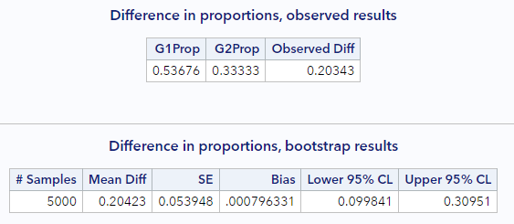
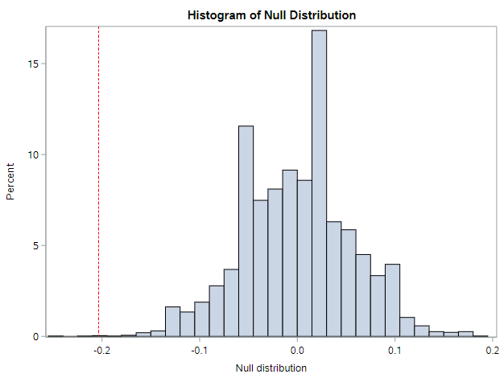
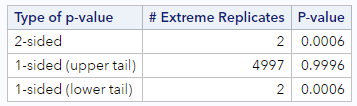
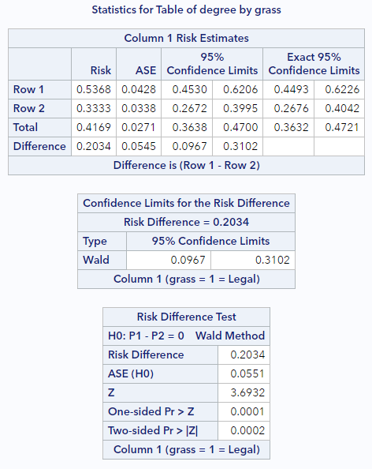

# Inference for a difference of 2 proportions

The next logical target for statistical inference is comparing two proportions. Let's continue from the last lesson with the General Social Survey data on opinions regarding the legalization of marijuana.

```
* Initialize this SAS session;
%include "~/my_shared_file_links/hammi002/sasprog/run_first.sas";

* Makes a working copy of GSS2010 data and check;
%use_data(gss2010);
%glimpse(gss2010);
```

For this lesson, we will compare two groups defined by the educational attainment variable, `degree`. Let's limit the dataset to the groups with lowest (5 = "Less than high school") and highest (2 = "Graduate") educational attainment, so we can see if their opinions differ. (As before, we are also limiting the data to have non-missing information for the `grass` variable.) Then let's calculate the observed proportion of each group that supports legalization of marijuana. 

```
* Limit to data not missing question response;
data gss2010;
	set gss2010(
		where = (
			not missing(grass) and
			degree in (2, 5)
		)
	);
run;

* Calculate proportion of sample favoring legality of marijuana;
proc freq data=gss2010;
	tables degree * grass / nocol nopct;
run;
```

Here we see big differences. Among the 136 respondents with a graduate degree, 53.7% believe marijuana should be legal, compared to only 33.3% of the 195 respondents with less than a high school education. So our difference in proportions (using the less-than-HS group as the reference) is 0.204 (0.537 – 0.333). This is our point estimate for the true difference in proportions between these 2 groups of Americans.

### Confidence interval via bootstrapping

As before, let's estimate a plausible range of values for this difference in proportions using 95% confidence intervals determined using 5,000 bootstrap re-samples. (Remember, no assumptions needed to use the bootstrapping method!)

```
* Load bootstrap macros;
%include "~/my_shared_file_links/hammi002/sasprog/load-randomization.sas";

* Simulate the null distribution of a difference in proportions,
* 5000 permutation samples;
%boot_2props(
	ds = gss2010,
	groupvar = degree,
	g1value = 2,
	g2value = 5,
	compvar = grass,
	cvalue = 1,
	alpha = .05,
	reps = 5000
);
```

The relevant macro this time is `%boot_2props`. We need to specify the dataset, the group variable (and which values identify each of the 2 groups of interest), the comparison variable (and which value identifies the level of interest), the alpha level, and the number of bootstrap samples to generate. As before, since 1 = Legal, we are estimating proportions where people think marijuana should be legal.

Here are my relevant results:



Again, it's always good to check that your look similar. Since randomization is involved, our results won't be exaclty the same, but they should be close.

<u>Bootstrap percentile interval</u>

Let's start with the easier confidence interval. The 95% bootstrap percentile confidence interval for our difference is (0.100, 0.310). One interpretation of this interval is that, with 95% confidence, we expect that the true difference in proportions of Americans who believe that marijuana should be legalized between those with a graduate degree, compared to those with less than a high school edcuation, is between 10.0% and 31.0%.

<u>Bootstrap SE-based interval</u>

Using the bootstrap standard error and the empirical rule, the confidence interval for this difference can also be calculated as:

$$CI = d \pm 2 \cdot SE = 0.203 \pm 2(0.054) = (9.5, 31.1)$$

which is very close to the bootstrap percentile interval and would have a similar interpretation.


### Hypothesis testing via randomization

When dealing with two proportions, we almost always want to test the equality of those proportions. This test can be represented with the following hypotheses, based on two population parameter—the proportion of Americans with a graduate degree who support legalization of marijuana, $$\pi_G$$, and the proportion of Americans with less than a high school education who support legalization of marijuana, $$\pi_L$$.

$$H_0: \pi_G = \pi_L$$, or $$ \pi_G - \pi_L = 0$$

$$H_A: \pi_G \neq \pi_L$$, or $$ \pi_G - \pi_L \neq 0$$

Because a significance level is not given, we will specify $$\alpha = 0.05$$.

To calculate the p-value, we will need to generate a distribution of differences as if the null hypothesis (of no difference) was true. When we have two groups, we can do this simply by shuffling the response variables among the observations. This is also called permuting the data. As with other permutation tests, this will give us a null distribution, from which we can calculate the % of samples with differences as or more extreme (in either direction from the null value) than our observed proportion.

```
* Simulate the null distribution of a difference in
* proportions, 5000 permutation samples;
%permute_2props(
    ds = gss2010,
    groupvar = degree,
    g1value = 2,
    g2value = 5,
    compvar = grass,
    cvalue = 1,
    reps = 5000,
    nullval = 0
);
```

Well, this histogram for the null distribution makes the point pretty clear. We have a very extreme sample that is very unlikely to have arisen from a population where these proportions are truly equal.



The p-value table below the histogram confirms this. 



There were only 2 of 5000 permuted datasets that resulted in a difference as extreme or more extreme than our difference of 0.20. The 2-sided p-value was <0.001. 

Based on this LOW p-value, what can we conclude? (Reject that $$H_0$$!) Because p (<.001) is less than our specified $$\alpha$$, we reject the null hypothesis and conclude that there is a difference between these two proportions. The proportion of Americans with a graduate degree who support legalization of marijuana (54%) is significantly higher than the proportion of American with less than a high school education who support legalization of marijuana (33%).

Now let's use the mathematical approximation methods for these same questions.


## Mathematical model for a difference of 2 proportions

We saw in the last lesson that the central limit theorem applies to proportions. Well, it also applies to a difference in proportions. This means we can again use the normal distribution as an approximation of the sampling distribution of the difference we are trying to making inference about, subject to two model assumptions.

Assumption #1: Independence

* We require the data to be independent within and between the two groups. Whether this is true depends on the sampling and/or data collection method. But, generally, this condition will be satisfied if the data come from two independent random samples or if the data come from a randomized experiment.

Assumption #2: Sufficient sample size

* The general rule of thumb is that we need to have at least 10 successes and 10 failures in each of the groups being compared. Stated mathmatically, both $$np$$ and $$n(1-p)$$ should be greater than or equal to 10 in both groups.

For our data, these assumptions are met. The sampling scheme of the GSS assures independence of observations. And we have well over 10 responses in favor and against the legalization of marijuana in both groups.

### Standard error of a proportion

When these assumptions hold, the estimate of the standard error for a difference in 2 proportions is:

$$SE(p_1 - p_2) = \sqrt{\frac{ p_1 \times (1 - p_1)}{n_1} + \frac{ p_2 \times (1 - p_2)}{n_2}}$$ 

where $$p_i$$ is the observed proportion in group $$i$$ and $$n_i$$ is the number of observations in group $$i$$.

We can use this estimate in the formulas for both the confidence interval and the *z* test statistic calculation.

For our data, using information from previous output generated above, the estimate of the standard error of the difference is:

$$SE = \sqrt{\frac{ .537 \times .463}{136} + \frac{ .333 \times .667}{195}} = 0.054$$ 

How does this compare to our original computational approach using the bootstrap? When rounded to 3 decimal places, it was exactly the same 0.054!

### Confidence interval via approximation

Let's use the SE calculated above to estimate a confidence interval:

$$CI = Observed Statistic \pm z^* \cdot SE$$

But first we need the $$z^*$$ critical value that is associated with 95% confidence (and $$\alpha = 0.05). If you look up that value, you should see that it's (still) 1.96. So our confidence interval for this difference, based on the mathematical approximation, is:

$$CI = 0.203 \pm 1.96(0.054) = (0.097, 0.309)$$

With 95% confidence, we expect that the true difference in proportions of Americans who believe that marijuana should be legalized between those with a graduate degree, compared to those with less than a high school edcuation, is between 9.7% and 30.9%.

### Hypothesis testing via approximation

Following on the test described above, where the hypotheses were

$$H_0: \pi_G = \pi_L$$, or $$ \pi_G - \pi_L = 0$$

$$H_A: \pi_G \neq \pi_L$$, or $$ \pi_G - \pi_L \neq 0$$

and the significance level is $$\alpha = 0.05$$, we can calculate a *z* statistic as:

$$z = \frac{Observed Statistic - Null Value}{SE}$$

For our data, this is:

$$z = \frac{0.203 - 0.0}{0.054} = 3.76$$

That's a pretty big *z* score. We should expect a low p-value. Using our z-score probability calculator, we see that p < 0.001. (By the way, this level of precision is fine for a small p-value. We don't gain much by reporting p = 0.0002, compared to p < 0.001.)

We will draw the same conclusion as with the randomization methods above. Because p (<.001) is less than 0.05, our specified $$\alpha$$, we reject the null hypothesis and conclude that there is a significant difference between the proportion of Americans with a graduate degree who support legalization of marijuana (54%) and the proportion of American with less than a high school education who support legalization of marijuana (33%).

### Approximation results via SAS

We can again leverage SAS PROC FREQ to do this for us. The code required to request a test for a difference in 2 proportions, along with a confidence interval for that difference, is:

```
* Calculate difference in proportions of 2 groups 
* favoring legality of marijuana;
proc freq data=gss2010;
	tables degree * grass / nocol nopct riskdiff(equal var=null cl=wald);
run;
```

Things to know:

* Put the group variable first in the tables statement, and put the response variable second (`tables group * response`)
* The `riskdiff` option is doing the work here. This option itself has many options. Stick with the ones here (`equal var=null cl=wald`) for now.
* This syntax will calculate the difference between the groups on the proportion defined by the value of the response variable that shows up in the first column. If you would rather use the value of the response that shows up in the second columns, you can apparently use the `column = 2` option in addition to the other `riskdiff` options above.

Run the code above to see the output relevant to the difference in proportions. It should look like this:



Here's what to notice:

* The "Row 1" and "Row 2" labels refer to the contingency table directly above and whichever groups appears in each row. For us, Row 1 is the group with a graduate degree. The values in these rows under the Risk column reflect the proportions of interest for these groups.
* The middle table ("Confidence Limits for the Risk Difference") indicates both the risk difference and the normal-based confidence interval. This is (9.7%, 31.0%), which is just what we calculated by hand. 
* The bottom table ("Risk Difference Test") lists the asymptotic standard error (ASE), which is the normal-based SE of the difference. (Again, similar to what we calculated by hand above.) This table also shows the (very small) 2-sided p-value for our test.


That's all there is to it. You have successfully completed this tutorial.

# [< Back to Section 5](https://bghammill.github.io/ims-05-infer/)


<!-- MathJax -->

<script src="https://cdn.mathjax.org/mathjax/latest/MathJax.js?config=TeX-AMS-MML_HTMLorMML" type="text/javascript"></script>

