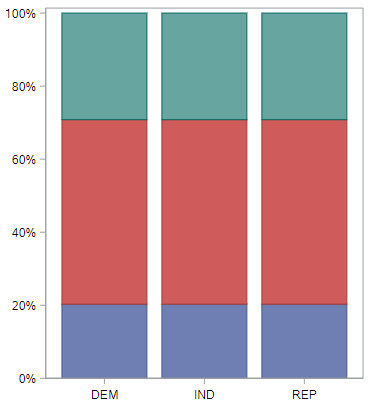

# Chi-square test of independence

In the last lesson, you learned methods that allow you to test the relationship between two two-level categorical variables. In this lesson we introduce the chi-square test that is used for testing categorical variables with any number of levels. As the book noted, we will only perform hypothesis testing (via randomization and via a mathematical model) for this data situation, since there is no readily interpretable statistic available. This means there is not confidence interval calculation to worry about.

For this tutorial, let's investigate the relationship between political party affiliation (Republican, Democrat, or Independent) and opinions on whether the government is spending too much money, too little money, or about the right amount of money on national defense and, separately, on space exploration. These data come from the 2016 General Social Survey.

```
* Initialize this SAS session;
%include "~/my_shared_file_links/hammi002/sasprog/run_first.sas";

* Makes a working copy of GSS2010 data and check;
%use_data(gss2016);
%glimpse(gss2016);
```

We're going to create a new variable named `PARTY` to limit the number of options available in the `PARTYID` source variable. The other variables are named `NATARMS` and `NATSPAC`, which we will leave as is. Let's take a look at those variables before and after recoding.

```
* Check a few variables;
proc freq data=gss2016;
	tables partyid natarms natspac / missing;
run;

* Recode Party ID and add a few labels;
data gss2016;
	set gss2016;
	
	* Create new PARTY variable;
	select(partyid);
		when (1, 2) party = "DEM";
		when (3, 4, 5) party = "IND";
		when (6, 7) party = "REP";
		otherwise delete;
	end;
	
	* Label our 2 variables;
	label
		party = "Party affiliation"
		natarms = "Opinion on spending for nat'l defense"
		natspac = "Opinion on spending for space exploration"
	;
run;

* Check our new variable;
proc freq data=gss2016;
	tables party natarms natspac / missing;
run;
```

You'll notice that we deleted one person who reported affiliation with some other party. So the final sample size is 149. 

## Research hypotheses

The research hypotheses we will test are not as specific as others we have talked about to date, in that there is not a specific numerical claim about one or more parameters of the population. Instead, we will express our hypotheses using words. For the two relationships of interest, we have:

*For defense spending*

* $$H_0$$: Party affiliation is not associated with opinions on national defense spending
* $$H_A$$: Party affiliation is associated with opinions on national defense spending

*For space exploration*

* $$H_0$$: Party affiliation is not associated with opinions on national spending for space exploration
* $$H_A$$: Party affiliation is associated with opinions on national spending for space exploration

As before, the null hypothesis reflect "no difference", it just uses words instead of an equation to get that point across.

## Descriptive analysis of the relationship

A good way to visualize the relationship between two variables, to start, is with a stacked bar chart.

```
* Stack bar chart for NATARMS by PARTY;
proc sgplot data=gss2016 pctlevel=group;
	vbar party / group=natarms stat=percent;
run;
```

We are using percentages here since the group sizes are so different. This helps us see the patterns better. And what do we see? If we look at the two major parties, we learn that a much larger proportion of Republicans than Democrats think we spend too little on the military.

Do we see similar differences regarding spending for space exploration?

```
* Stack bar chart for NATSPAC by PARTY;
proc sgplot data=gss2016 pctlevel=group;
	vbar party / group=natspac stat=percent;
run;
```

Not really. Opinions here are much more similar.

## Chi-squared test statistic

When you look at the bar plots that relate party to spending on space exploration and spending on the military, you get two very different stories. But these figures are only suggestive of a relationship. By now you should know that we'll need to perform a hypothesis test if we want to evaluate whether or not the data behind these graphs provide convincing evidence that a relationship exists in the population of all Americans.

Recall that in a hypothesis test you specify the variables you're studying, assume a hypothesis of "no difference" for generating null data, then for each data set calculate a relevant test statistic that you can compare to your observed test statistic. In this case, since we're interested in the association between two variables, but there is no obvious single statistic to calculate. The null relationship is obviously that the variables are independent (not related), but what test statistic should we use?


### Choosing a statistic

What we'd like is a test statistic that can capture how different each of these bar plots is from the bar plot that shows absolutely no relationship. That's the difference between this observed distribution


and this null distribution for defense spending.


Hopefully it's obvious before you saw the null-based plot that when the null distribution is true, all the groups will have the same distribution of opinions. And for the space exploration spending question, this is what the observed distribution


and null distribution look like.



These plots, though, are built from proportions, and a statistic will be be easier to build from counts. And for that, contingency tables are helpful.

Let's start with the space exploration question. Here is how we generate the observed contingency tables for this question:

```
* Contingency table of PARTY by NATSPAC;
proc freq data=gss2016;
	tables party * natspac / nocol nopct;
run;
```

This generates frequencies and percentages within each value of `party`. What we'd like to know is the counts in each table cell that we could expect if these two variables were independent from one another. It's tempting to think that the counts of all cells should be equal, but keep in mind we have to respect the marginal distributions of both variables. (A marginal distribution is just a one-way frequency distribution.) For example, we need to be sure we're still expecting that there are more independents in our data set than republicans; and we need to maintain the fact that more people think spending for space exploration is "about right" than "too little."

For this particular question, the marginal distribution of `party` and `natspac` within the sample of size 149 are:

| Party affiliation (PARTY) | Marginal proportion |
| ------------------------- | ------------------- |
| Democrat                  | 43                  |
| Independent               | 72                  |
| Republican                | 34                  |

| Opinion on spending (NATSPEC) | Marginal proportion |
| ----------------------------- | ------------------- |
| Too little                    | 30                  |
| About right                   | 76                  |
| Too much                      | 43                  |

Computing these expected counts while respecting the marginal distributions is a bit tedious, so we'll generally rely on SAS to do this, but it's important to understand how to calculate these. For any particular cell in the contingency table, the expected count is:

$$Expected Count = \frac{RowTotal - ColumnTotal}{SampleSize}$$

Some examples:

* For the combination Democrat x Too little, the expected count is $$43 \cdot 30 / 149 = 8.7$$
* For the combination of Independent x Too much, the expected count is $$72 \cdot 43 / 149 = 20.8$$

The total of the expected counts should add up to the total sample size.

To have SAS do this for us, we add the following option to the contingency table code above:

```
* Contingency table of PARTY by NATSPAC;
proc freq data=gss2016;
	tables party * natspac / nocol nopct expected;
run;
```

You should have a table that looks like this:


Notice that the little legend to the top left of the table now indicates that the middle value printed in each cell is the expected count. (They are right below the observed counts and above the by-group percentages.) The two expected counts we calculated above match what's here.

We're halfway there. Now we just need to summarize the difference between the expected table and the observed table in a single number. One option would be to simply find the difference in the observed and expected counts in each cell and add them all up. That does result in a single number, but because the positive differences and the negative differences will cancel one another out, it won't work for us. We can fix that by squaring each of those differences so that they're now positive. That's a big improvement but notice that the cells that have very large counts to begin with will dominate this sum. To put the cells on more even footing, will divide each squared difference by the expected count.

So each cell's contribution to our statistic will be $$\frac{(Observed - Expected)^2}{Expected}$$. And the test statistic will be the sum

$$\chi^2 = \sum \frac{(Observed - Expected)^2}{Expected}$$

Some examples:

* For the combination Democrat x Too little, the observed count is 8 and the expected count is 8.7, for a contribution to the overall statistic of $$\\frac{(8 - 8.7)^2}{8} = 0.061$$.
* For the combination Independent x Too much, the observed count is 22 and the expected is 20.8, for a contribution to the overall statistic of $$\\frac{(22 - 20.8)^2}{22} = 0.065$$.

If we do that for all 9 cells in the table, we will get $$\chi^2 = 1.33$$.

If we do the same for the `party` by `natarms` table, we will get $$\chi^2 = 18.97$$.

### Chi-squared distance

This statistic that we've just formulated is called the *chi-squared statistic*. It captures the distance between an observed contingency table and the table you would expect if the variables were independent of one another. We found that the observed statistic for the relationship between `party` and `natspac` was 1.33 and we find a much large statistic of 18.97 for the relationship between `party` and `natarms`.

With this statistic in hand, we can return to the hypothesis test to answer the question of if either of these observed statistics is so great as to lead you to reject the null hypothesis that these spending priorities are independent of political party.

### Randomization chi-square

As we've seen before, the key to generating data under a null hypothesis of independence is *permutation*, where we will do the following repeatedly:

* Randomly shuffle the values of the response among the sample observations
* Calculate the chi-square statistic for each permuted sample

This will generate the null distribution of chi-square statistics, against which we can compare our observed chi-square statistic. One unusual thing about the chi-square distribution, however, is that we are only interested in a 1-tailed test, not a 2-tailed test. In particular, we are interested in the number of null distances (chi-square statistics) *to the right* of our observed statistic. Because the the chi-square statistic is always positive (due to the squared term in the numerator the formula), this tail is the one that contains null statistics that are more common when the hypothesis of independence is false.

Let's generate the null distribution for the space exploration by party identification analysis:

```
* Randomization chi-square test for PARTY x  NATSPAC, 5000 reps;
%permute_2chisq(
    ds = gss2016,
    groupvar = party,
    compvar = natspac,
    reps = 5000
);
```

You should get output similar to this histogram and this "extreme observations" table.


From the histogram, we can see how common and not interesting our sample is for this particular comparison. Remember, values to the right are more extreme or "different from the null" than our sample. This is confirmed by the p-value of 0.86. Over 86% of the null statistics were as or more extreme than our observed statistic. This means we cannot reject the null hypothesis (at almost any $$\alpha$$!). We would conclude that we do not have enough evidence to conclude that opinions on funding for space exploration differ by party affiliation.

How about for opinions about spending on national defense?

```
* Randomization chi-square test for PARTY x  NATARMS, 5000 reps;
%permute_2chisq(
    ds = gss2016,
    groupvar = party,
    compvar = natarms,
    reps = 5000
);
```

Oh, very different.


From the histogram, we can see how unusual our sample is. There are only a few values to the right that are more extreme than our sample. This is confirmed by the p-value of 0.001. Under 1% of the null statistics were as or more extreme than our observed statistic. This means we reject the null hypothesis (assuming $$\alpha = 0.05$$) and conclude opinions on funding for national defense differ by party affiliation.

## Approximation via chi-squared distribution

Now you have some experience conducting a hypothesis test of independence using the chi-squared statistic and permutation. Next, you'll learn how to conduct the same test using an approximation method. This is the most commonly-used way to formulate the null distribution, so let's dive in.

The only approximation distribution we've talked about to date is the Normal distribution. This can be used to approximate the null distribution when the statistic is a proportion or a difference in proportions and the sample size is large.

In the case of the chi-squared statistic, the distribution is called, conveniently enough, the chi-squared distribution. You'll sometimes see it written out in words and other times given the Greek letter chi, or $$\chi$$. The shape of this distribution is determined by one parameter called the *degrees of freedom*. Here are three different chi-squared distributions, with one, three, and five degrees of freedom. You'll note that they're all positive and they're all right skewed, but as the degrees of freedom increases, the mean increases. You can find the appropriate degrees of freedom for your test by taking the number of rows (*r*) minus one and multiplying it by the number of columns (*c*) minus one.

- Statistic: $$\hat{\chi}^{2}$$
- Shape is determined by degrees of freedom
- $$df = (r - 1) (c - 1)$$


For both of the questions we explored above, where each variable in the contingency table has 3 levels, the degrees of freedom for the $$\chi^2$$ statistic is:

$$df = (r - 1)(c - 1) = (3-1)(3-1)=(2)(2)=4$$ 

So the appropriate chi-squared distribution to use is the one with four degrees of freedom, which is somewhere between the green and the blue curves in the figure above.

To find a p-value according to this distribution, we just use the Excel p-value workbook and enter our observed chi-square statistic. No further transformation of that statistic is necessary. The probability returned is the 1-sided, right-tailed probability.

If we do this for our two questions:

* `party` by `natspac`, $$\chi^2 = 1.33$$ (with 4 *df*), *p* = 0.856
* `party` by `natarms`, $$\chi^2 = 18.97$$ (with 4 *df*), *p* = <0.001

Not surprisingly, these are both very close to the p-values from the permutation approach.


### Chi-squared distribution assumptions

Like the normal distribution, the chi-squared distribution only becomes a good approximation when the sample size is large. A good rule of thumb is that the expected counts in each cell should be five or greater. And, of course, we need the observations in the sample to be independent of each other.

Assumptions:

- Observations are independent
- All expected counts are $$\ge$$ 5 (sometimes you'll see this relaxed, so that $$\ge$$ 80% of the cells are $$\ge$$ 5)


### Connection to the z-test

You may be wondering how the results would compare if we used the chi-square test instead of the z-test for 2-group comparisons of dichotomous proportions. Well, the results are actually mathematically identical. With a 2-by-2 contingency table, the degrees of freedom is equal to 1, and for *df* = 1, the chi-square statistic is equal to the z-statistic squared ($$z^2$$). (Subject to using the pooled variance in the z-test.)

You can see this using the Excel workbook if you'd like. Check what p-value you get for the following 2 statistics:

* z = 1.60 (look at the 2-tailed test)
* $$\chi^2$$ (with 1 *df*) = (1.6)(1.6) = 2.56

It should be 0.1096 for each.


### Violations of the assumptions

When the assumption for the chi-square approximation are not met, there are primarily two options: (1) Use the randomization test specified above (with the %permute_2chisq macro). One of the nice things about randomization tests is that they do not rely on any assumptions. (2) Use Fisher's Exact test.

Fisher's test is called "exact" because is it actually not an approximation at all. All possible combinations of the responses are determined and, through a very specific probability distribution, each combination is assigned a probability. From this complete distribution, it is possible to calculate the probability of getting a sample as or more extreme than the observed sample.

You don't need to know the specifics of this test beyond the description above, but let's work through an example by reloading the GSS data and looking at the relationship between religious affiliation and belief in an afterlife. We should note that this is not a perfect example, since only 2 of the 99 respondents in the analysis report being Jewish. In practice, we would probably not include that group in the analysis, since it's hard to learn much about a group from a sample of size 2. But this example is useful for illustrative purposes.

```
* Reload GSS data and recode to keep only specific religions;
%use_data(gss2016);

data gss2016;
	set gss2016(
		where=(relig in (2, 3, 4))
	);
run;
```

Let's look at the expected counts for a contingency table of `relig` by `postlife`:

```
* Get expected counts;
proc freq data=gss2016;
	tables relig * postlife / nocol nopct norow expected;
run;
```

Do any of the cells in this table have expected counts less than 5? Yes! In fact, 3 of the 6 cells have very small expected counts. So a chi-square approximation here is not going to work. If you try, SAS will warn you.

```
* Perform chi-square inappropriately;
proc freq data=gss2016;
	tables relig * postlife / nocol nopct chisq;
run;
```

Do you see the warning that SAS prints?


If you ever see that, you should use one of the alternatives listed above. What happens with very small cells is that the chi-square statistic is inflated, which leads to a p-value that is too small. Here, the p-value associated with the chi-square test is 0.0003.

So we could run a permutation (randomization) test, as:

```
* Randomization chi-square test for RELIG x POSTLIFE, 10000 reps;
%permute_2chisq(
    ds = gss2016,
    groupvar = relig,
    compvar = postlife,
    reps = 10000
);
```

This gives a p-value of 0.0079. Still significant, but considerably larger than 0.0003.

We could also request the Fisher's exact test:

```
* Run Fishers exact test;
proc freq data=gss2016;
	tables relig * postlife / nocol nopct exact;
run;
```

This produces a small table of output:


The p-value from here is yet larger, at 0.0150.

In this case, the hypothesis test would have come to the same conclusion, but in other cases, the significance of a test can change when you use a Fisher's exact test instead of an inappropriate chi-square test. So be on the look-out for violated assumptions in chi-square analyses. It happens more than you think it will.


You have successfully completed this tutorial.

# [< Back to Section 5](https://bghammill.github.io/ims-05-infer/)


<!-- MathJax -->

<script src="https://cdn.mathjax.org/mathjax/latest/MathJax.js?config=TeX-AMS-MML_HTMLorMML" type="text/javascript"></script>

