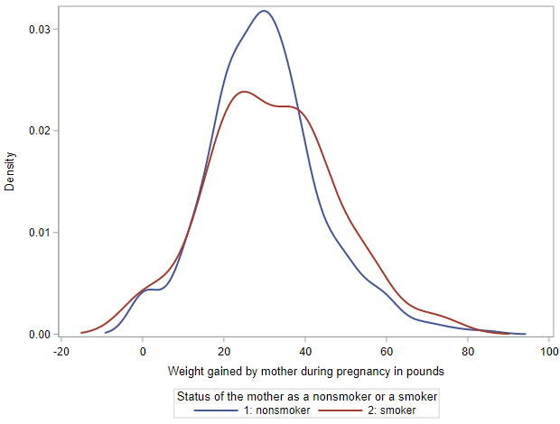
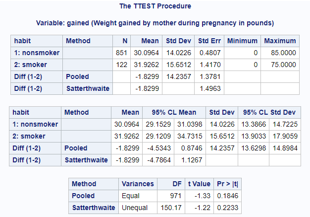

# Inference for a difference in two means

Now let's look at estimating confidence intervals and testing for differences between two means. We're going to continue to explore the NCBIRTHS dataset.

By the way, the 1000 records in this dataset come from a larger dataset released to the public by the state of North Carolina. These data have been of interest to medical researchers who are studying the relation between habits and practices of expectant mothers and the birth of their children. We want to evaluate whether there is a difference between weight gain during pregnancy to mothers who smoke compared to mothers who don't smoke. 

Let's load these data and exclude the rows where information about the mother's smoking habit, `habit`, or the mother's weight gain is missing.

```
* Initialize this SAS session;
%include "~/my_shared_file_links/hammi002/sasprog/run_first.sas";

* Load randomization macros;
%include "~/my_shared_file_links/hammi002/sasprog/load-randomization.sas";

* Makes a working copy of NCBIRTHS data and check;
%use_data(ncbirths);
%glimpse(ncbirths);

* Remove observations with missing data;
data ncbirths;
	set ncbirths(
		where=(
			not missing(habit) and
			not missing(gained)
		)
	);
run;
```

As usual, before we start the inference procedures, let' s calculate mean weight gain by group and take a look at the observed distributions in both groups:

```
* Observed weight gain for each group;
proc means data=ncbirths;
	var gained;
	class habit;
run;

* Overlapping density plots for weight gain by group;
proc sgplot data=ncbirths;
	density gained / group=habit type=kernel;
run;
```

Among the 851 non-smoking mothers, the mean weight gain was 30.1 pounds (with a standard deviation of 14.0 pounds). Among the 122 mothers who smoked, the mean weight gain was 31.9 pounds (with a SD of 15.7 pounds). This gives us a difference of 1.8 pounds, where mothers who smoked gained more weight than non-smoking mothers. (We'll use non-smoking mothers as the reference category for this entire lesson.)

The overlaid density plots help us see these differences graphically. While the lower end of the weight gain range was similar for both groups, the right tail of the smoking group is definitely thicker.



## Bootstrapping for confidence intervals

Let's first use our assumption-free randomization methods to get a confidence interval around this difference. For each bootstrap re-sample, we are going to calculate the mean of each group, then record the difference, in order to get the bootstrap distribution.

As is typical, we will generate 10,000 bootstrap re-samples. This time, we will use the bootstrap standard error to calculate a 95% confidence interval.

```
* Bootstrap confidence interval, difference in two means, 10000 samples;
%boot_2means(
	ds = ncbirths,
    groupvar = habit,
    g1value = 2,
    g2value = 1,
    compvar = gained,	
	alpha = 0.05,
	reps = 10000
);
```

My results indicated a bootstrap SE of 1.5 pounds. In order to generate an approximate 95% CI, we just add and substract $$2SE$$ to our point estimate.

$$CI = 1.8 \pm 2(1.5) = (-1.2, 4.8)$

So, with 95% confidence, we expect the true mean weight gain during pregnancy among mothers in North Carolina who smoked to be between 1.2 pounds lower and 4.8 pounds higher than weight gain among mothers in NC who didn't smoke.

Given this confidence interval, what do you think the hypothesis test is going to find?

## Randomization test for hypothesis testing

Let's perform a test, using a 0.05 significance level, with a null hypothesis of no difference in weight gain during pregnancy between these groups. The alternative hypothesis would be one that posits a difference. 

* $$H_0: \mu_{S} - \mu_{NS} = 0$$ pounds
* $$H_A: \mu_{S} - \mu_{NS} \neq 0$$ pounds

Since we have two groups and a hypothesis of no difference (or independence), we can shuffle the observed outcomes within the data over and over again to simulate the null hypothesis scenario. And, as usual, we'll count the number of differences between groups in this null distribution that are as or more extreme than our observed difference of 1.8 pounds.

```
* Permutation test, 2 means, 10000 replications;
%permute_2means(
    ds = ncbirths,
    groupvar = habit,
    g1value = 2,
    g2value = 1,
    compvar = gained,
    reps = 10000
);	
```

If we look at the histogram of the null distribution that is output, we see that it is centered at 0, our null value for the difference. 

Based on my output, the 2-sided p-value from this randomization test is 0.184. At $$\alpha = 0.05$$, our result is not statistically significant and we cannot reject the null hypothesis. We do not have enough evidence to conclude that mean weight gain during pregnancy in NC is different for mothers who smoke compared to mothers who don't smoke.

Now let's move to the mathematical model.

## Assumptions required for the *t*-distribution

In order to be able to rely on the *t*-distribution as a suitable approximation, our data must meet the following two assumptions:

* The sample observations must be independent, both within groups and between groups. As we have discussed before, you assess this assumption based on your knowledge of sampling design and measurement methodology.
* In both groups, we need either sufficient sample size ($$n \geq 30$$) or underlying data that is normally distributed (when $$n < 30$$).

When the data meet these conditions, the difference in means will follow a *t*-distribution with $$min(n_1 - 1, n_2 - 1)$$ degrees of freedom. (The true *df* is more challenging to calculate, but this is a decent approximation.)

The NC birth data meet both of these criteria. We have no indication that the mothers represented in these data are not independent, and the sample sizes (851 and 122) are plenty large.

For this approximation, we will rely on a *t*-distribution with 121 degrees of freedom, since $$min(122 - 1, 851 - 1) = min(121, 850) = 121$$.

## Confidence intervals with the *t*-distribution

The formula for a 95% confidence interval around our observed difference in means will take the form: 

$$CI = SampleStatistic \pm t^{*}_{df} \times SE$$

We already know our sample statistic. The difference in means between these two groups was 1.8 pounds.

The appropriate $$t^*$$ critical value, for a *t*-distribution with 121 *df* and a confidence level of 95% (which corresponds to a significance level of $$\alpha = 0.05$$) is 1.98.

The standard error associated with a difference in two means, based on each groups sample size and observed variability is:

$$SE = \sqrt{s^{2}_1/n_1 + s^{2}_2/n_2}$$

For our data, using the SD values we calculated at the beginning of this lesson,

$$SE = \sqrt{15.7^{2}/122 + 14.0^{2}/851} = 1.50$$

So our approximation-based 95% confidence interval is:

$$CI = 1.8 \pm 1.98(1.50) = (-1.2, 4.8)$$ pounds

This is exactly the same as we found above. And the interpretation we use there works here as well. With 95% confidence, we expect the true mean weight gain during pregnancy among mothers in North Carolina who smoked to be between 1.2 pounds lower and 4.8 pounds higher than weight gain among mothers in NC who didn't smoke.

## Hypothesis testing with the *t*-distribution

To test the hypotheses listed above, we will calculate our *t*-statistic as:

$$T = \frac{SampleStatistic - NullValue}{SE}$$

where the sample statistic is the difference in means, $$\bar{x}_{S} - \bar{x}_{NS}$$, the null value is the hypothesized value, and the SE is as described above, $$SE = \sqrt{s^{2}_1/n_1 + s^{2}_2/n_2}$$. The degrees of freedom for this $$t$$-statistic is 121, as above.

For our data, we have the following:

* The sample statistic, $$\bar{x}_{S} - \bar{x}_{NS}$$, is 1.8 pounds
* The null difference is 0 pounds
* The SE is 1.50 (calculated in the prior section)
* The $$df$$ is 121

So our $$t$$-statistic is:

$$T = \frac{1.8 - 0}{1.50} = 1.2$$

Using the Excel workbook, we find that the p-value is associated with this $$T$$ with 972 $$df$$ is 0.233. This leads to the same conclusion as for the randomization test. We do not have enough evidence to conclude that mean weight gain during pregnancy in NC is different for mothers who smoke compared to mothers who don't smoke.

## Inference for a difference in two means using SAS

As with the one-sample *t*-test, SAS can give us a two-sample *t*-test, and confidence intervals around the difference in means, with `PROC TTEST`. For our example, this is the syntax:

```
* T-test for two means, plus confidence interval;
proc ttest data=ncbirths;
	var gained;
	class habit;
run;
```

And here is the SAS output:



Note that SAS has ordered the groups differently than we ordered the groups for our randomization test and for our by-hand calculations. It's quite possible, but not always trivial to reorder things in SAS. So, if we'd like this output to match our problem set-up above, for the time being, all we'll need to do is flip the signs of the following quantities:

* The estimated difference in mean
* The confidence interval limits
* The *t*-statistic

An important point about this output is that we are always looking at the <u>Satterthwaite</u> method results. This is the version of the *t*-test that does not assume equal variances between our study groups.

So, find the following pieces of information in the top panel of the output above:

* The observed mean (SD) for non-smokers = 30.1 (14.0)
* The observed mean (SD) for smokers = 31.9 (15.7)
* The estimated difference between these means (-1.8) and the standard error of this difference (1.5) [Satterthwaite method]

We use the second panel of the output to find the confidence intervals for each group's mean and for the difference. So be sure you can find the following:

* The 95% CI for the mean of non-smokers = (29.2, 31.0)
* The 95% CI for the mean of smokers = (29.1, 34.7)
* The 95% CI for the estimated difference between these means = (-4.8, 1.1) [Satterthwaite method]

The third panel has our test statistic and p-value:

* *t*-statistic = -1.22 [Satterthwaite method]
* p-value = 0.223 [Satterthwaite method]

Note that values may differ slightly here from above based on the fact that we rounded a few of the quantities in our manual calculations. However, the conclusions remain the same.


You have successfully completed this tutorial.

# [< Back to Section 5](https://bghammill.github.io/ims-05-infer/)

<!-- MathJax -->

<script src="https://cdn.mathjax.org/mathjax/latest/MathJax.js?config=TeX-AMS-MML_HTMLorMML" type="text/javascript"></script>

