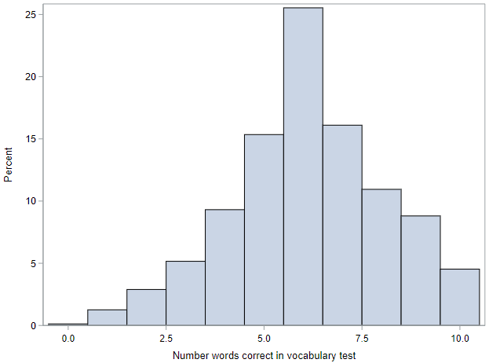

# Comparing many means

So far, we discussed inference on a single mean as well as inference for comparing two means. Next we move on to comparing many means simultaneously.

Our motivating data comes from the General Social Survey. The two variables of interest are vocabulary score, `wordsum`, and self-identified social class, `gssclass`. We'll be assessing whether or not a respondent's vocabulary score is associated with their self-reported social class or not.

The vocabulary score is calculated based on the number of correct answers on a ten-question vocabulary test, where a higher score means better vocabulary, and self-identified social class has 4 levels: lower, working, middle, and upper class.

Let's load the data and set up the SAS environment:

```
* Initialize this SAS session;
%include "~/my_shared_file_links/hammi002/sasprog/run_first.sas";

* Load randomization macros;
%include "~/my_shared_file_links/hammi002/sasprog/load-randomization.sas";

* Makes a working copy of GSS_WORDS data and check;
%use_data(gss_words);
%glimpse(gss_words);
```

### Exploratory data analysis

Before we conduct inference, let's look at the distribution of each of these variables, alone and in combination.

```
* Exploratory data analysis for WORDSUM & GSSCLASS;
proc sgplot data=gss_words;
	histogram wordsum / binwidth=1;
run;

proc sgplot data=gss_words;
	vbar gssclass;
run;

proc sgplot data=gss_words;
	hbox wordsum / group=gssclass grouporder=ascending;
run;

proc means data=gss_words n mean std var;
	var wordsum;
	class gssclass;
run;
```

The distribution of vocabulary scores is shown with a histogram. The scores range between 0 and 10. The distribution is centered around 6, and looks roughly symmetric. There is a bit of a left skew, but nothing overly dramatic. 



The distribution of social class is shown using a bar chart. The bulk of the respondents identified as working class or middle class, with many fewer in the outer categories.


And the distributions of vocabulary scores across the levels of (self-identified) social class are shown using a series of box plots. There do seem to be differences by class, with the vocabulary score increasing across the first three classes (lower to middle).


Something to note here, that will be important for later, is that the variability of vocabulary scores within each of the groups is generally similar. Look especially at the width of the boxes (representing the middle 50% of the data). For three of the groups, these are nearly identical. For the last group (Upper class), it is a little bit wider, but we may be able to chalk this up to having a small sample size.

Finally, we calculate the observed mean (SD) vocabulary score for each group. The mean score ranges from 5.1 among lower class respondents  to 6.8 among the middle class respondents. We can also see from this table that all of the SDs are reasonably similar, ranging between about 1.9 and 2.3.


## ANOVA

In order to conduct inference for this situation (comparing more than two means), we need to use <u>AN</u>alysis <u>O</u>f <u>VA</u>riance, or ANOVA.

The research hypotheses for an ANOVA are as follows:

* $$H_0$$: The mean vocabulary score is the same across all social classes; $$\mu_{lower} = \mu_{working} = \mu_{middle} = \mu_{upper}$$
* $$H_A$$: The mean vocabulary score for __*at least one*__ social class differs from the others. 

Notice that the alternative hypothesis __is not__ that the scores for all of the social classes are different! The negation (opposite) of assuming every group is equal is assuming that at least one group is different.

The general idea with ANOVA is to partition the total variability of the outcome into different buckets. The total variability of vocabulary scores is just the variance in scores of all survey respondents, ignoring social class, and we can partition it into two sets:

- Variability that can be attributed to differences in social class, also known as **between-group** variability. This is really what we're interested in.
- Variability attributed to other factors within social class, also known as **within-group** variability. This variability is not what we are interested in and is somewhat of a nuisance factor. If everyone within a certain social class had the same vocabulary score, then we would have no within-group variability and we would be able to more easily compare the vocabulary scores across groups. However, this is almost never the case, and we need to account for the variability within the groups we are interested in. 

## Parametric ANOVA

To understand this partitioning, let's look at the parametric (mathematical method) output of an ANOVA model from SAS. This is

```
* ANOVA for WORDSUM by GSSCLASS;
proc anova data=gss_words;
	class gssclass;
	model wordsum = gssclass;
run;
```

The key output is this table, which is referred to as the ANOVA table:


The first row (Model) reflects the between-group variability of the vocabulary score. The second row (Error) reflects the within-group variability of the vocabulary score. And the third row (Total) reflects total variability of the vocabulary score. We often refer to the first row as the "group", or "model" row, and the second row as the "error" row. 

The values in the Sum of Squares column are calculated similarly to how we calculate the variance, except that they are not scaled by the sample size.

* Row #1: Sum of squares between / group (SSG) = $$\Sigma n_j (\bar{X}_j - \bar{X})^2$$, where $$n_j$$ is the number of observations and $$\bar{X}_j$$ is the mean value within within group $$j$$ 
* Row #2: Sum of squares error (SSE) = $$\Sigma \Sigma (X - \bar{X}_j)^2$$
* Row #3: Sum of squares total (SST) = $$SSG + SSE$$ = $$\Sigma \Sigma (X - \bar{X})^2$$

See how each of these is a sum of squared deviations?

The values in the Mean Square column *are* scaled, but not by sample size. They are scaled by the degrees of freedom listed for each column. For reference, $$n$$ is the total number of sample records and $$k$$ is the number of groups.

* Row #1: Mean square between / group (MSG) = $$SSG / df_{SSG}$$, where $$df_{SSG} = k - 1 $$
* Row #2: Mean square error (MSE) = $$SSE / df_{SSE}$$, where $$df_{SSG} = n - k$$
* Row #3: Total variance (not shown) = $$SST / df_{SST}$$, where $$df_{SSG} = n - 1 $$

If the mean square value in the final row were listed, you would be able to see and confirm that it was the total variance in vocab scores within the sample.

The "F Value" in the next column is our observed statistic. We'll talk about that statistic and its distribution in the next section, but know that it is calculated as $$MSG / MSE$$, as the ratio between the “between” and “within” group variabilities. The p-value associated with this statistic is shown in the last column.

Without yet knowing how that p-value was calculated, we can still draw a conclusion relative to our hypotheses. With a p-value < 0.001, we can reject the null hypothesis that all of the groups have equal vocabulary scores. At least one of the groups has a score that is different from the others.

Knowing the basics of this ANOVA table is critical. Here's the general set-up:

| Source        | df    | Sum of Squares  | Mean Square         | F         |
| ------------- | ----- | --------------- | ------------------- | --------- |
| Model / Group | k - 1 | SSG             | MSG = SSG / (k - 1) | MSG / MSE |
| Error         | n - k | SSE             | MSE = SSE / (n - k) |           |
| Total         | n - 1 | SST = SSE + SSG |                     |           |


### F-distribution

ANOVA uses a test statistic $$F$$, which represents a standardized ratio of variability between the group means relative to the variability within the groups. If $$H_0$$ is true and the model conditions are met (discussed below), the *F*-statistic follows an *F*-distribution with two degrees of freedom: $$df_1 = k - 1$$ and $$df_2 = n - k$. That's right, there are 2 degrees of freedom for this distribution.

In the figure below, you see that the *F*-distribution is right skewed! There are no negative values for this distribution! Thus, for every hypothesis test, **only** the upper tail of the *F*-distribution is used to calculate the p-value.


Similar to the *t*-distribution, the *F*-distribution is defined by degrees of freedom. Except, now there are two different degrees of freedom, the degrees of freedom of the groups and the degrees of freedom of the residuals. 

These degrees of freedom are called the "numerator" and "denominator" degrees of freedom, since they correspond to the mean squares used in the calculation of the *F*-statistic. The "numerator" degrees of freedom is the number of groups you have minus 1 (here: 4 - 1). The "denominator" degrees of freedom is the total number of observations minus the number of groups (here: 795 - 4). 

We can evaluate the probability of any *F*-statistic within the Excel workbook.


## Conditions for ANOVA

Just like any other approximation-based inference method we've encounter so far, there are mathematical conditions that need to be met for an ANOVA as well. Since we cannot mathematically "prove" that these conditions have been "met," we will use a careful eye to evaluate the degree to which each condition may be violated. 

There are three main conditions for ANOVA.

* Independence: Within groups the sampled observations must be independent of each other, and between groups the groups must be independent of each other as well. 
* Approximate normality: The distributions within each group should be nearly normal. As with the various *t*-tests, having enough sample size and no extreme outliers is typically sufficient here.

* Constant variance: The variability of the distributions of the response variable within each group should have roughly the same variance.

We shouldn't have any concerns about these conditions in these data.

## Randomization-based ANOVA

If the condition of normality *is* violated, then the *F*-distribution is a poor approximation for what the true sampling distribution of the *F*-statistics looks like. Instead, we should use a more robust method. The familiar randomization methods from before can be extended into the ANOVA framework.

In the case of an ANOVA, the statistic we are interested in is the *F*-statistic. While we can plot this statistic on an *F*-distribution, is really is just another statistic that we can calculate (like the mean or median) and summarize across thousands of permuted samples. We like this statistic because it allows for us to summarize how different multiple means are from each other, relative to how variable the observations are within each group. And we can still calculate a p-value as the percentage of null samples where the test statistic was at least as extreme as our observed statistic.

So let's do this (and know that this could take a while to run):

```
* Randomization test for ANOVA;
%macro permute_anova(
    ds =,
    lib = work,
    groupvar =,
    compvar =,
    reps = 5000
);
```

Our observed *F*-statistic is 21.73, which is very, very far to the right of the normal distribution. So far, in fact, that it doesn't even appear on our histogram of null statistics. This leads to a very small p-value of <0.001.

Similar to before, with this p-value we can conclude that *at least one* of the classes has a different mean `wordsum`. But, you might wonder, which of the classes are different? That's where post-hoc testing come in. 


## Post-hoc testing

So far we've introduced ANOVA as a method for comparing many means to each other concurrently. Finding a statistically significant result at the end of an ANOVA, however, only tells us that at least one pair of means are different, but not which pair of means are different. To test any particular pair of means, we'll use a *t*-test. But in this case, what we're talking about is performing lots and lots of *pairwise* *t*-tests, in order to see which groups differ.

Unfortunately, performing lots and lots of hypothesis test has a major downside. We have to be worried about the inflation in the Type I error rate. Remember that a Type I error is when we reject the null hypothesis when it is actually true. We specify a threshold for the percentage of times we are willing to make this type of error by selecting an $$\alpha$$. So, an $$\alpha$$ of 0.05, says we are willing to make a Type I error 5% of the time. 

If we think about performing multiple *t*-tests all at a 5% significance level, then our error rate begins to grow. Specifically, if we perform 10 tests all with an $$\alpha$$ of 0.05, the probability of not making a Type I error for each test is $$(1- \alpha)$$. If we then compute the overall probability of not making a Type I error we'd have $$1 - (1- \alpha)^n \approx n \cdot \alpha$$. For 10 tests at a $$\alpha$$ of 0.05, the probability of not making a Type I error is approximately 50%. That's not very unlikely!  

So, what we're interested in is *controlling the Type I error rate*, when performing many pairwise tests in the quest for identifying the groups whose means are truly significantly different from each other.

Fortunately, there is a simple solution to this problem: use a modified significance level. 

That is, we'll use a "family" error rate, and then distribute that total error among each of the tests we are performing. The "family" error rate specifies an overall Type I error rate we are willing to have for **all** of tests you wish to perform. 


### Multiple comparisons

Testing many pairs of groups is called multiple comparisons. 

A common modification we use when doing multiple comparisons is the Bonferroni correction. This correction fixes a "family" error rate which then transfers to a more stringent significance level for each of the pairwise tests. 

More specifically, we will adjust our "family" $$\alpha$$ by the number of comparisons we are doing. 

The Bonferroni corrected significance level can be calculated as the original significance level ($$\alpha$$) divided by the number of pairwise comparisons to be carried out. 

If we think back to our days in Algebra, we can calculate the total number of tests using combinatorics. Specifically, for $$k$$ groups we will have $${k \choose 2}$$ possible pairwise tests. This number of tests can be calculated as $$\frac{k \cdot (k - 1)}{2}$$, where k is the number of groups in the ANOVA.

### Compare pairwise means

In SAS, we can compute all of the pairwise $$t$$-tests within PROC ANOVA. Here's the relevant code to run:

```
* ANOVA, including pairwise differences;
proc anova data=gss_words;
	class gssclass;
	model wordsum = gssclass;
	means gssclass / bon cldiff alpha=0.05;
run;
```

The MEANS statement requests the pairwise differences. Other options include:

* BON requests the Bonferroni correction of the total $$\alpha$$. There are many other options for modifying the family-wise Type 1 error rate, but this is the simplest;
* CLDIFF requests confidence intervals for each of the differences, and
* ALPHA sets the family-wise Type 1 error rate. It is 0.05 by default, but included here for completeness.

Let's look at the actual output of this new statement.


Things to notice:

* There are 12 comparisons listed here, although only six of these comparisons are unique. SAS just outputs all comparisons is both directions for us.
* There are no actual p-values here. The first line of the table indicates that the three asterisks (***) is our indication about which of these comparisons are statistically significant at the Bonferroni-corrected $$alpha$$.

So which groups does this procedure actually indicate are different?

* Middle vs. Working: Middle class respondents had a mean score that was just over 1 point higher than working class respondents.
* Middle vs. Lower: Middle class respondents also had a mean score that was almost 1.7 points higher than the lower class respondents.

That's it. Just those 2 comparisons. There is one more comparison with a difference greater than 1 point (Upper v. Lower), but this comparisons did not reach statistical significance. This is almost certainly due to the limited sample sizes of these groups.

Remember that we can only look at pairwise comparisons if the overall ANOVA is statistically significant. And when we look at these pairwise comparisons, we need to correct our $$\alpha$$.


You have successfully completed this tutorial.

# [< Back to Section 5](https://bghammill.github.io/ims-05-infer/)


<!-- MathJax -->

<script src="https://cdn.mathjax.org/mathjax/latest/MathJax.js?config=TeX-AMS-MML_HTMLorMML" type="text/javascript"></script>

