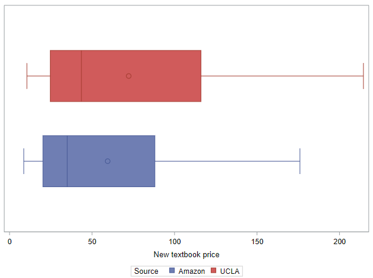
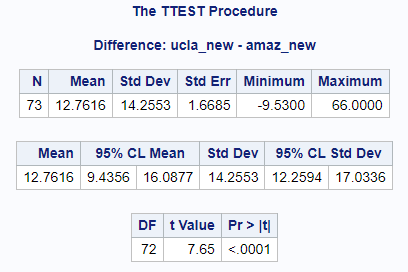
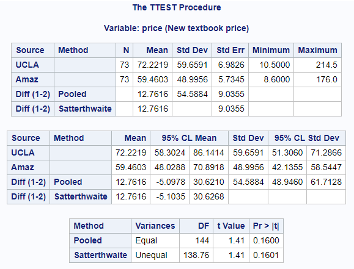

# Inference for two means, paired data

Next we discuss how we estimate the mean difference between data coming from two dependent groups, in other words, paired data. First, the good news: there's not much new here. We'll quickly see that we can summarize paired data in a way that allows us to re-use techniques we've already learned!

Let's reuse the TEXTBOOKS dataset that has information about prices for textbooks used at UCLA. We want to use these data to understand the difference in UCLA and Amazon prices.

```
* Initialize this SAS session;
%include "~/my_shared_file_links/hammi002/sasprog/run_first.sas";

* Load randomization macros;
%include "~/my_shared_file_links/hammi002/sasprog/load-randomization.sas";

* Makes a working copy of TEXTBOOKS data and check;
%use_data(textbooks);
%glimpse(textbooks);
```

 Using box plots for these prices, how do the distributions look similar? How are they different?



Both distributions are highly variable and right-skewed. It does appear that the UCLA prices are higher than the Amazon prices, especially at the higher end.


### Analyzing paired data

In cases where we have had two means, previously, we have had to assume independence in order to use a two-sample *t*-test. So can the UCLA and Amazon prices for a given textbook be assumed to be independent of each other? No way. Because both prices reflect some underlying cost for the same textbook, it is almost certain that they share information.

When two sets of observations have this special correspondence (repeated observations), they are said to be paired. And to analyze paired data, it is often useful to look at the difference in outcomes of each pair of observations. Here, for example, for each textbook, we would subtract their Amazon price from their UCLA price to create a new variable, `price_diff` , that holds the difference between these prices.

Let's do that now:

```
* Calculate the price difference for each textbook;
data textbooks;
	set textbooks;
	
	price_diff = ucla_new - amaz_new;
	label price_diff = "Price difference, UCLA vs. Amazon";
run;
```

Now we can summarize the differences directly. So let's look at the distribution of those differences and summarize their mean and standard deviation (along with the means and standard deviations of the original prices):

```
* Histogram of price differences;
proc sgplot data=textbooks;
	histogram price_diff;
run;

* Summarize the prices and price differences;
proc means data=textbooks n mean std median q1 q3 maxdec=2;
	var ucla_new amaz_new price_diff;
run;
```

We see that, on average, the mean UCLA price for these textbooks is $72.22 and the mean Amazon prices is $59.46, for a difference in the means of $12.76.

When analyzing the differences directly, we find that the mean difference among these 73 textbooks is $12.76 with a standard deviation of $14.26. (Notice here we are talking about the "mean difference" rather than the "difference in means." That is not an accident, it is how we talk about the mean of paired data.) 

Mathematically, it is expected that the mean of the differences will equal the difference of the means. This fact actually reinforces the idea that by making inference about the mean difference, we are making inferences about the difference in means. We're just taking advantage of the paired nature of the data to make stronger inferences. (We'll demonstrate that later.)

How we proceed from here is not new. Since we have a single continuous variable (the difference) that we would like to create a confidence interval and would like to test, we can simply use the methods already introduced for single means. It's as easy as that. Let's recap those methods here, briefly.

## Bootstrapping for confidence intervals

In order to get a randomization-based confidence interval around the mean difference, we will use bootstrapping. And, as before, we have the choice of calculating this interval using either the bootstrap standard error method or the bootstrap percentile method. Again, we will choose simplicity and use the percentile method:

```
* Bootstrap confidence interval, single mean, 10000 samples;
%boot_1mean(
	ds = textbooks,
	dovar = price_diff,
	alpha = 0.05,
	reps = 10000
);
```

What interval do you get? Mine was ($9.67, $16.22). A standard interpretation of this interval might be to say that, with 95% confidence, we expect the true mean difference in textbook prices between UCLA and Amazon to be between $9.67 and $16.22.

But a good interpretation should clearly convey directionality, in other words tell us which group is bigger than the other. So consider something like: We are 95% confident that the average UCLA textbook price is between $9.67 and $16.22 higher than the average Amazon textbooks price.

## Bootstrapping for hypothesis testing

In order to test that this mean difference against a null hypothesized value, we will again rely on the shifted bootstrap re-sampling method.

The question of interest is: Do the data provide convincing evidence of a difference between the average UCLA and Amazon prices for textbooks? We'll use a 5% significance level.  

We only have 1 parameter here, which is the mean difference in prices, $$\mu_d$$, and we'd like to test that the mean difference is different from $0. (But we could, if we wanted, compare the mean difference to some other quantity.) This gives us the following research hypotheses:

* $$H_0: \mu_d = $0$$, or there is no difference between the average UCLA and Amazon prices.
* $$H_A: \mu_d \neq $0$$, or there is a difference between the average UCLA and Amazon prices.

We use the `%test_1mean` SAS macro to perform this test using randomization methods:

```
* Hypothesis testing, single mean, 10000 samples;
%test_1mean(
	ds = textbooks,
	dovar = price_diff,
	nullval = 0,
	reps = 10000
);
```

This difference is so statistically significant that the line reflecting our observed difference doesn't even appear on the histogram. This indicates just how unlikely it would be to see a difference of $12.76 if the null hypothesis (no difference) were really true. (We probably shouldn't be surprised by this result given that the lower limit of the confidence interval, above, is nowhere near $0.)

To conclude, based on the output, the 2-sided p-value from this randomization test is <0.001. At $$\alpha = 0.05$$, we reject the null hypothesis, and conclude that the average price of textbooks at UCLA is significantly higher than the average prices of textbooks at Amazon.

## Mathematical approximation methods for paired means

Assumptions for *t*-based inference of paired data mirror those for a single sample.

* The sample observations must be independent. This is a different discussion than the idea that the two means that make up the difference are dependent. That prior discussion was just to reinforce that we cannot reasonably use the two-sample *t*-based inference methods here. Once we have reduced those two data points into a single variable, we no longer have to worry about that kind of dependence. But we still require that the different observations are not related.

* The underlying data must be normally distributed. Because a difference between two normally distributed variables <u>is</u> normally distributed, we are back to worrying about sample size. When *n* < 30, we just do not want to see any clear outliers; and when *n* is 30 or larger, we are almost always OK assuming the underlying data are normally distributed.

The textbook data meet both of these criteria.

## Confidence intervals with the *t*-distribution

In order to use the *t*-distribution as our mathematical approximation for calculating a 95% confidence interval, we again use the formula:

$$CI = SampleStatistic \pm t^{*}_{df} \times SE$$

Everything we saw previously for the one-sample CI is true here, too:

* The sample statistic is the sample mean. In this case, that is the mean difference, $$\bar{x}_d$$, where, in our data, $12.76.
* The critical value, $$t^*$$, is again the value of the *t*-distribution associated with the requested confidence level, where the degrees of freedom is $$n_d - 1$$, where $$n_d$$ is the number of observations on which we calculated differences. For our data, $$df = 73 - 1 = 72$$, so $$t^*$$ is 1.99.

* The standard error associated with a mean difference is $$s_d / \sqrt{n_d}$$, where $$s_d$$ is the standard deviation of the differences. For our data, $$SE = 14.26 / \sqrt{73} = 1.67$$.

So our approximation-based 95% confidence interval is:

$$CI = 12.76 \pm 1.99(1.67) = ($9.44, $16.08)$$

This is pretty close to the bootstrap CI from above. We would interpret this the same way. We are 95% confident that the average UCLA textbook price is between $9.44 and $16.08 higher than the average Amazon textbooks price.

## Hypothesis testing with the *t*-distribution

And to test the hypotheses described above, we will calculate a one-sample *t*-statistic as: 

$$T = \frac{SampleStatistic - NullValue}{SE}$$

where the sample statistic is the sample mean, $$\bar{x}_d$$, the null value is the hypothesized difference, and the SE is as described above, $$s_d / \sqrt{n_d}$$. This $$t$$-statistic will also have $$n - 1$$ degrees of freedom.

For our data, we have the following:

* The sample statistic, $$\bar{x}_d$$, is $12.76
* The null value is $0.00
* The SE is 1.67 (calculated in the prior section)
* The $$df$$ is 72 (also calculated in the prior section)

So our $$t$$-statistic is:

$$T = \frac{12.76 - 0}{1.67} = 7.64$$

The p-value is still super small, <.001, which leads to the same conclusion as for the randomization test. We reject the null hypothesis and conclude that there is a significant difference between textbook prices at UCLA and Amazon.

## Inference for one mean using SAS

To analyze these differences using SAS, we actually have two options with `PROC TTEST`. We can simply analyze the differences:

```
* T-test for one mean, plus confidence interval;
proc ttest data=textbooks;
	var price_diff;
run;
```

Or we can ask SAS to calculate the differences for us from two source variables that appear on the same record:

```
* T-test for paired data, plus confidence interval;
proc ttest data=textbooks;
	paired ucla_new * amaz_new;
run;
```

The mean listed second is treated as the reference, so this syntax would give us the same positive difference as the `price_diff` variable.

Is doesn't matter which version you use because the output is exactly the same, except for the title. Here is the output from the second code block above:



All the expected output is here. And everything matches with the approximation-based results presented above.


## Treating paired data as unpaired?

If you forgot that you had paired data, you might just conduct a two-sample *t*-test for answer a question where a paired *t*-test was more appropriate. But would you end up with a different conclusion? Let's see.

We have to rearrange the data a little bit to make this work, but here is the SAS code to do  that and for conducting a two-sample test:

```
* Treat paired data as unpaired?;
data wrong;
	set textbooks;
	
	Source = "UCLA"; price = ucla_new; output;
	Source = "Amazon"; price = amaz_new; output;
		
	label
		price = "New textbook price"
		source = "Textbook vendor"
	;
run;

* T-test for two means, plus confidence interval;
proc ttest data=wrong order=data;
	var price;
	class source;
run;
```

Let's look at that output, especially compared to the one-sample test results from above.



Wow, except for the difference ($12.76) these results are very, very different.

* The confidence interval around the difference is ($5.10, $30,63)
* The p-value associated with the test of no difference is 0.160, which would lead us to *not* reject the null hypothesis

How can that be? We would draw a completely different conclusion from a two-sample test. The answer has everything to do with variability. There is so much variability within each set of prices, that the difference in the means is small by comparison. By working with differences directly, we are eliminating the variability in prices across textbooks and focusing on the variability "within" textbooks. Just as we've seen here, ensuring that you take advantage of paired data, when present, can often lead to very different analysis results.

You have successfully completed this tutorial.

# [< Back to Section 5](https://bghammill.github.io/ims-05-infer/)


<!-- MathJax -->

<script src="https://cdn.mathjax.org/mathjax/latest/MathJax.js?config=TeX-AMS-MML_HTMLorMML" type="text/javascript"></script>


