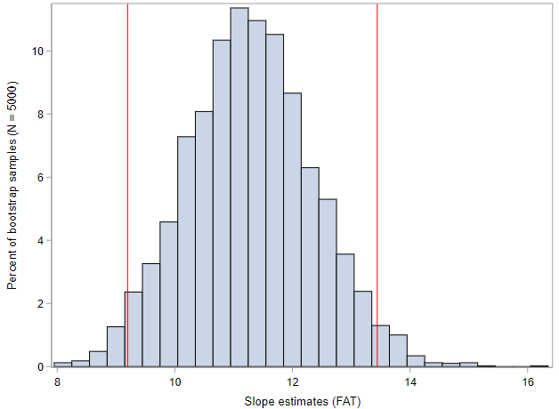

# Randomization methods for simple regression

So far in this class, we have used regression models (linear & logistic) to summarize the relationship between one or more explanatory variables and an outcome variable. And while this descriptive analysis of the sample data is useful, we would now like to use regression models to draw conclusions about the larger population using statistical inference. Specifically, by performing a statistical test of a regression slope, we will be able to say whether or not our sample data support the hypothesis that there is a relationship between two variables; and by estimating confidence intervals, we will be able to quantify a plausible range of values for the true slope of the linear regression line.

As an example, we have a data set, named STARBUCKS, that contains information about the nutritional content of a sample of menu items at Starbucks. We would like to quantify the relationship between grams of fat (as the explanatory variable) and calories (as the outcome variable). Since both of these are numerical variables, a linear regression is the appropriate statistical method. Let's load those data and take a look at the relationship between grams of fat, `fat`, and total calories, `calories`, using a scatterplot.

```
* Initialize this SAS session;
%include "~/my_shared_file_links/hammi002/sasprog/run_first.sas";

* Load randomization macros;
%include "~/my_shared_file_links/hammi002/sasprog/load-randomization.sas";

* Makes a working copy of STARBUCKS data and check;
%use_data(starbucks);
%glimpse(starbucks);

* Make scatterplot of CALORIES by FAT;
proc sgplot data=starbucks;
	scatter x=fat y=calories;
run;
```

Based on the scatterplot, the association between fat content and calories is clear and positive. Food items at Starbucks with high fat content have more calories. Remember, if there was no relationship, we would expect to see a cloud of points without a discernable pattern.

Let's run a regression of `calories` by `fat` to see the observed slope estimate for a regression of the form, $$Calories = \beta_0 + \beta_1 \cdot Fat + \epsilon$$.

```
* Regression of CALORIES on FAT;
proc reg data=starbucks outest=est;
	model calories = fat;
run;
```

The slope estimate is about 11.3 calories. And the interpretation is that for every additional gram of fat in a Starbucks food item, we expect the caloric content to increase by 11.3 calories.

In order to assess if this estimate is truly different from zero (i.e., no association), we need to perform a formal statistical test. The research hypotheses for this test, relative to the regression model specified above, would be:

$$H_0: \beta_1 = 0$$

$$H_A: \beta_1 \neq 0$$

If the null hypothesis here were true, there would be no association between fat content and caloric content.

## Randomization Test for Slope

As we have done with each of the different data scenarios in the second half of the course so far, we will start here with randomization methods. By repeatedly permuting the outcome (calories) across the different observations (i.e., values of fat content) and estimating a regression slope each time, we will be able to generate a null distribution of slope estimates against which we can compare our observed result.

For simple regression, this can be done as follows:

````
* Randomization test for slope;
%permute_simple_reg(
    ds = starbucks,
    x = fat,
    y = calories,
    reps = 5000
);
````

Based on these 5000 permuted datasets, it is clear that our observed data are very extreme, given a null hypothesis of no association. None of the permuted datasets exhibited a slope about ~5 calories, meaning our p-value is very, very small... <0.001. As we would expect, our null distribution is centered at zero (or no effect).

The results of this test would lead us to reject the null hypothesis and conclude that fat content is significantly associated with caloric content. 

If we wanted to get a confidence interval around our observed slope estimate, we could use bootstrap methods.


## Bootstrapping a Confidence Interval for Slope


Because interest is now in creating a CI, there is no null hypothesis, so there won't be any reason to permute either of the variables. We just need to treat our sample as representative of the source population and resample these data with replacement. Within each resample we estimate the regression and use the slope values to generate a bootstrap distribution (which will be centered around the slope of the observed regression line, instead of some null value).

Let's see what 5,000 bootstrap sample from our Starbucks data yields:

```
* Bootstrap CI for slope;
%boot_simple_reg(
    ds = starbucks,
    x = fat,
    y = calories,
    reps = 5000
);
```

For me, the bootstrap distribution looks like this, with the red lines representing the extent of the middle 95% of values.



Those lines correspond to a 95% confidence interval of (9.2, 13.4) calories. Meaning, with 95% confidence, for each additional gram of fat within a Starbucks food item, we expect the caloric content to increase by 9.2 to 13.4 calories. Was your confidence interval close to this?

And this was the bootstrap percentile CI. What would your 95% confidence interval look like if you have used the bootstrap SE ($$Observed \pm 2 SE$$)?

We would normally segue right into the mathematical approximation methods here, but the mathematical model for regression inference has a number of assumptions that are somewhat involved. So we'll tackle those in the next lesson.


You have successfully completed this tutorial. 

# [< Back to Section 5](https://bghammill.github.io/ims-05-infer/)


<!-- MathJax -->

<script src="https://cdn.mathjax.org/mathjax/latest/MathJax.js?config=TeX-AMS-MML_HTMLorMML" type="text/javascript"></script>

