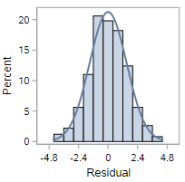
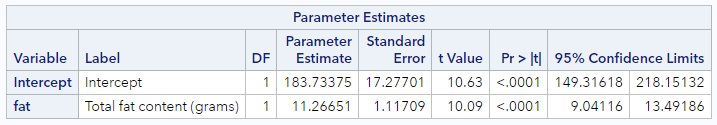

# Mathematical methods for model inference

We can also use mathematical methods for making inference from regression model output. But, as with any approximation-based statistical inference, there are specific conditions that need to be met. We will only be able to apply these methods if the data points are linear, independent, normally distributed, and have equal variability around the line.  These conditions are given by the linear model equation as well as spelled out using the LINE mnemonic.

> Model: $$Y = \beta_0 + \beta_1 \cdot X + \epsilon$$, where $$\epsilon \sim N(0, \sigma_\epsilon)$$
>
> Conditions:
>
> * L: __linear__ model 
> * I: __independent__ observations 
> * N: points are __normally__ distributed around the line 
> * E: __equal__ variability around the line for all values of the explanatory variable 

If the sampling distribution isn't accurate, the p-values and confidence intervals that you calculate could be wrong.

Apart from the assumption of independence, there are specific figures that SAS generates which are useful for assessing these conditions. Independence, of course, is only assessable by understanding how the sample and data were generated

Let's take a look at the others conditions one by one. We need to load a few specific contrived datasets for this, along with the Starbucks data.

```
* Initialize this SAS session;
%include "~/my_shared_file_links/hammi002/sasprog/run_first.sas";

* Makes a working copy of needed data;
%use_data(linear);
%use_data(nonnormal);
%use_data(nonlinear);
%use_data(nonequal);
%use_data(starbucks);
```

We will be relying on a number of different plots that SAS PROC REG generates as regression diagnostics when ODS graphics are requested. We turn on this setting in the `run_first.sas` program, but in your own projects, if you aren't seeing the diagnostic graphs, issue the following command and try again: `ods graphics on;`.

The full panel of diagnostic graphs looks like this:


We have previously used the graphs in the top-right on this panel to identify outliers and influential data points. For assessing the model conditions required for inference, we will be relying on the figures in the top-left (residual by predicted values) and bottom-left (histogram of residuals). Additionally, SAS produces a plot of residuals by x-values immediately after this panel that will be useful. It looks like this:


### Condition: Linear model

If the linear model is appropriate, a plot of the residuals versus the fitted values should show a non-patterned scattering of the points. Remember that we calculate the fitted value as $$\hat{Y}_i = b_0 + b_1 X_i$$ and the residual as $$e_i= Y_i - \hat{Y}_i$$. This plot is located at the top-left plot of the Fit Diagnostics output panel. 

Let's first look at the output for data that meet this condition:

```
* Regression of OUTCOME on EXPLANATORY (linear data);
proc reg data=linear;
	model response = explanatory;
run;
```

In fact, these data meet all the conditions, so we'll keep coming back to this output to demonstrate well-behaved data.

The residual plot below from this regression—with fitted values plotted on the x-axis and residuals plotted on the y-axis—shows a scattering of points which do not indicate any violation of this technical condition.


The residual plot for truly non-linear data, however, will demonstrate a clear violation of the linear model condition.  

```
* Regression of OUTCOME on EXPLANATORY (non-linear data);
proc reg data=nonlinear;
	model response = explanatory;
run;
```


The variables have a quadratic relationship, not a linear one! For the technical conditions to hold, you need a non-patterned scattering of points. 

### Condition: Normally distributed

The condition of normality is not exactly as you might expect it to be. We do not need the outcome variable ($$y$$) or the explanatory variable ($$x$$) to be normally distributed overall. Instead, we need the outcome variable ($$y$$) to be normally distributed *given the $$x$$ values*. And the best way to assess this is to check a histogram of the residuals ($$\epsilon$$). This plot is located at the bottom-left plot of the Fit Diagnostics output panel. 

Let's first look at the output for our well-behaved data that meet this condition:

```
* Regression of OUTCOME on EXPLANATORY (linear data);
proc reg data=linear;
	model response = explanatory;
run;
```

This residual histogram is reasonably bell-shaped and symmetric, so we should be comfortable assuming normality in this situation.



The histogram of residuals for non-normal data, however, will look decidedly less symmetric. As for these data: 

```
* Regression of OUTCOME on EXPLANATORY (non-normal data);
proc reg data=nonnormal;
	model response = explanatory;
run;
```


While the violation here might not be completely obvious, these residuals are definitely right skewed. It's possible a variable transformation of some sort is required to fix this issue.

### Condition: Equal variance

The last condition we will investigate is the assumption of equal variability in the outcome variable across different values of the explanatory variable. To assess this condition we use the plot of residuals by x-variable values that SAS produces. We would like this plot to also reflect a cloud of points, with no discernable pattern, since the lack of a pattern indicates constant variance. What we don't want to see is, for example, a situation where the variability of the points around 0 increases substantially at higher levels of the explanatory variable.

Let's first look at the output for data that meet this condition:

```
* Regression of OUTCOME on EXPLANATORY (linear data);
proc reg data=linear;
	model response = explanatory;
run;
```

The residual by x-value plot below indicates no pattern, meaning we can assume that the equal variance condition holds.


The similar plot for data without equal variance will look something like the following. 

```
* Regression of OUTCOME on EXPLANATORY (non-equal data);
proc reg data=nonequal;
	model response = explanatory;
run;
```


This pattern is extraordinarily common for cost data. Basically, the variability of the outcome increases at each level of the explanatory variable; and you need to use a different type of regression model to account for that heteroskedasticity. 

As mentioned previously, meeting the technical conditions will help to ensure that regression-based p-values and confidence intervals are an accurate reflection of the population values. 

### Technical conditions, Starbucks data

Let's check the diagnostic plots for some real data. We're using the Starbucks data to explain the caloric content of food items using information about the fat content of those items. Let's run the regression model and assess each of the technical conditions:

```
* Regression of CALORIES on FAT;
proc reg data=starbucks;
	model calories = fat;
run;
```

* Look at the plot of residuals by fitted values (top-left). Any concerns about the linearity condition?
* Look at the histogram of the residuals (bottom-left). Any concerns about the normality condition? (And, yes, the histogram looks a little odd, but it doesn't look there is severe skew here.)
* Finally, look at the plot of residuals by fat content. Any concerns about the equal variance condition?

All of those diagnostic plots confirm the appropriateness of linear regression for these data.

### Slope inference and the *t*-distribution

If the LINE conditions are met, we can rely on the *t*-distribution for hypothesis testing and confidence interval creation. As with inference for means, the *t*-distribution is appropriate since we do not know the true standard deviation of the data and have to rely on estimates of variability based on the sample.

Also, because the formulas for the standard errors of the regression estimates (intercept and slope) are not plug-and-play (as many of the SE formulas we have seen to date *are*), it is going to be easier to refer to SAS output for these quantities.

So let's first look at what is available in the SAS output regarding inference:

```
* Regression of CALORIES on FAT;
proc reg data=starbucks outest=est;
	model calories = fat / clb;
run;
```

You've seen this code before, with one exception. We added the `/ clb` option to the model statement to request confidence intervals for the parameter estimates. This code produces the following output for the linear model defined as:

$$Calories = \beta_0 + \beta_1 \cdot Fat + \epsilon$$



This little table has pretty much everything we need for inference.

First, the appropriate standard error estimates for both the intercept and slope estimates are found in the Standard Error columns. We'll use those for some manual calculations shortly.

Second, there are *t*-statistics ("t Value" column) and p-values ("Pr >|t|" column) which address the null hypotheses:

* For $$\beta_0$$, $$H_0: \beta_0 = 0$$
* For $$\beta_1$$, $$H_0: \beta_1 = 0$$

In this case, each of the *t*-statistics are large and statistically significant, meaning we can reject each of the null hypotheses that they are equal to zero. This may be uninteresting for the intercept parameter, but for the slope parameter, this finding indicates that the fat content of a food item is significantly associated with the caloric content of that food item. In other words, there is a relationship here. If there were not a relationship, we would have seen a large p-value and would not have been able to reject $$H_0$$.

If you are interested in these specific hypotheses, then you're all set. But if you want to test either of those parameters against a different null value, you'll have to do that yourself, using the estimated SE.

Finally, there are 95% confidence intervals for each of the parameter estimates. These are like every other confidence intervals we've talked about to date. With 95% confidence, each additional gram of fat is expected to be associated with between 9.0 and 13.5 additional calories among food items at Starbucks.

### *t*-tests for hypothesis testing

If we want to conduct our own *t*-tests using the SEs output by SAS, the general form of the statistic is

$$t = \frac{\hat{\beta} - NullValue}{\hat{se}_\beta}$$

This statistic is distributed as a *t* with degrees of freedom = $$n - k$$, where $$k$$ is the total number of parameters in the model. For simple regression, $$k = 2$$, so $$df = n - 2$$.

If we wanted to test the hypothesis that there are (per external references) 9 calories per gram of fat in food, we would have the following hypotheses:

$$H_0: \beta_1 = 9$$

$$H_A: \beta_1 \neq 9$$

And our test statistic would be $$t = \frac{11.27 - 9}{1.12} = 2.03$$, distributed as a *t* with $$df = 77 - 2 = 75$$. The total number of observations can be found elsewhere in the SAS output. This is associated with a p-value of 0.046. So, at $$\alpha = 0.05$$, we can reject this null hypothesis.

### *t*-based confidence intervals

Similarly, it we want confidence intervals for some other confidence level than 95%, we can either request a different $$\alpha$$ value in SAS or calculate our own.

The general formula for a CI is still:

$$CI = \hat{\beta} \pm t_{n-k}^* \cdot \hat{se}_\beta$$

For 90% confidence ($$\alpha = 0.10$$), for example, our critical value, $$t_{75}^* = 1.67$$, and our CI would be $$CI = 11.27 \pm 1.67(1.12) = (9.4, 13.1)$$ calories.


Those are the basics for now.


You have successfully completed this tutorial. 

# [< Back to Section 6](https://bghammill.github.io/ims-06-model-infer/)


<!-- MathJax -->

<script src="https://cdn.mathjax.org/mathjax/latest/MathJax.js?config=TeX-AMS-MML_HTMLorMML" type="text/javascript"></script>

